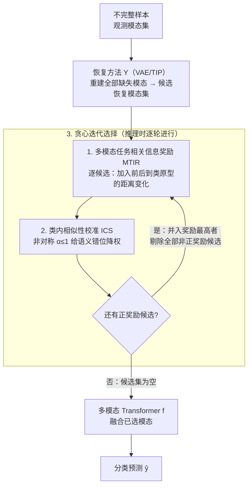

# Inference-Time Dynamic Modality Selection for Incomplete Multimodal Classification

**会议**: ICLR 2026  
**arXiv**: [2601.22853](https://arxiv.org/abs/2601.22853)  
**代码**: [GitHub](https://github.com/siyi-wind/DyMo)  
**领域**: 多模态学习 / 医学图像  
**关键词**: incomplete multimodal, dynamic modality selection, inference-time, information gain, discarding-imputation dilemma

## 一句话总结

提出DyMo——推理时动态模态选择框架，通过理论推导将多模态任务相关信息增益转化为可计算的MTIR奖励函数（基于分类损失降低代理 + 类原型距离 + 类内相似性校准），在推理时迭代选择性融合可靠的恢复模态，首次系统性解决"丢弃缺失模态损失信息 vs 补全可能引入噪声"的困境。

## 研究背景与动机

**领域现状**：多模态深度学习在医疗、营销、具身智能等领域取得显著进展，但实际部署时样本经常缺少一个或多个模态（传感器故障、不同采集协议、传输错误等）。

**现有痛点**：

1. **恢复型方法**（如MoPoE、M3Care）通过VAE等重建缺失模态，但重建质量参差不齐——可能产生低保真（模糊/失真）或语义错位（重建结果的类别与输入不一致）的恢复

2. **丢弃型方法**（如ModDrop、MUSE）直接忽略缺失模态，但当高任务相关性的模态缺失时，仅用剩余模态的特征区分度大幅下降

3. **现有动态融合方法**（QMF、DynMM、PDF）主要针对模态内噪声（低保真），无法检测模态间语义错位

**核心矛盾**（丢弃-补全困境）：丢弃缺失模态损失任务相关信息 → 性能下降；补全缺失模态可能引入任务无关噪声或语义错误 → 性能下降。两种方法各有短板，缺乏动态权衡的机制。

**本文切入角度**：不做二选一，而是动态评估每个恢复模态是否"值得融合"——如果恢复增加了任务相关信息就接受（正reward），如果引入噪声/错位就拒绝（负reward）。

## 方法详解

### 整体框架

DyMo 把"缺失模态要不要补、补了要不要用"拆成两步：先用现成的恢复方法 $\Upsilon$（VAE 或 TIP）把不完整样本 $\mathbb{X} = \{x^{(m)}\}_{m \in \mathcal{I}}$ 的缺失模态全部重建出来，得到一批候选恢复模态；再在推理时贪心迭代地逐个评估每个候选的 MTIR 奖励（含类内相似性校准），每轮只接纳奖励最高的那个、剔除所有奖励非正的候选，直到没有候选为止，最后把选中的模态喂进多模态 Transformer $f$ 做预测。这里的 $f$ 由模态专用编码器 $h^{(m)}$、带 [CLS] token 与注意力 mask 的多模态 Transformer $\psi$、线性 softmax 分类器 $\zeta$ 三部分组成，mask 机制天然支持任意模态组合，是"动态加减模态还能跑同一张网"得以落地的前提。整套流程不引入额外训练、只在推理时决策，因此称作 inference-time dynamic modality selection。

### 关键设计

**1. 多模态任务相关信息奖励 MTIR：把"恢复值不值得用"变成一个可计算的标量**

困境的根源是无法事先判断一个恢复模态带来的是信息还是噪声。本文从信息论入手，先证明任务相关信息 $I(Y;\mathbf{Z})$ 与经验交叉熵之间存在下界

$$I(Y;\mathbf{Z}) \geq H(Y) - \hat{\mathcal{L}}_{ce} - G\sqrt{\frac{\ln(1/\delta)}{2|\mathcal{D}|}}$$

于是"降低分类损失"就等价于"抬高任务相关信息的下界"，而损失在无标签的推理时也估得出来（用预测标签 $\hat{y}$ 代替真值）。为了让奖励对训练分布稳健，进一步把分类看成特征空间里到类原型的混合密度估计 $p(y=k|\mathbf{z}) = \frac{\exp(-d_\phi(\mathbf{z}, \mathbf{c}_k))}{\sum_{k'}\exp(-d_\phi(\mathbf{z}, \mathbf{c}_{k'}))}$，其中 $\mathbf{c}_k$ 是训练集上预存的类原型、$d_\phi$ 为 Bregman 散度。代回后 MTIR 就化简成"加入某个恢复模态前后、样本表示到类原型距离的变化"：距离拉近（奖励为正）说明恢复提供了有用信息，距离推远（奖励为负）说明恢复把样本推向错误类簇、引入了有害信息，奖励近零则是低保真恢复只添了噪声。这样低保真和语义错位两类不可靠恢复就被同一个标量统一刻画了。

**2. 类内相似性校准 ICS：补上奖励对语义错位的盲区**

MTIR 只看"到预测类原型的距离变化"，会漏掉一种刁钻情形：恢复前后预测类别变了（$\hat{y} \neq \hat{y}^u$），但两个表示离各自原型的距离差不多，损失差近零、奖励失灵——这正是语义错位最危险的样子。为此引入校准项 $\alpha$：先用截断正态近似算出样本在其预测类簇内的"类内相似性（intra-class similarity, ICS）"得分，再取恢复后与恢复前 ICS 之比。关键是 $\alpha$ 设计成**非对称**的——只有当恢复后表示在类簇里更不典型时才取 $\alpha < 1$ 给奖励降权，反之不放大。因为观测模态是真实可靠的、合成模态天生可疑，这种"只惩罚不奖励"的保守姿态让奖励对"恢复后语义偏移、在类内变得不典型"的情况更警觉，把语义错位也纳入过滤。

**3. 贪心迭代选择：逐轮吸收最有价值的恢复模态**

有了校准后的奖励 $R^*$，DyMo 不是一次性融合所有正奖励模态，而是贪心迭代（Algorithm 1）：每一步对当前候选集算一遍奖励，把奖励最高的那个并入观测集，同时把所有奖励非正的候选直接剔除，然后基于更新后的观测集重算剩余候选的奖励，直到候选集为空。之所以要迭代而非一次打分，是因为已选模态会改变融合后的特征分布、进而改变其余候选的奖励，逐轮评估才能反映模态间的相互作用、避免噪声累积，实验中也确实略优于一次性选择。

### 损失函数 / 训练策略

训练只在完整数据集上进行，靠对每个样本采 $A$ 个随机模态子集 $\mathcal{S} \sim \mathcal{U}_A$ 来模拟 $2^M-1$ 种缺失模式，使网络对任意模态组合都鲁棒。分类损失为子集平均的交叉熵 $\mathcal{L}_{class} = -\frac{1}{A}\frac{1}{B}\sum_{\mathcal{S} \sim \mathcal{U}_A}\sum_{i=1}^{B}\log p_f(y_i|\{x^{(m)}\}_{m \in \mathcal{S}})$；为了让推理时的类原型距离可靠，额外加一项缺失无关对比损失 $\mathcal{L}_{aux} = -\frac{1}{A}\frac{1}{B}\sum\sum\log\frac{\exp(-d_\phi(\mathbf{z}_i, \mathbf{c}_{y_i})/t)}{\sum_{k'}\exp(-d_\phi(\mathbf{z}_i, \mathbf{c}_{k'})/t)}$ 促使同类样本在特征空间聚拢。总损失为两者直接相加 $\mathcal{L} = \mathcal{L}_{class} + \mathcal{L}_{aux}$，无需额外网络或多阶段训练。

## 实验关键数据

### 主实验

在5个数据集（PolyMNIST/MST/CelebA/DVM/UKBB-CAD/UKBB-Infarction）上对比SOTA：

| 方法 | PolyMNIST(η=0.8) | MST(miss{M,T}) | CelebA(miss{T}) | DVM(γ=1) | CAD(γ=1) |
|------|------------------|----------------|-----------------|----------|----------|
| ModDrop | 88.44 | 82.47 | 87.32 | 87.97 | 69.18 |
| MTL | 91.14 | 84.37 | 89.38 | 92.32 | 70.23 |
| OnlineMAE | 90.09 | 86.67 | 86.67 | - | - |
| M3Care† | 87.92 | 85.16 | 91.32 | 93.43 | 72.48 |
| **DyMo_c** | **96.61** | **85.31** | **95.20** | **93.14** | **71.02** |
| **DyMo_e** | **96.81** | **86.84** | 93.67 | **93.36** | **72.17** |

PolyMNIST 80%缺失：DyMo超OnlineMAE +5.67%；DVM全表缺失：超ModDrop +4.11%

### 消融实验

| 设置 | PolyMNIST(η=0.8) | MST(miss{M,T}) |
|------|------------------|----------------|
| Baseline（全融合无选择） | 84.21 | 80.73 |
| S（正reward同时融合） | 94.33 | 82.08 |
| I（迭代选择最高reward） | 94.50 | 82.12 |
| I+C（迭代+校准，完整DyMo） | **96.61** | **85.31** |

### 关键发现

- 不使用动态选择直接融合所有恢复模态（Baseline）性能显著低于DyMo，验证了恢复质量不可靠的假设
- 迭代选择（I）比一次性选择（S）效果略好，ICS校准（C）在多数数据集上提供额外1-3%提升
- DyMo对距离函数选择（cosine vs Euclidean）不敏感，两种距离效果相当
- 现有动态融合方法（QMF/DynMM/PDF）在VAE恢复下效果有限——因为它们无法检测语义错位

## 亮点与洞察

- "丢弃-补全困境"的问题定义清晰到位，首次系统性提出并用理论框架解决
- 从互信息到分类损失再到类原型距离的理论推导链条完整：$I(Y;\mathbf{Z})$ → 损失下界 → Bregman散度 → 可计算的MTIR
- ICS校准的非对称设计（$\alpha \leq 1$ 当恢复后代表性低于恢复前）体现了对恢复模态的"保守主义"——合理的工程直觉
- 训练策略简洁有效：随机子集模拟 + 对比损失，无需额外网络或多阶段训练

## 局限与展望

- ICS校准项在CAD/Infarction数据集上反而降低性能，需要引入数据集特定的超参数调优
- 每个恢复模态都需要一次前向传播计算MTIR——缺失模态数 $M - |\mathcal{I}|$ 越多推理开销越大
- 恢复方法的选择对DyMo影响较大（如TIP对全表恢复能力有限），DyMo的性能上界受限于恢复方法
- 仅在分类任务上验证，未扩展到分割/检测等密集预测任务

## 相关工作与启发

- **vs ModDrop/MUSE**：丢弃型方法在高信息量模态缺失时性能大幅下降（MUSE在MST上下降61%），DyMo通过恢复+选择避免这一问题
- **vs MoPoE/M3Care**：恢复型方法在严重缺失场景下生成不可靠恢复，DyMo通过MTIR过滤不可靠恢复
- **vs QMF/DynMM/PDF**：现有动态融合方法主要关注模态内噪声，无法检测语义错位；DyMo通过类原型距离检测两种类型的不可靠性
- **方法论启发**：用任务损失降低作为信息增益代理的思路适用于任何需要动态决策的场景

## 评分

- 新颖性: ⭐⭐⭐⭐ 问题定义新颖，理论推导完整
- 实验充分度: ⭐⭐⭐⭐⭐ 5个数据集+9种SOTA对比+完整消融+可视化分析
- 写作质量: ⭐⭐⭐⭐ 理论与实验结合紧密，公式推导清晰
- 价值: ⭐⭐⭐⭐ 不完整多模态学习的通用框架，医学图像场景直接适用

<!-- RELATED:START -->

## 相关论文

- [\[ECCV 2024\] TIP: Tabular-Image Pre-training for Multimodal Classification with Incomplete Data](../../ECCV2024/medical_imaging/tip_tabular-image_pre-training_for_multimodal_classification_with_incomplete_dat.md)
- [\[ICLR 2026\] Adaptive Domain Shift in Diffusion Models for Cross-Modality Image Translation](adaptive_domain_shift_in_diffusion_models_for_cross-modality_image_translation.md)
- [\[CVPR 2025\] Distilled Prompt Learning for Incomplete Multimodal Survival Prediction](../../CVPR2025/medical_imaging/distilled_prompt_learning_for_incomplete_multimodal_survival_prediction.md)
- [\[CVPR 2026\] Universal-to-Specific: Dynamic Knowledge-Guided Multiple Instance Learning for Few-Shot Whole Slide Image Classification](../../CVPR2026/medical_imaging/universal-to-specific_dynamic_knowledge-guided_multiple_instance_learning_for_fe.md)
- [\[CVPR 2025\] Multimodal Classification of Radiation-Induced Contrast Enhancements and Tumor Recurrence Using Deep Learning](../../CVPR2025/medical_imaging/multimodal_classification_of_radiation-induced_contrast_enhancements_and_tumor_r.md)

<!-- RELATED:END -->
