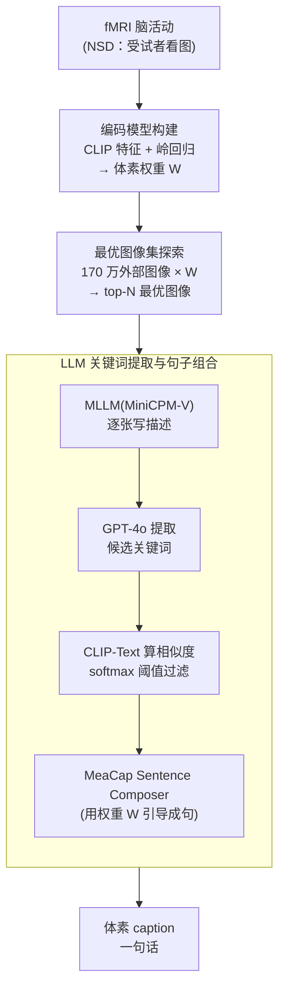

# LaVCa: LLM-assisted Visual Cortex Captioning

**会议**: ICLR 2026  
**arXiv**: [2502.13606](https://arxiv.org/abs/2502.13606)  
**代码**: [https://github.com/suyamat/LaVCa](https://github.com/suyamat/LaVCa)  
**领域**: 3D视觉 / 神经科学  
**关键词**: 视觉皮层, 体素选择性, LLM, fMRI编码模型, 脑活动预测

## 一句话总结

提出 LaVCa 方法，利用 LLM 为人类视觉皮层的每个体素生成自然语言描述（caption），通过"编码模型→最优图像选取→MLLM生成描述→LLM关键词提炼+句子组合"四步流程，比已有方法 BrainSCUBA 更准确、更多样地揭示了体素级视觉选择性。

## 研究背景与动机

**领域现状**：fMRI 编码模型是研究大脑视觉表征的标准工具。早期使用手工特征或独热语义标签，解释性强但粗糙；现代方法使用 DNN 特征（CLIP 等）大幅提升预测精度，但 DNN 本身是黑箱，难以解释单个体素"为什么被激活"。

**现有痛点**：已有数据驱动描述方法如 BrainSCUBA 直接用图像描述模型生成体素 caption，但依赖单一描述模型（ClipCap），词汇量和语义多样性受限。SASC 用短 n-gram 片段拼接但词汇太短。两者都缺乏足够的语义丰富度来精确刻画体素选择性。

**核心矛盾**：如何在保持可解释性（简短 caption）的同时，不丢失最优图像集中的丰富信息？

**本文目标**：为每个体素生成精准、简洁、语义丰富的自然语言描述，既能准确预测脑活动，又能揭示体素在类间（inter-voxel）和类内（intra-voxel）的多样性。

**切入角度**：将 pipeline 解耦为四个可解释步骤——把"选图"和"描述"分开，利用 LLM 的开放词汇能力做关键词提取和句子组合。

**核心 idea**：用 LLM 先为体素最优图像集提取共性关键词，再组合成 caption，实现高精度、高多样性的体素级视觉皮层描述。

## 方法详解

### 整体框架

LaVCa 要解决的问题是：给定人类视觉皮层里的一个体素，用一句简洁的自然语言说清它"对什么视觉内容敏感"，而且这句话还得准确到能反过来预测该体素的脑活动。它把这件事拆成一条四步流水线，关键在于**先把"选图"和"描述"两件事分开**，再让 LLM 在文本侧做提炼组合。

输入是 NSD 数据集中受试者观看图像时记录的 fMRI 脑活动。第一步先为每个体素拟合一个"图像→脑活动"的线性编码模型 $\mathbf{y}_i = \mathbf{W}\mathbf{x}_i + \boldsymbol{\varepsilon}_i$；第二步拿这个模型去 170 万张外部图像上打分，挑出最能激活该体素的 top-N 张最优图像；第三步用 MLLM（MiniCPM-V）给每张最优图像写描述；第四步再用 LLM（GPT-4o）从这些描述里提炼共性关键词，过滤后由 MeaCap Sentence Composer 组合成最终那句 caption。最终输出就是每个体素一句话。

### 关键设计

**1. 编码模型构建：把抽象的脑活动接到可用文本评估的 CLIP 空间**

要给体素配文字，前提是先有一座桥把"看了什么图"和"哪个体素被激活"连起来。LaVCa 提取 CLIP-Vision 投影层的 embedding（做 L2 归一化），用岭回归为每个体素拟合编码权重 $\mathbf{W} \in \mathbb{R}^{v \times d}$。选线性模型而不是更复杂的网络，是因为它本身就简单可解释；而选 CLIP 特征，是因为它的视觉-语言空间天然对齐，下游用文本关键词去衡量体素响应时不用再跨模态对齐一次。

**2. 最优图像集探索：用大规模外部图像找出体素的"偏好画像"**

有了编码权重，就能反过来问"什么样的图最能点亮这个体素"。LaVCa 把编码权重和 170 万张外部图像的 CLIP embedding 做内积，取响应最高的 top-N 张作为该体素的最优图像集。刻意用 OpenImages-v6 这种训练集之外的大规模数据，一是覆盖面广、概念全，二是避免在训练图像上过拟合、把噪声当成选择性；N 是可调的，决定了后面拿多少张图去提炼共性。

**3. LLM 关键词提取与句子组合：在文本侧提炼共性，再让脑信号亲自指导成句**

多张最优图像各自的描述里混着大量个体细节，真正反映体素选择性的是它们的**共性**。LaVCa 先用 GPT-4o 做 in-context learning，从这些描述里提取候选关键词；再用 CLIP-Text 算每个关键词与编码权重的余弦相似度，经 softmax 阈值过滤掉不相关的词；最后交给 MeaCap Sentence Composer 把保留下来的关键词组织成一句通顺的话。这里有个巧思——句子组合阶段**用编码权重替代了原始图像特征**来引导生成，相当于让"脑科学信号"直接参与造句，而不是先变成图像再变成文字。相比 BrainSCUBA 端到端从一个固定 captioning 模型出 caption，这套解耦+开放词汇的做法既更简洁可解释，词汇覆盖也更广。

### 评估方法

为了把"caption 准不准"量化，LaVCa 用了两种互补的预测方式。**句子级预测**用 Sentence-BERT 算体素 caption 与 NSD 图像本身 caption 的余弦相似度，作为该体素活动的预测值，再用 Spearman 相关系数衡量它和真实脑活动的吻合度。**图像级预测**则先用 FLUX.1-schnell 把 caption 还原成图像，取其 CLIP-Vision embedding 去和 NSD 图像比较——这一路绕开了纯文本比较，排除语言表述差异带来的干扰，单看视觉内容对不对得上。

## 实验关键数据

### 主实验

句子级脑活动预测准确性（top-5000 体素，4 名受试者平均精度 ± 标准差）：

| 方法 | #关键词 | Sentence Composer | subj01 | subj02 | subj05 | subj07 |
|------|---------|-------------------|--------|--------|--------|--------|
| Shuffled | - | - | 0.007±0.199 | 0.058±0.223 | 0.068±0.243 | 0.009±0.175 |
| BrainSCUBA | - | - | 0.207±0.062 | 0.251±0.071 | 0.264±0.084 | 0.182±0.065 |
| LaVCa | 1 | ✗ | 0.205±0.068 | 0.250±0.075 | 0.272±0.086 | 0.186±0.072 |
| **LaVCa** | **5** | **✓** | **0.246±0.066** | **0.287±0.075** | **0.306±0.084** | **0.218±0.073** |

图像级脑活动预测准确性同样显示 LaVCa (5 keywords + SC) 全面超越 BrainSCUBA，如 subj01: 0.213 vs 0.188。

### 消融实验

| 配置 | 词汇量 (inter-voxel) | 语义方差 | PCA 90%维度 |
|------|----------------------|----------|-------------|
| BrainSCUBA | 3,193 | 0.0588 | 127 |
| Top-1 MLLM caption | 13,959 | 0.0638 | 210 |
| **LaVCa** | **16,922** | **0.0642** | **219** |

ROI 内 shuffle 测试（验证体素间多样性）：

| ROI | Original | Shuffled | 倍数 |
|-----|----------|----------|------|
| OFA（面部区域） | 0.095 | 0.028 | 3.3× |
| PPA（场景区域） | 0.213 | 0.151 | 1.4× |
| EBA（身体区域） | 0.157 | 0.018 | 8.7× |

### 关键发现

- 5 个关键词 + Sentence Composer 的组合在所有受试者上都显著优于 BrainSCUBA 和单关键词版本
- LaVCa 的词汇量是 BrainSCUBA 的 5.3 倍（16,922 vs 3,193），语义多样性也更高
- 即使在被认为只对"面部"或"场景"选择性的 ROI（如 OFA、PPA）中，LaVCa 也发现了丰富的多概念编码——单个体素可以同时编码多个不同概念
- 跨受试者分析表明这种 ROI 内多样性具有可重复性

## 亮点与洞察

- **解耦设计很巧妙**：把体素描述拆成"选图→captioning→关键词提取→句子组合"四步，每步独立可替换（任意 VLM/LLM），比端到端方法更灵活且可解释。这种模块化思路可迁移到其他需要"从数据中提取可解释特征描述"的场景
- **编码权重替代图像特征**：在 MeaCap Sentence Composer 中用编码权重而非图像特征引导句子生成——巧妙地把"脑科学信号"直接接入了 NLP 管道
- **揭示传统 ROI 的多样性**：之前认为 OFA 只编码"面部"，但 LaVCa 发现有些体素编码"舌头"、"微笑"、"动物"等——这是方法论进步带来的认知突破

## 局限与展望

- **依赖 CLIP 特征空间**：编码模型和关键词过滤都基于 CLIP，如果 CLIP 对某些视觉概念表征不好（如细微纹理、抽象概念），LaVCa 也会受限
- **线性编码假设**：岭回归假设体素响应与 CLIP 特征线性相关，这对高级视觉区域可能过于简化
- **LLM 幻觉风险**：GPT-4o 提取关键词时可能引入幻觉，虽有 CLIP 过滤但不能完全消除
- **仅限视觉皮层**：方法尚未扩展到其他脑区（如听觉、语言区域），可考虑用类似思路研究语言编码

## 相关工作与启发

- **vs BrainSCUBA**: BrainSCUBA 端到端用 ClipCap 直接为体素生成 caption，词汇受限于 ClipCap 的训练数据。LaVCa 解耦后利用 LLM 开放词汇，词汇量提升 5×，准确性也更好
- **vs SASC**: SASC 用 n-gram 短语拼接描述，信息量太少。LaVCa 通过多图像关键词提取保留更丰富的语义信息
- **vs 脑解码工作**：脑解码问"受试者看到了什么"，编码模型问"这个体素表征什么"——是互补的两个方向

## 评分

- 新颖性: ⭐⭐⭐⭐ 方法本身是已有组件的巧妙组合，但解耦设计和 LLM 引入脑科学是新思路
- 实验充分度: ⭐⭐⭐⭐⭐ 句子级+图像级评估、多样性分析、ROI shuffle 分析、跨受试者验证，非常充分
- 写作质量: ⭐⭐⭐⭐⭐ 逻辑清晰，图表设计精美，方法描述步骤明确
- 价值: ⭐⭐⭐⭐ 对理解视觉皮层表征有重要贡献，但应用范围较窄（神经科学方向）

<!-- RELATED:START -->

## 相关论文

- [\[NeurIPS 2025\] Meta-Learning an In-Context Transformer Model of Human Higher Visual Cortex](../../NeurIPS2025/medical_imaging/meta-learning_an_in-context_transformer_model_of_human_higher_visual_cortex.md)
- [\[ICCV 2025\] NEURONS: Emulating the Human Visual Cortex Improves Fidelity and Interpretability in fMRI-to-Video Reconstruction](../../ICCV2025/medical_imaging/neurons_emulating_the_human_visual_cortex_improves_fidelity_and_interpretability.md)
- [\[ICLR 2026\] Towards Interpretable Visual Decoding with Attention to Brain Representations](towards_interpretable_visual_decoding_with_attention_to_brain_representations.md)
- [\[ICLR 2026\] Boosting Medical Visual Understanding From Multi-Granular Language Learning](boosting_medical_visual_understanding_from_multi-granular_language_learning.md)
- [\[AAAI 2026\] TAlignDiff: Automatic Tooth Alignment assisted by Diffusion-based Transformation Learning](../../AAAI2026/medical_imaging/taligndiff_automatic_tooth_alignment_assisted_by_diffusion-based_transformation_.md)

<!-- RELATED:END -->
