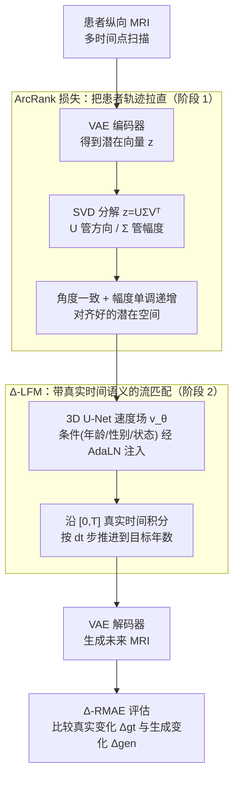

# Learning Patient-Specific Disease Dynamics with Latent Flow Matching for Longitudinal Imaging Generation

**会议**: ICLR 2026  
**arXiv**: [2512.09185](https://arxiv.org/abs/2512.09185)  
**代码**: 无  
**领域**: 医学影像 / 疾病进展建模  
**关键词**: disease progression, flow matching, patient-specific, longitudinal MRI, ArcRank loss

## 一句话总结
提出 Δ-LFM 框架：用 ArcRank 损失在潜在空间构建患者特异性时间对齐轨迹（角度一致 + 幅度单调递增），将流匹配时间范围从 [0,1] 扩展到 [0,T] 实际时间间隔实现任意时间点预测，在三个阿尔茨海默纵向 MRI 基准上全面超越 8 种基线方法，并提出进展专用指标 Δ-RMAE。

## 研究背景与动机

**领域现状**：疾病进展建模对早期诊断和个性化治疗至关重要。GAN → 扩散模型的演进带来了更高保真度的纵向医学影像生成，但多数方法仅捕捉群体趋势。

**现有痛点**：1）多数模型忽略个体异质性——同一疾病不同患者进展速率差异巨大；2）扩散模型的随机去噪过程打断时间连续性；3）自编码器的潜在空间跨患者不对齐、与临床严重度指标不相关；4）传统图像质量指标（PSNR/SSIM）在纵向场景中虚高——同一患者不同时间点天然高相似度，微小的疾病变化被正常解剖淹没。

**核心矛盾**：纵向影像生成需要同时满足高保真度（图像质量）和高准确度（进展方向正确），现有方法偏重前者忽略后者。

**本文目标** 构建患者特异性的生成框架，使潜在空间语义有意义+ 任意时间点可预测 + 进展方向正确。

**切入角度**：疾病进展在潜在空间可建模为速度场——流匹配（Flow Matching）天然学习从源到目标的速度场，与疾病动力学概念完美对应。

**核心 idea**：ArcRank 约束让每个患者的潜在轨迹"一条线走到底"（方向恒定、幅度递增），Δ-LFM 沿这条线以真实时间步长推进。

## 方法详解

### 整体框架
Δ-LFM 想解决的是这样一件事：给定患者某个时间点的 MRI，按真实的时间间隔（"几年后"）预测出方向正确、个体化的未来扫描。难点在于，自编码器学出的潜在空间跨患者乱成一团、和临床严重度不挂钩，直接在上面做生成既不可控也不可解释。论文把整个流程拆成两阶段：先把潜在空间"理顺"，再在理顺的空间里学动力学。

阶段 1 训练一个 VAE，但额外加上 ArcRank 损失，逼着同一患者不同时间点的潜在表示排成"一条线"——方向恒定、幅度随时间递增，于是潜在空间里"沿着某条轨迹前进"就等价于"疾病在加重"。阶段 2 在这个已经对齐好的潜在空间里训练一个 3D U-Net，用流匹配学习患者特异性的速度场，并把年龄、性别、临床状态等条件信号通过 AdaLN 注入。推理时从当前潜在向量出发、沿速度场积分到目标时间，再解码回图像。最后用进展专用指标 Δ-RMAE 评估生成的"变化量"是否对得上真实变化。

### 关键设计

**1. ArcRank 损失：把患者轨迹在潜在空间里"拉直"**

这一步针对的痛点是潜在空间跨患者不对齐、和严重度无关。做法是对潜在向量 $\mathbf{z}$ 做 SVD 分解 $U\Sigma V^\top = \text{SVD}(\mathbf{z})$，让 $U$ 承担"方向（角度）"、$\Sigma$ 承担"幅度（严重度）"两个语义。ArcRank 损失同时约束这两者：

$$\mathcal{L}_{\text{ArcRank}} = \lambda_{\text{arc}} \sum_{i<j} |U_i - U_j| + \lambda_{\text{rank}} \sum_{i<j} \max(0, m - (\Sigma_j - \Sigma_i)), \quad t_i < t_j$$

前一项（arc）压低同一患者各时间点之间的角度差，让方向保持一致；后一项（rank）是带 margin $m$ 的排序铰链，强制时间靠后的扫描幅度更大，于是 $\Sigma$ 随时间单调递增、天然对应严重度。为防止相邻时间点被排序项推得过开，再加一个 pull 项 $\mathcal{L}_{\text{Pull}} = |\Sigma_j - \Sigma_i|$ 把它们拉回来。用 SVD 统一处理方向和幅度，比"cosine 管方向 + 绝对值管幅度"那种拆开两套度量的做法更稳定，训练时配合 stop-gradient 进一步稳住梯度。

**2. Δ-LFM：让流匹配的时间轴带上真实语义**

标准流匹配把时间归一化到 $[0,1]$，这对疾病进展是个硬伤——"0.5"既可能是半年也可能是五年，实际时间语义被抹掉了。Δ-LFM 把时间范围直接扩展到 $[0,T]$，其中 $T = t_j - t_i$ 就是两次扫描相隔的实际年数。目标速度定义为 $v^*(i,j) = (\mathbf{z}_j - \mathbf{z}_i)/(t_j - t_i)$，即"单位时间内潜在向量该走多远"。推理时以步长 $\text{d}t = 0.01$ 沿速度场逐步积分 $\mathbf{z}_{i+\text{d}t} = \mathbf{z}_i + \text{d}t \cdot v_\theta(\mathbf{z}_i, t_i)$，积分到任意目标时间即可。这样"预测 3 年后的 MRI"就变成"在速度场上走 3 个时间单位"，任意未来时间点的预测直接可行，也因为是确定性积分而非随机去噪，保住了时间连续性。

**3. Δ-RMAE：换一把尺子量"进展方向"而非"图像长得像不像"**

PSNR/SSIM 在纵向场景会虚高——同一患者不同时间点本就高度相似，连"原样复制基线图"都能拿高分，疾病引起的微小变化被淹没。Δ-RMAE 把评估对象从绝对图像换成"变化量"：先取残差 $\Delta = \mathbf{x}_T - \mathbf{x}_0$，再比较真实变化与生成变化的相对误差

$$\Delta\text{-RMAE} = \frac{|\Delta_{\text{gt}} - \Delta_{\text{gen}}|}{\frac{1}{2}(|\Delta_{\text{gt}}| + |\Delta_{\text{gen}}|)} \in [0, 2]$$

分母用两者绝对变化的均值做归一化，避免被变化幅度本身带偏。指标越低说明模型真正抓住了疾病该往哪个方向变，而不是靠"保持静态"骗分，正好补上常规质量指标的盲区。

### 损失函数 / 训练策略
阶段 1（AE）用重建损失 + ArcRank 联合训练，权重 $\lambda_{\text{arc}}=0.005$、$\lambda_{\text{rank}}=0.01$，$m$ 为排序 margin；优化器 AdamW，lr=$10^{-3}$，batch=2，训练 300 epochs。阶段 2（FM）的流匹配目标为 $\mathcal{L}_{\text{LFM}} = \sum_{i<j} |v_\theta(i,j) - v^*(i,j)|^2$，主干是 3D U-Net，AdamW，lr=$3 \times 10^{-5}$，batch=4，训练 200 epochs；年龄/性别/临床状态等条件信号通过 AdaLN 注入。

## 实验关键数据

### 主实验——影像质量（3 个纵向 MRI 基准，mean±std）

| 方法 | ADNI PSNR↑ | ADNI SSIM↑ | AIBL PSNR↑ | OASIS PSNR↑ |
|------|:---:|:---:|:---:|:---:|
| CardiacAging | 27.78±1.49 | 92.04 | 28.41 | 26.23 |
| DiffuseMorph | 29.56±1.63 | 93.57 | 29.17 | 28.13 |
| SADM | 26.94±2.28 | 85.15 | 27.97 | 26.74 |
| BrLP | 28.51±1.77 | 91.52 | 28.96 | 27.98 |
| MambaControl | 29.72±1.04 | 93.60 | 29.86 | 28.24 |
| **Δ-LFM** | **30.59±0.89** | **94.62** | **30.52** | **29.01** |

### 主实验——进展准确度（Region MAE + Δ-RMAE）

| 方法 | ADNI Δ-RMAE↓ | AIBL Δ-RMAE↓ | OASIS Δ-RMAE↓ |
|------|:---:|:---:|:---:|
| DiffuseMorph | 0.516 | 0.482 | 0.503 |
| BrLP | 0.630 | 0.594 | 0.622 |
| MambaControl | 0.554 | 0.525 | 0.561 |
| **Δ-LFM** | **0.436** | **0.417** | **0.473** |

Δ-RMAE 相比 MambaControl 相对误差降低 ~21%/21%/16%。

### 消融实验（3 数据集均值）

| 配置 | PSNR↑ | Δ-RMAE↓ | 说明 |
|------|:---:|:---:|------|
| LFM Baseline (无条件, [0,1]) | 27.59 | 0.552 | 最差 |
| + 条件信息 | 28.46 | 0.486 | 条件信号重要 |
| + [0,T] 时间采样 | 28.78 | 0.472 | 时间语义化有效 |
| + Arc Loss only | 29.52 | 0.457 | 方向约束最重要 |
| + Rank Loss only | 28.36 | 0.474 | 单独排序效果弱 |
| + ArcRank + [0,T] (完整) | **30.04** | **0.442** | 组件协同 |

### 关键发现
- ArcRank 潜在空间的 t-SNE 可视化：(1) 同一患者的扫描聚在一起；(2) 诊断状态（CN/MCI/AD）自然分群——**虽未用诊断标签训练**
- 长期预测性能随时间衰减但仍合理：1-5 年 PSNR 31-32dB, 10 年 ~28.6dB, 13 年 ~27dB
- ArcRank 引入 SVD 计算 overhead ~40% 训练时间增加，但使用 `full_matrices=False` 后从 0.055s→0.009s（6x 加速）

## 亮点与洞察
- **"疾病 = 速度场"的建模视角**：不是生成未来快照，而是学习变化过程的连续动力学——流匹配的速度场概念与疾病进展天然匹配
- **ArcRank 的对偶设计**：SVD 统一了方向（patient identity）和幅度（disease severity）两个本质不同的轴——简洁优雅
- **Δ-RMAE 填补评估盲区**：常规指标在纵向场景失效（"复制基线"也能得高分），Δ-RMAE 迫使模型真正捕捉变化而非保持静态
- **诊断状态的无监督涌现**：ArcRank 仅约束时间顺序和方向一致性，却自然学出了 CN→MCI→AD 的严重度梯度——好的归纳偏置的力量

## 局限与展望
- 仅在阿尔茨海默病上验证——脑肿瘤等快速进展/治疗干预的疾病需要不同建模假设
- 线性轨迹假设（潜在空间中直线进展）可能无法捕捉突发恶化或稳定期的非线性模式
- 扫描间隔不均匀问题仅通过条件信号部分缓解，未显式建模进展速率变化
- 数据集异质性（多扫描仪/协议差异）仅依赖预处理缓解，未使用协调技术
- AE 容量受 GPU 内存限制（48GB A6000），更大 crop 或更深网络可能进一步提升

## 相关工作与启发
- **vs BrLP (Puglisi et al. 2024)**：BrLP 用 ControlNet + 体积比条件实现部分个性化，但条件粗糙；Δ-LFM 通过 ArcRank 在潜在空间实现更精细的个体轨迹建模
- **vs TADM (Litrico et al. 2024)**：TADM 预测残差图像但用扩散去噪→打破时间连续性；Δ-LFM 用流匹配天然保持连续性
- **vs ImageFlowNet (Liu et al. 2025)**：ImageFlowNet 也用流场但在图像空间操作；Δ-LFM 在潜在空间更高效且支持 ArcRank 轨迹对齐

## 评分
- 新颖性: ⭐⭐⭐⭐⭐ 流匹配用于疾病进展 + ArcRank 潜在对齐 + Δ-RMAE 评估指标，三重创新
- 实验充分度: ⭐⭐⭐⭐ ADNI/AIBL/OASIS 三基准 + 8 种对比方法 + 详细消融 + 长期预测分析
- 写作质量: ⭐⭐⭐⭐ 动机清晰、公式推导简洁、可视化有说服力
- 价值: ⭐⭐⭐⭐⭐ 对医学影像生成和疾病进展建模有重要贡献，Δ-RMAE 可能成为领域标准指标

<!-- RELATED:START -->

## 相关论文

- [\[AAAI 2026\] Ambiguity-aware Truncated Flow Matching for Ambiguous Medical Image Segmentation](../../AAAI2026/medical_imaging/ambiguity-aware_truncated_flow_matching_for_ambiguous_medica.md)
- [\[NeurIPS 2025\] Riemannian Flow Matching for Brain Connectivity Matrices via Pullback Geometry](../../NeurIPS2025/medical_imaging/riemannian_flow_matching_for_brain_connectivity_matrices_via_pullback_geometry.md)
- [\[NeurIPS 2025\] Surf2CT: Cascaded 3D Flow Matching Models for Torso 3D CT Synthesis from Skin Surface](../../NeurIPS2025/medical_imaging/surf2ct_cascaded_3d_flow_matching_models_for_torso_3d_ct_synthesis_from_skin_sur.md)
- [\[CVPR 2026\] Personalized Longitudinal Medical Report Generation via Temporally-Aware Federated Adaptation](../../CVPR2026/medical_imaging/personalized_longitudinal_medical_report_generation_via_temporally-aware_federat.md)
- [\[ICLR 2026\] Brain-Semantoks: Learning Semantic Tokens of Brain Dynamics with a Self-Distilled Foundation Model](brain-semantoks_learning_semantic_tokens_of_brain_dynamics_with_a_self-distilled.md)

<!-- RELATED:END -->
