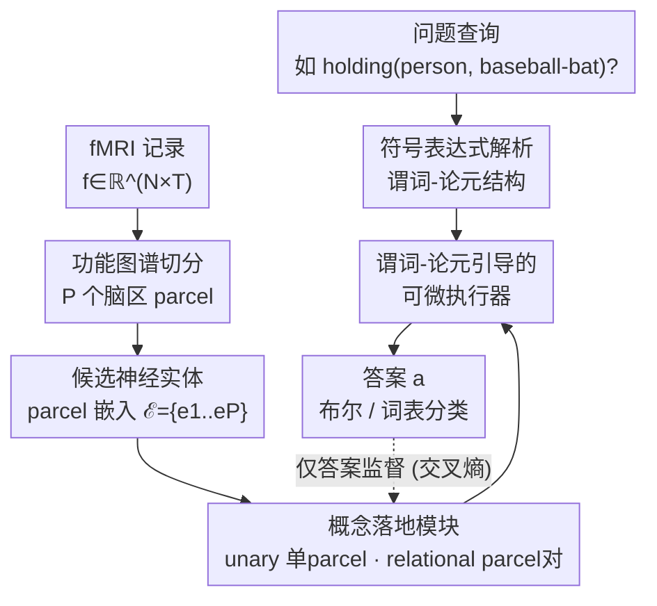

# Neuro-Symbolic Decoding of Neural Activity

**会议**: ICLR 2026  
**arXiv**: [2603.03343](https://arxiv.org/abs/2603.03343)  
**代码**: 无  
**领域**: 神经科学 / 多模态  
**关键词**: fMRI解码, 神经符号, 概念基础, 思维语言假说, 视觉问答

## 一句话总结
提出 NEURONA，一个神经符号框架用于 fMRI 解码和概念基础，通过将视觉场景分解为符号程序（概念的逻辑组合），在 fMRI 问答任务上显著优于端到端神经解码和线性模型。

## 研究背景与动机

**领域现状**：认知科学的"思维语言"假说认为人类思维以结构化、组合性的表征运作。fMRI 神经解码在过去几十年取得了大量进展，从线性映射到深度学习方法。

**现有痛点**：现有神经解码方法要么使用简单线性模型（可解释但表达力不足），要么使用端到端神经网络（强大但黑盒）。两者都无法很好地捕捉概念间的组合关系和逻辑结构。

**核心矛盾**：自然场景里的语义是组合性的（多个概念 + 把它们绑在一起的关系，如"一个人举着棒球棒"），而现有解码要么只解码孤立概念、要么整体重建刺激，都没有显式建模概念之间的谓词-论元（predicate-argument）结构，导致关系类语义解不准。

**本文目标**：把组合性结构先验（概念该如何按谓词-论元方式组合）显式注入解码过程，从而更准确、更精确、对未见的概念组合也更能泛化地解码高层语义。

**切入角度**：利用图像/视频 fMRI 数据天然编码的复合语义，把每个问题解析成符号表达式，再把脑活动经一组"概念落地模块"组合执行得到答案。

**核心 idea**：采用神经符号框架——查询→符号表达式、fMRI→候选脑区实体、概念→可学习落地、按表达式可微组合；并用谓词-论元依赖引导关系概念的落地，从而比纯线性/纯端到端解码更准、对未见组合也更能泛化。

## 方法详解

### 整体框架
NEURONA 不直接从 fMRI 端到端预测答案，而是把"组合性结构先验"显式注入解码：每个问题（如"画面里有没有一个人举着棒球棒？"）先被解析成一个符号表达式，描述概念之间的谓词-论元结构（如 `holding(person, baseball-bat)`）；与此同时，一段 fMRI 记录 $f\in\mathbb{R}^{N\times T}$ 用标准功能图谱切成 $P$ 个脑区（parcel），编码成一组候选"神经实体"嵌入 $\mathcal{E}=\{e_1,\dots,e_P\}$。接着每个概念由一个可学习的落地模块（grounding module）打分——判断哪些 parcel（或 parcel 对）最支持这个概念；最后一个可微执行器（differentiable executor）按符号表达式把这些落地分数组合起来给出答案。整条链路端到端训练，监督只有最终答案，中间的"概念→脑区"落地是从弱监督里自己学出来的。方法从 LEFT 神经符号框架改造而来，关键差异在于 fMRI 没有图像里现成的物体 proposal 那样的"实体"，需要从 parcel 里推断，并用谓词-论元结构引导关系落地。

### 关键设计

**1. fMRI 切块成候选神经实体：把无定形的体素信号变成可落地的"实体"**

图像里有现成的物体 proposal 当作概念落地的候选实体，但 fMRI 没有——哪些神经表征对应某个概念，既无监督也得自己推断。NEURONA 用标准功能图谱（实验了 Yeo-7/17、DiFuMo-64/128、Schaefer-100，正文用 Yeo-17）把全脑信号切成 $P$ 个 parcel，编码成嵌入集合 $\mathcal{E}=\{e_1,\dots,e_P\}$，作为候选神经实体。这一步既给后续概念 grounding 提供了离散的候选单元，又把"某个概念到底落在哪些脑区"变成可学习、可追溯的对象，多种图谱下表现都稳定。

**2. 概念落地模块：一元概念落在脑区、关系概念落在脑区对**

要回答问题，先得判断每个概念在脑活动里是否出现、关系是否成立，且关系本质上是跨脑区的。NEURONA 把概念分两类打分：一元概念（如 person、baseball-bat）用线性投影 $\mathcal{W}_{\text{unary}}$ 在每个 parcel 上算证据，得 $G_{\text{unary}}(c)\in\mathbb{R}^{P}$；关系概念（如 holding）在 parcel 对 $(i,j)$ 上打分——把两个 parcel 嵌入（再拼一组可学习嵌入 $\mathcal{E}_b$）拼接后经 $\mathcal{W}_{\text{pair}}$ 变换、再线性分类，得 $G_{\text{binary}}(c)\in\mathbb{R}^{P\times P}$。一元/关系分开建模，让"实体在哪"和"关系连哪两个脑区"各有专门表征，关系天然定义在脑区对上，契合"关系语义靠多脑区共激活"的神经事实。

**3. 谓词-论元引导的可微执行：让关系落地受其论元约束（核心创新）**

关系概念若孤立打分，跨脑区的组合语义抓不准，更无法泛化到训练没见过的概念组合。NEURONA 的执行器按符号表达式组合落地分数，关键是把谓词 $c_p$ 的落地用它的主语 $c_s$、宾语 $c_o$ 的落地来引导。论文系统比较了 5 种结构假设：H1 单脑区、H2 多脑区无引导、H3 主语引导、H4 宾语引导、H5 双论元引导，其中 H5 最优：

$$G_{\mathrm{H5}}(c_p)=\tilde{G}_{\mathrm{binary}}(c_p)+G_{\mathrm{unary}}(c_s)+G_{\mathrm{unary}}(c_o)$$

（$\tilde{G}_{\mathrm{binary}}$ 是把 parcel 对得分按列平均回到逐 parcel 空间）。把关系条件在其论元的脑区落地上，正是组合泛化的关键——遇到 `in_front_of(surfboard, person)` 这种训练里只见过反向组合的新查询，也能复用学到的落地；实验里 baseline 掉到接近随机时 NEURONA 仍稳。

### 损失函数 / 训练策略
中间概念落地没有任何标签，整套模型只用最终答案的交叉熵端到端训练：$\mathcal{L}_{\text{CE}}=-\sum_{k=1}^{K}a_k\log(\hat{a}_k)$，其中 $\hat{a}$ 是执行完整符号表达式后对 $K$ 个答案类的预测分布、$a$ 是真值。答案既可是布尔标签（True/False），也可是答案词表上的分类。

## 实验关键数据

### 主实验（fMRI-QA，同分布）

| 方法 | BOLD5000-QA Overall | CNeuroMod-QA Overall |
|------|-------------------|---------------------|
| Linear | 0.4692 | 0.4638 |
| UMBRAE | 0.4754 | 0.4642 |
| SDRecon | 0.4711 | 0.4430 |
| BrainCap | 0.4773 | 0.4417 |
| **NEURONA** | **0.7041** | **0.7046** |

相对最强 baseline 取得约 **47% 的相对提升**；在最需要关系推理的 Action（0.62 vs ~0.24）和 Position（0.51 vs ~0.19）查询上提升最大。

### 消融：落地结构假设（BOLD5000-QA Overall）

| 结构假设 | Overall | 说明 |
|------|--------|------|
| H1 单脑区 | 0.6451 | 概念只落单个脑区 |
| H2 多脑区无引导 | 0.6476 | 仅扩到脑区对，无引导 |
| H3 主语引导 | 0.6678 | 谓词受主语论元引导 |
| H4 宾语引导 | 0.6733 | 谓词受宾语论元引导 |
| **H5 双论元引导** | **0.7102** | 主语+宾语共同引导（默认） |

### 关键发现
- **光扩表征空间不够**：多脑区无引导（H2）相比单脑区（H1）几乎不涨，容易在词表分类上过拟合到高频标签。
- **谓词-论元引导才是关键**：论元引导一致优于无引导，宾语引导普遍强于主语引导，双论元引导最佳——尤其在 Action / Position 这类需要精确关系推理的查询上。
- **组合泛化**：在训练/测试概念组合完全不重叠的设置下，NEURONA 达 0.6840（BOLD5000）/ 0.6583（CNeuroMod），而 baseline 普遍掉到接近随机。
- **落地可追溯**：作者提出一致性指标，验证同一概念在不同样本里倾向落到相似脑区，说明学到的中间落地是有意义、可解释的（而非偶然）。

## 亮点与洞察
- **思维语言假说的计算验证**：用神经符号框架显式建模谓词-论元结构后解码大幅变好，间接为"大脑以组合性结构表征知识"提供了计算层面的证据
- **结构先验比表征容量更值钱**：消融显示单纯扩到多脑区几乎没用，真正涨点的是"把关系条件在其论元的脑区落地上"，这是本文最有价值的发现
- **可解释的中间落地**：grounding 不只是中间变量，一致性指标证明它在弱监督下仍稳定地落到相似脑区，对神经科学研究有诊断价值

## 局限与展望
- fMRI-QA 数据由 VLM 抽取场景图自动构建，问答质量与概念覆盖受限于 VLM 的零样本能力，对偏离自然图像/视频的刺激可能不可靠
- 落地结构靠人工设计的几种假设（H1–H5）枚举比较，尚未做到自动发现最优结构
- 训练/测试均限于少数被试（BOLD5000 4 人、CNeuroMod 3 人），跨被试大规模泛化仍待验证
- 关系建模在 parcel 对上是 $O(P^2)$，脑区数增大时计算与过拟合风险上升

## 相关工作与启发
- **vs BrainBERT/Mind-Vis**: 端到端解码方法直接从 fMRI 生成文本/图像，但缺乏结构化推理能力
- **vs Neurosymbolic AI (VQA)**: 类似 NS-VQA 将视觉问答分解为感知+推理，NEURONA 将此思路引入 fMRI 领域

## 评分
- 新颖性: ⭐⭐⭐⭐⭐ 首次将神经符号方法应用于 fMRI 解码，连接认知科学和 AI
- 实验充分度: ⭐⭐⭐ 数据集较小，定量比较有限
- 写作质量: ⭐⭐⭐⭐ 跨学科但可读性好
- 价值: ⭐⭐⭐⭐ 开辟了 fMRI 解码的新方向

<!-- RELATED:START -->

## 相关论文

- [\[CVPR 2026\] NeuroFlow: Toward Unified Visual Encoding and Decoding from Neural Activity](../../CVPR2026/medical_imaging/neuroflow_toward_unified_visual_encoding_and_decoding_from_neural_activity.md)
- [\[NeurIPS 2025\] FireGNN: Neuro-Symbolic Graph Neural Networks with Trainable Fuzzy Rules for Interpretable Medical Image Classification](../../NeurIPS2025/medical_imaging/firegnn_neuro-symbolic_graph_neural_networks_with_trainable_fuzzy_rules_for_inte.md)
- [\[ICLR 2026\] Towards Interpretable Visual Decoding with Attention to Brain Representations](towards_interpretable_visual_decoding_with_attention_to_brain_representations.md)
- [\[ICLR 2026\] SEED: Towards More Accurate Semantic Evaluation for Visual Brain Decoding](seed_towards_more_accurate_semantic_evaluation_for_visual_brain_decoding.md)
- [\[NeurIPS 2025\] Generalizable, Real-Time Neural Decoding with Hybrid State-Space Models](../../NeurIPS2025/medical_imaging/generalizable_real-time_neural_decoding_with_hybrid_state-space_models.md)

<!-- RELATED:END -->
