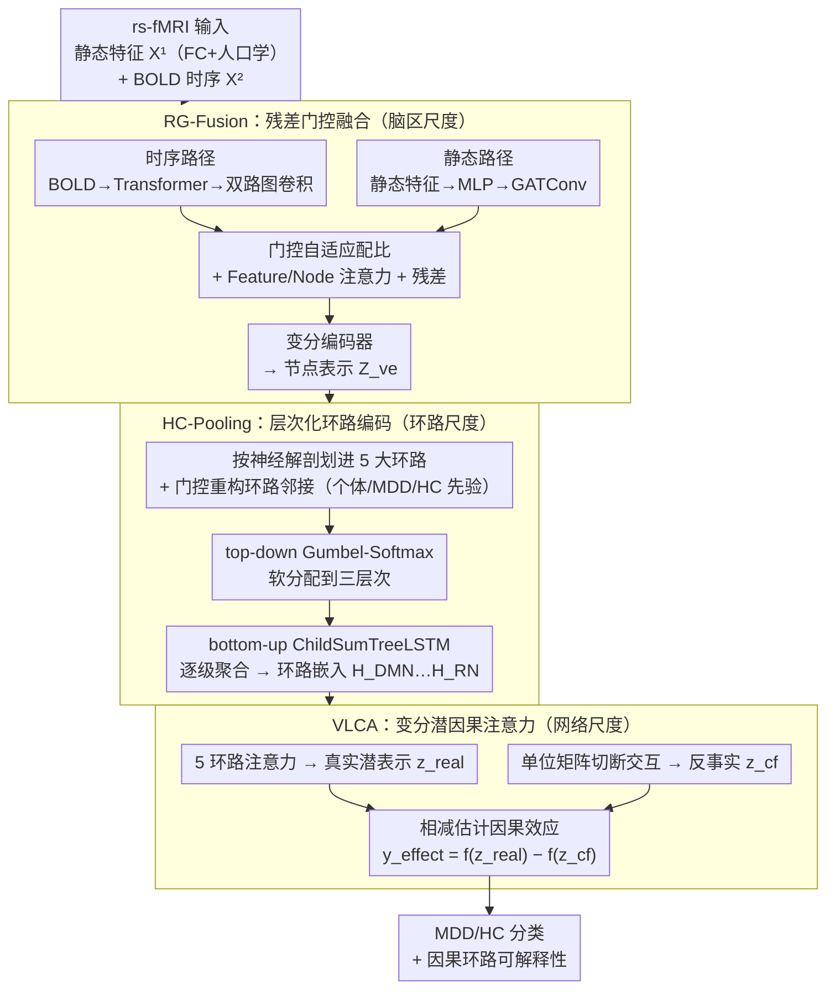

# NeuroCircuitry-Inspired Hierarchical Graph Causal Attention Networks for Explainable Depression Identification

**会议**: ICLR 2026  
**arXiv**: [2511.17622](https://arxiv.org/abs/2511.17622)  
**代码**: [GitHub](https://github.com/author/NH-GCAT)  
**领域**: 医学图像  
**关键词**: 脑网络图神经网络, 抑郁症识别, 因果注意力, 层次化回路编码, 可解释AI

## 一句话总结

提出 NH-GCAT 框架，将神经科学中的抑郁症神经环路先验知识显式融入 GNN，在区域、环路和网络三个空间尺度上建模，在 REST-meta-MDD 数据集上取得 SOTA 分类效果（AUC 78.5%、ACC 73.8%），并提供与神经科学相符的可解释性分析。

## 研究背景与动机

重性抑郁障碍（MDD）影响全球数百万人，fMRI 揭示的脑网络拓扑天然适合用图模型描述。现有 GNN 方法存在两大瓶颈：

**准确率受限**：将脑区等同对待、仅依赖静态功能连接（FC），忽略了时间动态和 MDD 特异性改变

**可解释性差**：缺少对脑网络层次组织和神经环路因果关系的显式建模，post-hoc 解释方法无法对齐神经科学知识

神经科学发现 MDD 病理在三个空间尺度上表现不同：
- **局部区域**：低频 BOLD 振荡异常（与反刍思维相关）
- **环路水平**：DMN、SN、FPN、LN、RN 各环路特异性失调
- **全脑网络**：环路间因果信息流异常

现有方法要么只做数据驱动的黑盒分类，要么只在某一尺度引入先验，没有系统地跨尺度整合神经科学知识。

## 方法详解

### 整体框架

NH-GCAT 要解决的是：怎么把神经科学里"抑郁症在不同空间尺度上各有异常"的先验，显式塞进一个端到端可训练的 GNN，既提分类又能解释。它的做法是把脑区→环路→全脑三个尺度串成三级层次模块，每一级的输出喂给下一级：

1. **RG-Fusion（残差门控融合）**：局部脑区尺度——融合时序 BOLD 动态与静态功能连接（FC），产出节点表示
2. **HC-Pooling（层次化环路编码）**：多区域环路尺度——把节点按 DMN/SN/FPN/LN/RN 五大抑郁环路聚合成环路嵌入
3. **VLCA（变分潜因果注意力）**：多环路网络尺度——推断环路间有向信息流，用反事实对照量化因果效应，最后给出分类

**问题形式化**：给定 N 个受试者的 rs-fMRI，提取静态特征 $\mathbf{X}^{(1)} \in \mathbb{R}^{n \times m}$（FC + 人口学变量）和 BOLD 时序 $\mathbf{X}^{(2)} \in \mathbb{R}^{n \times T}$，构建图 $\mathcal{G} = (\mathcal{V}, \mathcal{E}, \mathbf{X}^{(1)}, \mathbf{X}^{(2)})$，学习 $f: \mathcal{G} \to \{0, 1\}$。

### 关键设计

**1. RG-Fusion：用残差门控把 BOLD 时序动态和静态功能连接融到一起**

最底层（脑区尺度）的痛点是：以往方法只看静态 FC，丢掉了真正有判别力的低频 BOLD 振荡（0.01–0.08 Hz，与反刍思维相关）。RG-Fusion 因此走双路径并行：时序路径把 BOLD 信号送进 Transformer Encoder 得到 $\mathbf{H}_{\text{temp}}$，与静态特征拼接后过双路图卷积（SAGEConv + GATConv）得到 $\mathbf{Z}_{\text{temp}}$；静态路径把静态特征过 MLP 后经 GATConv 得到 $\mathbf{Z}_{\text{static}}$。两路不是简单相加，而是用一个可学习门控自适应配比——$\mathbf{G} = \sigma(\mathbf{W}_g[\mathbf{Z}_1 | \mathbf{Z}_2] + \mathbf{b}_g)$，$\mathbf{Z}_{\text{fused}} = \mathbf{G} \odot \mathbf{Z}_1 + (1-\mathbf{G}) \odot \mathbf{Z}_2$，让模型按节点决定信任时序还是静态信息。最后再经 FeatureAttention → NodeAttention 得到 $\mathbf{H}_{\text{attn}}$，与 $\mathbf{Z}_{\text{temp}}$ 残差门控融合、拼接 $\mathbf{Z}_{\text{static}}$，送入变分编码器得到节点表示 $\mathbf{Z}_{\text{ve}}$。门控+残差的组合既保住了原始信号，又能放大那段最有信息量的低频成分。

**2. HC-Pooling：按神经解剖先验把脑区聚成五大环路，再做双向层次聚合**

中层（环路尺度）要回答的问题是：116 个脑区不该被等同对待，MDD 的失调是按环路发生的。HC-Pooling 先依神经解剖知识把 AAL-116 脑区划进 DMN/SN/FPN/LN/RN 五大抑郁相关环路；再重构每个环路的邻接矩阵——用可学习门控融合个体 FC、MDD 组均值 FC 和 HC 组均值 FC，$\mathbf{A}^{(c_j)} = \sum_{k=1}^{3} \text{softmax}(\text{MLP}(\mathbf{Z})) \cdot \mathbf{A}_k$，把组别先验注入个体图。环路内部再做两步层次处理：top-down 用 Gumbel-Softmax 把节点软分配到高层整合 / 中间处理 / 初级处理三个层次，bottom-up 再用 ChildSumTreeLSTM 从最底层逐级向上聚合，输出各环路的综合嵌入 $\mathbf{H}_{\text{DMN}}, ..., \mathbf{H}_{\text{RN}}$。这一步把"哪些脑区在环路里扮演整合枢纽"显式建模出来，正是后面发现"MDD 的 DMN 被过多分配到高层"这类病理对应的来源。

**3. VLCA：用反事实注意力估计环路间的因果信息流**

顶层（全脑网络尺度）的目标是刻画五大环路之间谁在驱动谁，而普通注意力只能给出相关、给不出因果。VLCA 先对 5 个环路嵌入算 Q/K/V 得到真实注意力权重 $\mathbf{A}^{\text{real}}$，把注意力加权表示编码到连续潜空间 $\mathbf{z}^{\text{real}} = \boldsymbol{\mu}^{\text{real}} + \boldsymbol{\sigma}^{\text{real}} \odot \boldsymbol{\epsilon}$；关键在于它再做一次反事实——用单位矩阵替换注意力矩阵、切断环路间交互，得到 $\mathbf{z}^{\text{cf}}$。两者过同一预测头相减 $\mathbf{y}^{\text{effect}} = f_{\text{pred}}(\mathbf{z}^{\text{real}}) - f_{\text{pred}}(\mathbf{z}^{\text{cf}})$，就量化出"环路间交互究竟贡献了多少分类效应"。这种"有交互 vs 切断交互"的对照，比 post-hoc 注意力可视化更接近因果证据，也让 VLCA 揭示的 DMN→SN、RN→DMN 等有向通路有了可解释依据。

### 损失函数 / 训练策略

总损失为四项加权和：

$$\mathcal{L} = \mathcal{L}_{\text{cls}} + \lambda_{\text{kl}} \mathcal{L}_{\text{kl}} + \lambda_{\text{VLCA}} \mathcal{L}_{\text{VLCA}} + \lambda_{\text{mse}} \mathcal{L}_{\text{mse}}$$

- $\mathcal{L}_{\text{cls}}$：MDD/HC 二分类交叉熵
- $\mathcal{L}_{\text{kl}}$：变分编码的 KL 正则
- $\mathcal{L}_{\text{VLCA}}$：因果效应的分类损失 + KL 散度
- $\mathcal{L}_{\text{mse}}$：约束学习到的邻接矩阵与组别先验 FC 一致

使用 Adam 优化器 + 梯度裁剪，正则项动态权重调度。隐藏层 128 维，因果注意力 64 维单头。在 NVIDIA RTX 4090 上训练。

## 实验关键数据

### 主实验

**数据集**：REST-meta-MDD，16 个采集站点，1601 人（830 MDD + 771 HC），AAL-116 脑区。

| 模型 | AUC | ACC | SEN | SPE | F1 |
|------|-----|-----|-----|-----|-----|
| LCCAF | 75.6 (1.0) | 70.2 (8.3) | 69.7 (2.7) | 70.7 (2.1) | - |
| BPI-GNN | - | 73.0 (1.0) | - | - | 72.0 (1.0) |
| GAT-Baseline | 71.5 (3.2) | 67.7 (2.7) | **77.5** (9.1) | 57.2 (9.4) | 71.2 (3.3) |
| **NH-GCAT** | **78.5 (1.7)** | **73.8 (1.4)** | 76.4 (5.8) | **71.0 (6.6)** | **75.0 (1.8)** |
| 提升 | +2.9 | +0.8 | -1.1 | +0.3 | +2.4 |

**LOSO-CV 跨站泛化**：16 站加权平均 ACC = 73.3%，超过 CI-GNN（69.2%）和 BrainIB（68.8%）。

| 方法 | 加权平均 ACC |
|------|------------|
| CI-GNN | 69.2% |
| BrainIB | 68.8% |
| **NH-GCAT** | **73.3%** |

### 消融实验

| 模型变体 | AUC | ACC | SPE | F1 |
|----------|-----|-----|-----|-----|
| GAT-Baseline | 71.5 | 67.7 | 57.2 | 71.2 |
| + RG-Fusion | 74.8 (+3.3) | 70.2 (+2.5) | 70.6 (+13.4) | 70.5 |
| + VLCA | 75.9 (+1.1) | 72.0 (+1.8) | 68.2 | 73.6 (+3.1) |
| + HC-Pooling (完整) | **78.5 (+7.0)** | **73.8 (+6.1)** | **71.0 (+13.8)** | **75.0 (+3.8)** |

三个模块逐步叠加，AUC 累计提升 7.0%，特异性提升 13.8%（p<0.05 统计显著）。

### 关键发现

1. **低频振荡验证**：RG-Fusion 模块在低频输入（0.01–0.08 Hz）上 AUC=0.742，显著高于高频（0.1–0.25 Hz）的 0.679（p=0.0037）
2. **层次化分配**：HC-Pooling 发现 MDD 患者 DMN 区域（如内侧额上回）被过多分配到高层，与病理性反刍一致；FPN 区域高层分配减少，提示认知控制受损
3. **因果环路分析**：VLCA 揭示 MDD 中 DMN→SN 调控减弱、RN→DMN 输入异常增强等模式，与核心抑郁症状对应

## 亮点与洞察

- **三尺度建模范式**：首次在 region / circuit / network 三层同时引入神经科学先验，不同于以往只在单一尺度加约束
- **反事实因果推理**：VLCA 通过"切断环路交互"的反事实实验估计因果效应，比 post-hoc 注意力可视化更有说服力
- **临床可解释性强**：所有模块的中间结果都可映射到已知的神经科学发现，而非黑盒中间表示

## 局限与展望

1. 仅在 REST-meta-MDD 单一数据集验证，未在 ABIDE（自闭症）等其他精神疾病数据上测试泛化性
2. 5 大环路的划分基于先验知识，不同疾病可能需要不同的环路定义
3. 时间分辨率受限于 fMRI 的 TR（~2s），无法捕获更快速的神经动态
4. 部分站点表现不稳定（如 Site 8 下降 11.2%），跨站域偏移仍需进一步处理

## 相关工作与启发

- 与 BrainIB（信息瓶颈）、CI-GNN（因果推断）同属脑图谱 GNN 方向，但本文是首个跨三尺度融合的框架
- ChildSumTreeLSTM 用于层次化聚合的思路值得借鉴到其他有先验层次结构的图问题
- 可推广到 EEG、DTI 等其他脑成像模态，以及帕金森、PTSD 等其他精神/神经疾病

## 评分

- 新颖性：★★★★☆ — 三尺度神经科学先验融合是显著的方法创新
- 技术深度：★★★★☆ — 三个模块设计精细，数学严谨
- 实验充分度：★★★☆☆ — 仅一个数据集，但消融和可解释性分析非常充分
- 写作质量：★★★★☆ — 结构清晰，图文配合好

<!-- RELATED:START -->

## 相关论文

- [\[CVPR 2026\] Focus-to-Perceive Representation Learning: A Cognition-Inspired Hierarchical Framework for Endoscopic Video Analysis](../../CVPR2026/medical_imaging/focus-to-perceive_representation_learning_a_cognition-inspired_hierarchical_fram.md)
- [\[NeurIPS 2025\] RadZero: Similarity-Based Cross-Attention for Explainable Vision-Language Alignment in Chest X-ray](../../NeurIPS2025/medical_imaging/radzero_similarity-based_cross-attention_for_explainable_vision-language_alignme.md)
- [\[CVPR 2026\] MedFG-VQA: Low-Frequency Memory and Graph Attention for Lightweight Medical VQA](../../CVPR2026/medical_imaging/medfg-vqa_low-frequency_memory_and_graph_attention_for_lightweight_medical_vqa.md)
- [\[AAAI 2026\] NutriScreener: Retrieval-Augmented Multi-Pose Graph Attention Network for Malnourishment Screening](../../AAAI2026/medical_imaging/nutriscreener_retrieval-augmented_multi-pose_graph_attention_network_for_malnour.md)
- [\[ICLR 2026\] Towards Interpretable Visual Decoding with Attention to Brain Representations](towards_interpretable_visual_decoding_with_attention_to_brain_representations.md)

<!-- RELATED:END -->
