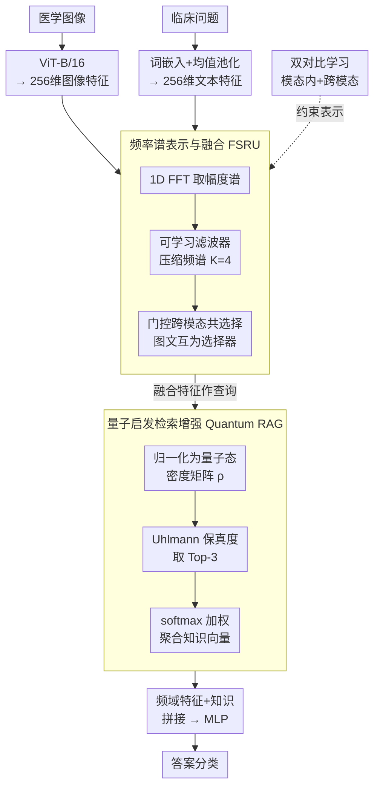

# Q-FSRU: Quantum-Augmented Frequency-Spectral Fusion for Medical Visual Question Answering

**会议**: ICLR 2026  
**arXiv**: [2509.23899](https://arxiv.org/abs/2509.23899)  
**代码**: 无  
**领域**: 医学图像  
**关键词**: 医学VQA, 频率域融合, 量子检索增强, 多模态融合, 对比学习

## 一句话总结
提出 Q-FSRU 框架，通过 FFT 将医学图像和文本特征变换到频率域进行融合，并引入量子启发的检索增强机制（Quantum RAG）从外部知识库中获取医学事实，在 VQA-RAD 数据集上取得 90.0% 准确率。

## 研究背景与动机
- 医学视觉问答（Med-VQA）需要同时理解医学图像和临床问题，现有方法面临数据稀缺、专业术语复杂、影像模态多样等挑战
- 大多数方法（LLaVA-Med、STLLaVA-Med 等）仅在空间域操作，可能忽略了频率域中隐含的病理模式信息
- 现有的检索增强方法依赖经典余弦相似度，可能无法充分捕捉临床推理所需的复杂语义关系
- **核心动机**：频率域变换可以捕捉空间处理遗漏的全局上下文模式；量子启发的相似度度量可能优于经典检索方法

## 方法详解

### 整体框架
Q-FSRU 要解决的是医学视觉问答（Med-VQA）里的两个老问题：现有方法几乎只在空间域逐像素处理图像，容易错过弥漫性病变这类分布式的全局病理模式；同时模型自身缺乏专业医学知识，靠余弦相似度的经典检索又不够细。它的整体流程是：先用 ViT-B/16 抽 256 维图像特征、用 300 维词嵌入加均值池化抽 256 维问题特征（这部分是通用脚手架），再把两路特征送进**频率谱融合主干（FSRU）**——FFT 变到频域、可学习滤波器压缩、门控跨模态共选择；融合后的特征又作为查询去触发**量子启发检索分支（Quantum RAG）**，从外部知识库取回医学事实；最后把频域特征和检索知识拼接送进 MLP 出答案。训练时额外挂一组**双对比损失**整理表示空间。

### 关键设计

**1. 频率谱表示与融合（FSRU）：把空间域遗漏的全局病理模式拉到频域里融合**

纯空间处理容易盯着局部像素，反而忽略弥漫性病变这类全局模式。FSRU 先对文本特征 $t$ 和投影后的图像特征 $v_{\text{proj}}$ 各做一次 1D FFT 并取幅度谱 $t_{\text{freq}} = |\mathcal{F}(t)|$、$v_{\text{freq}} = |\mathcal{F}(v_{\text{proj}})|$，把信号搬到频率域，让能量在哪些频段集中这件事直接成为可学习的特征；随后用一组可学习滤波器（$K=4$）把高维频谱压成紧凑表示。融合阶段采用门控的跨模态共选择，由图像频谱压缩特征算出作用在文本上的门 $g_{\text{text}} = \sigma(W_{\text{gate1}} \cdot \text{AvgPool}(v_{\text{compressed}}))$，再用它逐通道调制文本 $t_{\text{enhanced}} = t_{\text{compressed}} \odot g_{\text{text}}$，反过来也对图像做同样的门控，于是两个模态在频域里互为选择器、彼此放大对方真正相关的成分。消融里去掉频率处理直接掉 4.9 个点，是所有模块里贡献最大的一项，印证了频谱表示确实抓到了空间域看不见的临床线索。

**2. 量子启发检索增强（Quantum RAG）：用保真度替代余弦，从外部知识库取医学事实**

经典 RAG 靠余弦相似度匹配，在高维医学语义上未必够细。这里先把融合后的查询 $q_{\text{multi}} = \tfrac{1}{2}(t_{\text{enhanced}} + v_{\text{enhanced}})$ 归一化成"量子态" $|\psi(x)\rangle = x / \|x\|_2$，再用密度矩阵 $\rho(x) = |\psi(x)\rangle\langle\psi(x)|$ 表示，借二阶统计量带来一些鲁棒性；查询与知识库条目之间改用 Uhlmann 保真度 $\text{Fid}(\rho_q, \rho_{k_i})$ 衡量相似度，取 Top-3 后按温度 $\tau = 0.1$ 的 softmax 加权聚合成知识向量 $k_{\text{agg}} = \sum_{j=1}^{3} \text{softmax}(\text{Sim}_j / \tau) \cdot k_j$，再注入融合特征。消融里把保真度换回余弦，准确率从 90.0% 降到 88.1%，说明这套量子相似度确有增益，只是 1.9 个点的差距也提示优势尚属温和。

**3. 双对比学习框架：在模态内和模态间同时整理表示空间**

为让相同答案类别的样本聚拢、不同类别推开，模型同时上两路对比损失：模态内对比 $\mathcal{L}_{\text{intra}}$（温度 $\tau = 0.07$）分别约束文本和图像各自的表示，跨模态对比 $\mathcal{L}_{\text{cross}}$（温度 $\tau = 0.05$）则拉齐图文配对。两者一起让融合前的特征就具备更好的判别结构，消融显示去掉对比学习掉 2.7 个点。

### 损失函数 / 训练策略
总损失把分类交叉熵和两路对比项加权相加：$\mathcal{L}_{\text{total}} = \mathcal{L}_{\text{CE}} + (0.3 \cdot \frac{\mathcal{L}_{\text{intra-text}} + \mathcal{L}_{\text{intra-image}}}{2} + 0.7 \cdot \mathcal{L}_{\text{cross}})$，跨模态项权重明显更高（0.7 对 0.3），把对齐图文放在首位。训练用 Adam（学习率 $5 \times 10^{-5}$、L2 正则 $10^{-5}$），batch size 32，最多 50 个 epoch 并按每 5 epoch 乘 0.98 衰减、patience 10 早停，整体走 5 折交叉验证。

## 实验关键数据

### 主实验

| 数据集 | 指标 | Q-FSRU | FSRU (之前SOTA) | 提升 |
|--------|------|--------|----------------|------|
| VQA-RAD | Accuracy | 90.0% | 87.1% | +2.9% |
| VQA-RAD | F1-Score | 85.2% | 82.3% | +2.9% |
| VQA-RAD | AUC | 0.954 | 0.921 | +0.033 |
| VQA-RAD→PathVQA | Accuracy | 81.7% | 78.4% | +3.3% |
| PathVQA→VQA-RAD | Accuracy | 80.3% | 76.9% | +3.4% |

### 消融实验

| 配置 | Accuracy | Δ Acc. | 说明 |
|------|---------|--------|------|
| Q-FSRU (Full) | 90.0% | — | 完整模型 |
| w/o Frequency Processing | 85.1% | -4.9% | 频率处理贡献最大 |
| w/o Quantum Retrieval | 86.8% | -3.2% | 量子检索有显著帮助 |
| w/o Contrastive Learning | 87.3% | -2.7% | 对比学习也有贡献 |
| Spatial-only Fusion | 84.2% | -5.8% | 纯空间融合最差 |
| Cosine Similarity (替代量子) | 88.1% | -1.9% | 量子相似度优于余弦 |

### 关键发现
- 频率域处理是性能提升的最大贡献者（-4.9%），表明频谱表示确实能捕捉空间域遗漏的临床相关模式
- 量子启发检索比经典余弦相似度高 1.9%，但差距不算巨大
- 模型参数量仅 92.4M，远小于 LLaVA-Med/STLLaVA-Med 的 7B，但在 VQA-RAD 上表现更好
- 跨数据集泛化能力强（+3.3%/+3.4%），说明学到的特征有迁移性

## 亮点与洞察
- 将频率域分析引入 Med-VQA 是一个新颖的探索方向，FFT 的全局信息可能对医学影像分析特别有用
- 量子启发检索是一个有趣但相对初步的尝试，将量子态表示应用于知识检索
- 模型紧凑（92.4M 参数），在资源受限环境下有实际部署价值

## 局限与展望
- 仅在 VQA-RAD 和 PathVQA 两个数据集上验证，数据规模较小（VQA-RAD 仅 3,515 对）
- 量子检索的理论优势描述较多，但实际性能提升相对有限（比余弦仅高 1.9%）
- 缺少与最新大语言模型 (GPT-4V 等) 的对比
- 知识库的构建和维护方式没有详细说明
- 在更复杂的多选/开放式问答上的表现未知

## 相关工作与启发
- 频率域在图像分析（FDTrans）和谣言检测（Lao et al. 2024）中已有成功，本文扩展到 Med-VQA
- 量子启发信息检索(Uprety et al. 2021)为相似度计算提供了新视角
- 跨模态对比学习已成为多模态融合的标准做法

## 评分
- 新颖性: ⭐⭐⭐⭐ 频率域+量子检索的组合在 Med-VQA 中是新颖的
- 实验充分度: ⭐⭐⭐ 数据集较小，缺少与最新 LVLM 对比
- 写作质量: ⭐⭐⭐⭐ 结构清晰，公式推导完整
- 价值: ⭐⭐⭐ 轻量级方案有价值，但量子检索的实际优势需更深入验证

<!-- RELATED:START -->

## 相关论文

- [\[ICLR 2026\] CARE: Towards Clinical Accountability in Multi-Modal Medical Reasoning with an Evidence-Grounded Agentic Framework](care_towards_clinical_accountability_in_multi-modal_medical_reasoning_with_an_ev.md)
- [\[CVPR 2026\] Dual-Level Confidence based Implicit Self-Refinement for Medical Visual Question Answering](../../CVPR2026/medical_imaging/dual-level_confidence_based_implicit_self-refinement_for_medical_visual_question.md)
- [\[ICLR 2026\] Boosting Medical Visual Understanding From Multi-Granular Language Learning](boosting_medical_visual_understanding_from_multi-granular_language_learning.md)
- [\[CVPR 2026\] MR-RAG: Multimodal Relevance-Aware Retrieval-Augmented Generation for Medical Visual Question Answering](../../CVPR2026/medical_imaging/mr-rag_multimodal_relevance-aware_retrieval-augmented_generation_for_medical_vis.md)
- [\[ICLR 2026\] Towards Interpretable Visual Decoding with Attention to Brain Representations](towards_interpretable_visual_decoding_with_attention_to_brain_representations.md)

<!-- RELATED:END -->
