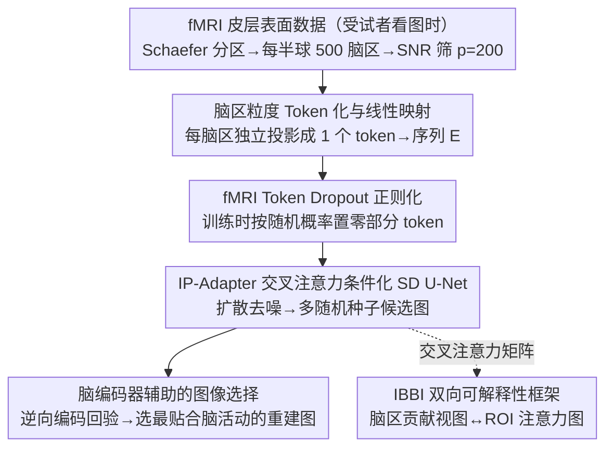

# Towards Interpretable Visual Decoding with Attention to Brain Representations

**会议**: ICLR 2026  
**arXiv**: [2509.23566](https://arxiv.org/abs/2509.23566)  
**代码**: [GitHub](https://github.com/kriegeskorte-lab/NeuroAdapter)  
**领域**: 脑机接口 / 视觉解码 / 医学影像  
**关键词**: fMRI 视觉解码, 端到端脑-图像重建, 交叉注意力条件化, 双向可解释性, 脑区 token

## 一句话总结

提出 NeuroAdapter，将 fMRI 信号按脑区分割为独立 token 并通过交叉注意力直接条件化 Stable Diffusion，跳过传统的 CLIP/DINO 中间嵌入空间，在 NSD 等数据集上高层语义指标超越或持平现有方法，同时引入 IBBI 双向可解释性框架，首次动态揭示不同皮层区域在去噪轨迹中如何驱动图像生成。

## 研究背景与动机

**领域现状**：从人脑 fMRI 活动重建视觉刺激是计算神经科学的核心挑战。当前主流方法采用两阶段流水线——先将 fMRI 映射到预训练视觉-语言模型的嵌入空间（如 CLIP、DINO），再用这些嵌入引导 Stable Diffusion 等生成模型重建图像。代表工作包括 Brain Diffuser、MindEye1、DREAM 等。

**现有痛点**：两阶段流水线存在两个根本问题。（1）**信息瓶颈**：中间嵌入空间的维度和语义覆盖范围有限，fMRI 中丰富的低层/高层神经信息可能在映射过程中丢失——重建质量取决于 fMRI 与嵌入空间的对齐程度而非脑活动本身的信息量。（2）**可解释性被遮蔽**：中间映射切断了脑区与生成结果之间的直接联系，无法追溯"哪些脑区驱动了图像的哪些部分"，限制了解码方法在神经科学研究中的价值。

**核心矛盾**：两阶段方法将"提升重建质量"和"保持可解释性"置于对立面——嵌入空间的引入提升了生成质量但牺牲了脑区归因的透明性。

**本文目标**（1）设计一个端到端框架，直接从 fMRI 到图像，不经过中间嵌入空间；（2）在不损失重建质量的前提下，实现脑区级别的可解释性——动态追踪每个皮层区域对生成过程的贡献。

**切入角度**：将每个脑区视为一个独立的 token，通过交叉注意力机制让扩散模型直接"关注"这些脑区 token。这种设计天然地将注意力权重与脑区一一对应，注意力矩阵本身就成为可解释性的分析对象。

**核心 idea**：用脑区粒度的 token 通过交叉注意力直接条件化扩散模型，让注意力权重成为可解释性的天然载体。

## 方法详解

### 整体框架

NeuroAdapter 想做的事情很直接：跳过 CLIP/DINO 这类中间嵌入空间，让 fMRI 信号本身直接当扩散模型的条件，同时让"哪个脑区驱动了图像"这件事变得可读。整条 pipeline 是这样转的：受试者看图时的 fMRI 皮层表面数据先经 Schaefer 分区切成每半球 500 个脑区，按信噪比（SNR）筛出最高的 $p=200$ 个；每个脑区各自走一条独立线性投影，被压成一个 token，拼成条件序列 $E \in \mathbb{R}^{p \times f}$；训练时再对这些 token 做随机丢弃（fMRI Token Dropout）做正则。接着把 Stable Diffusion U-Net 里的交叉注意力层换成 IP-Adapter 风格的模块，让 U-Net 的空间 query 直接去"关注"这 200 个 fMRI token，去噪生成重建图像。训练时冻结 SD 主体，只更新脑区投影矩阵和新加的交叉注意力模块；推理时再用一个脑编码器从多张候选里挑出最优重建。最后，因为脑区与 token 一一对应，注意力矩阵本身可被 IBBI 双向可解释性框架读出，反查"哪个脑区驱动了图像的哪一块"。

### 关键设计

**1. 脑区粒度 Token 化与线性映射：把每个脑区单独投影成一个 token，让注意力天然对齐到解剖结构**

两阶段方法把 fMRI 映到一个统一嵌入空间，结果是脑区与生成结果之间的链路被切断，没法追溯归因。这里换了个粒度：对每个脑区 $P_i$，把它包含的顶点响应向量填充到最大顶点数 $v_{max}$，再通过一个**独立**的投影矩阵 $w \in \mathbb{R}^{v_{max} \times f}$（$f=768$）映射成一个 $f$ 维 token——200 个脑区就产生 200 个 token，构成条件序列 $E \in \mathbb{R}^{p \times f}$，且每个脑区的投影矩阵不共享参数。关键就在"一个脑区 = 一个 token"这层对应关系：它不同于把整个大脑展平成一个高维向量再投影，脑区粒度让交叉注意力矩阵的每一列正好对应一个解剖学定义的脑区，可解释性因此是"设计自带"的而非事后探针。用线性映射而不是 MLP 也是有意为之——避免非线性变换把脑区信息的来源搅浑。

**2. fMRI Token Dropout 正则化：训练时随机丢弃脑区 token，逼模型别只盯着某几个脑区**

直接条件化容易让模型过拟合到特定的脑区组合，解码就不鲁棒了。做法是训练时对每个样本独立采一个 dropout 概率 $r \sim \mathcal{U}(0,1)$，按它生成二值掩码 $M \in \{0,1\}^{p \times 1}$，每个 token 以概率 $r$ 被置零：$E' = E \odot M$。注意这里 dropout 概率本身是均匀随机的，所以训练中模型会见到从"几乎不丢弃"到"几乎全部丢弃"的各种信息量场景，被迫在任何残缺程度下都给出合理输出——思路上类似 classifier-free guidance 里的条件 dropout。消融里这一项格外关键，去掉后高层语义指标显著下降。

**3. 脑编码器辅助的图像选择：用"逆向编码"回验候选图，挑最贴合原始脑活动的那一张**

扩散模型的随机性是把双刃剑，同一条件下生成质量可能差很多。为此对每个测试 fMRI 样本，用不同随机种子生成 $n$ 张候选图像，再用一个预训练的全脑编码器（Transformer 架构）反过来预测每张候选**应该**激发的 fMRI 响应 $B'_i$，算它与真实测量 fMRI 的 Pearson 相关性，最后选相关性最高的那张作为输出。本质上是拿编码-解码一致性当质量筛选标准：谁最能"还原"出原始脑活动模式，谁就最可能是对的重建。

**4. IBBI 双向可解释性框架：把交叉注意力矩阵直接当探针，双向读出脑区↔图像的对应**

因为脑区与 token 一一对应，注意力矩阵 $A^{(\ell,h,t)} \in \mathbb{R}^{q \times p}$ 本身就携带了可解释信息，IBBI（Image–Brain BI-directional）就从两个互补方向去读它。**脑导向视图**回答"哪些脑区在驱动生成"：把注意力矩阵在 query 维度、层、头上聚合，得到脑区贡献向量 $B^{(t)} \in \mathbb{R}^p$ 且 $\sum_j B_j^{(t)} = 1$，投影回皮层表面就能看到每个去噪步里各脑区的相对影响力。**图像导向视图**回答"某个脑区在关注图像的哪里"：对给定 ROI $\mathcal{R}$，在 head 和 ROI 内 token 上池化注意力，得到每层的 query-wise 注意力图 $m_\mathcal{R}^{(\ell,t)} \in \mathbb{R}^{q^\ell}$，reshape 成 2D、上采样到图像分辨率、再层间平均，就得到 ROI 注意力图 $I_\mathcal{R}^{(t)}$——它揭示了像 FFA（面部区）、PPA（场景区）这类脑区在图像空间中的"功能足迹"。

### 损失函数 / 训练策略

基础扩散损失配合 Min-SNR 加权策略：降低高 SNR（噪声少、重建容易）步的损失权重，保持低 SNR（噪声大、重建难）步的权重，平衡训练信号。文本编码器接收空输入，确保 fMRI token 是唯一的条件来源。训练 300 epoch，batch size 16，2 张 NVIDIA L40 GPU，约 25 小时。

## 实验关键数据

### 主实验

在 NSD 数据集上与主流方法的对比（4 个受试者平均，相对 ImageNet 检索基线的提升百分比）：

| 方法 | 类型 | CLIP↑ | Incep↑ | Eff↑ | SwAV↑ | PixCorr↑ | SSIM↑ |
|------|------|-------|--------|------|-------|----------|-------|
| Brain Diffuser (w/ VDVAE) | 两阶段 | 较高 | 较高 | 较高 | 较高 | **最高** | **最高** |
| Brain Diffuser (w/o VDVAE) | 两阶段 | 中等 | 中等 | 中等 | 中等 | 与本文相当 | 与本文相当 |
| MindEye1 | 两阶段 | 高 | 高 | 高 | 高 | 中等 | 中等 |
| DREAM | 两阶段 | 高 | 高 | 高 | 高 | 中等 | 中等 |
| MindFormer | 多受试者 | 高 | 高 | 高 | 高 | 中等 | 中等 |
| **NeuroAdapter（本文）** | **端到端** | **最高/持平** | **最高/持平** | **竞争力** | **竞争力** | 中等 | 中等 |

关键结论：NeuroAdapter 在高层语义指标（CLIP、Incep、Eff、SwAV）上与使用 CLIP/DINO 嵌入的两阶段方法竞争甚至超越；低层指标（PixCorr、SSIM）上与去掉 VDVAE 路径的 Brain Diffuser 相当——说明低层指标的差距来自 VDVAE 的额外低层特征路径，而非端到端方法本身的局限。

### 消融实验

在 NSD Subject 1 上进行的关键消融（相对基线的变化方向）：

| 配置 | 高层指标 | 低层指标 | 说明 |
|------|---------|---------|------|
| Full NeuroAdapter | 最优 | 最优 | 完整模型，$p=200$, $f=768$ |
| w/o fMRI Token Dropout | 显著下降 | 下降 | Dropout 对鲁棒性至关重要 |
| w/o Min-SNR 加权 | 轻微下降 | 下降 | 训练信号平衡有一定帮助 |
| w/o 脑编码器选择 | 下降 | 下降 | 随机性导致质量不稳定 |
| $p=50$（脑区数少） | 显著下降 | 下降 | 信息量不足 |
| $p=400$（脑区数多） | 轻微下降 | 轻微下降 | 低 SNR 脑区引入噪声 |
| 仅用视觉 token（无脑区结构） | 大幅下降 | 大幅下降 | 脑区粒度 token 化是核心 |

### 关键发现

- **fMRI Token Dropout 是最关键的设计**：去掉后性能大幅下滑，说明模型容易过拟合到特定脑区组合。均匀采样 dropout 概率的设计比固定概率更有效
- **脑区数 $p=200$ 是甜蜜点**：太少（50）信息不足，太多（400）引入低 SNR 噪声。SNR 筛选 + 适量脑区的组合最有效
- **高级视觉区域主导生成动态**：IBBI 分析显示 FFA（面部选择区）、PPA（场景选择区）等高阶视觉区的注意力贡献始终远高于 V1/V2 等低层视觉区
- **注意力图的时间动态与神经科学一致**：早期去噪步注意力分散在整个图像上，随着去噪推进逐渐集中到语义相关区域——面部 ROI 收敛到人脸、场景 ROI 扩展到背景
- **因果扰动验证了功能选择性**：遮蔽低层视觉 ROI（V1-V3）不影响语义内容，但遮蔽高层 ROI（FFA、PPA、LOC）完全改变生成图像，验证了高阶区域携带核心语义信息
- **NSD-Imagery 和 Deeprecon 上的泛化**：在心理意象任务和训练/测试类别不重叠的设置下，NeuroAdapter 均展现出合理的泛化能力，高层语义指标与现有方法可比

## 亮点与洞察

- **"一个脑区 = 一个 token"的设计极其巧妙**：这一看似简单的对应关系同时解决了条件化和可解释性两个问题——交叉注意力矩阵的每一列直接对应一个解剖学脑区，无需额外探针或后处理即可分析脑区贡献。这种"设计即可解释"的思路值得借鉴
- **IBBI 框架提供了生成模型的神经科学探针**：将扩散模型的去噪轨迹与脑区功能连接，不仅验证了已知的视觉层次结构（低层→低层特征、高层→语义），还提供了时间维度的新发现（注意力从扩散到收敛的动态过程）
- **"去掉中间嵌入反而不掉点"的反直觉结论**：说明 fMRI 本身携带的信息足以直接驱动高质量生成，CLIP/DINO 嵌入空间更多是便利而非必要的。这对其他模态的条件生成有启示——是否也可以跳过中间表示？
- **脑编码器选择策略**是一个通用的生成质量筛选范式：通过"逆向编码"回验重建结果与输入条件的一致性，可推广到任何条件生成任务中

## 局限与展望

- **低层视觉特征重建偏弱**：端到端方法放弃了 VDVAE 等低层特征路径，在 PixCorr/SSIM 上有差距。可考虑添加一个轻量的像素级辅助损失或波形 VAE 分支
- **扩散模型随机性问题**：即使有脑编码器选择，生成质量仍然不稳定。未来可探索确定性采样或一致性模型减少随机性
- **可解释性仍是相关性而非因果性**：交叉注意力权重反映的是"模型选择关注什么"而非"脑区真正编码了什么"。因果扰动分析是一步，但更严格的因果推断方法仍有必要
- **受试者规模有限**：NSD 仅 8 名受试者，跨受试者泛化性未被充分验证。未来应结合功能对齐技术支持跨受试者解码
- **脑编码器引入额外开销**：选择策略需要预训练编码器 + 多次前向传播，推理成本较高

## 相关工作与启发

- **vs Brain Diffuser**：通过 CLIP+VDVAE 两条路径分别捕获高层和低层特征引导 SD。本文用单一端到端路径取代，高层指标持平/超越，但低层受限于缺少 VDVAE。关键区别是 Brain Diffuser 的嵌入空间映射切断了脑区归因链路
- **vs MindEye1/DREAM**：使用精心设计的 CLIP 对齐策略和大规模数据增强提升性能。本文证明即使不走嵌入对齐路线，直接条件化也能达到竞争力水平——暗示嵌入对齐的收益可能被高估
- **vs DynaDiff**：用 LoRA 微调 SD 处理动态 fMRI，是向单阶段迈进的另一条路线。但 LoRA 方式不具备脑区粒度的可解释性，注意力分析无法映射回解剖结构
- **vs 脑编码模型（Adeli et al. 2025）**：编码方向（图像→fMRI）的 Transformer 注意力图揭示"哪些视觉特征被路由到哪些脑区"。本文从解码方向（fMRI→图像）提供互补视角，两者结合可形成更完整的脑视觉表征理解

## 评分

- 新颖性: ⭐⭐⭐⭐ 端到端条件化 + "设计即可解释"的思路是重要范式创新
- 实验充分度: ⭐⭐⭐⭐ 三个数据集、完整消融、IBBI 定性定量分析，但低层指标讨论可更深入
- 写作质量: ⭐⭐⭐⭐ 方法和可解释性框架描述清晰，图示精良
- 价值: ⭐⭐⭐⭐ 为神经科学解码研究提供了新的可解释性工具，高层语义重建 SOTA 水平

<!-- RELATED:START -->

## 相关论文

- [\[ICLR 2026\] SEED: Towards More Accurate Semantic Evaluation for Visual Brain Decoding](seed_towards_more_accurate_semantic_evaluation_for_visual_brain_decoding.md)
- [\[NeurIPS 2025\] MoRE-Brain: Routed Mixture of Experts for Interpretable and Generalizable Cross-Subject fMRI Visual Decoding](../../NeurIPS2025/medical_imaging/more-brain_routed_mixture_of_experts_for_interpretable_and_generalizable_cross-s.md)
- [\[CVPR 2026\] Modeling the Brain's Grammar: ROI-Guided fMRI Pretraining for Transferable and Interpretable Vision Decoding](../../CVPR2026/medical_imaging/modeling_the_brains_grammar_roi-guided_fmri_pretraining_for_transferable_and_int.md)
- [\[ICLR 2026\] Neuro-Symbolic Decoding of Neural Activity](neuro-symbolic_decoding_of_neural_activity.md)
- [\[CVPR 2026\] NeuroFlow: Toward Unified Visual Encoding and Decoding from Neural Activity](../../CVPR2026/medical_imaging/neuroflow_toward_unified_visual_encoding_and_decoding_from_neural_activity.md)

<!-- RELATED:END -->
