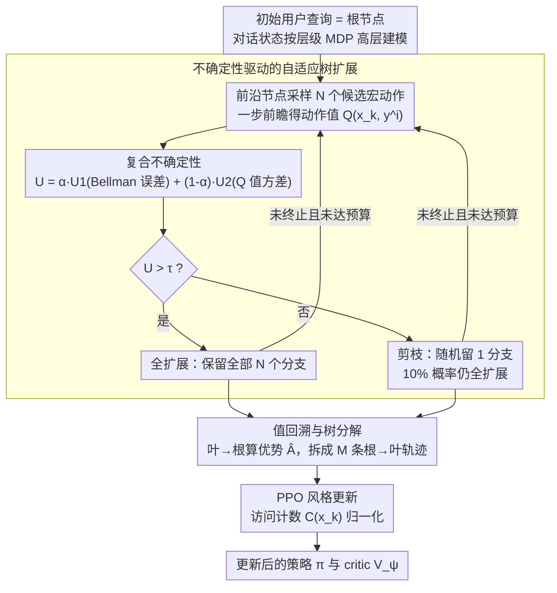

# ATPO: Adaptive Tree Policy Optimization for Multi-Turn Medical Dialogue

**会议**: ICLR 2026  
**arXiv**: [2603.02216](https://arxiv.org/abs/2603.02216)  
**代码**: [https://github.com/Quark-Medical/ATPO](https://github.com/Quark-Medical/ATPO)  
**领域**: 医疗NLP
**关键词**: 多轮医疗对话, 树搜索, 策略优化, 不确定性引导, 层级MDP, 值函数估计, LLM对齐  

## 一句话总结
提出 ATPO（自适应树策略优化）算法，将多轮医疗对话建模为层级马尔可夫决策过程（H-MDP），通过不确定性感知的自适应树扩展机制动态分配rollout预算，结合Bellman误差和动作值方差的复合不确定性度量来引导探索，在三个医学对话基准上以Qwen3-8B超越GPT-4o。

## 研究背景与动机

**领域现状**：医学大语言模型在单轮问答（如医学考试、疾病诊断）中已达到SOTA水平，但现实医疗对话中用户初始信息通常不完整，需要模型主动追问以收集关键信息。

**现有痛点**：
   - Prompt工程方法（如MEDIQ）让模型主动提问反而降低准确率
   - SFT方法仅模仿训练数据的表面模式，泛化能力差
   - 轨迹级偏好优化依赖昂贵的偏好数据且对分布偏移敏感
   - GRPO在长horizon任务中难以进行有效的信用分配
   - PPO的值函数估计在多轮对话场景下不稳定

**核心矛盾**：多轮医疗对话本质上是长horizon序列决策问题，现有RL方法要么在信用分配上失效（GRPO将整条轨迹共享同一优势值），要么值估计不准确（PPO的单步critic在长对话中误差累积）。

**本文目标**：如何在多轮医疗对话中实现高效且准确的策略优化——既能精确估计每轮对话的价值，又能高效探索对话空间。

**切入角度**：将问题建模为H-MDP，在对话轮次级别进行树搜索，用不确定性度量自适应地分配计算预算。

**核心 idea**：通过Bellman误差和Q值方差的复合度量识别高不确定性对话状态，选择性扩展树节点，同时提升采样多样性和critic准确性。

## 方法详解

### 整体框架
ATPO要解决的是「多轮医疗对话该怎么做策略优化」：GRPO把整条轨迹共享一个优势值、信用分配太粗，PPO的单步critic在长对话里误差累积、值估计不准。ATPO的思路是把整个对话过程展开成一棵搜索树，再用不确定性把有限的rollout预算花在真正值得探索的对话状态上。

具体来说，初始用户查询是根节点，每个节点是一个对话状态。在每个非终端节点，助手模型先采样 N 个候选宏动作（一次追问或一次最终回答），算一个复合不确定性分数：分数高就完全扩展（保留全部 N 个分支、继续深挖），分数低就剪枝（只留 1 个分支）；这个「采样—算不确定性—决定扩不扩」的循环一直转到所有对话终止或叶节点数触及预算。树长完之后，从叶节点回溯算出每个节点的目标值和优势，把树拆成一条条根到叶的轨迹，再用 PPO 风格更新策略和 critic。

### 关键设计

**1. 层级 MDP 建模：把轮次和 token 分成两层，让信用分配落在「轮」上**

ATPO 把对话拆成高层和低层两个 MDP。高层 MDP 里，宏动作 $y_k$ 是助手在第 $k$ 轮输出的完整 token 序列，状态 $x_k$ 包含第 $k$ 轮之前的交互历史和当前用户查询 $q_k$；低层 MDP 里，微动作 $y_{k,t}$ 对应单个 token。优化和信用分配都放在高层——一轮对话内的所有 token 共享同一个宏动作优势。这正好对上多轮对话的痛点：真正有意义的决策是「这一轮要追问什么 / 要不要给答案」，按 token 级算优势会让奖励极度稀疏，按轮算则把信用直接挂到决策粒度上。后面的树搜索、值回溯、策略更新全都建立在这个「按轮」的粒度上。

**2. 不确定性驱动的自适应树扩展：用两个互补信号决定一个状态值不值得深挖**

这是 ATPO 的核心，回答的是「有限的 rollout 预算该花在哪」。对状态 $x_k$ 采样 N 个候选宏动作 $\{y_k^i\}_{i=1}^N$，先做一步前瞻得到每个候选的动作值 $\hat{Q}(x_k, y_k^i) = r(x_k, y_k^i) + \gamma V_\psi(x_{k+1}^i)$，再从中提炼两个互补信号：**Bellman 误差** $U_1$ 是 critic 当前值估计与经验一步前瞻值之差的绝对值，反映值函数在这个状态上估得准不准；**Q 值方差** $U_2$ 是 N 个候选动作值估计的方差（再做 Z-score 归一化），反映策略在这里有多犹豫、环境有多随机。两者加权合成复合分数：

$$U = \alpha U_1 + (1-\alpha) U_2, \quad \alpha = 0.3$$

拿到 $U(x_k)$ 后用阈值 $\tau$ 直接决定扩展形态：$U(x_k) > \tau$ 时保留全部 N 个分支、继续深挖，$U(x_k) \leq \tau$ 时随机只留 1 个分支（但仍以 10% 概率绕过剪枝，保留一点基线多样性），整个循环持续到所有对话终止或叶节点数触及预算上限。两个信号各管一头才有意义：$U_1$ 高说明 critic 在这个状态估不准、需要更多样本改善值估计，$U_2$ 高说明策略拿不定主意、需要更多探索——消融里只用 $U_1$ 会把激进探索集中在浅层（3-4 层就停），补上 $U_2$ 后覆盖才变深、变均匀。这也是相对 TreePO 的关键区别：TreePO 固定 N 叉扩展让节点数指数增长、预算全堆在早期轮次，而按不确定性自适应分配能把预算挪到真正需要的深层状态上。

**3. 值回溯与树分解：从叶往根算值，给每个节点低方差的优势**

树长完后从叶节点递归回溯：叶节点的目标值 $\hat{V}$ 直接等于即时奖励，非叶节点则取所有子节点一步 TD 目标的平均值（子节点数 $B(x_k)$ 对全扩展节点是 N、对剪枝节点是 1）。优势用标准一步 TD 公式

$$\hat{A} = r + \gamma V_\psi(x_{k+1}) - V_\psi(x_k)$$

这里有个细节——计算优势时用的是 critic 的估计值 $V_\psi$ 而非回溯出的目标值，因为剪枝节点只剩一个分支时，目标值会和当前值相等、导致优势恒为零，而 critic 估计能保留非零的学习信号。这种树结构回溯出的值，比纯 Monte Carlo（GRPO）方差更低，又比单一 critic（PPO）更准，正好卡在两者中间。算完值和优势后，把树按「每条根到叶路径 = 一条轨迹」拆开，M 个叶节点产生 M 条轨迹，喂给下一步的策略更新。

**4. PPO 风格更新与访问计数归一化：把树拆成的轨迹喂回训练，再压住共享节点的过度优化**

每条轨迹套 PPO 风格目标更新策略，宏动作优势均匀分配到该轮的所有 token。关键的额外一步是引入访问计数 $C(x_k)$ 做归一化：树里靠近根的共享节点会被很多条轨迹反复经过，不归一化的话这些高频节点会被过度优化。消融证实，去掉访问计数归一化会让熵不受控增长、策略直接崩溃；而如果连值损失也一起做归一化，又会让熵快速坍缩、模型退化成次优的单轮策略——所以归一化只加在策略更新这一侧。这套树搜索的额外开销则靠工程手段压住：助手生成、用户交互、critic 值估计三个阶段完全异步执行，并复用 KV 缓存（树天然前缀共享，同一父节点的子节点共享对话历史前缀、只需算一次）。最终 ATPO 虽然 rollout 占比更高（45% vs 25%），但产出的训练数据质量更高，总训练时间反而最短。

## 实验设置

### 环境
- **用户模拟器**：Qwen3-8B实现，严格根据原子事实回答问题，GPT-4o验证指令遵循准确率100%，幻觉率仅1.2%
- **助手代理**：需从选项中选择正确答案，可迭代查询用户模拟器获取更多信息
- **奖励函数**：仅基于最终答案正确性——正确+3，错误0，格式无效-1

### 数据集
- **MedicalExam**：150样本，来自5个来源（MedQA/MedMCQA/MMLU/SelfExam/QMAX）
- **MedQA**：1,268样本，来自MEDIQ测试集
- **MedMCQA**：536样本，从MedMCQA验证集构建
- 训练数据14,256样本（66% MEDIQ + 34% MedMCQA）

### 基线
- **Zero-shot**：Direct单轮 / MEDIQ多轮提示
- **SFT**：标准SFT / 动态微调DFT（Gemini-2.5-Pro自我对弈生成1,269条对话）
- **SFT+RL**：PPO (MDP) / PPO (H-MDP) / GRPO / TreePO

### 关键超参数
- 策略学习率 $1 \times 10^{-6}$，critic学习率 $1 \times 10^{-5}$
- KL惩罚 $\beta=0.01$，折扣因子 $\gamma=1$
- GRPO组大小32；ATPO扩展大小 $N=4$，总扩展预算128
- ATPO ($U_1$): $\tau=0.5$；ATPO ($U_1+U_2$): $\alpha=0.3$, $\tau=1.5$

## 实验结果

### 主要结果（Table 1）

| 模型 | 方法 | MedicalExam | MedQA | MedMCQA |
|------|------|-------------|-------|---------|
| Qwen3-8B | GRPO | 60.93 | 57.92 | 51.12 |
| Qwen3-8B | TreePO | 65.33 | 61.81 | 54.74 |
| Qwen3-8B | ATPO ($U_1+U_2$) | **65.87** | **64.07** | 53.66 |
| GPT-4o | MEDIQ | 64.00 | 63.15 | 53.03 |

- ATPO ($U_1+U_2$) 在8B规模上MedQA超越GPT-4o **+0.92%**
- 相比TreePO，ATPO在MedQA上绝对提升：1.7B +0.82%，4B +1.73%，8B +2.26%
- MEDIQ提示策略反而比Direct单轮更差，与原论文发现一致
- SFT（含从GPT-4o/Gemini蒸馏）仅提供有限准确率增益，RL训练不可或缺

### 采样效率
- Qwen3-4B在MedQA上，ATPO ($U_1+U_2$) 仅用TreePO约55%的训练轮次即达~52.7%准确率
- ATPO达到PPO最佳性能的时间最短（2.22小时 vs PPO 3.02小时 vs GRPO 4.86小时）

### 消融分析
- **不确定性度量**：$U_1+U_2$ 产生高方差样本回报（与GRPO相当），critic值损失显著低于PPO；单独 $U_1$ 导致探索集中在浅层（3-4层），叠加 $U_2$ 实现更深更均匀的覆盖
- **访问计数归一化**：不做归一化→熵不受控增长和策略崩溃；对值损失也做归一化→熵快速坍缩，模型退化为次优单轮策略
- **用户模拟器泛化**：将测试时模拟器从Qwen3-8B替换为Llama-3.3-70B-Instruct，性能几乎无变化，证明未过拟合特定模拟器

## 优点与局限

### 优点
1. 不确定性引导的自适应树搜索兼顾了采样多样性（$U_2$）和critic优化（$U_1$），比固定结构的TreePO更灵活
2. 层级MDP建模+轮次级信用分配适合多轮对话的宏观决策特性
3. KV缓存复用和异步执行使树搜索的额外计算开销可控，总训练时间反而最短
4. 8B模型超越GPT-4o验证了方法的有效性

### 局限
1. 扩展阈值τ和α为手动设定的固定超参数，不同任务/模型可能需要重新调优
2. 宏动作优势在轮内所有token间均匀分配，未区分关键token和冗余token
3. 用户模拟器基于预定义原子事实，与真实患者的自由表达存在差距
4. 仅在MCQ格式的医学数据集上验证，未涉及开放式诊断场景

## 个人思考
1. **不确定性度量的通用性**：Bellman误差+Q值方差的复合度量可以推广到其他需要长horizon决策的多轮交互场景（如工具使用、多轮code generation），核心是在"哪里值得花更多计算资源探索"这个问题上提供了一个量化标准
2. **树搜索与MCTS的关系**：ATPO的树搜索与AlphaGo的MCTS有相似之处（都是选择性扩展），但ATPO的不确定性度量基于值函数而非UCB，更适合连续动作空间；未来可以考虑引入UCT准则或PUCT来进一步优化节点选择
3. **对SFT局限性的验证**：即使用GPT-4o/Gemini蒸馏也无法显著提升性能，再次证实了"模仿⊊学习"——SFT学到格式但学不到决策策略，这对医学AI的训练范式有重要启示

<!-- RELATED:START -->

## 相关论文

- [\[ACL 2026\] IndicMedDialog: A Parallel Multi-Turn Medical Dialogue Dataset for Accessible Healthcare in Indic Languages](../../ACL2026/medical_nlp/indicmeddialog_a_parallel_multi-turn_medical_dialogue_dataset_for_accessible_hea.md)
- [\[AAAI 2026\] A Principle-Driven Adaptive Policy for Group Cognitive Stimulation Dialogue for Elderly with Cognitive Impairment](../../AAAI2026/medical_nlp/a_principle-driven_adaptive_policy_for_group_cognitive_stimu.md)
- [\[NeurIPS 2025\] Shallow Robustness, Deep Vulnerabilities: Multi-Turn Evaluation of Medical LLMs](../../NeurIPS2025/medical_nlp/shallow_robustness_deep_vulnerabilities_multi-turn_evaluation_of_medical_llms.md)
- [\[ACL 2025\] Adaptive-VP: A Framework for LLM-Based Virtual Patients that Adapts to Trainees' Dialogue to Facilitate Nurse Communication Training](../../ACL2025/medical_nlp/adaptive-vp_a_framework_for_llm-based_virtual_patients_that_adapts_to_trainees_d.md)
- [\[ACL 2026\] Query Pipeline Optimization for Cancer Patient Question Answering Systems](../../ACL2026/medical_nlp/query_pipeline_optimization_for_cancer_patient_question_answering_systems.md)

<!-- RELATED:END -->
