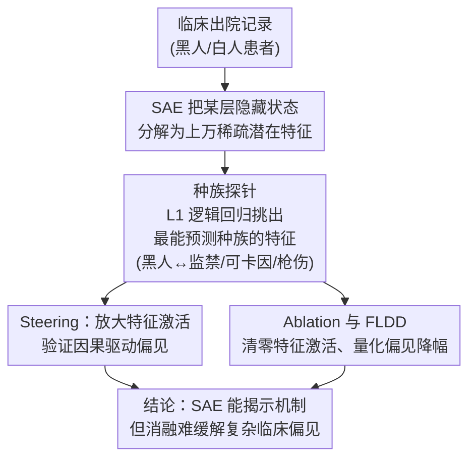

# Can SAEs Reveal and Mitigate Racial Biases of LLMs in Healthcare?

**会议**: ICLR 2026  
**arXiv**: [2511.00177](https://arxiv.org/abs/2511.00177)  
**代码**: [https://github.com/hibaahsan/sae_bias/](https://github.com/hibaahsan/sae_bias/)  
**领域**: 医学NLP / AI安全 / LLM对齐  
**关键词**: 稀疏自编码器, 种族偏见, 医疗AI, 可解释性, 因果干预

## 一句话总结
研究稀疏自编码器（SAE）能否揭示和缓解 LLM 在医疗场景中的种族偏见：发现 SAE 能识别出与种族相关的有害联想（如黑人与暴力），但在复杂临床任务中缓解偏见的效果有限（FLDD < 3%），远不如简单的提示策略（FLDD 8-15%）。

## 研究背景与动机

**领域现状**：LLM 在医疗场景中越来越多被使用（临床记录分析、病例生成），但已知存在种族偏见——对黑人患者可能系统性地给出不同的风险评估。

**现有痛点**：现有偏见检测依赖外部基准评测，无法解释偏见的"内在机制"——模型到底在内部如何表示种族信息？CoT 解释不忠实（模型声称不使用种族信息，但实际使用了）。

**核心矛盾**：SAE 提供了对 LLM 内部表征的精细分析工具，但能否将"检测"转化为"缓解"仍不清楚。

**本文目标** (a) SAE 能否识别 LLM 中与种族相关的特征？(b) 消融这些特征能否有效减少偏见？

**切入角度**：用 L1 正则化的逻辑回归在 SAE 激活上训练种族探针，识别预测种族的潜在特征，然后通过 steering 和 ablation 进行因果验证。

**核心 idea**：SAE 能揭示偏见的机制（黑人潜在特征与监禁/可卡因/枪伤等耻辱化术语共激活），但消融这些特征并不足以缓解复杂临床任务中的偏见。

## 方法详解

### 整体框架
论文想搞清楚一件事：LLM 在医疗场景里对黑人患者的偏见，到底以什么形式编码在模型内部，又能不能靠"动一动内部特征"就消掉。整条流程围绕 SAE（稀疏自编码器）展开，分三步走：先用 SAE 把某一层隐藏状态拆成上万个稀疏潜在特征（latent），在临床出院记录上训练一个种族分类探针，把最能预测患者种族的特征挑出来并人工检查它们的语义；再用 steering（放大激活）验证"这些特征真的因果地驱动了偏见"；最后用 ablation（清零激活）配合 FLDD 指标，检验"消掉它们能不能缓解偏见"。前一步是"揭示机制"，后两步是"检测因果 + 尝试缓解"。

### 关键设计

**1. 种族探针：把"种族信息藏在哪些 SAE 特征里"找出来**

SAE 把模型某一层的隐藏状态分解成上万个稀疏、可解释的潜在特征，但谁也不知道哪几个跟种族有关。论文的做法是对每条出院记录的 SAE 激活向量做跨 token 的 max-aggregate（每个特征取它在整段文本里的最大激活值），再用 L1 正则化的逻辑回归去预测患者种族。L1 的稀疏性会自动把权重压到极少数特征上，于是高权重特征就是"最能预测种族"的候选，数量少到可以逐个人工检查语义。这一步把"种族在内部如何表示"从黑箱问题变成了一份可读的特征清单。

**2. Steering：放大特征激活，验证它和偏见的因果关系**

光知道某特征和种族相关还不够，得证明它真的会改变模型的临床判断。论文在第 $l$ 层对种族相关特征做定向放大，把隐藏状态改成

$$z'_i = z_i + \alpha \cdot z_{\max}$$

其中 $z_{\max}$ 是该特征的最大激活、$\alpha$ 是放大系数，从 0.01 扫到 5。如果放大"黑人特征"后模型对暴力风险的评估随之升高，就说明这个特征不是旁观者，而是因果地参与了偏见判断——这把相关性升级成了可干预的因果证据。

**3. Ablation 与 FLDD：消除特征激活，量化偏见到底降了多少**

缓解端的做法相反：直接把种族相关特征的激活清零，看模型在临床任务上的偏见缩小多少。论文用 FLDD（Fraction of Logit-Difference Decrease）来度量效果，

$$\text{FLDD} = 1 - \frac{\text{logitdiff}_{\text{ablated}}}{\text{logitdiff}_{\text{clean}}}$$

这里 logitdiff 指同一病例在"黑人 vs 白人"设定下模型输出的 logit 差，反映偏见强度；消融后这个差缩得越多，FLDD 越接近 1，说明干预越有效。把它当统一标尺，就能直接和提示去偏等其他策略横向比较——而正是这个标尺最后暴露了 SAE 消融在复杂临床任务上的乏力（FLDD < 3%）。

## 实验关键数据

### 偏见发现
- 黑人相关潜在特征与哪些词共激活：incarceration（监禁）、cocaine（可卡因）、gunshot（枪伤）
- Steering 黑人特征后，暴力风险评估得分增加 0.51-0.80（因果验证）

### 缓解效果对比

| 临床任务 | SAE Ablation FLDD | 提示策略 FLDD |
|---------|-------------------|-------------|
| 可卡因诊断 | 0.8% | **15.2%** |
| 妊娠高血压 | 1.1% | **12.8%** |
| 疼痛评估 | 0.01% | **8.1%** |
| 子宫肌瘤 | 2.9% | 3.2% |

### 关键发现
- SAE 成功识别了种族偏见的机制（与耻辱化术语的共激活）
- CoT 解释不忠实——模型声称不使用种族，但 SAE 分析证明使用了
- SAE ablation 在复杂临床任务中效果极差（FLDD < 3%），远不如简单提示策略
- 种族信息可能分布在太多特征中，单一消融不足以影响整体输出
- 病历生成任务中，SAE ablation 减少黑人病例比例约 30%（有效但可能过度修正）

## 亮点与洞察
- **诚实的负面结果**：坦率报告 SAE 缓解效果不佳，比声称成功更有价值。揭示了机制可解释性和实际缓解之间的差距。
- **CoT 不忠实性的证据**：SAE 分析提供了模型"说一套做一套"的定量证据——模型声称不用种族信息，但内部表征明显编码了种族。
- **耻辱化联想的发现**：黑人-暴力、黑人-可卡因等有害联想的精确定位，对理解和审计医疗 AI 有直接意义。

## 局限与展望
- SAE 缓解策略的失败可能是因为种族信息过于分布式，需要更细粒度的干预
- 仅在 Gemma-2 系列模型上验证，其他架构可能不同
- 临床任务的标注数据有限，可能影响偏见评估的统计功效

## 相关工作与启发
- **vs 提示去偏策略**: 简单的提示（如"不要考虑种族"）反而更有效，说明表层干预有时比深层干预更实用
- **vs 传统公平性审计**: SAE 提供了内部机制层面的偏见分析，比仅看输出指标更深入

## 评分
- 新颖性: ⭐⭐⭐⭐⭐ 首次系统研究 SAE 在医疗偏见中的应用，负面结果也很有价值
- 实验充分度: ⭐⭐⭐⭐ 检测/steering/ablation 全流程，多临床任务
- 写作质量: ⭐⭐⭐⭐⭐ 诚实报告负面结果，分析深入
- 价值: ⭐⭐⭐⭐ 对医疗 AI 公平性研究有重要参考价值

<!-- RELATED:START -->

## 相关论文

- [\[ACL 2025\] LLMs Can Simulate Standardized Patients via Agent Coevolution](../../ACL2025/medical_nlp/evopatient_standardized_patient.md)
- [\[ICLR 2026\] SimpleToM: Exposing the Gap between Explicit ToM Inference and Implicit ToM Application in LLMs](simpletom_exposing_the_gap_between_explicit_tom_inference_and_implicit_tom_appli.md)
- [\[ACL 2026\] Efficient and Effective Internal Memory Retrieval for LLM-Based Healthcare Prediction](../../ACL2026/medical_nlp/efficient_and_effective_internal_memory_retrieval_for_llm-based_healthcare_predi.md)
- [\[ICLR 2026\] CounselBench: A Large-Scale Expert Evaluation and Adversarial Benchmarking of LLMs in Mental Health QA](counselbench_llm_mental_health_qa.md)
- [\[AAAI 2026\] GEM: Generative Entropy-Guided Preference Modeling for Few-shot Alignment of LLMs](../../AAAI2026/medical_nlp/gem_generative_entropy-guided_preference_modeling_for_few-shot_alignment_of_llms.md)

<!-- RELATED:END -->
