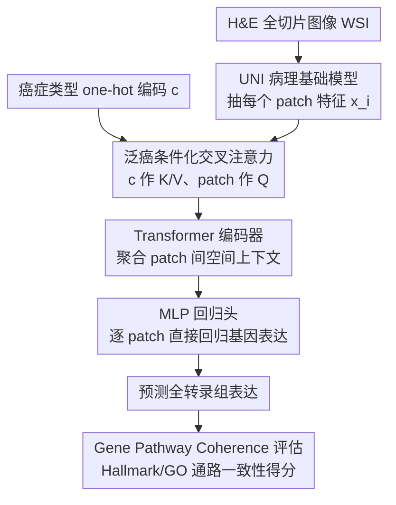

# HistoPrism: Unlocking Functional Pathway Analysis from Pan-Cancer Histology via Gene Expression Prediction

**会议**: ICLR 2026  
**arXiv**: [2601.21560](https://arxiv.org/abs/2601.21560)  
**代码**: [GitHub](https://github.com/susuhu/HistoPrism)  
**领域**: 计算生物
**关键词**: 空间转录组学, 基因表达预测, Pan-Cancer, Pathway分析, Transformer

## 一句话总结

本文提出 HistoPrism，一个高效的 Transformer 架构，通过交叉注意力注入癌症类型条件来从 H&E 病理图像预测泛癌基因表达，并提出基于 Hallmark/GO 通路的 Gene Pathway Coherence (GPC) 评估框架，在通路级别预测上大幅超越 STPath，尤其在低方差核心生物通路上优势显著。

## 研究背景与动机

**领域现状**：空间转录组学（ST）是将高分辨率成像与转录组分析结合、在组织原位映射基因表达分布的技术。但 ST 成本高、劳动密集、难以规模化。H&E 染色的全切片图像（WSI）在临床中常规采集，因此从 H&E 计算推断基因表达成为热门方向。

**现有痛点**：(1) 早期方法（BLEEP、GraphST、TRIPLEX）依赖复杂的多阶段 pipeline，使用对比学习（负样本定义困难）或多分辨率工程（计算开销大）；(2) 生成式方法（STEM、STFlow）虽建模一对多映射，但仅在单癌种验证且计算密集；(3) STPath 使用 BERT 式掩码基因建模在38k基因上学习泛癌预测，但假设基因间相关性跨组织稳定（在异质性大的泛癌设置中易失效），且模型庞大导致训练/推理资源需求高。

**核心矛盾**：现有评估标准只关注 top-N 高变异基因（HVG）的 Pearson 相关性，忽略了功能通路层面的生物学一致性。一个模型可以在 HVG 上达到高分但无法恢复生物学上有意义的协调表达模式，限制了临床转化价值。

**本文目标** (1) 设计高效的直接映射架构替代复杂的重建式方法；(2) 建立通路级别的评估标准来衡量预测的生物学意义。

**切入角度**：作者认为基因表达预测本质上是模态翻译（图像→表达）任务而非重建任务，直接映射比自编码器框架更合适；评估应从孤立基因级方差转向功能通路级一致性。

**核心 idea**：用交叉注意力注入癌症类型条件 + Transformer 编码器捕获 patch 间上下文 + MLP 直接回归基因表达，并用通路级 GPC 基准评估生物学保真度。

## 方法详解

### 整体框架

HistoPrism 把"从 H&E 图像预测基因表达"当成一个**直接的模态翻译**任务，而不是 STPath 那样的掩码重建任务。整条流程很短：H&E WSI 先经病理基础模型（UNI PFM）抽出每个 patch 的特征 $\mathbf{x}_i \in \mathbb{R}^{D_{img}}$；这些 patch 特征用癌症类型 one-hot 编码 $\mathbf{c}$ 做交叉注意力条件化，把"这是哪种癌"的全局信息注入进来；条件化后的特征过一个 Transformer 编码器建模 patch 之间的空间上下文，最后由 MLP 回归头直接吐出每个 patch 的 $D_{gene}$ 维基因表达。除了这条预测主干，本文还单独提出一套通路级评估框架 GPC，用来衡量预测结果在生物学上是否站得住。

### 关键设计

**1. 泛癌条件化交叉注意力：让一个模型同时吃下多种癌**

泛癌设置的麻烦在于不同癌种的表达模式差异很大，直接混在一起训会互相干扰。这里的做法是把 one-hot 癌症类型向量经线性层映射成 $\mathbf{c}_{\text{emb}} \in \mathbb{R}^{D_{img}}$，让它充当交叉注意力的 Key 和 Value，而 patch 特征作 Query，算出条件化后的 patch 特征 $\mathbf{X}_{\text{cond}}$。这样每个 patch 的表示都会被"当前是哪种癌"调制一遍，模型得以同时学到泛癌共享的模式和癌种特异的模式。消融实验里去掉这个交叉注意力后所有癌种性能一致下降，说明这个条件化确实在起作用。

**2. Transformer 编码器做上下文聚合：从单个 patch 升到组织结构**

单个 patch 只看到局部形态，但基因表达往往跟肿瘤边界、免疫浸润这类高层组织结构有关。条件化后的 patch 特征先投影到隐层维度 $D_{hidden}=256$，再过一个 2 层 8 头的 Transformer 编码器，输出 $\mathbf{H}_{\text{latent}} \in \mathbb{R}^{N \times D_{hidden}}$，让每个 patch 都能聚合到短程和长程的邻居信息。一个反直觉的发现是：**不加位置编码反而更好**——大概是因为 UNI PFM 特征本身已经携带了形态信息，此时把 Transformer 当成一个置换不变的集合函数、利用全局组成结构，比强行注入固定位置坐标更合适。

**3. Gene Pathway Coherence (GPC)：把评估从单基因方差搬到功能通路**

现有评估只盯着 top-N 高变异基因（HVG）的 Pearson 相关性，于是一个模型可以在 HVG 上刷出高分，却完全恢复不出生物学上有意义的协调表达——那些低方差但对应核心生物过程的通路被彻底忽略了。GPC 换了个角度：先从 MSigDB Hallmark（50 条通路）和 GO 数据库筛出 87 条非冗余通路（每条 50–100 个基因，用 Jaccard 相似度 < 0.1 去冗余），然后对每条通路内所有成员基因计算跨 patch 的 Pearson 相关系数再平均

$$s_m = \frac{1}{N} \sum_{i=1}^{N} \frac{1}{|P_m|} \sum_{g \in P_m} r_{i,g}$$

得到该通路的一致性得分。$s_m$ 越高，说明预测出的表达在这条通路上越协调，也就越贴近临床真正关心的"功能通路是否被恢复"，而不只是"个别高方差基因预测得准"。

### 损失函数 / 训练策略

端到端训练，目标函数为 MSE 损失：$\mathcal{L}_{\text{MSE}} = \frac{1}{N} \sum_{i \in N} (\hat{y}_i - y_i)^2$。在 HEST1k 数据集上训练，该数据集聚合了153个队列、36项独立研究的空间转录组数据。HistoPrism 仅需约500张 WSI 训练，约为 STPath 的一半。

## 实验关键数据

### 主实验（Top50 HVG PCC）

| 癌种 | STPath (微均) | HistoPrism (微均) |
|------|-------------|-----------------|
| CCRCC | 0.117 | **0.206** |
| COAD | **0.459** | 0.397 |
| HCC | 0.094 | **0.113** |
| IDC | **0.629** | 0.477 |
| PRAD | 0.255 | **0.317** |
| 全部平均(微均) | 0.292 | **0.318** |

### GPC 通路级别评估

| 通路数据库 | HistoPrism 胜出比例 |
|-----------|-------------------|
| Hallmark 通路 (50条) | **86.0%** |
| GO 通路 (87条) | **74.7%** |

### 聚类质量对比

| 模型 | AMI ↑ | ARI ↑ |
|------|-------|-------|
| STPath | 0.395 | 0.402 |
| **HistoPrism** | **0.623** | **0.521** |

### 关键发现
- HistoPrism 在微均 PCC 上超越 STPath（0.318 vs 0.292），微均更能反映跨癌种的整体预测质量
- **通路级别预测是最大亮点**：在86%的 Hallmark 通路和75%的 GO 通路上优于 STPath，尤其在低方差通路上优势最大——这些通路往往对应核心生物学过程
- 聚类实验中 AMI 从0.395提升到0.623（+57.7%），说明 HistoPrism 的全转录组预测在整体上更具生物学一致性
- 位置编码无益于性能，暗示预测任务主要是局部的，PFM 特征已捕获了形态信息

## 亮点与洞察
- **GPC 评估框架的提出**是本文最重要的贡献——将评估从孤立的高方差基因转向功能通路的协调表达，更符合临床和生物学的真实需求。这比单纯提升 HVG PCC 有更大的方法论意义
- 直接映射架构 vs 自编码器框架的选择非常有洞察——基因表达预测是单向翻译任务，没有输入侧基因信息可供重建，自编码器的归纳偏置反而是负担
- 交叉注意力做泛癌条件化的设计简洁高效，且消融实验中去掉交叉注意力的性能下降验证了其必要性

## 局限与展望
- STPath 在 IDC（乳腺浸润性导管癌）和 COAD（结肠腺癌）上的宏均 PCC 仍然领先，说明 HistoPrism 在某些癌种上的特异性学习还有提升空间
- GPC 框架中通路的筛选标准（50-100基因、Jaccard < 0.1）是人为设定的，不同阈值可能影响评估结论
- 仅使用 UNI 一种 PFM 作为特征提取器，未测试不同 PFM（如 GigaPath、CTransPath）的影响
- 生成式方法（STEM、STFlow）在泛癌设置下表现差，但作者承认受限于计算资源只用了部分基因训练这些基线

## 相关工作与启发
- **vs STPath**: STPath 是当前泛癌基因预测的 SOTA 基础模型，使用 BERT 式掩码基因建模学习基因间依赖。HistoPrism 在通路级别全面超越但在某些癌种的 HVG 上仍不及 STPath。根本差异在于架构哲学：STPath 是重建式（预测缺失基因），HistoPrism 是直接映射式（从图像回归表达）
- **vs BLEEP**: BLEEP 用对比学习对齐 H&E 和基因表达到联合空间，推理时用最近邻检索。检索式推理限制了对未见样本的泛化，且负样本定义在病理中本身就很模糊
- **vs TRIPLEX**: TRIPLEX 引入多分辨率蒸馏架构，计算复杂度高但只在单癌种验证。HistoPrism 在效率和泛化性上远优

## 评分
- 新颖性: ⭐⭐⭐⭐ GPC 评估框架的提出有重要方法论贡献，架构设计简洁但缺乏突破性创新
- 实验充分度: ⭐⭐⭐⭐⭐ 10个癌种、多基线对比、通路级评估、聚类分析、效率对比、消融实验，非常全面
- 写作质量: ⭐⭐⭐⭐ 问题动机和评估框架阐述清晰，方法部分公式化到位
- 价值: ⭐⭐⭐⭐⭐ GPC 评估范式对计算病理学领域有深远影响，HistoPrism 本身也是实用的高效工具

<!-- RELATED:START -->

## 相关论文

- [\[ICLR 2026\] mCLM: A Modular Chemical Language Model that Generates Functional and Makeable Molecules](mclm_a_modular_chemical_language_model_that_generates_functional_and_makeable_mo.md)
- [\[ACL 2026\] ReMedi: Reasoner for Medical Clinical Prediction](../../ACL2026/medical_nlp/remedi_reasoner_for_medical_clinical_prediction.md)
- [\[ICLR 2026\] SurvHTE-Bench: A Benchmark for Heterogeneous Treatment Effect Estimation in Survival Analysis](survhte-bench_a_benchmark_for_heterogeneous_treatment_effect_estimation_in_survi.md)
- [\[ACL 2026\] Query Pipeline Optimization for Cancer Patient Question Answering Systems](../../ACL2026/medical_nlp/query_pipeline_optimization_for_cancer_patient_question_answering_systems.md)
- [\[ACL 2026\] Efficient and Effective Internal Memory Retrieval for LLM-Based Healthcare Prediction](../../ACL2026/medical_nlp/efficient_and_effective_internal_memory_retrieval_for_llm-based_healthcare_predi.md)

<!-- RELATED:END -->
