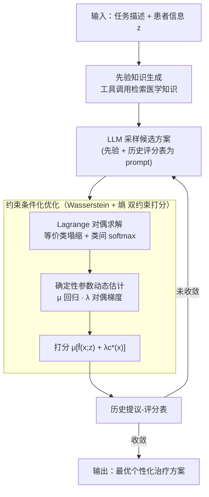

# Knowledgeable Language Models as Black-Box Optimizers for Personalized Medicine

**会议**: ICLR 2026  
**arXiv**: [2509.20975](https://arxiv.org/abs/2509.20975)  
**代码**: [代码](https://code.roche.com/braid/projects/leon)  
**领域**: 医学影像/个性化医疗  
**关键词**: 大语言模型优化, 个性化医疗, 黑箱优化, 分布偏移, 先验知识  

## 一句话总结

提出 LEON（LLM-based Entropy-guided Optimization with kNowledgeable priors），一种数学原理严格的方法，将个性化医疗治疗方案设计建模为条件黑箱优化问题，通过熵约束和对抗性源批评模型引导 LLM 在不微调的情况下作为零样本优化器提出个性化治疗计划。

## 研究背景与动机

- **领域现状**：个性化医疗的目标是根据患者的基因和环境因素发现最优治疗方案。近期 LLM 在数学和代码等领域的黑箱优化中展现了潜力
- **现有痛点**：(1) 真实治疗效果评估代价极高，通常只能使用代理模型（数字孪生、ML 模型）来评估方案质量；(2) 代理模型在分布偏移下（如面对新医院的患者）预测不准，导致优化出看起来好但实际差的"虚假"方案；(3) 特定人群在临床研究中系统性代表不足
- **核心矛盾**：简单地用代理模型 $\hat{f}$ 替代真实目标 $f$ 进行优化，会因分布外偏差导致治疗方案在实际中效果差。而改进代理模型又受限于数据可用性和隐私问题
- **本文目标**：在代理模型不可靠、真实目标函数不可访问的情况下，如何为分布偏移下的患者设计个性化治疗方案
- **切入角度**：利用 LLM 内化的领域先验知识（医学教科书、知识图谱）作为补充信号，通过约束优化同时控制代理模型的外推程度和 LLM 提议的确定性
- **核心 idea**：用两个约束（Wasserstein 距离约束限制分布偏移 + 熵约束提升 LLM 确定性）规范化 LLM 驱动的条件黑箱优化，利用先验知识提高 LLM 作为随机治疗推荐引擎的质量

## 方法详解

### 整体框架

LEON 要解决的是这样一个困境：真实治疗效果无法直接评估，只能靠一个在分布偏移下并不可靠的代理模型 $\hat{f}$ 打分，而 LLM 本身的随机性又会让它提出五花八门、质量参差的方案。LEON 的思路是把"该信代理模型多少"和"该信 LLM 多少"两件事都变成可调的旋钮，套进一个迭代优化循环里——全程不动 LLM 一根权重，纯靠 prompting 把优化引向"既符合分布、LLM 又有把握"的区域。

每一轮循环可拆成四步：LLM 先取一份**先验知识**（从医学教科书、知识图谱等外部源检索），连同任务描述、患者信息 $z$ 和一张"历史提议-评分表"作为提示，**采样**出一批候选治疗方案；接着把这批方案按等价关系**聚成等价类**；然后从当前批次**估计两个确定性参数**——LLM 确定性 $\mu$ 与源批评确定性 $\lambda$；最后用打分公式 $\mu[\hat{f}(x;z) + \lambda c^*(x)]$ 给每个方案评分，把分数连同方案存回历史表，喂给下一轮提示，直到收敛后输出最优方案。

### 关键设计

**1. 先验知识生成：把外部医学知识灌进 LLM，压住它的随机游走**

LLM 单靠 next-token 统计采样容易随机游走，提出一堆没把握的方案。LEON 让它在采样前先取一份领域先验：把 LLM 当成一个工具调用代理，自主从一组外部知识源里挑相关的——医学教科书语料、MedGemma 27B 模型、HetioNet/PrimeKG 知识图谱、Cellosaurus 细胞系数据、COSMIC 癌症突变数据、GDSC 药物敏感性、DepMap 癌细胞依赖数据——再把检索到的内容合成成一段自然语言的先验知识陈述塞进提示。这段先验既补上代理模型在 OOD 区域的盲区，又让 LLM 对方案更有把握，从而抬高后面估出来的确定性参数 $\mu$、间接放大优质方案的奖励。

**2. 约束条件化优化问题：用两个约束分别管住代理模型外推和 LLM 随机性**

有了先验，朴素做法是直接拿代理模型 $\hat{f}$ 当目标去最大化，但这会被代理模型在 OOD 区域的虚高预测带偏，优化出"看着好、实际差"的方案。LEON 把问题写成带两个约束的条件黑箱优化：

$$\arg\max_{q(x)} \mathbb{E}_{x \sim q(x)}[\hat{f}(x;z)] \quad \text{s.t.} \quad W_1(p_{\text{src}}, q) \leq W_0, \quad \mathcal{H}_\sim(q(x)) \leq H_0$$

第一个约束用 1-Wasserstein 距离把提议方案分布 $q$ 和历史方案分布 $p_{\text{src}}$ 的偏离程度卡在 $W_0$ 以内，落地成一个对抗性源批评模型 $c^*$，专门惩罚跑到代理模型外推区的方案（且 $c^*$ 只用治疗设计、不碰患者数据，天然保护隐私）。第二个约束用 $\sim$-粗粒度熵 $\mathcal{H}_\sim(q) = -\sum_i \bar{q}_i \log \bar{q}_i$（$\bar{q}_i$ 为第 $i$ 个等价类的占有率）把 LLM 提议的分散程度压在 $H_0$ 以内，逼它收敛到自己更有把握的方案。两个约束各管一件事，正好对上"代理模型不可靠"和"LLM 输出随机"这两个痛点。

**3. Lagrange 对偶求解：把约束优化推成一个可直接采样的封闭形式**

上面的约束优化既非凸、又无法直接对 $q(x)$ 做梯度，LEON 走 Lagrange 对偶，得到两条关键引理把它化简成可计算的采样规则。Lemma 4.2（等价类内塌缩）说明最优分布 $q^*$ 在每个等价类内部不必铺开，只需集中到该类里得分最高的那个设计 $x_i^* = \arg\max_{x \in [x]_i} (\hat{f}(x;z) + \lambda c^*(x))$ 上；Lemma 4.3（概率采样）进一步给出等价类之间的概率分配 $\bar{q}_i \propto \exp[\mu(\hat{f}(x_i^*;z) + \lambda c^*(x_i^*))]$，是一个温度由 $\mu$ 控制的 softmax。两个 Lagrange 乘子在这里各自对应一个约束：$\lambda$ 是源批评确定性、$\mu$ 是 LLM 确定性，原来的硬约束就转化成这两个乘子的取值问题，方案最终按这个 softmax 采样而来。

**4. 确定性参数动态估计：让 $\mu$ 和 $\lambda$ 随当前批次自适应调节**

两个乘子若当成手调超参就失去了意义，LEON 让它们每轮从数据里估出来。LLM 确定性 $\mu$ 的估计办法是：先用 LLM 批量采样统计各等价类的占有率 $\hat{q}_i$，再对点对 $(\hat{f}(x_i^*;z) + \lambda c^*(x_i^*),\ \log \hat{q}_i)$ 做线性回归取斜率得到 $\hat{\mu}$。直觉很直接——当 LLM 输出高熵（莫衷一是）时 $\log \hat{q}_i$ 在各类间几乎是常数、回归斜率 $\hat{\mu} \approx 0$，奖励加成被压到几乎为零，避免盲目相信一个没把握的 LLM；当 LLM 高度一致时 $\hat{\mu} > 0$，奖励被放大。源批评参数 $\lambda$ 则按对偶函数做梯度下降更新 $\lambda_{t+1} = \lambda_t - \eta_\lambda [W_0 - W_1(\text{estimated})]$：方案还在分布内时 $\lambda$ 减小、放开探索，方案一旦偏离历史分布 $\lambda$ 就增大、收紧外推。两个旋钮一起动，探索与利用就被自动平衡住。

### 损失函数

LEON 本身不训练 LLM。唯一需要训练的是源批评模型 $c^*$，它通过 Wasserstein 对偶 (Eq.1) 学习，Lipschitz 约束靠参数裁剪实现。

## 实验关键数据

### 主实验

5 个真实世界个性化医疗优化任务（分布偏移设定，100 名测试患者）：

| 方法 | Warfarin RMSE↓ | HIV 病毒载量↓ | Breast TTNTD↑ | Lung TTNTD↑ | ADR NLL↓ | 平均排名 |
|---|---|---|---|---|---|---|
| Human（实际治疗）| 2.68 | 4.55 | 29.65 | 21.10 | - | 8.5 |
| Gradient Ascent | 1.37 | 4.52 | 65.23 | 24.09 | 23.7 | 5.2 |
| BO-qEI | 1.36 | 4.53 | 67.05 | 27.97 | 23.2 | 3.4 |
| OPRO | 1.40 | 4.55 | 55.68 | 24.35 | 23.8 | 7.0 |
| Eureka | 1.54 | 4.58 | 63.48 | 25.10 | 21.3 | 6.8 |
| **LEON** | **1.36** | **4.50** | **72.43** | **32.71** | **12.4** | **1.2** |

### 消融实验

- 去除先验知识：性能显著下降，LEON 对知识质量敏感
- 去除源批评模型约束（$\lambda = 0$）：代理模型外推导致 ground-truth 性能退化
- 去除熵约束（$\mu = 0$）：LLM 提议过于分散，需要更多迭代才能收敛
- 不同 LLM 选择：gpt-4o-mini 表现最佳性价比

### 关键发现

1. LEON 在 5 个任务中平均排名 1.2，显著优于传统优化方法和其他 LLM 优化方法
2. LEON 提出的方案**优于患者实际接受的治疗**（Human baseline），具有实际临床价值
3. 两个约束（Wasserstein + 熵）的协同效应明显：单独去除任一约束都会导致性能下降
4. 先验知识在分布偏移设定下尤为重要——它帮助 LLM 补充代理模型在 OOD 区域的盲区

## 亮点与洞察

1. **数学严格性与实际价值兼具**：从约束优化到 Lagrange 对偶、到 Lemma 的推导都很严谨，同时 5 个真实临床任务的实验极具说服力
2. **两个确定性参数的设计极为巧妙**：$\mu$ 量化 LLM 的"共识程度"，$\lambda$ 量化设计的"分布内程度"，二者动态平衡探索与利用
3. **零样本优化**：LLM 无需任何微调，纯靠 prompting + 外部知识就能超越专门的优化算法
4. **隐私保护**：源批评模型 $c^*$ 仅需要治疗设计数据 $\mathcal{D}_{\text{src}} \subseteq \mathcal{X}$，不需要患者信息

## 局限与展望

1. **先验知识敏感性**：错误或过时的领域知识会传播到优化输出中，需要知识质量保证机制
2. **模拟基准的局限**：虽然使用真实数据，但评估框架仍基于学到的 ground-truth 函数 $f$，无法完全反映真实患者响应的异质性
3. **等价关系定义**：使用 k-means 聚类定义等价类，不同聚类方法可能影响结果
4. **计算成本**：每个患者需要 2048 次代理模型查询和大量 LLM API 调用
5. **公平性未充分验证**：虽然在附录中讨论了性别/种族公平性，但 LLM 的社会偏见可能影响治疗建议

## 相关工作与启发

- **LLM 优化**：OPRO（Yang et al., 2024a）通过 prompting 优化但缺乏约束；Eureka（Ma et al., 2024b）加入反思但无分布控制
- **分布偏移下的优化**：Trabucco et al.（2021）的保守代理模型假设可控制代理模型设计，而 LEON 处理黑箱代理
- **鉴别模型在优化中的应用**：Wasserstein 距离约束来自 MBO/生物序列设计文献（Yao et al., 2024, 2025b）
- **启发**：LLM 作为条件优化器的范式可推广到其他需要个性化决策的领域（教育、金融等），关键是如何注入领域知识并控制置信度

## 评分

⭐⭐⭐⭐（4/5）

- **创新性**：⭐⭐⭐⭐⭐ 将 LLM 优化、分布偏移鲁棒性、先验知识注入统一到数学严格的框架
- **实验**：⭐⭐⭐⭐ 5 个真实临床任务 + 10 个基线，全面深入
- **写作**：⭐⭐⭐⭐ 理论推导清晰，但公式符号较多
- **实用性**：⭐⭐⭐ 依赖多种外部知识源和 LLM API，部署门槛较高

<!-- RELATED:START -->

## 相关论文

- [\[ACL 2026\] Beyond the Leaderboard: Rethinking Medical Benchmarks for Large Language Models](../../ACL2026/medical_nlp/beyond_the_leaderboard_rethinking_medical_benchmarks_for_large_language_models.md)
- [\[NeurIPS 2025\] Position: Thematic Analysis of Unstructured Clinical Transcripts with Large Language Models](../../NeurIPS2025/medical_nlp/position_thematic_analysis_of_unstructured_clinical_transcripts_with_large_langu.md)
- [\[ACL 2025\] Pattern Recognition or Medical Knowledge? The Problem with Multiple-Choice Questions in Medicine](../../ACL2025/medical_nlp/pattern_recognition_or_medical_knowledge_the_problem_with_multiple-choice_questi.md)
- [\[ACL 2026\] MHGraphBench: Knowledge Graph-Grounded Benchmarking of Mental Health Knowledge in Large Language Models](../../ACL2026/medical_nlp/mhgraphbench_knowledge_graph-grounded_benchmarking_of_mental_health_knowledge_in.md)
- [\[ACL 2026\] Text-Attributed Knowledge Graph Enrichment with Large Language Models for Medical Concept Representation](../../ACL2026/medical_nlp/text-attributed_knowledge_graph_enrichment_with_large_language_models_for_medica.md)

<!-- RELATED:END -->
