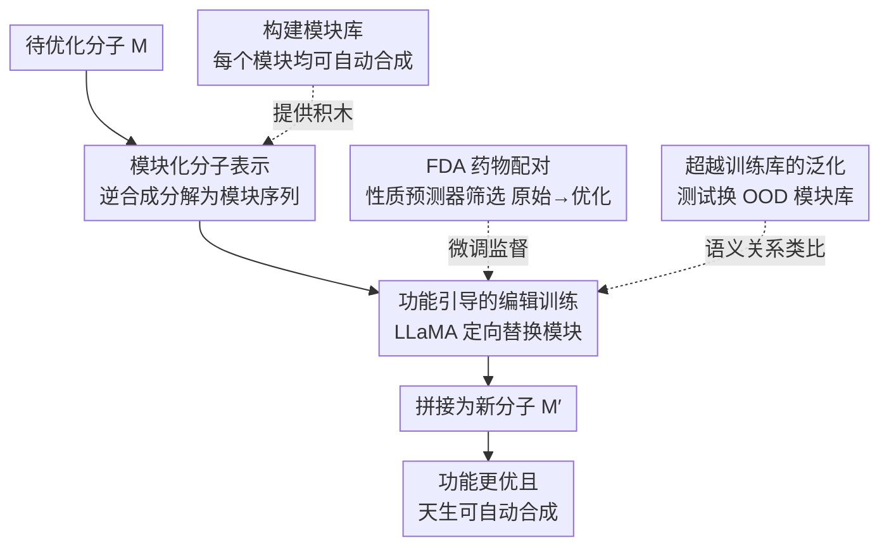

# mCLM: A Modular Chemical Language Model that Generates Functional and Makeable Molecules

**会议**: ICLR 2026 Oral  
**arXiv**: [2505.12565](https://arxiv.org/abs/2505.12565)  
**代码**: 有（论文中提供）  
**领域**: 医学 / 分子生成  
**关键词**: 化学语言模型, 分子优化, 自动化合成, 模块化设计, 药物发现

## 一句话总结
提出 mCLM（模块化化学语言模型），通过将分子表示为可合成构建模块的序列，使 LLM 能生成同时满足药理功能和自动化合成可行性的分子，在 430 种 FDA 批准药物上显著改善了药代动力学和毒性性质。

## 研究背景与动机

**领域现状**：LLM 已展现出理解化学知识的能力，但在生成功能性小分子方面仍然有限——生成的分子通常不兼容自动化合成方法。

**现有痛点**：现有分子生成方法使用原子级或片段级表示（如 SMILES），生成的分子虽然可能满足药理目标，但几乎无法通过自动化合成流程制造。这导致计算预测到实验验证之间存在巨大鸿沟。

**核心矛盾**：分子的"功能"（药效、毒性等）和"可制造性"（合成路径已知、构建模块可用）是两个独立优化目标，传统方法只关注前者。

**本文目标** 让 LLM 学习一种新的分子语言，使其生成的分子同时具有优化的化学功能和保证的合成可行性。

**切入角度**：将分子表示为来自预定义构建模块库的组合序列，每个模块对应已知的可自动合成的化学片段。

**核心 idea**：用模块化分子语言替代传统 SMILES，让 LLM 在受限的合成空间中搜索功能最优分子。

## 方法详解

### 整体框架
mCLM 不在原子层面摆弄分子，而是把每个分子读成一串"积木"——来自一个与自动化合成流程兼容的构建模块库的有序序列。给定一个待优化的初始分子，模型先把它拆成模块序列，再以序列到序列（seq2seq）的方式输出一串改写后的模块，拼起来就是功能更好、且天生可合成的新分子。整个流程靠"原始分子→优化分子"的配对数据微调一个 LLaMA 骨干完成；测试时还能把模块库换成训练未见过的分布外模块，继续扩张可搜索的化学空间。

### 关键设计

**1. 模块化分子表示：把"能不能造出来"写进表示本身**

传统 SMILES 在原子级别描述分子，生成器很容易拼出药效漂亮却根本没法自动合成的结构，计算预测和实验制造之间隔着一道鸿沟。mCLM 改用模块级语言来回避这个问题：先定义一个构建模块库 $\mathcal{B} = \{b_1, ..., b_N\}$，每个 $b_i$ 都是一段已知可自动合成的化学片段；任意分子 $M$ 则被表示为模块的连接序列 $M = b_{i_1} \oplus b_{i_2} \oplus \cdots \oplus b_{i_k}$，其中 $\oplus$ 代表一次化学键连接，分解方式由逆合成分析确定。这样一来合成可行性不再是事后检查，而是表示的内蕴属性——只要每个模块本身可合成、模块间的连接规则有效，整条序列对应的分子就一定能造出来。

**2. 功能引导的编辑训练：从"凭空生成"退回到"定向改写"**

让模型从零生成一个既有药效又合理的分子太难，mCLM 转而学一个更可控的动作：在保留原分子骨架的前提下替换若干模块来改善药理性质。训练数据是这样构造的——把 430 种 FDA 批准药物拆成模块序列后，用性质预测器对各种模块替换方案逐一打分，挑出那些骨架相似、但目标指标确实变好（AMES 毒性↓、BBBP 血脑屏障透过率↑、HIA 肠吸收率↑ 等）的替换作为正样本，构成"原始→优化"配对。模型据此学到的是"哪里该换、换成什么模块能让性质往好的方向走"，既不丢掉原分子已被验证的有效部分，又能定向地把药代动力学/毒性指标往上推。

**3. 超越训练模块库的泛化：让合成空间在测试时还能继续扩张**

固定的模块库会把可搜索的化学空间锁死，限制实用性。mCLM 在测试阶段把模块库换成训练时从未见过的分布外（OOD）模块集合，要求模型仍能正确使用这些新积木。之所以可行，是因为模型在训练中学到的并不是某几个具体模块的记忆，而是模块之间的语义关系（化学性质上的相似性），于是面对一个新模块时能根据它"像哪个已知模块"来推断该把它放在序列的什么位置。论文在 122 种 OOD 药物、且只允许使用兼容自动合成的模块的设定下验证，模型依然有效，说明这种基于语义关系的泛化确实成立。

### 损失函数 / 训练策略
训练目标就是标准的 seq2seq 交叉熵，在 LLaMA 骨干上微调；关键不在损失形式而在数据——所有"原始→优化"配对都由药理性质预测器筛选过，保证监督信号指向真实的性质改善。

## 实验关键数据

### 主实验
在 430 种 FDA 批准药物上做分子优化，评估 6 个药代动力学/毒性指标——AMES 致突变性（↓更好）、BBBP 血脑屏障透过率（↑）、CYP3A4 代谢抑制（↓）、DILI 肝毒性（↓）、HIA 肠吸收率（↑）、PGP 外排（↓）。mCLM 在全部 6 个指标上相比原始药物均取得改善，并大幅超越 MoleculeSTM 等文本-分子编辑基线（各指标具体数值见原文）。

| 对比对象 | 结论 |
|------|------|
| mCLM vs 原始 FDA 药物 | 6 个药代/毒性指标全部改善 |
| mCLM vs MoleculeSTM 等文本编辑基线 | 大幅领先，且保证可合成 |

### 消融与泛化

| 配置 | 观察 | 说明 |
|------|------|------|
| 完整 mCLM | 表现最优 | 模块化表示 + 功能引导编辑 |
| OOD 模块库（122 种药物） | 仍然有效 | 仅用兼容自动合成的未见模块，验证语义泛化 |
| SMILES 基线 | 不保证可合成 | 功能可能更优但难以自动制造 |
| 去掉功能引导（随机替换模块） | 无定向改善 | 说明性质预测器筛选的监督信号是关键 |

### 关键发现
- mCLM 在 430 种 FDA 药物的全部 6 个药代动力学/毒性指标上都有改善，说明模块级编辑确实能定向推动性质
- 在 122 种 OOD 药物上、只允许使用兼容自动合成的未见模块时仍然有效，是"学到的是模块间语义关系而非具体记忆"最直接的证据
- 模块化表示让合成路径随生成结果自动可得，把"计算预测→实验制造"的鸿沟收进了表示本身

## 亮点与洞察
- **合成可行性作为硬约束**：将可制造性从"事后检查"变为"架构保证"，这是药物发现管线的关键实用需求
- **模块化语言让化学搜索变为 token 序列优化**：将连续化学空间的搜索转化为离散模块序列的编辑，天然适合 LLM

## 局限与展望
- 模块库的覆盖范围限制了可到达的化学空间
- 性质预测器的准确性直接影响训练数据质量
- 仅优化药代动力学/毒性，未涉及药效（结合亲和力等）
- 合成路径的实际执行成功率未验证

## 相关工作与启发
- **vs MoleculeSTM**: 传统文本-分子方法在 SMILES 空间操作，不保证合成可行性
- **vs RetroGPT**: 逆合成规划关注"如何合成给定分子"，mCLM 关注"在可合成空间中找最优分子"，是互补方向

## 评分
- 新颖性: ⭐⭐⭐⭐ 模块化分子表示+LLM 结合的思路新颖
- 实验充分度: ⭐⭐⭐ 多性质评估但缺少实验验证
- 写作质量: ⭐⭐⭐⭐ 跨学科但讲解清晰
- 价值: ⭐⭐⭐⭐⭐ 对 AI 辅助药物发现有直接实用价值

<!-- RELATED:START -->

## 相关论文

- [\[ACL 2026\] CURA: Clinical Uncertainty Risk Alignment for Language Model-Based Risk Prediction](../../ACL2026/medical_nlp/cura_clinical_uncertainty_risk_alignment_for_language_model-based_risk_predictio.md)
- [\[ACL 2025\] A Modular Approach for Clinical SLMs Driven by Synthetic Data with Pre-Instruction Tuning, Model Merging, and Clinical-Tasks Alignment](../../ACL2025/medical_nlp/a_modular_approach_for_clinical_slms_driven_by_synthetic_data_with_pre-instructi.md)
- [\[ICLR 2026\] HistoPrism: Unlocking Functional Pathway Analysis from Pan-Cancer Histology via Gene Expression Prediction](histoprism_unlocking_functional_pathway_analysis_from_pan-cancer_histology_via_g.md)
- [\[NeurIPS 2025\] CGBench: Benchmarking Language Model Scientific Reasoning for Clinical Genetics Research](../../NeurIPS2025/medical_nlp/cgbench_benchmarking_language_model_scientific_reasoning_for_clinical_genetics_r.md)
- [\[ACL 2026\] CT-Flow: Orchestrating CT Interpretation Workflow with Model Context Protocol Servers](../../ACL2026/medical_nlp/ct-flow_orchestrating_ct_interpretation_workflow_with_model_context_protocol_ser.md)

<!-- RELATED:END -->
