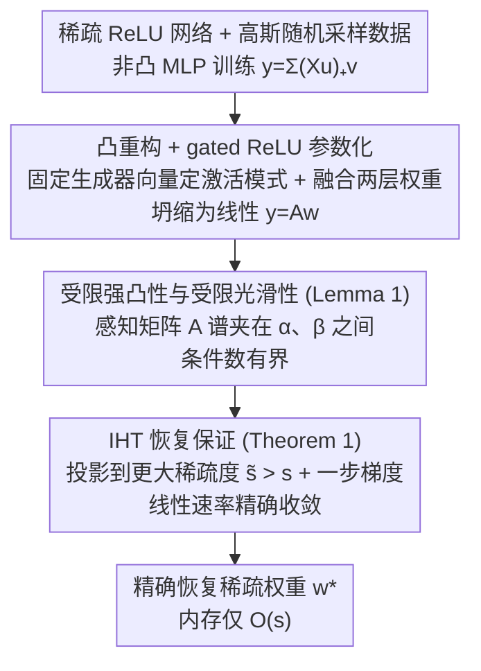

# A Recovery Guarantee for Sparse Neural Networks

**会议**: ICLR 2026  
**arXiv**: [2509.20323](https://arxiv.org/abs/2509.20323)  
**代码**: [https://github.com/voilalab/MLP-IHT](https://github.com/voilalab/MLP-IHT)  
**领域**: 模型压缩 / 理论  
**关键词**: 稀疏神经网络, 压缩感知, 迭代硬阈值, 凸重构, ReLU网络  

## 一句话总结
证明了 ReLU 神经网络的首个稀疏恢复保证：对两层标量输出网络，当训练数据为高斯随机采样时，基于凸重构的迭代硬阈值 (IHT) 算法可精确恢复稀疏网络权重，且内存需求仅与非零权重数线性增长。

## 研究背景与动机

**领域现状**：大规模神经网络虽然性能优秀但需巨大内存和计算资源，训练后的权重通常高度可压缩。已知高性能稀疏子网络存在（Lottery Ticket Hypothesis），但高效优化稀疏网络仍是开放挑战。

**现有痛点**：现有方法要么内存不高效（如 IMP 需先训练密集网络），要么质量不够（如初始化剪枝），要么缺乏理论保证（所有现有方法都是启发式的）。压缩感知文献虽然有丰富的稀疏恢复理论，但仅适用于线性模型。

**核心矛盾**：稀疏神经网络优化是非凸问题，经典的稀疏恢复理论（需要限制等距性/强凸性）不直接适用于非线性 ReLU 网络。

**本文目标** 为稀疏 ReLU MLP 权重恢复提供理论保证，包括唯一可辨识性和高效恢复算法的收敛保证。

**切入角度**：利用 ReLU 网络的凸重构理论 (Pilanci & Ergen, 2020)，将非凸稀疏网络优化转化为高度结构化的线性感知问题，然后应用 IHT 的稀疏恢复保证。

**核心 idea**：通过 gated ReLU 凸化将稀疏 MLP 训练转化为线性稀疏恢复问题，证明感知矩阵满足受限强凸性/光滑性，从而 IHT 可精确恢复稀疏权重。

## 方法详解

### 整体框架
论文想回答一个看似简单却长期没有理论答案的问题：如果一个稀疏 ReLU 网络确实存在，能不能在内存只与非零权重数成正比的前提下把它精确找回来？整条路线分三步走。先把两层 ReLU 网络 $\hat{y} = \sum_{j=1}^p (Xu_j)_+ v_j$ 通过固定激活模式重构成线性形式 $y = Aw^*$，其中 $A$ 是由数据和激活模式拼出的感知矩阵、$w^*$ 是融合后的稀疏权重向量；接着证明这个 $A$ 在合理假设下满足稀疏恢复需要的条件；最后让迭代硬阈值 (IHT) 直接在线性问题上恢复 $w^*$。换句话说，原本非凸的 MLP 训练被翻译成了一个压缩感知里教科书式的线性稀疏恢复问题。

### 关键设计

**1. 凸重构 + gated ReLU 参数化：把非凸 MLP 训练翻译成线性稀疏恢复**

稀疏网络优化的根本障碍是非凸——经典稀疏恢复理论要的强凸性/限制等距性在非线性 ReLU 上根本用不上。这一步的做法是借 Pilanci & Ergen 的凸重构思路，用固定的随机生成器向量 $h_i$ 替代可训练的 $u_i$ 来确定激活模式 $D_i = \text{Diag}(\mathbb{I}[Xh_i \geq 0])$，再把两层权重融合成 $w_i = u_i v_i$，整个网络就坍缩成线性形式 $\hat{y} = Aw$。关键的好处是稀疏性同时帮了忙：可能出现的激活模式数量从随宽度指数增长被压到了多项式量级。非凸性一旦被消掉，后面就能直接搬用线性世界里成熟的稀疏恢复机器。

**2. 受限强凸性与受限光滑性（Lemma 1）：证明感知矩阵满足恢复所需的谱条件**

线性化之后还得回答一个核心问题——这个被数据和激活模式拼出来的 $A$ 真的"够好"吗？Lemma 1 在 Assumption 2 下给出了肯定回答：只要每个神经元至少关注 $\varepsilon$ 比例的数据、且任意两个不同神经元的激活模式至少在 $\gamma$ 比例的位置上不同，那么以高概率有 $\alpha I_s \preceq A_S^T A_S \preceq \beta I_s$，即 $A$ 在所有 $s$-稀疏子集 $S$ 上的谱被夹在 $\alpha$ 和 $\beta$ 之间，条件数 $\sqrt{\beta/\alpha}$ 有限且有界。Assumption 2 的两个条件其实各自对应一个直觉：前者要求网络"不靠几个样本过拟合"，后者要求"神经元之间互不相干"——这正是压缩感知里 RIP 的思想，只是这里的要求更宽松。

**3. IHT 恢复保证（Theorem 1）：在有限条件数下精确恢复稀疏权重**

有了谱条件，最后一步是把恢复保证落地。难点在于标准 RIP 常数的要求太苛刻，MLP 的感知矩阵满足不了。论文转而引用 Jain et al. 2014 的结果——它允许任意有限条件数下 IHT 仍保证恢复，代价是硬阈值这一步要投影到比真实稀疏度更大的 $\tilde{s} > s$（膨胀因子随条件数增大而增大）。把 Lemma 1 给出的有界条件数代入，就得到 Theorem 1：IHT 以线性速率精确收敛到真权重，

$$\|w^{k+1} - w^*\|_2 \leq \rho^k \|w^0 - w^*\|_2.$$

代价只是收敛速度随条件数变慢，但精确恢复本身始终成立——这正是用"放宽常数、牺牲速度"换来 MLP 可用性的关键一步。

### 损失函数 / 训练策略
恢复目标就是线性最小二乘 MSE $f(w) = \frac{1}{2}\|Aw - y\|_2^2$，IHT 更新写作 $w^{k+1} = H_{\tilde{s}}(w^k - \eta A^T(Aw^k - y))$，即一步梯度下降后用硬阈值 $H_{\tilde{s}}$ 只保留幅值最大的 $\tilde{s}$ 个分量。内存效率的关键正在于此：全程只需存储 $O(s)$ 个非零权重，而不必像 IMP 那样先撑起整个密集网络。

## 实验关键数据

### 主实验

**稀疏 planted MLP 恢复:**

| 方法 | 恢复误差 | 内存效率 | 理论保证 |
|------|---------|---------|---------|
| IHT | ~0（精确恢复） | 线性于 s | ✓ |
| IMP | 可比/稍差 | 需密集网络 | ✗ |

### 消融实验

| 实验 | IHT | IMP | 说明 |
|------|-----|-----|------|
| MNIST 分类 | 竞争性/更优 | 需更多内存 | IHT 内存效率显著优势 |
| 隐式神经表征 | 竞争性 | 基线 | 扩展到 3 层和向量输出 |

### 关键发现
- IHT 在稀疏 planted MLP 恢复任务中实现精确恢复，验证了理论预测
- 实验中 IHT 的性能通常超过 IMP，同时使用更少内存——理论保证转化为实际优势
- 尽管理论仅覆盖 2 层标量输出网络，IHT 在 3 层和向量输出网络上也表现良好
- 样本复杂度与活跃（非零）权重数而非总权重数成正比，实现了真正的压缩感知

## 亮点与洞察
- **压缩感知与深度学习的桥梁**：将 30 年历史的稀疏恢复理论首次严格应用到 ReLU 网络，展示了经典理论在新领域的生命力
- **凸化的使能作用**：Pilanci & Ergen 的凸重构不仅有理论意义，在这里成为连接稀疏恢复理论和 MLP 的关键桥梁
- **内存效率的理论保证**：IHT 的内存仅需 $O(s)$，而 IMP 等方法需 $O(dp)$——对于大规模稀疏网络这意味着数量级的内存节省

## 局限与展望
- 理论仅适用于两层标量输出 ReLU 网络，向深层网络和多输出的推广是开放问题
- Assumption 1 对权重取值有限制（二值隐层或 ±1 输出层），实际权重更一般
- 需要枚举所有可能的激活模式，对于非稀疏网络计算上不可行
- 随机高斯数据假设与实际数据分布有差距
- 实验规模偏小，大规模网络上的实用性有待验证

## 相关工作与启发
- **vs Lottery Ticket Hypothesis**: LTH 经验性地发现高性能稀疏子网络的存在；本文提供了在特定条件下精确恢复这些权重的理论保证
- **vs Pilanci & Ergen 凸化**: 凸化提供了 MLP 训练的凸等价形式；本文将其与稀疏恢复结合，是凸化理论的重要应用
- **vs Jain et al. 2014 IHT**: 他们证明了一般线性稀疏恢复的 IHT 保证；本文证明 MLP 的感知矩阵满足所需条件

## 评分
- 新颖性: ⭐⭐⭐⭐⭐ 首个 ReLU 网络稀疏恢复保证，理论贡献清晰且重要
- 实验充分度: ⭐⭐⭐ 实验规模偏小，仅做 MNIST 和简单任务验证
- 写作质量: ⭐⭐⭐⭐ 理论推导严谨，假设条件清晰
- 价值: ⭐⭐⭐⭐ 为稀疏神经网络训练提供了理论基础，但实用性仍需验证

<!-- RELATED:START -->

## 相关论文

- [\[ICLR 2026\] Adaptive Width Neural Networks](adaptive_width_neural_networks.md)
- [\[ICLR 2026\] Fine-tuning Quantized Neural Networks with Zeroth-order Optimization](fine-tuning_quantized_neural_networks_with_zeroth-order_optimization.md)
- [\[ICML 2025\] Sparse Spectral Training and Inference on Euclidean and Hyperbolic Neural Networks](../../ICML2025/model_compression/sparse_spectral_training_and_inference_on_euclidean_and_hyperbolic_neural_networ.md)
- [\[ICLR 2026\] PASER: Post-Training Data Selection for Efficient Pruned Large Language Model Recovery](paser_post-training_data_selection_for_efficient_pruned_large_language_model_rec.md)
- [\[ICLR 2026\] FASA: Frequency-Aware Sparse Attention](fasa_frequency-aware_sparse_attention.md)

<!-- RELATED:END -->
