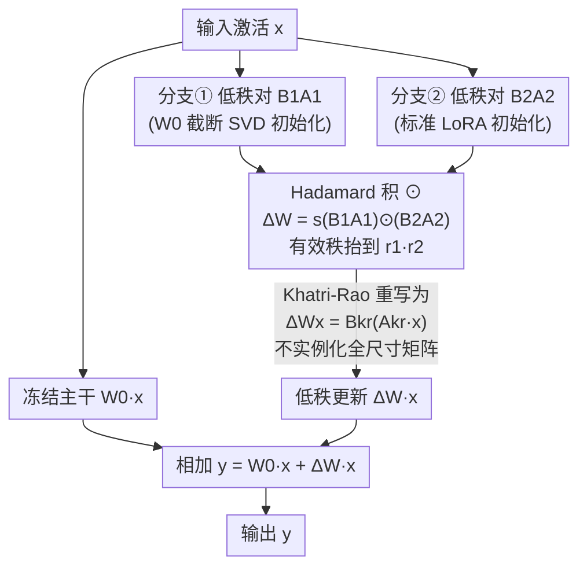

# ABBA-Adapters: Efficient and Expressive Fine-Tuning of Foundation Models

**会议**: ICLR 2026  
**arXiv**: [2505.14238](https://arxiv.org/abs/2505.14238)  
**代码**: [https://github.com/CERT-Lab/abba](https://github.com/CERT-Lab/abba)  
**领域**: 模型压缩 / PEFT  
**关键词**: 参数高效微调, LoRA, Hadamard积, 低秩适应, Khatri-Rao分解  

## 一句话总结
提出 ABBA 适配器，将权重更新参数化为两个独立可学习的低秩矩阵的 Hadamard 积 $\Delta W = s(B_1A_1) \odot (B_2A_2)$，在相同参数预算下实现远高于 LoRA 的有效秩（$r_1 \cdot r_2$ vs $r$），并通过 Khatri-Rao 重构实现与 LoRA 相当的内存效率，在算术和常识推理任务上显著超越现有 PEFT 方法。

## 研究背景与动机

**领域现状**：LoRA 是最流行的 PEFT 方法，通过 $\Delta W = BA$（$B \in \mathbb{R}^{m \times r}, A \in \mathbb{R}^{r \times n}$）将更新限制在秩-$r$ 子空间中。

**现有痛点**：LoRA 的更新严格受限于秩-$r$，表达力天然有限。HiRA 通过 $\Delta W = W_0 \odot (BA)$ 引入 Hadamard 积提升有效秩，但更新与冻结权重 $W_0$ 耦合——当目标更新与 $W_0$ 的元素比值不是低秩时，HiRA 无优势。

**核心矛盾**：高表达力（高秩更新）需要更多参数，但 PEFT 的核心约束是参数量少。如何在相同参数预算下突破秩限制？

**本文目标** 在保持 LoRA 级别参数效率的同时大幅提升更新的表达力和有效秩。

**切入角度**：将 Hadamard 积的两个因子都设为可学习的低秩矩阵，完全解耦与预训练权重的依赖。利用 Khatri-Rao 分解避免实例化全尺寸矩阵。

**核心 idea**：两个秩-$r/2$ 矩阵的 Hadamard 积有效秩可达 $r^2/4$，是同参数下 LoRA 秩 $r$ 的平方量级提升。

## 方法详解

### 整体框架
ABBA 想解决的是 LoRA 表达力被秩-$r$ 死死卡住、但又不能多花参数这个矛盾。它的做法是把每个目标层的权重更新从 LoRA 的 $\Delta W = BA$ 换成两个独立低秩矩阵的 Hadamard 积 $\Delta W = s(B_1A_1) \odot (B_2A_2)$，四个矩阵 $A_1, B_1, A_2, B_2$ 拼出"ABBA"这个名字。为了和 LoRA 公平对比，论文把两支的秩都设成 $r_1 = r_2 = r/2$，这样总参数量恰好等于 LoRA 的秩-$r$。剩下三件事就是：为什么逐元素积能在不加参数的前提下放大秩、怎么算它才不爆内存、怎么初始化才稳——分别对应下面三个设计。整体数据流是：输入激活 $x$ 一路过冻结主干 $W_0$，另一路过两个低秩分支再经 Hadamard 积合成 $\Delta W$，两路相加得到输出。

### 关键设计

**1. Hadamard 积的双低秩参数化：在不加参数的前提下把有效秩从 $r$ 抬到 $r^2/4$**

LoRA 的更新被锁死在秩-$r$ 子空间里，表达力天然封顶。ABBA 利用逐元素积的秩放大性质——$\text{rank}(W_1 \odot W_2) \leq r_1 \cdot r_2$——把两个秩-$r/2$ 的低秩矩阵相乘，使更新的有效秩上界一举抬到 $r_1 r_2 = r^2/4$，是同参数下 LoRA 的平方量级提升。矩阵重构实验直接验证了这点：在各类目标矩阵上 ABBA 的重构误差都一致低于同参数 LoRA。和同样用 Hadamard 积的 HiRA（$\Delta W = W_0 \odot (BA)$）相比，关键区别在于 ABBA 的两个因子都完全可学习，不与冻结权重 $W_0$ 绑定，因此更新能力不受预训练权重结构的牵制——HiRA 一旦遇到"目标更新除以 $W_0$ 不是低秩"的情况就失去优势，ABBA 没有这层依赖。

**2. Khatri-Rao 高效实现（Theorem 1）：把逐元素积重写成 LoRA 形式，避免实例化全尺寸矩阵**

朴素地算 $(B_1A_1) \odot (B_2A_2)$ 要先把两个 $m \times n$ 的全尺寸矩阵都造出来再逐元素相乘，内存代价等同全微调，PEFT 的省钱优势就没了。Theorem 1 用 Khatri-Rao（列向 Kronecker）分解绕开这一步：定义 $B_{\text{kr}} = B_1 \odot_r B_2 \in \mathbb{R}^{m \times r_1 r_2}$、$A_{\text{kr}} = (A_1^\top \odot_r A_2^\top)^\top$，就有 $\Delta W x = B_{\text{kr}}(A_{\text{kr}} x)$。这样前向传播退化成两次低秩矩阵-向量乘法，中间激活只有 $r_1 r_2$ 维，从头到尾都没有构造过全尺寸矩阵，计算和存储都保持在低秩级别——这正是让 ABBA 从"理论上更强"变成"实际能跑"的关键工程贡献。

**3. SVD 初始化 + 秩稳定性：让一支锚定主子空间，另一支负责探索，并把缩放配到正确量级**

ABBA 对两支用不对称的初始化：第一对 $(B_1, A_1)$ 用冻结权重 $W_0$ 的截断 SVD 来初始化，第二对 $(B_2, A_2)$ 沿用标准 LoRA 初始化。这么分工的理由是 EYM（Eckart–Young–Mirsky）定理保证截断 SVD 是最优的秩-$r_1$ 近似，于是第一支把更新锚定在 $W_0$ 中有意义的低秩主子空间上，第二支则保留对任务特定方向的自由探索。另一处细节是缩放因子 $s$：由于 ABBA 的有效秩是 $r_1 r_2$ 而不是 $r$，缩放必须随这个更大的容量来配。论文证明（Definition 1 的"秩稳定" + Theorem 2）只有取 $s_{\text{ABBA}} = \alpha^2/\sqrt{r_1 r_2} \in \Theta(1/\sqrt{r_1 r_2})$ 时，前向/反向的二阶矩才保持 $\Theta(1)$、不随秩漂移；这正是把 rsLoRA 的 $\alpha/\sqrt{r}$ 推广到双低秩结构的结果。$s$ 配错会出问题——太小学不动、太大发散。

### 损失函数 / 训练策略
同标准微调损失。与 LoRA 使用完全相同的训练超参数，唯一改动就是把适配器结构替换成 ABBA。代码开源。

## 实验关键数据

### 主实验

**算术推理 (GSM8K, MATH 等):**

| 方法 | 参数量 | GSM8K | MATH | 平均↑ |
|------|-------|-------|------|-------|
| LoRA (r=16) | 基准 | 基线 | 基线 | 基线 |
| DoRA | 同 | 略优 | 略优 | 略优 |
| HiRA | 同 | 优于LoRA | 优于LoRA | 优于LoRA |
| **ABBA (r=8+8)** | **同** | **显著最优** | **显著最优** | **显著最优** |

**常识推理 (多数据集平均):**

| 方法 | LLaMA-7B | LLaMA-3-8B | 说明 |
|------|---------|-----------|------|
| LoRA | 基线 | 基线 | |
| **ABBA** | **+2-3pp** | **+2-3pp** | 全面领先 |

### 消融实验

| 配置 | 性能 | 说明 |
|------|------|------|
| $r_1 = r_2 = r/2$ | 最佳 | 等分秩最大化 $r_1 r_2$ |
| $r_1 \neq r_2$ | 略差 | 不对称分配非最优 |
| 随机初始化 $(B_1, A_1)$ | 较差 | SVD 初始化关键 |
| 无缩放因子 | 训练不稳定 | 秩稳定性需要适当缩放 |

### 关键发现
- 矩阵重构实验证实 ABBA 在各类矩阵上一致优于同参数 LoRA，验证了更高的表达力
- ABBA 的实际收敛速度快于 LoRA 和 HiRA（MNIST toy 实验视觉化展示）
- Khatri-Rao 重构使 ABBA 的实际内存甚至优于 HiRA（HiRA 需要存储完整 $W_0$）
- 秩稳定性分析（Theorem 2）表明缩放应取 $s \propto 1/\sqrt{r_1 r_2}$，是 rsLoRA 的 $\alpha/\sqrt{r}$ 在双低秩结构下的推广

## 亮点与洞察
- **参数量不变但秩平方提升**：$r/2 \times r/2 = r^2/4$ 的有效秩提升是核心贡献——相当于在相同"预算"下购买了 $r/4$ 倍更强的表达力
- **Khatri-Rao 的工程巧妙**：Hadamard 积本不能"分配"到矩阵-向量乘法中，但通过 KR 分解巧妙避免了全矩阵实例化。这是使 ABBA 实际可用的关键技术贡献
- **与 HiRA 的本质区别**：HiRA 把一个因子固定为 $W_0$（免费但不可学），ABBA 把两个因子都设为可学但低秩（有参数代价但更灵活）。这引发了"利用预训练权重结构 vs 自由学习"的有趣权衡讨论

## 局限与展望
- Khatri-Rao 重构的中间激活维度为 $r_1 r_2$（而非 LoRA 的 $r$），实际 FLOPs 有所增加
- ABBA 不像 LoRA 那样有 closed-form 最优解（无法应用 EYM 定理），优化依赖梯度下降
- 初始化依赖 $W_0$ 的截断 SVD，每层需要一次 SVD 计算的前期成本
- 仅在 LLM 上验证，视觉模型和多模态模型的适用性未探索

## 相关工作与启发
- **vs LoRA**: ABBA 在相同参数下有效秩从 $r$ 提升到 $r^2/4$，是表达力的本质提升，代价是初始化和实现稍复杂
- **vs HiRA**: HiRA 的 Hadamard 积因子之一固定为 $W_0$，更新与预训练权重耦合；ABBA 全部可学，泛化能力更强
- **vs DoRA**: DoRA 解耦方向和幅度，但更新仍为低秩；ABBA 通过 Hadamard 积突破秩限制

## 评分
- 新颖性: ⭐⭐⭐⭐⭐ Hadamard 双低秩参数化+KR 高效实现是优雅的组合，秩平方提升的洞察深刻
- 实验充分度: ⭐⭐⭐⭐⭐ 4 个模型+算术/常识推理+矩阵重构+详尽消融
- 写作质量: ⭐⭐⭐⭐⭐ 从动机到理论到实验叙述流畅，图表设计清晰
- 价值: ⭐⭐⭐⭐⭐ 作为 LoRA 的直接改进方案，简单实用且提升显著，代码开源

<!-- RELATED:START -->

## 相关论文

- [\[CVPR 2026\] Mining Attribute Subspaces for Efficient Fine-tuning of 3D Foundation Models](../../CVPR2026/model_compression/mining_attribute_subspaces_for_efficient_fine-tuning_of_3d_foundation_models.md)
- [\[ICML 2025\] Parameter-Efficient Fine-Tuning of State Space Models](../../ICML2025/model_compression/parameter-efficient_fine-tuning_of_state_space_models.md)
- [\[ICLR 2026\] LoFT: Low-Rank Adaptation That Behaves Like Full Fine-Tuning](loft_low-rank_adaptation_that_behaves_like_full_fine-tuning.md)
- [\[ICLR 2026\] Memba: Membrane-driven Parameter-Efficient Fine-Tuning for Mamba](memba_membrane-driven_parameter-efficient_fine-tuning_for_mamba.md)
- [\[NeurIPS 2025\] RefLoRA: Refactored Low-Rank Adaptation for Efficient Fine-Tuning of Large Models](../../NeurIPS2025/model_compression/reflora_refactored_low-rank_adaptation_for_efficient_fine-tuning_of_large_models.md)

<!-- RELATED:END -->
