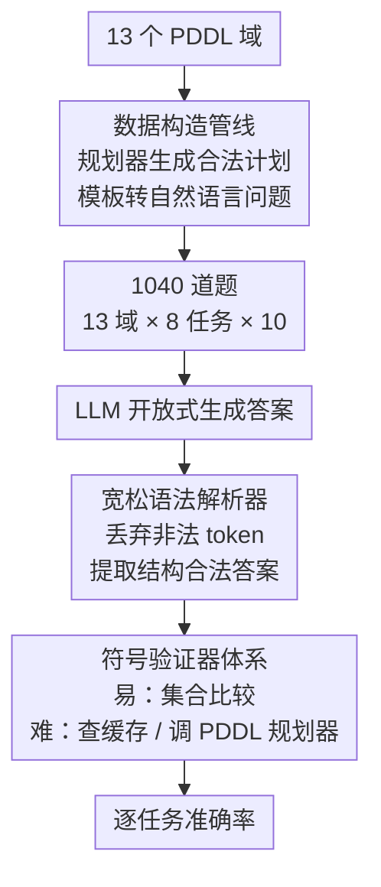

# ACPBench Hard: Unrestrained Reasoning about Action, Change, and Planning

**会议**: ICLR 2026  
**arXiv**: [2503.24378](https://arxiv.org/abs/2503.24378)  
**代码**: [https://ibm.github.io/ACPBench](https://ibm.github.io/ACPBench)  
**领域**: 模型压缩  
**关键词**: planning benchmark, PDDL, generative evaluation, symbolic validator, action reasoning

## 一句话总结

构建 ACPBench Hard——基于 PDDL 形式化系统的 8 类**开放式生成**规划推理 benchmark（13 域 × 8 任务 = 1040 题），配备具有严格正确性保证的符号验证器，系统测评 15 个 LLM 后发现：即使最强推理模型 o1-preview 在半数任务上准确率 ≤66%，所有模型在最基本的"列举可执行动作"任务上几乎完全失败，暴露了当前 LLM 在规划推理方面的根本不足。

## 研究背景与动机

现有 LLM 规划评估存在两层瓶颈。**第一层**：PlanBench、AutoPlanBench 等 benchmark 只关注端到端计划生成/验证，黑箱模型失败时无法定位具体原因。ACPBench v1 将规划过程拆解为 7 个原子推理任务（可适用性、状态转移、可达性等），但采用**布尔/多选**格式。**第二层**：多选格式与真实规划器的需求脱节——规划器需要从庞大的动作空间中*生成*答案，而非从 4 个选项里挑一个。模型在多选题上答对不代表能完成生成任务，且开放式生成的评估本身就困难得多（部分任务验证复杂度为 PSPACE-complete）。

本文的核心思路：将 ACPBench 的 7 个任务从多选升级为**开放式生成**，新增"下一步动作"任务（对应最优规划），为 8 个任务各设计一个基于 PDDL 的**符号验证器**，彻底避免 LLM-as-judge 的不可靠性。

## 方法详解

### 整体框架

ACPBench Hard 想解决的是"现有规划评估只看端到端成败、答错了也定位不到病根"，它把"会不会规划"拆成动作级、状态级、计划级三个层次共 8 个原子任务，每个任务都要求模型**开放式生成**答案（而非从选项里挑），再交给一个有严格正确性保证的符号验证器判分。整条链路是：从 13 个 PDDL（Planning Domain Definition Language，规划领域定义语言）域批量造题，模板把形式化描述转写成自然语言问题，模型开放式作答，先经宽松解析器把答案从格式噪声里捞出来，最后由符号验证器判对错。这样既能精确定位模型在哪个环节出错，又彻底绕开了 LLM-as-judge（用大模型当评委）的不可靠性。

| 层次 | 任务 | 缩写 | 生成目标 | 验证复杂度 |
|------|------|------|----------|-----------|
| 动作级 | 可适用性 | App | 列举当前状态下**所有**可执行动作 | O(&#124;A&#124;) |
| 动作级 | 状态转移 | Prog | 给定动作，列出正效果（新增为真）和负效果（变为假） | O(&#124;F&#124;) |
| 状态级 | 命题可达性 | Reach | 找出从当前状态**永远不可能**为真的命题 | PSPACE-complete |
| 状态级 | 动作可达性 | AReach | 找出**永远不可能**变得可执行的动作 | PSPACE-complete |
| 计划级 | 计划验证 | Val | 识别动作序列中**第一个**不可执行的动作 | O(1) |
| 计划级 | 计划简化 | Just | 移除计划中 1-2 个冗余动作并输出简化计划 | O(&#124;π&#124;·&#124;F&#124;) |
| 计划级 | 里程碑 | Land | 找出任何合法计划都必须经过的**必要子目标** | PSPACE-complete |
| 计划级 | 下一步动作(新) | NextA | 选择一个使最优目标距离减少 1 的动作 | PSPACE-complete |

### 关键设计

**1. 数据构造管线：从 13 个 PDDL 域批量生成 1040 道有标准答案的题**

要让"开放式生成"可被精确判分，前提是每道题背后都有规划器能算出的客观答案，这正是整条评测链路的起点。题目全部源自 ACPBench 的 13 个 PDDL 域，每域每任务出 10 题，共 $13 \times 8 \times 10 = 1040$ 题。为保证题目背后有合法解，计划优先用最优质量规划器（top-quality planner）生成、以多样化规划器（diverse planner）兜底，再通过模板把 PDDL 形式化描述转写成自然语言问题。统一的 PDDL 来源让每道题都有规划器可计算的标准答案——没有这一步，后面的符号验证器就无从判对错。

**2. 宽松语法解析器：把模型答案从格式噪声里捞出来**

模型作答后、判分之前还有一道坎：LLM 输出常夹带解释、格式漂移，逐字匹配会把本来答对的也判错，污染的是"格式"而非"推理能力"。为此设计了基于语法（grammar）的宽松解析器，自动丢弃不符合语法的 token、只保留结构合法的部分，最大限度提取有效答案。这一步把"会不会规划"和"会不会按格式输出"解耦，让后续验证只针对推理本身。

**3. 符号验证器体系：让开放式生成也能被可靠自动判分**

这是本文最核心的贡献——开放式生成的答案不唯一、空间巨大，传统 benchmark 只能退回多选或求助 LLM 评委，本文则为 8 个任务各配一套专用验证算法。简单任务（App/Prog/Val）直接做集合比较就能判对错；困难任务（Reach/AReach/Land/NextA）验证复杂度本身就是 PSPACE-complete，做法是先查预计算缓存、未命中时再调真正的 PDDL 规划器求解，从而保证判分的**完备性**与**正确性**。以里程碑（Land）为例，要验证一个候选子目标是否真的必经，做法是构造辅助规划任务 $\Pi'$——往原问题里塞一个标记命题 $p_{nach}$，若存在一条绕开该候选的合法计划，就说明它并非里程碑。这类验证算法的构造本身也带来独立的技术价值。

## 实验关键数据

### 小/中型模型结果

| 模型 | App | AReach | Just | Land | NextA | Prog | Reach | Val |
|------|-----|--------|------|------|-------|------|-------|-----|
| Granite 3.1 8B | 0.00 | 0.00 | 0.21 | 0.08 | 0.22 | 0.36 | 0.33 | 0.09 |
| Llama 3.1 8B | 0.00 | 0.00 | 0.22 | 0.06 | 0.25 | 0.40 | 0.33 | 0.13 |
| DeepSeek Coder 33B | 0.02 | 0.02 | 0.21 | 0.10 | 0.17 | 0.42 | 0.18 | 0.15 |
| Granite 34B Code | 0.02 | 0.00 | 0.17 | 0.11 | 0.18 | 0.43 | 0.28 | 0.12 |

小型模型在 App 和 AReach 上几乎为零，最高的 Prog 也仅 43%。

### 大型模型 & 推理模型结果

| 模型 | App | AReach | Just | Land | NextA | Prog | Reach | Val |
|------|-----|--------|------|------|-------|------|-------|-----|
| Mixtral 8x22B | 0.10 | 0.02 | 0.31 | 0.26 | 0.32 | 0.68 | **0.37** | 0.23 |
| Llama 3.1 70B | 0.12 | 0.02 | 0.44 | 0.20 | 0.42 | 0.65 | 0.28 | 0.20 |
| GPT-4o mini | 0.07 | 0.01 | 0.14 | 0.04 | 0.35 | 0.59 | 0.22 | 0.27 |
| Llama 3.1 405B | 0.14 | 0.04 | 0.59 | 0.15 | 0.48 | 0.74 | 0.26 | 0.48 |
| **GPT-4o** | **0.25** | 0.01 | 0.54 | **0.29** | **0.55** | **0.78** | 0.32 | **0.62** |
| DeepSeek V3 | 0.21 | **0.05** | **0.65** | 0.12 | 0.47 | 0.76 | 0.32 | 0.56 |
| o1-mini | 0.38 | 0.06 | 0.44 | 0.38 | 0.64 | 0.70 | 0.60 | **0.78** |
| GPT OSS 20B | 0.03 | 0.09 | 0.14 | 0.47 | 0.62 | 0.72 | 0.50 | 0.14 |
| GPT OSS 120B | 0.00 | 0.13 | 0.05 | 0.49 | 0.78 | 0.79 | 0.68 | 0.70 |
| **o1-preview** | **0.44** | **0.12** | 0.46 | **0.56** | **0.80** | **0.89** | **0.66** | 0.26 |
| DeepSeek R1 | 0.05 | 0.01 | 0.52 | 0.20 | 0.36 | 0.77 | 0.24 | 0.53 |

### 表示形式消融（DeepSeek V3）

| 表示 | App | AReach | Just | Land | NextA | Prog | Reach | Val | 平均 |
|------|-----|--------|------|------|-------|------|-------|-----|------|
| NL | 0.21 | 0.05 | 0.65 | 0.12 | 0.47 | 0.76 | 0.32 | 0.56 | 0.39 |
| PDDL | 0.31 | 0.07 | 0.74 | 0.21 | 0.53 | 0.87 | 0.33 | 0.55 | 0.44 |
| PDDL+NL | 0.32 | 0.09 | 0.68 | 0.19 | 0.60 | 0.88 | 0.37 | 0.61 | **0.47** |

加入 PDDL 形式化描述后平均准确率从 39%→47%，但当 PDDL 可用时，直接用传统规划器更合适。

### 核心发现

- **Applicability 几乎全军覆没**：最基本的"列举所有可执行动作"，小模型≈0%，最强 o1-preview 仅 44%。严格要求生成**完整**集合是主要原因——如果改用 Jaccard 相似度评分，o1-preview 可达 57%，Mixtral 从 10%→38%。
- **Action Reachability 是最难任务**：需要对动作前置条件中多个命题的**联合可达性**进行推理，o1-preview 仅 12%。多数正确答案来自识别"None"（所有动作均可达）的情况。
- **无全能模型**：没有任何模型在所有 8 个任务上都最优。GPT-4o 在 5/8 任务最佳，但 Just 被 DeepSeek V3 超过 11%，AReach 被超过 4%。
- **推理模型性价比存疑**：o1 系列计算成本远超普通 LLM，但仅在 Prog（89%）和 NextA（80%）有显著优势，半数任务 ≤66%。
- **o1-preview 在 Val 上反常低分（26%）**：错误案例中 86% 的答案与正确索引仅相差 1，说明模型接近正确但差一步。
- **Progression 是最容易的任务**（o1-preview 89%），但即使如此模型仍会犯低级错误，如不识别"堆叠方块后顶部方块变为 clear"等合理效果。

## 亮点与洞察

- **精准定位能力缺陷**：通过将规划过程拆解为 8 个原子任务，可以精确诊断模型在哪个环节失败。App≈0% 说明 LLM 连最基本的"枚举可执行动作"都做不到——这是一切规划的前提。
- **符号验证器的方法论意义**：为开放式生成任务提供了完全可靠的自动评估方案，部分验证算法本身的构造（如 Landmarks 的辅助规划任务）具有独立的技术贡献。
- **生成 vs 多选的鸿沟**：同一模型（GPT-4o）在多选格式上的错误率远低于生成格式（除 Val 外），说明多选题严重高估了模型的规划推理能力。

## 局限性与改进方向

- 基于模板的自然语言不够自然，与真实世界规划场景存在差距
- 仅覆盖 13 个 PDDL 域，可能不足以代表所有规划推理模式
- 只评估单次生成的最终答案，未考虑多步迭代自纠正能力
- 宽松解析器仅提取第一个答案，可能遗漏模型的多次尝试
- 未来方向：构造带推理链（CoT）的训练数据、扩展到物体计数等新任务类型

## 相关工作对比

- **vs ACPBench v1**：v1 是布尔/多选，本文升级为开放式生成——难度质变式提升
- **vs PlanBench / AutoPlanBench**：侧重端到端计划生成/验证，无法定位原子能力缺陷
- **vs ActionReasoningBench**：混合多个能力到单个问题中且依赖 LLM-as-judge 评估；本文每个任务对应一个原子能力 + 符号验证器

## 评分

- 新颖性: ⭐⭐⭐⭐ 生成式规划推理 benchmark + 完备符号验证器
- 实验充分度: ⭐⭐⭐⭐⭐ 15 模型 × 8 任务 + 表示消融 + 复杂度分析 + 逐域分析
- 写作质量: ⭐⭐⭐⭐ 任务定义与验证算法清晰，观察分析细致
- 价值: ⭐⭐⭐⭐⭐ LLM 规划推理能力诊断的标杆测试平台

<!-- RELATED:START -->

## 相关论文

- [\[CVPR 2026\] Rethinking Dataset Distillation: Hard Truths about Soft Labels](../../CVPR2026/model_compression/rethinking_dataset_distillation_hard_truths_about_soft_labels.md)
- [\[ACL 2026\] Social Story Frames: Contextual Reasoning about Narrative Intent and Reception](../../ACL2026/model_compression/social_story_frames_contextual_reasoning_about_narrative_intent_and_reception.md)
- [\[ICLR 2026\] Efficient Reasoning with Balanced Thinking](efficient_reasoning_with_balanced_thinking.md)
- [\[ICML 2026\] Hard Labels In! Rethinking the Role of Hard Labels in Mitigating Local Semantic Drift](../../ICML2026/model_compression/hard_labels_in_rethinking_the_role_of_hard_labels_in_mitigating_local_semantic_d.md)
- [\[ICLR 2026\] BeyondBench: Contamination-Resistant Evaluation of Reasoning in Language Models](beyondbench_contamination-resistant_evaluation_of_reasoning_in_language_models.md)

<!-- RELATED:END -->
