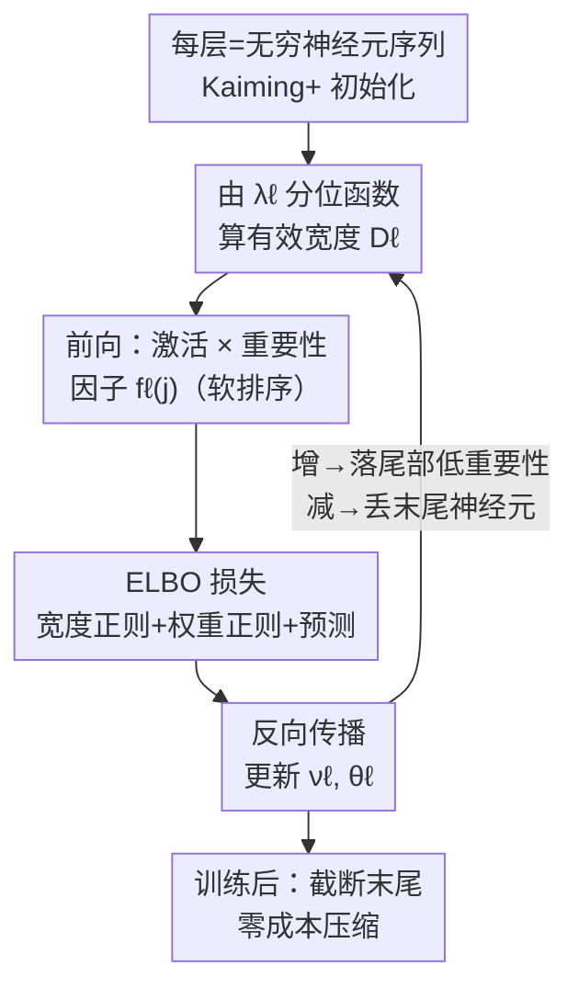

# Adaptive Width Neural Networks

**会议**: ICLR 2026  
**arXiv**: [2501.15889](https://arxiv.org/abs/2501.15889)  
**代码**: [https://github.com/nec-research/Adaptive-Width-Neural-Networks](https://github.com/nec-research/Adaptive-Width-Neural-Networks)  
**领域**: 模型压缩 / 神经架构学习  
**关键词**: 自适应宽度, 变分推断, 神经元重要性排序, 网络压缩, 超参数学习  

## 一句话总结
提出AWN框架，通过变分推断在训练过程中自动学习每层的无上界宽度（神经元数量），利用单调递减的重要性函数对神经元施加软排序，实现宽度自适应于任务难度，并支持零成本的训练后截断压缩。

## 研究背景与动机

**领域现状**：近70年来，神经网络的层宽度一直依赖手动选择或超参搜索（grid search/NAS），这已成为深度学习的基础性未解问题。

**现有痛点**：宽度作为超参的搜索空间随层数指数增长，实践中多采用"所有层相同宽度"的简化策略。对于数十亿参数的基础模型，超参调优的计算成本完全不可承受。

**核心矛盾**：网络需要"足够宽"以学习好的表示，但"过宽"浪费资源。现有方法要么在固定宽度空间中搜索（NAS），要么需要额外的训练-裁剪流程（剪枝/蒸馏）。

**本文目标**：能否在单次训练中，让每层宽度随梯度下降自动增长/收缩，且无需预设上界？

**切入角度**：引入隐变量 $\lambda_\ell$ 控制每层截断宽度，用单调递减的重要性分布对神经元排序——低序号神经元重要、高序号神经元次要，新增神经元自然处于低重要性位置。

**核心 idea**：将宽度学习形式化为变分推断问题，通过ELBO目标同时优化宽度参数和网络权重。

## 方法详解

### 整体框架
AWN（Adaptive Width Networks）想做的事很直接：让每层宽度 $D_\ell$ 在训练里跟着梯度自己增长或收缩，既不用预设上界，也不用单独的剪枝阶段。它把每层看成一个**无穷长的神经元序列**，为该层引入两组隐变量——$\lambda_\ell$ 控制"这一层实际激活多少个神经元"，$\theta_\ell$ 是这些神经元的权重——然后用变分推断最大化 ELBO。每个训练步先由 $\lambda_\ell$ 的分位函数算出当前有效宽度 $D_\ell$，再做一次普通的前向-反向传播；宽度的增减就发生在这条标准 SGD 链路上，不需要任何特殊优化器。整套方法靠三件事咬合：把宽度建成可推断的隐变量（设计 1）、用重要性因子给神经元排序好让宽度能平滑增减（设计 2）、再用改写的初始化保证深层训得动（设计 3）。

图里 $\lambda_\ell$ 分位函数算宽度、前向乘重要性因子、Kaiming+ 初始化三个节点，正对应下面三个关键设计；其余（前向/反向/损失）是标准 SGD 脚手架。

### 关键设计

**1. 概率图模型与变分目标：把"选宽度"变成"推断隐变量"**

宽度之所以难学，是因为它本是个离散超参，没法直接对它求梯度。AWN 的破局点是把整层建成一条无穷的 i.i.d. 隐变量序列 $\theta_{\ell n}$（第 $\ell$ 层第 $n$ 个神经元的权重），再引入隐变量 $\lambda_\ell$，让它通过重要性分布 $f_\ell$ 的分位函数决定有效宽度 $D_\ell$——超出 $D_\ell$ 的神经元一律回退到先验、不参与计算。这样宽度就被一个连续变量 $\lambda_\ell$ 接管了。训练目标是最大化 ELBO，它自然分成三块：宽度正则 $\log \frac{p(\nu_\ell)}{q(\nu_\ell)}$、权重正则 $\sum_{n=1}^{D_\ell} \log \frac{p(\rho_{\ell n})}{q(\rho_{\ell n})}$、以及预测性能 $\sum_i \log p(y_i | \nu, \rho, x_i)$。好处在于变分参数 $\nu_\ell, \rho_{\ell n}$ 本身就是网络参数，可以直接梯度优化；先验项又免费提供了正则化和不确定性量化，不需要任何启发式的"加神经元/删神经元"规则。

**2. 神经元重要性软排序（Soft Ordering）：给序列里的神经元排个先后**

光把宽度变成连续变量还不够——如果所有神经元地位平等，新增一个就可能突然扰动输出，训练初期权重矩阵的置换对称性还会让神经元互相"挤位置"（jostling）。AWN 的办法是给激活乘上一个**单调递减的重要性因子**：把标准 MLP 激活改成

$$h_j^\ell = \sigma\!\Big(\sum_k w_{jk}^\ell h_k^{\ell-1}\Big) \cdot f_\ell(j; \nu_\ell),$$

其中 $f_\ell$ 取离散化的指数分布，序号 $j$ 越小因子越大（越重要），序号越大越接近零。于是序列被强行排了序：低序号神经元承担主要表示，高序号神经元只做微调，新加进来的神经元天然落在低重要性的尾部、不会冲击已有输出。这一步同时打破了置换对称性、消除了 jostling，还顺带让"训练后截断"几乎免费——直接删掉末尾几个神经元，对网络影响最小。代价是要配合**有界激活**（ReLU6/tanh），否则后面的层会用权重去补偿这个重标定因子，把排序效果抵消掉。

**3. 适配深度 AWN 的 Kaiming+ 初始化（Theorem 3.1）：别让重标定因子把深层激活压没**

重要性因子虽好，却带来一个副作用：每层都乘一个小于 1 的 $f_\ell$，深层激活会被逐层压缩、方差快速衰减到零，梯度随之消失，深网根本训不动。论文为此重新推导了初始化方差，要求

$$\text{Var}[w_{jk}^\ell] = \frac{2}{\sum_{j=1}^{D_{\ell-1}} f_\ell^2(j)},$$

让深层激活方差在初始化时保持常数。和标准 Kaiming 的唯一区别是分母——从 $D_{\ell-1}$ 换成了 $\sum_j f_\ell^2(j)$（后者因为 $f_\ell<1$ 而更小），恰好把重标定带来的能量损失补回来。技术上不复杂，但对这类"动态架构"方法的可训练性是决定性的：不做这一步，深度 AWN 就无法收敛。

### 训练策略
- 每个训练步先用分位函数更新各层宽度 $D_\ell$，再做正常的前向-反向传播；宽度增加时用标准正态初始化新神经元权重，减少时直接丢弃多余权重。
- mini-batch 训练时预测损失需按 $N/M$ 缩放（贝叶斯视角下，数据越多、正则项相对越弱）。
- 推荐用有界激活（ReLU6）保证宽度收敛——配合软排序，起始宽度不影响最终学到的宽度。

## 实验关键数据

### 主实验
在表格、图像、文本、序列、图数据上全面测试：

| 模型/数据集 | Fixed Acc/Loss | AWN Acc/Loss | Fixed宽度 | AWN学习宽度 |
|------------|---------------|-------------|----------|-----------|
| MLP/DoubleMoon | 100.0 | 100.0 | 8 | 8.1 |
| MLP/Spiral | 99.5 | 99.8 | 16 | 65.9 |
| MLP/SpiralHard | 98.0 | **100.0** | 32 | 227.4 |
| ResNet-20/CIFAR10 | 91.4 | 91.4 | Linear | 80.1 |
| RNN/PMNIST | 91.1 | **95.7** | 24 | 806.3 |
| GIN/REDDIT-B | 87.0 | **90.2** | 96-320 | 793.6 |
| Transformer/Multi30k | 1.43 | 1.51 | 24576 | **123.2** (200x少) |

### 消融实验

| 重要性函数族 | 平均准确率 | 最大准确率 | 学习宽度 |
|------------|----------|----------|---------|
| Exponential | 80.27 | 100.00 | 954 |
| Power Law | 81.82 | 100.00 | 2952 (长尾) |
| Sigmoidal | 76.85 | 100.00 | 427 (尖锐过渡) |

### 关键发现
- **宽度自适应任务难度**：DoubleMoon→Spiral→SpiralHard，学习宽度从8→66→227，完美符合直觉
- **训练后截断**：Spiral数据集上83单元的MLP可截断30%（~58单元）而准确率不变，之后平滑退化——零额外成本的"蒸馏"
- **在线压缩**：在SpiralHard上，通过1000轮后引入信息先验，宽度从800降至300（-62%）且准确率不变
- **Transformer 200x压缩**：Multi30k翻译任务上FFN学到的宽度仅123（固定为24576），loss仅微升0.08
- 起始宽度在有界激活下不影响最终收敛宽度，证明超参空间确实被缩减

## 亮点与洞察
- **概率形式化的优雅性**：将宽度学习完全纳入标准变分推断框架，无需启发式规则，仅靠反向传播即可增减神经元——这是将"架构搜索"变为"参数学习"的范式转换
- **软排序→免费截断**的附带效果非常实用：训练完直接删末尾列/行即可压缩，比剪枝简单得多
- **Kaiming+初始化**虽然技术上不难，但对深度AWN的可训练性至关重要，说明这类"动态架构"方法的初始化需要特殊关注
- Transformer的200x压缩结果暗示LLM中的FFN可能存在巨大冗余

## 局限与展望
- 目前仅学习**MLP层的宽度**，CNN的filter数量需要不同的形式化（作者明确说beyond scope）
- CIFAR100上AWN偶发不收敛（avg 63.1 vs fixed 66.5），稳定性待提升
- 指数分布作为 $f_\ell$ 的默认选择缺乏理论最优性支撑，不同分布族导致截然不同的宽度（exponential 954 vs power law 2952）
- 未在真正的大规模模型（如LLM）上验证，Transformer实验仅限于小型Multi30k翻译任务
- 变分推断的一阶近似（$\mathbb{E}[f(\lambda)] \approx f(\nu)$）丢失了不确定性信息，削弱了贝叶斯框架的优势

## 相关工作与启发
- **vs NAS**: NAS搜索离散架构空间，需多次训练；AWN在连续空间中一次训练搞定，但仅覆盖宽度维度
- **vs 剪枝**: 剪枝需预训练一个大模型再裁剪；AWN从一开始就学习合适宽度，且可同时增长和收缩
- **vs Unbounded Depth Network (Nazaret & Blei 2022)**: 同一思路扩展到宽度维度，但需要单调递减的重要性分布（深度不需要）
- **vs Firefly (Wu et al. 2020)**: Firefly交替训练和增长，需要启发式规则；AWN纯梯度驱动

## 评分
- 新颖性: ⭐⭐⭐⭐⭐ 将宽度学习形式化为变分推断并支持无上界增长，概念优雅且理论扎实
- 实验充分度: ⭐⭐⭐⭐ 覆盖5种数据域+充分的消融分析，但缺乏大规模验证
- 写作质量: ⭐⭐⭐⭐⭐ 数学严谨，实验分析透彻，行文逻辑清晰
- 价值: ⭐⭐⭐⭐ 概念上很有吸引力，但在大规模实际应用中的可行性待验证

<!-- RELATED:START -->

## 相关论文

- [\[ICLR 2026\] A Recovery Guarantee for Sparse Neural Networks](a_recovery_guarantee_for_sparse_neural_networks.md)
- [\[ICLR 2026\] Fine-tuning Quantized Neural Networks with Zeroth-order Optimization](fine-tuning_quantized_neural_networks_with_zeroth-order_optimization.md)
- [\[ICML 2026\] SURGE: Surrogate Gradient Adaptation in Binary Neural Networks](../../ICML2026/model_compression/surge_surrogate_gradient_adaptation_in_binary_neural_networks.md)
- [\[NeurIPS 2025\] The Graphon Limit Hypothesis: Understanding Neural Network Pruning via Infinite Width Analysis](../../NeurIPS2025/model_compression/the_graphon_limit_hypothesis_understanding_neural_network_pruning_via_infinite_w.md)
- [\[CVPR 2026\] Content-Adaptive Hierarchical Hyperprior for Neural Video Coding](../../CVPR2026/model_compression/content-adaptive_hierarchical_hyperprior_for_neural_video_coding.md)

<!-- RELATED:END -->
