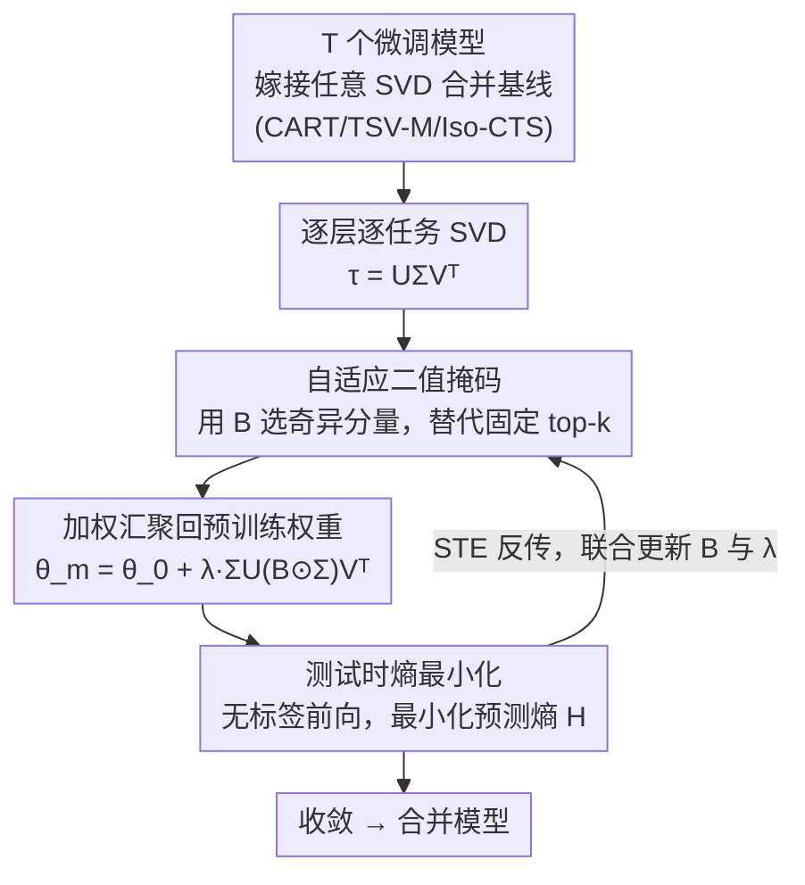

# AdaRank: Adaptive Rank Pruning for Enhanced Model Merging

**会议**: ICLR 2026  
**arXiv**: [2503.22178](https://arxiv.org/abs/2503.22178)  
**代码**: 待确认  
**领域**: 目标检测（模型合并/多任务学习）  
**关键词**: 模型合并, SVD, 任务向量, 测试时自适应, 多任务学习

## 一句话总结

提出 AdaRank，用可学习二值掩码自适应选择 task vector 的奇异分量（取代启发式 top-k），结合测试时熵最小化优化，大幅缓解多任务模型合并中的任务间干扰，在 ViT-B/32 上达到 89.4% 准确率。

## 研究背景与动机

**领域现状**：模型合并（Model Merging）将多个独立微调模型整合为一个统一框架，避免多模型部署的高计算开销。Task Arithmetic 通过加权求和 task vector（微调与预训练权重之差）实现合并，但存在严重的任务间干扰问题。

**SVD 方法的局限**：近期 SVD 方法利用低秩结构截断 task vector 取得了进展，但依赖启发式固定 top-k 选择，存在两个根本问题：
   - **反直觉现象**：top 奇异分量虽然对本任务损失降低最多，但对其他任务可能造成更大的净损失增加。作者在 ViT-B/32 上实验发现，加入 MNIST 的 top 奇异分量会使语义相近的 SVHN 受益，但让不相似的 DTD（纹理分类）损失大幅增加
   - **秩需求差异巨大**：不同任务和层的内禀秩差异悬殊——SUN397（397类）需要更高的秩，MNIST/SVHN 秩更低；早期层（任务无关特征）秩高且方差小，后期层（任务特定表示）秩低且变异大

**核心矛盾**：固定 top-k 截断既可能丢弃某些任务的关键分量，又保留了引起干扰的分量

**本文解决方案**：自适应地为每个任务每层独立选择最优奇异分量子集

## 方法详解

### 整体框架

AdaRank 把"保留哪些奇异分量"这件事，从写死的 top-k 规则改成每个任务、每一层独立学出来的二值决策。它不是一个全新的合并算法，而是一层嫁接在已有 SVD 合并方法（CART、TSV-M、Iso-CTS 等）之上的自适应适配器：先对第 $l$ 层、第 $i$ 个任务的 task vector 做 SVD 分解 $\tau_i^l = U_i^l \Sigma_i^l V_i^{l\top}$，再给每个奇异分量配一个可学习的二值掩码 $B_i^l \in \{0,1\}^{1 \times m}$，把被保留的分量加权汇聚回预训练权重得到合并模型：

$$\theta_m^l = \theta_0^l + \lambda^l \sum_{i=1}^T U_i^l (\text{diag}(B_i^l) \odot \Sigma_i^l) V_i^{l\top}$$

掩码 $B$ 与层级系数 $\lambda^l$ 没有标签可学，于是在无标签测试数据上以预测熵最小化为目标联合优化——前向算合并模型的输出熵、反向更新 $B$ 与 $\lambda$，迭代收敛后定下保留的分量子集。

### 关键设计

**1. 自适应二值掩码：把启发式 top-k 换成逐分量的可学开关**

固定 top-k 截断的根本缺陷在于它假定"奇异值大的分量一定该留"，但作者的反直觉观察表明，对本任务损失贡献最大的 top 分量，恰恰可能是对其他任务干扰最大的分量。AdaRank 因此给每个奇异分量单独配一个开关 $B_{ir}$：$B_{ir}=1$ 保留、$B_{ir}=0$ 剪枝，让模型自己决定哪些分量值得留下。这个设计天然涵盖了已有方法——掩码全为 1 时退化为标准 Task Arithmetic，只有前 $k$ 个为 1 时退化为 top-k 截断，因此它是比固定截断更宽的搜索空间，既能丢掉引起干扰的分量，又不会误删某些任务的关键秩。难点在于二值掩码不可导、会切断梯度流，AdaRank 用直通估计器（Straight-Through Estimator, STE）解决：每个开关背后维护一个连续参数 $\tilde{b}_{ir}$，前向时经 sigmoid 后以 0.5 为阈 round 成 $\{0,1\}$ 严格执行稀疏剪枝，反向时把它当连续值直接透传梯度，从而能用标准梯度下降优化这些离散开关。

**2. 测试时熵最小化：用无标签数据找一个与监督损失对齐的代理目标**

模型合并的场景里通常拿不到带标签的多任务数据，无法直接最小化分类损失。AdaRank 转而用预测分布的 Shannon 熵作为无监督代理：在无标签测试样本上让输出尽量"自信"（熵低），优化目标为

$$\arg\min_B \sum_{i=1}^T \sum_{x_i \in \mathcal{D}_i} H_i(f(\theta(B), x_i))$$

其中 $H_i$ 是任务 $i$ 输出分布的熵，$\mathcal{D}_i$ 是该任务的无标签测试数据。这一选择之所以有效，是因为熵与多任务监督损失高度相关——降低熵近似等价于降低真实任务损失。作者还专门用一个有标签的 oracle（直接最小化多任务交叉熵）做对照，验证了在熵代理下优化出的分量子集，确实逼近 oracle 找到的优质子集，从而把"该保留哪些分量"转化成一个可在测试时求解的无监督优化。

**3. 即插即用：B 与 λ 联合优化，嫁接到任意合并基线**

掩码 $B$ 与层级系数 $\lambda^l$ 都通过测试时适应（TTA）联合优化，且不绑定任何特定合并算法，因此 AdaRank 可以直接套在 Task Arithmetic、CART、TSV-M、Iso-CTS 等多种静态/自适应基线之上，把它们的奇异分量选择从固定规则升级为自适应选择。消融显示，单独学 $B$ 或单独学 $\lambda$ 都能带来明显增益，且二者是正交互补的——$\lambda$ 调每层的整体强度、$B$ 选每层留哪些分量，联合优化效果最好。整套适配器的额外参数仅占总量的 0.032%，几乎不增加部署成本。

## 实验关键数据

### 主实验（ViT-B/32, 8 任务）

| 方法类型 | 方法 | 平均准确率 |
|---------|------|----------|
| 静态合并 | CART | 84.7 |
| 静态合并 | Iso-CTS | 84.9 |
| 自适应 | TA+AdaMerging | 80.1 |
| 自适应 | **TA+AdaRank** | **87.9** |
| 自适应 | **CART+AdaRank** | **89.2** |
| 自适应 | **Iso-CTS+AdaRank** | **89.4** |
| 路由方法 | WEMoE | 89.5 |

### 消融实验

| 配置 | ViT-B/32 (8任务) | 说明 |
|------|-----------------|------|
| 固定 top-k (k=50) | 84.7 | CART 基线 |
| 随机掩码 | ~82.0 | 不如 top-k |
| 仅优化 λ（AdaMerging） | 80.1 | 层级系数优化不足 |
| **AdaRank (B+λ 联合)** | **89.2** | 掩码+系数联合优化最佳 |

### 关键发现

- **NLP 任务**：RoBERTa 上 CART+AdaRank 达 0.7547，GPT-2 上达 0.6587，显著优于 AdaMerging
- **20 任务场景**：优势更大——TSV-M+AdaRank 达 86.9%（ViT-B/32），远超 WEMoE 的 80.2%
- 额外参数仅占总量 0.032%，TTA 时间与 AdaMerging 相当
- 模型参数量恒定（不随任务数增长），优于路由方法的线性增长

## 亮点与洞察

- 揭示了 top-k 奇异分量在多任务场景下并非最优的反直觉现象，这一分析本身就有独立价值
- 方法极其通用，可即插即用到多种静态/自适应模型合并框架中
- 在 20 任务大规模场景下优势更加明显，说明任务间干扰随任务数增长加剧
- 跨视觉/NLP、跨架构（双向/自回归 Transformer）均有效

## 局限与展望

- 需要无标签测试数据进行测试时适应，不适用于完全无数据场景
- SVD 分解本身有 $O(d^2 d')$ 的额外预处理开销
- 熵最小化作为代理目标并非总与多任务损失完美相关，某些场景下可能失效
- 仅验证了分类任务，检测/分割等密集预测任务上的效果未知

## 相关工作与启发

- **Task Arithmetic / TIES-Merging / DARE**：逐元素稀疏化 task vector，不保留低秩结构
- **CART / TSV-M / STAR**：SVD 低秩截断，但固定 top-k
- **AdaMerging**：测试时适应层级系数 λ，AdaRank 在更细粒度（奇异分量级）做适应
- **WEMoE / Twin-Merging**：路由方法，参数随任务数线性增长

## 评分

- 新颖性: ⭐⭐⭐⭐ 自适应奇异分量选择替代启发式 top-k，分析深入
- 实验充分度: ⭐⭐⭐⭐⭐ 视觉+NLP，多backbone，8/20任务，消融充分
- 写作质量: ⭐⭐⭐⭐ 分析清晰，动机图示直观
- 价值: ⭐⭐⭐⭐ 模型合并领域实用且通用的方法

<!-- RELATED:START -->

## 相关论文

- [\[CVPR 2025\] Task Singular Vectors: Reducing Task Interference in Model Merging](../../CVPR2025/model_compression/task_singular_vectors_reducing_task_interference_in_model_merging.md)
- [\[ICLR 2026\] RAIN-Merging: A Gradient-Free Method to Enhance Instruction Following Through Model Merging](rain-merging_a_gradient-free_method_to_enhance_instruction_following_through_mod.md)
- [\[ICLR 2026\] Null-Space Filtering for Data-Free Continual Model Merging: Preserving Stability, Promoting Plasticity](null-space_filtering_for_data-free_continual_model_merging_preserving_stability_.md)
- [\[NeurIPS 2025\] Accurate and Efficient Low-Rank Model Merging in Core Space](../../NeurIPS2025/model_compression/accurate_and_efficient_low-rank_model_merging_in_core_space.md)
- [\[ICML 2026\] When Shared Knowledge Hurts: Spectral Over-Accumulation in Model Merging](../../ICML2026/model_compression/when_shared_knowledge_hurts_spectral_over-accumulation_in_model_merging.md)

<!-- RELATED:END -->
