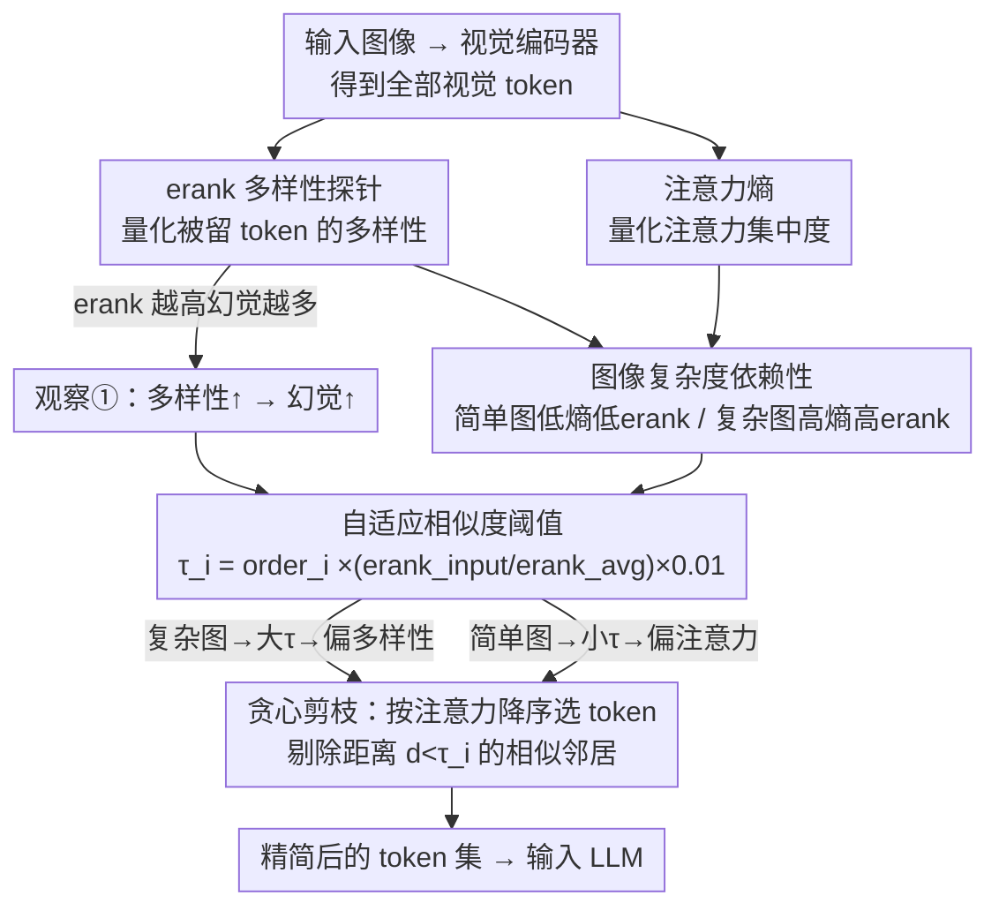

# AgilePruner: An Empirical Study of Attention and Diversity for Adaptive Visual Token Pruning in LVLMs

**会议**: ICLR 2026  
**arXiv**: [2603.01236](https://arxiv.org/abs/2603.01236)  
**代码**: [https://cvsp-lab.github.io/AgilePruner](https://cvsp-lab.github.io/AgilePruner)  
**领域**: 模型压缩  
**关键词**: visual token pruning, attention, diversity, hallucination, adaptive pruning

## 一句话总结
通过 erank（有效秩）和注意力熵的系统性实证分析，揭示了视觉 token 剪枝中注意力方法和多样性方法的互补特性——注意力方法抑制幻觉但覆盖有限，多样性方法覆盖全面但易引入幻觉——并据此提出基于图像复杂度自适应切换剪枝策略的 AgilePruner，在 9 个 benchmark 上表现稳健。

## 研究背景与动机
**领域现状**：LVLM 的视觉 token 数量大量冗余（数百个），导致推理效率低。现有剪枝方法分两派：注意力方法（保留高注意力 token）和多样性方法（保留特征最分散的 token），也有混合策略。

**现有痛点**：各种方法优劣不清——(1) 多样性方法实际保留了多少多样性？(2) 多样性和幻觉是什么关系？(3) 不同类型图像分别适合哪种策略？这些问题缺乏系统研究。

**核心矛盾**：注意力方法在简单图像上好但覆盖不足，多样性方法在复杂图像上好但容易幻觉。没有一种方法是普遍最优的。

**本文目标** 通过实证研究揭示两种范式的本质行为差异，并据此设计自适应剪枝策略。

**切入角度**：用 erank 量化特征多样性、用注意力熵量化注意力集中度，作为分析工具和自适应切换的依据。

**核心 idea**：根据图像复杂度（用 erank、注意力熵度量）自适应地在注意力和多样性剪枝之间切换。

## 方法详解

### 整体框架
这篇工作要回答的问题是：视觉 token 剪枝里"保留高注意力的 token"和"保留最分散的 token"这两派到底各自在做什么、什么时候该用哪一派。它先用两个可量化的探针——有效秩（effective rank，记 erank，量化被保留 token 集合的特征多样性）和注意力熵（attention entropy，量化注意力的集中/分散程度）——把各类方法解剖一遍，得到两条核心观察：保留得越多样、幻觉反而越多；图像复杂度决定该用哪一派。然后把这两条观察落成一个免训练（training-free）的自适应剪枝器：按注意力分数降序贪心选 token，每选中一个就把与它过于相似的邻居剔掉，而"多相似才算冗余"的阈值 $\tau$ 随图像复杂度（用 erank 度量）动态伸缩。整条链路是"先做实证诊断、再让诊断结论驱动机制"，所以前两个关键设计其实是分析工具，第三个才是真正部署的算法。

### 关键设计

**1. erank 多样性探针：用有效秩戳穿"号称多样"的方法到底有多多样**

各家多样性方法都声称自己保留了更分散的 token，但缺一把尺子去验证。这里对被保留 token 的嵌入矩阵做奇异值分解，把归一化奇异值分布 $\{q_i\}$ 的熵取指数定义为有效秩 $\text{erank}(A)=\exp(-\sum_i q_i\log q_i)$，奇异值越均摊（信息越分散在多个方向）erank 越高。量出来的结果很说明问题：DivPrune(21.84) ≫ VisPruner(14.35) ≈ VisionZip(14.02) ≫ PruMerge+(10.91)，也就是不少打着"多样性"旗号的方法实际多样性并不高。更关键的是把 erank 和幻觉率对照后发现两者强正相关——erank 最高的 DivPrune 在 CHAIR 上 $C_S$=57.4，而注意力派方法只有 ~45。这把"多样性=好"的朴素假设直接推翻，为后面的设计埋下伏笔。

**2. 图像复杂度依赖性：把"该用哪派"归因到图像本身**

既然没有一派普遍最优，那决定胜负的就该是图像。用注意力熵和 erank 一起刻画图像复杂度后规律很清晰：简单图像注意力熵低、erank 低（如 OCR 任务熵 4.61、erank 78），信息集中在少数几个 token 上，此时注意力方法精准命中要害、覆盖不足的缺点也无所谓，所以更好；复杂图像注意力熵高、erank 高（如 POPE 熵 4.87、erank 106），信息摊在很多 token 上，注意力方法会漏掉关键区域，多样性方法的全覆盖反而占优。实验侧的对照印证了这点——偏简单的 ScienceQA 上注意力方法更优，偏复杂的 POPE 上多样性方法更优。这条观察把"选策略"这件事变成了"读图像复杂度"，是自适应机制能成立的前提。

**3. 自适应相似度阈值剪枝：把上面两条观察合成一个可跑的算法**

部署的算法本身刻意做得简单：把 token 按注意力分数降序排列，从最高分的开始，每选中一个就把所有与它余弦距离 $d$ 小于阈值 $\tau_i$（即太相似）的候选 token 一并剔除，再跳到下一个未被剔除的高分 token 重复，直到留够预算数量。点睛之处在于 $\tau_i$ 不是固定值，而是由图像复杂度（用 erank 度量）直接驱动：

$$\tau_i=\text{order}_i\times\left(\frac{\text{erank}_{\text{input}}}{\text{erank}_{\text{avg}}}\times 0.01\right)$$

其中 $\text{order}_i$ 是该 token 的注意力排名（1 起），$\text{erank}_{\text{avg}}$ 是 LLaVA 训练集的平均有效秩，最后再用统计上界 $\tau_{max}$ 截断保证稳定。这个公式把"简单图靠注意力、复杂图靠多样性"的结论编码进了一条遍历逻辑：复杂图像 $\text{erank}_{\text{input}}>\text{erank}_{\text{avg}}$ 抬高 $\tau_i$，剔除范围更宽、把冗余相似 token 大量清掉，逼着保留集合变得分散，行为偏向多样性派；简单图像 $\text{erank}_{\text{input}}<\text{erank}_{\text{avg}}$ 压低 $\tau_i$，只剔掉极少数最相似的邻居，把注意力集中的高分 token 连同细粒度细节都留住，行为偏向注意力派。这样一个随 erank 伸缩的阈值就同时替代了两派，既不需要训练，也不用为两套策略各维护一条流程。

### 损失函数 / 训练策略
无需训练（training-free），整套方法只在推理阶段对视觉 token 做剪枝。

## 实验关键数据

### 主实验（9 个 benchmark 平均表现）

| 方法 | 类型 | POPE | ScienceQA | MME | CHAIR $C_S$↓ |
|------|------|------|-----------|-----|-------------|
| FasterVLM | 注意力 | - | 较好 | - | 45.4 |
| DivPrune | 多样性 | 较好 | - | - | 57.4 |
| PruMerge+ | 混合 | - | - | - | 45.2 |
| **AgilePruner** | **自适应** | **稳健** | **稳健** | **稳健** | **低** |

### 消融实验（注意力 vs 多样性比例 on CHAIR）

| 注意力比例 R | $C_S$↓ | $C_I$↓ | Recall↑ | erank |
|-------------|--------|--------|---------|-------|
| 0 (纯多样性) | 57.4 | 18.0 | 76.4 | 21.14 |
| 0.25 | 50.8 | 16.8 | 74.5 | 14.98 |
| 0.50 | 46.2 | 14.5 | 73.7 | 14.38 |
| 0.75 | 45.2 | 14.1 | 70.5 | 13.58 |

### 关键发现
- **多样性 ↔ 幻觉正相关**：增加注意力token比例从0→0.75，$C_S$ 从57.4降到45.2，但 recall 从76.4降到70.5——trade-off 清晰
- 在 LLaVA-1.5-13B、LLaVA-NeXT-7B、Qwen2.5-VL-7B 上观察到相同趋势，说明发现是模型无关的
- 将图像复杂度自适应策略应用到现有混合方法上后，性能一致提升，验证了实证发现的泛化性

## 亮点与洞察
- **"多样性导致幻觉"的反直觉发现**：以前认为保留更多样的 token 总是好的，本文揭示了这并非如此——保留更多样但注意力低的 token 反而容易引入虚假信息
- **erank 作为分析工具**：用有效秩来量化 token 集合的特征多样性是一个简洁有效的度量，可复用到其他需要评估 token 选择质量的场景
- **简单有效的自适应策略**：不需要复杂设计，仅用注意力熵做阈值调节就能获得稳健的跨场景表现

## 局限与展望
- 自适应阈值的设定仍依赖超参数，不同模型可能需要调整
- erank-幻觉关系的因果性未完全建立（是否是因为保留了特定类型的 token 而非纯粹的多样性？）
- 主要在 7B/13B 模型上验证，更大模型（70B+）上的行为未知
- 对视频理解、高分辨率多 patch 场景的分析不足

## 相关工作与启发
- **vs VisionZip/FasterVLM (注意力方法)**: AgilePruner 分析了它们在复杂图像上的不足并用多样性补充
- **vs DivPrune (多样性方法)**: 揭示了其高幻觉风险，并通过注意力信号约束来缓解
- **vs PruMerge+/VisPruner (混合方法)**: 证明将图像复杂度自适应策略应用到这些方法上能一致提升性能

## 评分
- 新颖性: ⭐⭐⭐⭐ 实证分析深入，多样性-幻觉关系是新发现
- 实验充分度: ⭐⭐⭐⭐⭐ 9个benchmark、CHAIR幻觉分析、多模型验证、细致消融
- 写作质量: ⭐⭐⭐⭐ 分析驱动的叙事清晰，图表丰富
- 价值: ⭐⭐⭐⭐ 为 token pruning 提供了实证基础和实用指导

<!-- RELATED:START -->

## 相关论文

- [\[CVPR 2026\] One Layer's Trash is Another Layer's Treasure: Adaptive Layer-wise Visual Token Selection in LVLMs](../../CVPR2026/model_compression/one_layers_trash_is_another_layers_treasure_adaptive_layer-wise_visual_token_sel.md)
- [\[ICLR 2026\] Why Attention Patterns Exist: A Unifying Temporal Perspective Analysis](why_attention_patterns_exist_a_unifying_temporal_perspective_analysis.md)
- [\[ACL 2025\] A Silver Bullet or a Compromise for Full Attention? A Comprehensive Study of Gist Token-based Context Compression](../../ACL2025/model_compression/gist_token_context_compression.md)
- [\[ICLR 2026\] Token Distillation: Attention-Aware Input Embeddings for New Tokens](token_distillation_attention-aware_input_embeddings_for_new_tokens.md)
- [\[ICLR 2026\] TurboBoA: Faster and Exact Attention-aware Quantization without Backpropagation](turboboa_faster_and_exact_attention-aware_quantization_without_backpropagation.md)

<!-- RELATED:END -->
