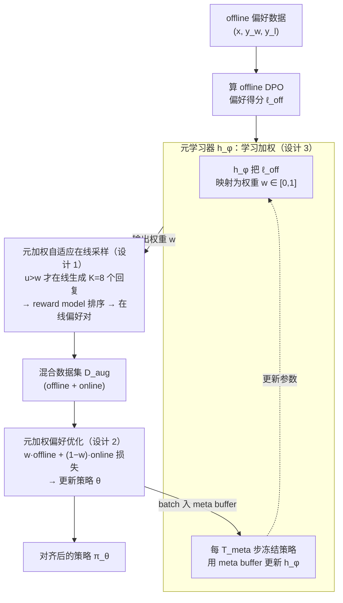

# Alignment through Meta-Weighted Online Sampling: Bridging the Gap between Data Generation and Preference Optimization

**会议**: ICLR 2026  
**arXiv**: [2509.23371](https://arxiv.org/abs/2509.23371)  
**代码**: [https://github.com/junming-yang/MetaAPO](https://github.com/junming-yang/MetaAPO)  
**领域**: LLM对齐 / 偏好优化  
**关键词**: 偏好优化, 在线采样, 元学习权重, 分布不匹配, DPO  

## 一句话总结
提出MetaAPO框架，用一个轻量级meta-learner（两层MLP）动态估计offline/online数据的对齐差距，既指导"在哪些prompt上做在线采样"（解决分布不匹配），又在训练时自适应加权offline/online数据（优化学习效率），在AlpacaEval 2/Arena-Hard/MT-Bench上超越DPO/Online DPO等基线，同时减少42%在线标注成本。

## 研究背景与动机

**领域现状**：DPO等离线偏好优化方法简单高效，但offline数据与模型动态演化策略之间的分布不匹配（OOD问题）限制了对齐效果；Online DPO等在线方法通过on-policy采样缓解不匹配，但忽略了高质量offline数据的价值。

**现有痛点**：(a) 离线方法受限于固定数据分布；(b) 在线方法成本高且多样性不足（依赖当前策略能力）；(c) 混合方法用启发式/静态阈值做数据选择，忽视了数据采样与优化过程的交互。

**核心矛盾**：offline数据高效多样但分布不对齐，online数据分布对齐但缺多样性和质量——需要根据模型当前状态动态平衡两者。

**本文目标**：设计一个将数据生成与偏好优化紧密耦合的自适应框架——让模型自己决定"哪些样本需要在线重新采样"以及"offline/online各占多少权重"。

**切入角度**：用元学习器将每个样本的DPO偏好得分映射为权重，低权重触发在线重采样，高权重保留offline数据——weight既控制采样又控制训练。

**核心 idea**：一个meta-learner同时担任"对齐差距估计器"和"样本权重指派器"，将在线采样和偏好优化紧密耦合。

## 方法详解

### 整体框架
MetaAPO 想解决的是同一个矛盾：offline 数据高效多样但分布不对齐，online 数据对齐却缺多样性，而以往混合方法靠固定阈值/比例硬拼，没把"采样"和"训练"两件事串起来。它的办法是放一个轻量级 meta-learner $h_\phi$（两层 MLP）做枢纽——同一个输出权重 $w$ 既决定某条 prompt 要不要在线重采样，又决定训练时 offline/online 损失各占多少。整个训练在一个 epoch 内把数据集切成 $T$ 个子集顺序迭代：每个子集上先由 meta-learner 评估每个 offline 样本与当前策略的对齐度，对齐差的就触发在线采样补数据；再在混合数据集上用 $w$ 加权的偏好损失更新策略；每隔若干步回头更新一次 meta-learner。三个模块交替推进，让数据生成和偏好优化在训练过程中彼此咬合。

### 关键设计

**1. 元加权自适应在线采样：只在模型"跟不上"的 prompt 上补在线数据**

全在线方法的痛点是对所有 prompt 一律重采样，成本高又冗余。这里换成按需触发：对每个 offline 样本 $(x, y_w^{\text{off}}, y_l^{\text{off}})$ 先算出它的 DPO 偏好得分 $\ell^{\text{off}}$，meta-learner 把这个标量映射成权重 $w = h_\phi(\ell^{\text{off}}) \in [0,1]$，$w$ 越低代表 offline 数据与当前策略越不对齐。采样 $u \sim U(0,1)$，当 $u > w$ 时才让当前策略对该 prompt 生成 $K=8$ 个 response，再用 reward model 排序构造在线偏好对。这样对齐好的样本直接复用 offline 数据，只有真正需要的 prompt 才花钱做在线标注，实验上把在线标注量减少了 42%。

**2. 元加权偏好优化：用同一个权重 $w$ 动态平衡 offline/online 损失**

光决定采不采样还不够，混合数据怎么用同样关键。MetaAPO 复用上一步那个 $w$ 直接当训练时的混合系数，损失写成

$$\mathcal{L}(\theta) = -\mathbb{E}\big[\,w \cdot \ell_\theta(\text{offline}) + (1-w) \cdot \ell_\theta(\text{online})\,\big],\quad w = h_\phi(\ell^{\text{off}}).$$

对齐好的样本 $w$ 高，训练更倚重可靠的 offline 人工标注；对齐差的样本 $w$ 低，更多让 online 数据来校正。关键在于这是 sample-wise 的自适应——不同样本、不同训练阶段最优的 offline/online 比例本就不同，用学出来的 $w$ 逐样本调，比固定比例或固定阈值灵活得多。同一个权重串起采样和加权两件事，也避免了两阶段 pipeline 的脱节。

**3. 元学习器的交替更新与理论保证：让权重自己学会"谁更好就靠谁"**

meta-learner 不是一开始就准的，需要随策略演化一起更新。具体做法是每 $T_{\text{meta}}=8$ 步冻结策略模型 $\pi_\theta$，用累积的 meta buffer $\mathcal{B}_{\text{meta}}$ 训练 $h_\phi$。这套更新的妙处在它的梯度方向天然合理：梯度分析（Eq.7）表明更新量正比于 $(\ell^{\text{on}} - \ell^{\text{off}}) \cdot \nabla_\phi h_\phi$，于是当 online 得分更高（$\ell^{\text{on}} > \ell^{\text{off}}$）时 meta-learner 自动调低 offline 权重，反之调高——"谁更好就靠谁"无需人工写规则。理论上还有支撑：Theorem 1 给出泛化界，meta-learner 的真实风险与 oracle 风险之差不超过 $4\text{Rad}_m(\mathcal{L}_{\text{meta}} \circ \mathcal{H}) + M\sqrt{2\ln(1/\delta)/m}$，即 meta-buffer 足够大、假设空间足够简单时学到的权重就逼近最优。这也正是为什么用一个简单的两层 MLP 就够——复杂网络反而更容易过拟合、偏离这个界。

## 实验关键数据

### 主实验（Llama-3.1-8B）

| 方法 | AlpacaEval 2 LC(%) | Arena-Hard SC(%) | MT-Bench |
|------|-------------------|-----------------|----------|
| SFT | 17.28 | 21.6 | 6.63 |
| DPO | ~21 | ~24 | ~7.1 |
| Online DPO | ~25 | ~28 | ~7.3 |
| Selective DPO | ~22 | ~25 | ~7.1 |
| SELM (Hybrid) | ~24 | ~27 | ~7.2 |
| **MetaAPO (DPO)** | **最佳** | **最佳** | **最佳** |

MetaAPO在所有三个benchmark上一致超越offline、online和hybrid基线。在线标注成本比Online DPO减少42%。

### 消融实验
- 去掉adaptive sampling → online比例失控，性能下降
- 去掉meta-weight训练 → 退化为固定权重混合
- 去掉meta-learner更新 → 权重无法适应模型演化
- MetaAPO兼容多种偏好目标（DPO、SimPO、KTO）

### 关键发现
- meta-learner在训练早期倾向于低权重（多做online采样），后期逐渐提高权重（模型已对齐，更依赖可靠offline数据）——符合直觉的自适应行为
- 两层MLP作为meta-learner足够有效，更复杂的网络过拟合反而更差——与理论分析一致
- Qwen2.5-7B上同样有效，说明方法跨模型可迁移

## 亮点与洞察
- **一个meta-learner双重作用**的设计极其elegant：同一个权重w既控制"是否采样"又控制"如何加权训练"——将采样和优化无缝耦合，避免了两阶段pipeline的脱节
- **梯度分析**（Eq.7）提供了清晰的直觉：$(\ell^{on} - \ell^{off}) \cdot \nabla_\phi h_\phi$ 自动判断offline/online谁更好并调整——比人工设计阈值优雅得多
- **42%标注成本节省**——在性能提升的同时还减少了成本，这是工程上非常有吸引力的结果
- 理论泛化界（Theorem 1）为"简单meta-learner+充足buffer"的设计提供了理论支撑

## 局限与展望
- meta-learner输入仅为标量DPO偏好得分，信息量有限——加入更丰富的特征（如prompt难度、response长度/多样性）可能进一步提升
- 在线采样仍需reward model标注，reward model本身的质量/bias未被讨论
- 单epoch训练，更长训练可能暴露meta-learner漂移问题
- 仅在UltraFeedback数据集+两个7-8B模型上验证，更大模型和更多数据集的验证不足
- meta-learner的更新频率 $T_{\text{meta}}=8$ 的选择依据不充分

## 相关工作与启发
- **vs DPO/SimPO（offline）**: offline方法无法适应模型演化，MetaAPO在offline需要时自动切换到online补全
- **vs Online DPO/SPPO（online）**: 全online方法在所有prompt上都采样，MetaAPO只在需要的prompt上采样，效率高42%
- **vs SELM/ADPO（hybrid）**: 混合方法用固定启发式，MetaAPO的meta-learner是可学习的、动态的
- **vs Selective DPO**: 基于loss的静态过滤不考虑模型状态变化，MetaAPO的权重随训练动态调整

## 评分
- 新颖性: ⭐⭐⭐⭐ meta-learner耦合采样和训练的idea很巧妙，但元学习做数据加权不算全新
- 实验充分度: ⭐⭐⭐⭐ 三个主流benchmark+多基线+消融+成本分析很全面
- 写作质量: ⭐⭐⭐⭐⭐ 梯度分析提供直觉，Algorithm 1清晰，理论和实验相辅相成
- 价值: ⭐⭐⭐⭐ 在偏好对齐中平衡offline/online数据是实际部署中的核心问题，方法实用

<!-- RELATED:START -->

## 相关论文

- [\[AAAI 2026\] MetaGDPO: Alleviating Catastrophic Forgetting with Metacognitive Knowledge through Group Direct Preference Optimization](../../AAAI2026/model_compression/metagdpo_alleviating_catastrophic_forgetting_with_metacognitive_knowledge_throug.md)
- [\[ACL 2026\] Alignment Tuning for Large Language Models: A Data-Centric Lens on Alignment Data Pipelines](../../ACL2026/model_compression/alignment_tuning_for_large_language_models_a_data-centric_lens_on_alignment_data.md)
- [\[ICML 2025\] ConfPO: Exploiting Policy Model Confidence for Critical Token Selection in Preference Optimization](../../ICML2025/model_compression/confpo_exploiting_policy_model_confidence_for_critical_token_selection_in_prefer.md)
- [\[CVPR 2026\] Bridging Domains through Subspace-Aware Model Merging](../../CVPR2026/model_compression/bridging_domains_through_subspace-aware_model_merging.md)
- [\[ICLR 2026\] ConFu: Contemplate the Future for Better Speculative Sampling](confu_contemplate_the_future_for_better_speculative_sampling.md)

<!-- RELATED:END -->
