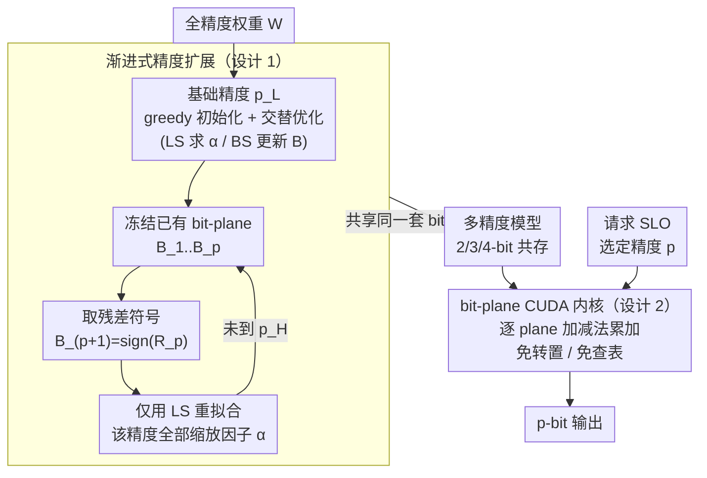

# AnyBCQ: Hardware Efficient Flexible Binary-Coded Quantization for Multi-Precision LLMs

**会议**: ICLR 2026  
**arXiv**: [2510.10467](https://arxiv.org/abs/2510.10467)  
**代码**: [https://github.com/naver-aics/anybcq](https://github.com/naver-aics/anybcq)  
**领域**: 模型压缩 / LLM量化  
**关键词**: 二进制编码量化, 多精度推理, bit-plane操作, LLM部署, CUDA内核  

## 一句话总结
提出AnyBCQ，基于二进制编码量化(BCQ)的多精度LLM量化框架，通过渐进式精度扩展（冻结已有bit-plane+添加残差bit-plane）支持单个模型在2-4bit之间动态切换，专设CUDA内核直接在bit-plane级别计算避免查表/转置开销，在2-bit下准确率大幅超越Any-Precision LLM（MMLU 35.3% vs 24.7%），吞吐量最高达到FP16的3.0x。

## 研究背景与动机

**领域现状**：多精度LLM模型允许单一模型在运行时根据SLO动态选择精度。Any-Precision LLM是当前SOTA，但依赖非均匀量化（clustering-based），需要查表和bit-transpose操作。

**现有痛点**：(a) 非均匀量化无法直接在bit-plane上计算，需要额外的转置+查表开销；(b) 现有多精度方法在极低bit（如2-bit）时准确率崩溃，实际可用范围局限于3-4bit；(c) 存储多个独立精度模型的内存开销大（LLaMA-3.1-8B需9.85GB vs AnyBCQ的4.99GB）。

**核心矛盾**：非均匀量化表达力强但不适合硬件加速（需查表），BCQ天然适合硬件但固定精度。

**本文目标**：将BCQ扩展到多精度设置，保持硬件友好性的同时支持动态精度切换。

**切入角度**：BCQ将权重表示为二进制bit-plane的线性组合 $\hat{W} = \sum_i \alpha_i B_i$，p-bit推理恰好对应p个bit-plane计算——天然支持多精度。

**核心 idea**：冻结低精度bit-plane→从残差添加新bit-plane→仅优化缩放因子，实现渐进式精度扩展。

## 方法详解

### 整体框架
AnyBCQ的出发点是把二进制编码量化（binary-coded quantization, BCQ）从固定精度推广到多精度：BCQ把权重写成若干二进制 bit-plane 的线性组合 $\hat{W} = \sum_i \alpha_i B_i$（$B_i \in \{-1,+1\}$），用 $p$ 个 bit-plane 计算恰好对应 $p$-bit 推理，这意味着「精度」天然由参与计算的 bit-plane 数量决定。整套方法分两段：离线先做一次「可增长」的量化，从基础精度 $p_L$ 出发逐级扩展到目标精度 $p_H$，每升一级都冻结已有的 binary codes、只重新拟合缩放因子，于是各精度共享同一套 bit-plane；在线则交给一个直接在 bit-plane 上做加减法的 CUDA 内核，按当前请求需要的精度加载对应数量的 plane，免去查表和转置，从而做到「一个模型、运行时按服务级目标（SLO）选精度」。

### 关键设计

**1. 渐进式精度扩展：让低精度和高精度共享同一套 bit-plane**

多精度量化最直接的痛点是「每个精度各存一份模型」太占内存。AnyBCQ 的做法是把高精度看成低精度的残差补充。基础精度 $p_L$ 先用 greedy 初始化得到 BCQ，再做 alternating refinement 交替优化——固定 $B$ 用最小二乘（LS）求缩放因子 $\alpha$，固定 $\alpha$ 用二分搜索（BS）更新 $B$。要从 $p$-bit 扩到 $(p{+}1)$-bit 时，已有的 $B_1,\dots,B_p$ 全部冻结不动，新增的 bit-plane 直接取当前残差的符号 $B_{p+1} = \text{sign}(R_p)$，然后只用 LS 重新优化这一精度下的全部缩放因子 $\{\alpha_i^{p+1}\}_{i=1}^{p+1}$。

这样做有两个直接收益。一是存储：BCQ 的开销主要在 binary codes 上，缩放因子很小，各精度共享 binary 后 LLaMA-3.1-8B 的多精度模型从 9.85GB 降到 4.99GB（-49%），相当于只比单份模型大一点就装下了 2/3/4-bit 全部精度。二是精度单调：因为高精度是在低精度基础上「叠加残差 plane」，加 plane 只会让量化误差进一步减小，保证精度随 bit 数单调递增，不会出现升精度反而变差的反常情况。

**2. 直接在 bit-plane 上运算的 CUDA 内核：把精度差异变成访存和计算量的差异**

BCQ 适合多精度只是表达层面的优势，真正落到吞吐还要看推理内核。非均匀量化（Any-Precision LLM 那类 clustering 方案）在前向时必须先做 bit-transpose（约 $O(MKp)$）把权重排成可查表的布局，再做 centroid lookup（约 $O(MK)$）查出实际数值，这两步都是纯开销。AnyBCQ 的内核则逐个加载 bit-plane：由于 $B_i \in \{-1,+1\}$，与激活的 GEMM 退化成加减法，配合 LUT-GEMM 缓存常见部分和，每个 plane 算完乘上对应的 $\alpha_i$ 累加进 partial sum，凑齐 $p$ 个 plane 即得到 $p$-bit 输出。

省掉 transpose 和 lookup 之外，这种「逐 plane 累加」还让低精度天然更省。访存量正比于实际加载的 plane 数——跑 3-bit 时只读 3 个 plane，而不是像定点方案那样读满 4-bit 再丢掉 1 bit，所以内存带宽按精度线性下降，这也是低精度档位能拿到更高加速的原因。

### 训练策略
- 用 512 条 C4 序列做校准数据，以最小化相对误差（MRE）为目标优化 10 个 epoch
- 采用非对称 BCQ + group-wise 量化（group size $g=128$）
- 基础精度初始化阶段做 20 轮 alternating refinement

## 实验关键数据

### 主实验（LLaMA-3.1-8B）

| 方法 | 2-bit MMLU | 3-bit MMLU | 4-bit MMLU |
|------|-----------|-----------|------------|
| AWQ | 24.12 | 47.28 | 60.49 |
| Any-Precision LLM | 24.66 | 55.53 | **64.04** |
| ShiftAddLLM | 24.83 | 56.53 | 63.50 |
| **AnyBCQ (Multi)** | **35.32** | 58.28 | 63.53 |
| FP16 | 65.02 | - | - |

AnyBCQ在2-bit下MMLU超越对手10+个百分点。4-bit下与Any-Precision LLM接近。

### 吞吐量
- 相比FP16: 最高3.0x加速
- 相比Any-Precision LLM: 最高1.2x加速
- 动态精度切换开销可忽略

### 关键发现
- 2-bit是区分度最大的区间——AnyBCQ的BCQ方案远优于非均匀量化
- Multi-prec vs Fixed-prec差距在3-4bit时出现——共享binary constraint压缩了优化空间
- 4-bit时各方法差距收敛——量化误差已经很小

## 亮点与洞察
- **BCQ天然适合多精度**的洞察是本文核心——p-bit计算=p个bit-plane加法，这使得BCQ在多精度场景下成为唯一不需要查表的方案
- **内存节省49%**（vs多模型方案）同时保持准确率，实用性极强
- 在2-bit这个传统"死区"（MMLU 24%→35%）取得了显著进步

## 局限与展望
- 4-bit时准确率略低于Any-Precision LLM——BCQ的表达力限制在高精度时显现
- 仅在LLaMA-3.1-8B上验证，更大模型待测试
- 渐进扩展中binary codes一旦冻结无法修正——早期的错误会传播到高精度
- 仅考虑weight-only量化，activation量化未涉及

## 相关工作与启发
- **vs Any-Precision LLM**: 非均匀量化表达力更强但不适合硬件；BCQ牺牲少量高精度准确率换取巨大的硬件效率优势和低bit性能
- **vs ShiftAddLLM**: 同为BCQ方法但ShiftAddLLM只支持固定精度，AnyBCQ扩展到多精度
- **vs GPTQ/AWQ**: 均匀量化在2-bit下完全崩溃，BCQ的二进制bit-plane结构更鲁棒

## 评分
- 新颖性: ⭐⭐⭐⭐ BCQ→多精度的扩展思路自然但有效，CUDA内核设计有工程创新
- 实验充分度: ⭐⭐⭐⭐ 多基准+吞吐量+消融完整，但仅一个模型
- 写作质量: ⭐⭐⭐⭐ Figure 1-3的对比图非常直观
- 价值: ⭐⭐⭐⭐⭐ 填补了BCQ在多精度LLM部署中的空白，实用性强

<!-- RELATED:START -->

## 相关论文

- [\[ICLR 2026\] Highly Efficient and Effective LLMs with Multi-Boolean Architectures](highly_efficient_and_effective_llms_with_multi-boolean_architectures.md)
- [\[ICML 2026\] GEMQ: Global Expert-Level Mixed-Precision Quantization for MoE LLMs](../../ICML2026/model_compression/gemq_global_expert-level_mixed-precision_quantization_for_moe_llms.md)
- [\[AAAI 2026\] DynaQuant: Dynamic Mixed-Precision Quantization for Learned Image Compression](../../AAAI2026/model_compression/dynaquant_dynamic_mixed-precision_quantization_for_learned_i.md)
- [\[ICLR 2026\] ParoQuant: Pairwise Rotation Quantization for Efficient Reasoning LLM Inference](paroquant_pairwise_rotation_quantization_for_efficient_reasoning_llm_inference.md)
- [\[AAAI 2026\] QuEPT: Quantized Elastic Precision Transformers with One-Shot Calibration for Multi-Bit Switching](../../AAAI2026/model_compression/quept_quantized_elastic_precision_transformers_with_one-shot_calibration_for_mul.md)

<!-- RELATED:END -->
