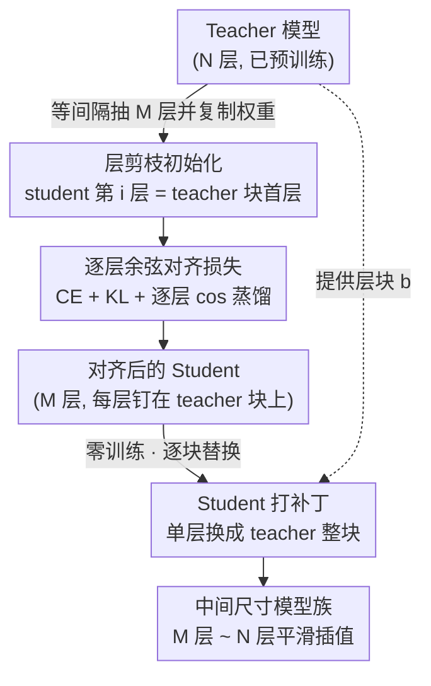

# Boomerang Distillation Enables Zero-Shot Model Size Interpolation

**会议**: ICLR2026  
**arXiv**: [2510.05064](https://arxiv.org/abs/2510.05064)  
**代码**: [https://github.com/dcml-lab/boomerang-distillation](https://github.com/dcml-lab/boomerang-distillation)  
**领域**: 模型压缩  
**关键词**: 知识蒸馏, 模型压缩, 零样本插值, 层剪枝, 模型家族  

## 一句话总结
提出"回旋蒸馏"范式——只训练一个小 student 模型，通过将 teacher 的 transformer 层块逐步贴回 student，零训练代价地构建出一整族中间尺寸模型，性能在 student 与 teacher 之间平滑插值，匹配甚至超越逐个蒸馏的同等规模模型。

## 研究背景与动机

**领域现状**：LLM 部署场景跨度极大——从手机端到大规模集群，模型开发者通常会发布不同参数规模的模型家族（Qwen3-0.6B/1.7B/4B/8B/32B，Llama 3.2-1B/3B/8B 等），但每个尺寸都需要独立从头预训练或独立蒸馏，训练成本随家族成员数线性增长。

**现有痛点**：知识蒸馏虽然比从零预训练高效，但每个 student 仍然需要一次完整的训练流程（从层剪枝初始化 → 蒸馏 → 对齐），无法无训练地扩展到细粒度尺寸选项。现有层剪枝方法（ShortGPT、LaCo）只利用了 teacher 信息，删掉少量层后分类性能断崖式下降，生成能力更是迅速崩溃至接近零。

**核心矛盾**：实际部署需要在"尺寸–性能"空间中做细粒度权衡，但训练成本限制了模型家族只能提供寥寥几个粗粒度选项。

**切入角度**：作者观察到，如果 student 模型通过层剪枝从 teacher 初始化（而非随机初始化），蒸馏后 student 的每一层与 teacher 对应层块之间保持了高度的表征对齐。这意味着 teacher 的层块可以无训练地"贴回"student，替换对应的单层，由此增大模型而不破坏功能——就像回旋镖飞出去（层删除）又飞回来（层贴回）。

**核心 idea**：一次蒸馏 + 逐步贴回 teacher 层块 = 零训练代价的细粒度模型家族。

## 方法详解

### 整体框架
回旋蒸馏把"层剪枝—蒸馏—贴回"串成一条流水线：先从 teacher 的 $N$ 层里等间隔抽出 $M$ 层（连同嵌入层与 LM head）拷贝成一个小 student，再在文本语料上用 CE + KL + 逐层余弦三个损失把 student 蒸馏到与 teacher 的输出分布和逐层表征都对齐，最后完全不再训练，直接把 teacher 的连续层块逐个"贴回"student 的对应位置，就能零成本地拼出从 $M$ 层到 $N$ 层之间的任意中间尺寸模型。

### 关键设计

**1. 层剪枝初始化：让 student 每一层天然成为 teacher 层块的代理**

把 teacher 的 $N$ 个 transformer 层切成 $M$ 个连续块 $\mathcal{B} = (\mathbf{b}^{(1)}, \dots, \mathbf{b}^{(M)})$，第 $i$ 块覆盖层 $(\theta_T^{(\ell_i)}, \dots, \theta_T^{(\ell_{i+1}-1)})$；student 的第 $i$ 层不做随机初始化，而是直接复制对应块的首层 $\theta_S^{(i)} = \theta_T^{(\ell_i)}$，嵌入层和 LM head 也照搬。这样初始化换来的是结构兼容——student 每层从一开始就站在 teacher 对应层块的位置上，后续才有可能把整块层贴回去而不破坏功能。作者用消融证明这是回旋现象成立的必要条件：随机初始化的 student 即便经过完全相同的蒸馏训练，贴回 teacher 层后也几乎拿不到任何性能增益。

**2. 逐层余弦对齐损失：把每层输出钉在 teacher 层块上，稳住极端尺寸**

总损失为 $\mathcal{L} = \mathcal{L}_{CE} + \lambda_{KL} \mathcal{L}_{KL} + \lambda_{cos} \sum_{i=1}^{M} \mathcal{L}_{cos}^{(i)}$，其中 $\mathcal{L}_{KL}$ 用温度 $\tau$ 缩放 logits 后计算 KL 散度以学习 teacher 的输出分布，$\mathcal{L}_{cos}^{(i)}$ 则把 student 第 $i$ 层的隐藏状态与 teacher 块 $\mathbf{b}^{(i)}$ 最后一层的隐藏状态做余弦距离对齐（$\lambda_{KL}$、$\lambda_{cos}$ 为超参数）。只有当 student 某一层的输出与 teacher 对应层块的输出足够接近，贴回时才能无缝替换。有意思的是这个损失并不主要拉高平均性能：即使只留 CE 损失，回旋蒸馏照样出现（因为 teacher 初始化已经给了基础对齐），但缺了它，首层、尾层这些对应最极端尺寸的插值模型性能会明显波动——余弦对齐真正的作用是把这些边缘层稳住。

**3. Student 打补丁：一步层替换换来整族中间尺寸**

蒸馏结束后这一步不需要任何训练，操作简单到只是把 student 的单层 $\theta_S^{(i)}$ 换成 teacher 的整块 $\mathbf{b}^{(i)}$，模型层数随之从 $M$ 涨到 $M + |\mathbf{b}^{(i)}| - 1$；对不同位置逐步执行，就能在 $M$ 层（纯 student）到 $N$ 层（完全恢复 teacher）之间拼出任意中间尺寸的模型。拼接时嵌入层取自贡献第一层的那个模型、LM head 取自贡献最后一层的模型。顺序上从最后一层往前贴回效果最好，但 Llama 是例外：它前两层之间余弦相似度极低、属于特殊层，需要保留在 student 中并改成从前往后打补丁。

### 损失函数 / 训练策略
主 teacher 为 Qwen3-4B-Base（36 层），隔层抽取得到 18 层、2.7B 参数的 student；蒸馏数据用去重后的 The Pile，只训练 2.1B tokens。跨模型验证另取 Qwen3-8B-Base、Pythia-6.9B、Llama-3.2-3B 作为 teacher。

## 实验关键数据

### 主实验：回旋蒸馏 vs 基线 & 标准蒸馏

| 方法 | 参数量 | 分类准确率 | 生成准确率 | 额外训练 |
|------|--------|-----------|-----------|---------|
| Qwen3-4B (Teacher) | 4.0B | 基准线 (最高) | 基准线 (最高) | - |
| 回旋蒸馏 (Student) | 2.7B | 接近 Teacher | 接近 Teacher | 1次蒸馏 |
| 回旋蒸馏插值模型 | 2.7B–4.0B | 平滑插值 ✅ | 平滑插值 ✅ | 0 (零样本) |
| 标准蒸馏（逐个训练） | 2.7B–4.0B | 小尺寸≈回旋，大尺寸劣于回旋 | 类似趋势 | 每个尺寸1次蒸馏 |
| 朴素层剪枝 | <4.0B | <4B 剧烈下降 ❌ | 快速崩溃至~0 ❌ | 0 |
| 随机初始化蒸馏+贴回 | 2.7B–4.0B | 几乎无增益 ❌ | 几乎无增益 ❌ | 1次蒸馏 |
| Pythia-2.8B (预训练) | 2.8B | 可比 | 可比 | 完整预训练 |
| Llama-3.2-3B (预训练) | 3.0B | 可比 | 可比 | 完整预训练 |

关键发现：大尺寸插值模型反而**优于**独立蒸馏模型。原因是蒸馏语料（The Pile）质量低于 Qwen3 的原始预训练数据，独立蒸馏在此低质语料上训练更多层数会产生灾难性遗忘，而回旋蒸馏通过贴回 teacher 原始权重保留了原始知识。Pythia 作为 teacher 时此效应消失（因为 Pythia 本身就是在 The Pile 上训练的）。

### 消融实验：损失函数组合

| 损失组合 | Perplexity (WikiText) | 分类准确率 | 边缘层稳定性 |
|---------|----------------------|-----------|-------------|
| CE only | 较高 | 基本可用，仍有回旋蒸馏 | 首尾层波动大 ❌ |
| CE + KL | 略低 | 略优于 CE only | 仍有波动 |
| CE + 逐层 cos | 更低 | 改善不大 | 明显更稳定 ✅ |
| **CE + KL + 逐层 cos（完整）** | **最低** | 最优 | **最稳定 ✅** |

关键发现：(1) 即使只用 CE 损失，回旋蒸馏也能出现——说明 teacher 权重初始化本身就是回旋蒸馏的核心必要条件；(2) 逐层 cos 损失的主要贡献不在于"提升均值性能"而在于"稳定边缘层"——首层和尾层对应的插值模型是最极端的尺寸选项，对齐不足时它们最容易出问题；(3) 完整损失在 PPL 上有显著优势。

### 与层剪枝方法对比
回旋蒸馏在**所有中间尺寸**上显著优于 ShortGPT 和 LaCo 两种流行的层剪枝方法。核心差异在生成任务上尤为明显：ShortGPT/LaCo 删除几层后生成准确率即崩溃至接近零（ShortGPT 论文自己也承认会出现误差累积），而回旋蒸馏创建的小模型仍保持较高的生成水平，分类性能也平滑过渡而非断崖式下降。

### 跨模型家族与开源模型验证
- Qwen3-8B、Pythia-6.9B、Llama-3.2-3B 作为 teacher 均观察到回旋蒸馏现象，说明这是 LLM 蒸馏中的**通用现象**
- 已有的 DistilBERT ↔ BERT、DistilGPT2 ↔ GPT2 也存在此现象——不需要任何额外训练，直接将 BERT 的层贴回 DistilBERT 就能得到平滑插值的中间模型。这是首次发现这些经典模型之间存在零样本尺寸插值能力
- Llama 的特殊性：前两层之间余弦相似度很低，需要保留前两层并反向打补丁

### 额外消融
- 更激进的层剪枝（更小的 student）：只要 student 在目标任务上有非平凡性能，回旋蒸馏就能工作
- 训练 token 量：增加训练 budget 可以改善插值模型性能，但即使 2.1B tokens 就已足够产生平滑插值

## 亮点与洞察
- **"一次训练、无限尺寸"的极简范式**：整个方法不需要路由器、不需要弹性架构、不需要多次训练，只需要标准蒸馏管线 + 一步简单的层替换操作，实用性极高
- **回旋蒸馏揭示了蒸馏过程中一个被忽视的"副产品"**：层剪枝初始化 + 蒸馏训练不仅让 student 学到好的输出分布，更隐式地维护了 student 每一层与 teacher 对应层块之间的表征兼容性。这种兼容性以前没有被利用过
- **灾难性遗忘的"逆向利用"**：在低质量蒸馏语料上，独立蒸馏越多层越容易遗忘原始知识，而回旋蒸馏通过贴回 teacher 原始权重天然免疫此问题，大尺寸反而更强。这提供了一个在缺少原始预训练数据时构建模型家族的实用路线

## 局限与展望
- **仅支持同架构、同隐状态维度的 teacher-student 对**：如果 student 使用了神经元剪枝（如 Minitron），隐状态维度不匹配，就无法贴回 teacher 层。这限制了与部分工业蒸馏管线（如 Minitron + 层+神经元混合剪枝）的兼容性
- **需要同时存储 teacher 和 student 权重**：打补丁阶段需要访问 teacher 的层权重。虽然推理时只需要最终的插值模型，但存储开销仍高于完全独立的小模型
- **蒸馏语料质量对 student 有影响**：在 Pythia 实验中，使用 teacher 原始预训练数据（The Pile）蒸馏时，独立蒸馏的中间模型反而优于回旋插值模型。说明回旋蒸馏的优势部分来自于"规避低质量语料对大模型的污染"，如果有高质量数据则优势减弱
- **打补丁顺序敏感**：Llama 需要特殊处理（保留前两层、反向打补丁），不同模型家族可能需要不同的打补丁策略

## 相关工作与启发
- **vs 弹性 Transformer (Cai et al., 2025)**：弹性方法需要在 teacher 中训练 Gumbel Softmax 路由器来做尺寸插值，训练复杂且需要修改 teacher 架构。回旋蒸馏只用标准蒸馏管线，不修改任何架构，方法更简洁通用
- **vs ShortGPT / LaCo 层剪枝**：层剪枝只做单向压缩（删层），回旋蒸馏做双向操作（先删再贴回）。剪枝方法的核心问题是误差在层间累积导致生成崩溃，回旋蒸馏通过蒸馏训练消除了这种累积
- **vs Minitron (Muralidharan et al., 2024)**：Minitron 同时做层剪枝和神经元剪枝，效率更高但每个尺寸仍需独立蒸馏，且因为维度不匹配无法做回旋操作。两种方法的优势互补——未来可以探索"只做层剪枝不做神经元剪枝"的 Minitron 变体来兼容回旋蒸馏

## 评分
- 新颖性: ⭐⭐⭐⭐⭐ 首次发现并系统化"蒸馏后零样本尺寸插值"这一现象，概念上有独创贡献
- 实验充分度: ⭐⭐⭐⭐⭐ 跨四个模型家族验证、含开源已有模型（DistilBERT/DistilGPT2）、完整消融、与两种剪枝基线对比
- 写作质量: ⭐⭐⭐⭐ 结构清晰、图表丰富，但部分附录内容可合并入主文
- 价值: ⭐⭐⭐⭐ 为 LLM 部署提供了一条极低成本的模型家族构建路线，但受限于同架构同维度约束

<!-- RELATED:START -->

## 相关论文

- [\[ICLR 2026\] Distilling and Adapting: A Topology-Aware Framework for Zero-Shot Interaction Prediction in Multiplex Biological Networks](distilling_and_adapting_a_topology-aware_framework_for_zero-shot_interaction_pre.md)
- [\[NeurIPS 2025\] Enhancing Semi-supervised Learning with Zero-shot Pseudolabels](../../NeurIPS2025/model_compression/enhancing_semi-supervised_learning_with_zero-shot_pseudolabels.md)
- [\[ECCV 2024\] Improving Zero-Shot Generalization for CLIP with Variational Adapter](../../ECCV2024/model_compression/improving_zero-shot_generalization_for_clip_with_variational_adapter.md)
- [\[ICML 2026\] Float8@2bits: Entropy Coding Enables Data-Free Model Compression](../../ICML2026/model_compression/float82bits_entropy_coding_enables_data-free_model_compression.md)
- [\[ICLR 2026\] Topology and Geometry of the Learning Space of ReLU Networks: Connectivity and Size](topology_and_geometry_of_the_learning_space_of_relu_networks_connectivity_and_si.md)

<!-- RELATED:END -->
