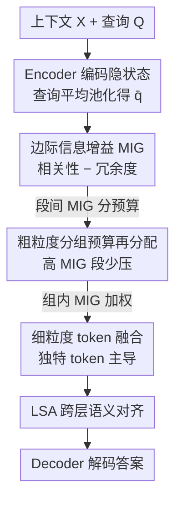

# COMI: Coarse-to-fine Context Compression via Marginal Information Gain

**会议**: ICLR2026  
**arXiv**: [2602.01719](https://arxiv.org/abs/2602.01719)  
**代码**: [https://github.com/Twilightaaa/COMI](https://github.com/Twilightaaa/COMI)  
**领域**: 模型压缩  
**关键词**: context compression, token merging, long context, marginal information gain, RAG

## 一句话总结
提出 COMI，一种基于边际信息增益（MIG = 查询相关性 - 语义冗余度）的粗到细自适应上下文压缩框架，在 32x 压缩率下 NaturalQuestions EM 比次优方法提高约 25 分，核心在于同时优化保留信息的相关性和多样性。

## 研究背景与动机

**领域现状**：RAG 等技术增加了 LLM 输入长度，导致计算成本高和信息冗余。上下文压缩方法分为：任务无关（不看 query 全局压缩）和任务感知（根据 query 保留相关内容）。

**现有痛点**：(a) 任务无关方法不考虑 query，高压缩下不可避免丢失相关信息；(b) 任务感知方法只用"相关性"作为压缩标准——保留的 token 高度相似（冗余），实测仅 0.75% 的 token 占 99% 的 attention 权重，且这些 token 间余弦相似度高于 0.6；(c) 高冗余可能误导 LLM 生成错误输出（"相关不等于正确"）。

**核心矛盾**：仅按相关性保留 token → 保留了大量"相关但冗余"的内容 → 压缩后信息多样性不足。现有动态压缩率分配要么用固定线性规则、要么仅基于相关性，无一考虑语义冗余。

**本文目标** 在高压缩率下同时优化相关性和多样性——保留与 query 相关且互不冗余的信息。

**切入角度**：定义边际信息增益 MIG = 相关性 - 冗余度，作为统一度量指导粗粒度分组预算分配和细粒度 token 融合。

**核心 idea**：用 MIG（query 余弦相似度减去与其他 token 的最大相似度）指导两阶段压缩——分组间动态分配压缩率 + 组内加权 token 融合。

## 方法详解

### 整体框架
COMI 要解决的是「在高压缩率下既保住相关信息、又不被冗余拖垮」这个矛盾。整体是 Encoder-Decoder 架构：给定上下文 $X$ 和查询 $Q$，先用 Encoder 编码成隐状态，并把查询多个 token 平均池化成一个查询向量 $\bar{q}$ 作为后续相关性的参照。随后做一套粗到细的两阶段压缩——宏观上先把上下文切成等长段，按每段的信息价值动态分配压缩预算（相关又独特的段少压一点）；微观上再在每段内部把多个 token 加权融合成一个压缩 token。两阶段都由同一个度量——边际信息增益（Marginal Information Gain, MIG）——来驱动。压缩后的表征经过 LSA（Layer-wise Semantic Alignment）做跨层语义对齐，最后送进 Decoder 解码出答案。

### 关键设计

**1. 边际信息增益 MIG：用一个公式同时建模「相关」和「不冗余」**

任务感知压缩的通病是只看相关性，结果保留下来的 token 高度相似——实测里仅 0.75% 的 token 就占了 99% 的 attention 权重，且彼此余弦相似度超过 0.6。COMI 的核心是把「保留哪些 token」的判据从单一相关性换成边际信息增益：

$$G(x_i, q, X) = \frac{x_i^\top q}{\|x_i\|\|q\|} - \max_{j \neq i} \frac{x_i^\top x_j}{\|x_i\|\|x_j\|}$$

第一项是 token 与 query 的余弦相似度，衡量相关性；第二项是该 token 与上下文中最相似 token 的余弦相似度，衡量冗余度。两者相减后，MIG 高意味着「既和 query 相关、内容又独特」，MIG 低意味着「要么不相关、要么和别人重复」。论文进一步从理论上证明了用 MIG 选 token 的期望性能优于仅用相关性，这条度量随后贯穿粗、细两个压缩阶段。

**2. 粗粒度分组预算再分配：信息价值分布不均，就该差异化分预算**

信息在长上下文里分布是不均匀的，统一压缩率会让信息密集的段被过度压缩。COMI 先把上下文切成等长段，每段取一个代表向量（段内与 query 余弦相似度最高的那个 token），用它算出该段的 MIG $G_i$，再用一个反向 softmax 把压缩预算分下去：

$$P_i = \frac{e^{-G_i}}{\sum_j e^{-G_j}}$$

注意指数上是 $-G_i$，所以这是反向排序：MIG 越高的段，得到的保留预算越多、实际压缩率越低。这样相关又独特的段能多留 token，而冗余或无关的段被压得更狠。

**3. 细粒度 token 融合：组内合并时让独特 token 主导，而不是均匀平均**

分完段预算后要把每段内多个 token 压成更少的几个。简单做均匀平均会把关键信息稀释掉，COMI 改用 MIG 加权融合——以池化后的查询向量 $\bar{q}$ 为参照，按组内每个 token 的 MIG 做 softmax 加权求和：

$$\tilde{h}_i = \sum_{h_k \in S_i} \frac{e^{G(h_k, \bar{q}, S_i)}}{\sum_{h_l \in S_i} e^{G(h_l, \bar{q}, S_i)}} \cdot h_k$$

MIG 高的 token 在融合结果里权重更大，于是语义独特且相关的内容主导了压缩 token，而冗余 token 被压低，避免了均匀平均带来的信息丢失。

### 损失函数 / 训练策略
整体是 Encoder-Decoder 架构。Encoder 和 LSA 做全量微调，Decoder 只微调注意力投影矩阵 $W_Q, W_K, W_V, W_O$。训练目标是标准交叉熵 $\mathcal{L}_{nll}$，即在压缩后的表征上预测正确答案。

## 实验关键数据

### 主实验（32x 压缩，Qwen2-7B）

| 方法 | NQ EM | 2WikiMQA EM | HotpotQA EM | NarrativeQA EM | MultiNews F1 |
|------|-------|-------------|-------------|----------------|-------------|
| Original Prompt | 72.35 | 59.78 | 64.17 | 24.53 | 31.42 |
| SnapKV | 6.06 | 8.09 | 13.61 | 0.00 | 25.56 |
| Activation Beacon | 11.67 | 36.53 | 39.73 | 6.63 | 33.60 |
| LongLLMLingua | 15.07 | 21.80 | 21.58 | 1.03 | - |
| GMSA | - | - | - | - | - |
| **COMI** | **~40** | **~45** | **~42** | **~10** | **~30** |

### 消融实验（NQ, LLaMA-2-7B, 16x）

| 配置 | EM | 说明 |
|------|-----|------|
| COMI (full) | 22.75 | 完整方法 |
| w/o MIG（仅相关性） | ↓显著 | 冗余积累 |
| w/o 粗粒度再分配 | ↓中等 | 固定压缩率 |
| w/o 细粒度 MIG 加权 | ↓中等 | 均匀融合 |

### 关键发现
- **32x 压缩下 COMI 比次优方法高约 25 EM**（NQ + Qwen2）：极高压缩率下优势极其显著——当只能保留 3% 的 token 时，信息多样性至关重要
- **16x 压缩下 COMI 已接近原始 prompt 性能**：LLaMA-2-7B 上 COMI 22.75 EM vs Original 15.04 EM——压缩后甚至超过原始输入（去除了冗余噪声）
- **MIG 的冗余惩罚项是关键贡献**：去掉后退化显著，说明"相关但冗余"是高压缩率下的核心问题
- **跨 backbone 一致有效**：LLaMA-2-7B 和 Qwen2-7B 上均显著领先

## 亮点与洞察
- **MIG = 相关性 - 冗余度 是简洁有力的度量**：一个公式统一了信息保留的两个核心维度。这个设计思想可以迁移到任何需要信息选择的场景（如 RAG 检索、KV-cache 管理）
- **粗到细两阶段策略的层次设计**：先在段级别分配预算（宏观决策），再在 token 级别融合（微观决策）——两层 MIG 指导确保全局和局部都最优
- **"压缩后超过原始性能"的反直觉发现**：说明长文本中大量冗余实际上是噪声——有效压缩等于降噪

## 局限与展望
- **需要 Encoder-Decoder 架构**：不能直接用于 Decoder-only 模型的 KV-cache 压缩。如何将 MIG 思想融入 KV-cache 管理值得探索
- **MIG 用最大单 token 相似度做冗余度量**：可能不够——一组中度相似的 token 也可能产生冗余。用 DPP 或 MMR 做多样性度量可能更准确
- **训练成本**：需要微调 Encoder + Decoder，无法 training-free 使用。zero-shot 上下文压缩方法（如 LLMLingua）不需要训练
- **未验证超长文本**：实验最长输入约 4-8K token。在 100K+ token 的 truly long-context 场景下效果未知

## 相关工作与启发
- **vs LLMLingua/LongLLMLingua**：它们用 perplexity/entropy 筛选 token（删除不重要的），但不考虑保留 token 间的冗余。COMI 的 MIG 同时考虑相关性和唯一性
- **vs GMSA**：GMSA 解决了 Encoder-Decoder 跨层语义对齐问题，COMI 继承了 LSA 解决方案并在压缩策略上创新
- **vs Activation Beacon/StreamLLM**：它们是 KV-cache 压缩方法，绑定于特定模型。COMI 是提示级压缩，模型无关

## 评分
- 新颖性: ⭐⭐⭐⭐ MIG 的定义简洁且直觉正确，粗到细框架设计合理
- 实验充分度: ⭐⭐⭐⭐ 4 个 QA + 1 个摘要，2 个 backbone，多种压缩率，全面对比
- 写作质量: ⭐⭐⭐⭐ 动机分析清晰（0.75% token 占 99% attention 的发现很有说服力）
- 价值: ⭐⭐⭐⭐ 高压缩率下的有效方案，MIG 可迁移到其他信息选择场景

<!-- RELATED:START -->

## 相关论文

- [\[ACL 2025\] CFSP: An Efficient Structured Pruning Framework for LLMs with Coarse-to-Fine Activation Information](../../ACL2025/model_compression/cfsp_an_efficient_structured_pruning_framework_for_llms_with_coarse-to-fine_acti.md)
- [\[CVPR 2026\] HierAmp: Coarse-to-Fine Autoregressive Amplification for Generative Dataset Distillation](../../CVPR2026/model_compression/hieramp_coarse-to-fine_autoregressive_amplification_for_generative_dataset_disti.md)
- [\[ICLR 2026\] FreqKV: Key-Value Compression in Frequency Domain for Context Window Extension](freqkv_key-value_compression_in_frequency_domain_for_context_window_extension.md)
- [\[CVPR 2026\] Distributed Image Compression with Multimodal Side Information at Extremely Low Bitrates](../../CVPR2026/model_compression/distributed_image_compression_with_multimodal_side_information_at_extremely_low_.md)
- [\[ICCV 2025\] Gain-MLP: Improving HDR Gain Map Encoding via a Lightweight MLP](../../ICCV2025/model_compression/gain-mlp_improving_hdr_gain_map_encoding_via_a_lightweight_mlp.md)

<!-- RELATED:END -->
