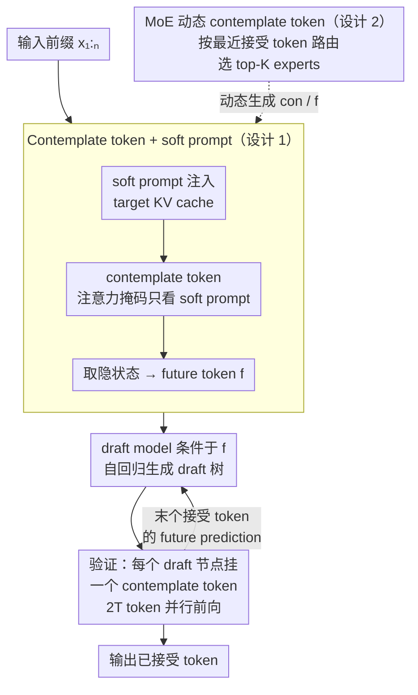

# ConFu: Contemplate the Future for Better Speculative Sampling

**会议**: ICLR 2026  
**arXiv**: [2603.08899](https://arxiv.org/abs/2603.08899)  
**代码**: 待确认  
**领域**: 模型压缩  
**关键词**: speculative decoding, contemplate tokens, future prediction, MoE, draft model, EAGLE

## 一句话总结

提出 ConFu，在推测解码的 draft model 中引入 contemplate tokens 让其预见 target model 的未来生成方向，结合 MoE 动态机制和锚点采样训练，在 EAGLE-3 基础上提升 8-11% 的接受率和生成速度。

## 研究背景与动机

**推测解码范式**：用轻量 draft model 提议候选 token 序列，由 target model 单次前向验证，通过批量接受加速推理。核心指标是 token 接受率和端到端加速比

**EAGLE 系列是当前 SOTA**：EAGLE-1/2/3 逐步改进 draft head 架构（单层 Transformer + target model 隐状态），设置了推测解码的最高基线

**核心问题——误差累积**：现有 draft model 仅基于当前前缀条件生成，随着 draft 步数增加，误差从上游 draft token 传播累积，draft 分布逐渐偏离 target 分布，接受率下降

**关键 insight**：如果 draft model 能获得 target model 当前的"思路方向"——即高层语义意图而非具体 token——就能生成更符合 target 轨迹的候选，减少验证拒绝

**Latent reasoning 启发**：COCONUT 等工作表明 LLM 可生成连续"思考 token"作为中间推理状态，但需多次前向传播代价高。Pause token (Goyal et al.) 可在并行计算中"免费"获得额外计算

## 方法详解

### 整体框架

ConFu 在标准推测解码的 draft–verify 循环里塞进一类额外的 contemplate token：每次 target model 前向验证 draft 候选时，顺带让它"分心"算出一份对未来生成方向的预判，并把这份预判作为 future token 喂给 draft model。这样 draft model 不再只盯着当前前缀盲猜，而是带着 target 的高层意图去提议候选，从源头缓解多步 draft 的误差累积。具体一轮迭代是：target model 在前缀后附 soft prompt 与 contemplate token，算出 future token $\mathbf{f}$；draft model 以 $\mathbf{f}$ 为额外条件自回归生成一棵 draft 树；target 把树里每个节点配一个 contemplate token 并行验证，既判接受又为每个候选产出未来预判；取最后一个被接受 token 对应的 future prediction 进入下一轮。整套机制建立在 EAGLE-3 之上，只动 draft 侧的条件输入而不改 target 主干，属于正交改进。

### 关键设计

**1. Contemplate token 与 soft prompt：让 target 几乎免费地"想一步"**

draft model 仅以已生成前缀为条件，越往后走分布越偏离 target，接受率随之滑坡。ConFu 借鉴 pause token 的机理在并行计算中挤出额外算力：在 target 输入前插入一组可学习的 soft prompt token（落在 KV cache 维度上），并在末尾追加一个 contemplate token，再用注意力掩码限制只有 contemplate token 能 attend 到这些 soft prompt，从而不污染原始前缀的表征。contemplate token 的隐状态由此编码出 target 当前的"中间思路"，被取出作为 future token $\mathbf{f}$ 交给 draft model。和 BiTA 直接从 contemplate token 解码 future token 不同，ConFu 是拿这份隐状态去**引导** draft 生成，而非直接当输出。推理时这一步嵌入验证阶段——在 draft tree 的每个节点都挂一个 contemplate token，让 target 一次前向就为每个候选并行产出对应的未来预测；某节点被接受后，就把它对应的 future prediction 传给下一轮迭代。代价是验证时要处理 $2T$ 个 token（$T$ 个 draft 节点加 $T$ 个 contemplate token，$T$ 通常取 30–60），但因为是并行前向，并未额外增加前向次数。

**2. MoE 动态 contemplate token：按上下文切换"提示语气"**

单一静态的 contemplate embedding 难以适配差异极大的场景——数学推理时它该暗示"接下来是某个等式"，创意写作时又该暗示"这段在讲什么"。ConFu 用一个 MoE 来参数化 contemplate token 的 embedding：MoE 维护一组 $n_{expert}$ 个可学习 embedding 当 experts，以最新被接受 token 的隐状态作为输入，经线性 router 打分、Softmax 归一化后选出 top-$K_{expert}$ 个 experts，按门控权重加权求和得到最终 embedding，从而让"提示指令"随上下文自适应。喂给 target 的 [con] 与喂给 draft 的 [f] 各配一套独立的 MoE 模块（前者用 target 的拼接隐状态、后者用 draft 的隐状态作输入）。这也是首次在 pause token 这类设置里引入动态性，相比固定 embedding 更贴合多样化任务。

### 损失函数 / 训练策略

直接对每个位置都插 contemplate token 会让训练序列翻倍到 $2N$，开销难以接受。ConFu 用 **Anchor Token Sampling** 随机采样 $K_{train}$ 个锚点位置插入 contemplate token，把序列长度从 $2N$ 压回 $N + K_{train}$；再以 **Future Prediction Replication** 把锚点处算出的 future prediction 复用给临近的 $l$ 个 token，既提升样本效率又增强对位置扰动的鲁棒性。训练目标是用 KL 散度把 draft 的输出分布对齐到 target 的输出分布，不引入任何额外的辅助损失，保持训练管线简洁。

## 实验关键数据

### 主实验（SpecBench, Llama-3.2-3B, T=0.0, 30 nodes）

| 方法 | 平均接受长度 τ | 加速比 SR |
|------|-------------|----------|
| EAGLE-3 | 4.00 | 1.83× |
| **ConFu** | **4.41** | **2.11×** |
| 相对提升 | **+10.3%** | **+15.3%** |

### 跨温度和预算

| 设置 | EAGLE-3 τ → ConFu τ | 提升 |
|------|---------------------|------|
| T=0.0, 30 nodes | 4.00 → 4.41 | +10.3% |
| T=0.7, 30 nodes | 3.44 → 3.75 | +9.0% |
| T=1.0, 60 nodes | 3.89 → 4.27 | +9.8% |
| 8B 模型平均 | - | +8-11% |

### 关键发现

- 所有任务类型（写作/QA/翻译/代码/数学/摘要）均一致提升
- 不同温度（0.0/0.7/1.0）和预算（30/60 nodes）下稳健有效
- 从 EAGLE-3 checkpoint 初始化+继续训练 EAGLE-3 相同步数无提升→增益来自 ConFu 架构而非更长训练
- 8×H100 训练，单 H100 推理

## 亮点与洞察

- **首次将连续推理 token 与推测解码桥接**：概念上开创了"future-aware draft generation"的新方向
- Contemplate token 利用 pause token 机理实现几乎免费的"思考"——不需要额外前向传播
- MoE 动态 token 在不同上下文下自适应选择"提示指令"——这是一个优雅的设计
- 方法建立在 EAGLE-3 之上，实现了正交改进，与基线架构演进兼容

## 局限与展望

- 仅在 Llama-3 3B/8B 测试，更大模型（70B+）是否有同比提升未知
- Soft prompt tokens 数量（默认 16）和 MoE expert 数量的最优配置未系统研究
- 验证时 $2T$ token 的额外开销在 draft tree 极大时可能不容忽视
- 与不同 target model 架构（非 LLaMA）的兼容性未验证

## 相关工作与启发

- **EAGLE-1/2/3**：逐步改进 draft 架构和训练的最强基线；ConFu 为正交改进
- **BiTA**：用 soft prompt 直接解码 future token；ConFu 用其引导 draft model 而非直接解码
- **COCONUT / Latent Reasoning**：需多步前向传播获取连续思考；ConFu 用 pause token 并行获取
- **Medusa / HASS**：早期推测解码方法，已被 EAGLE 系列超越

## 评分

- 新颖性: ⭐⭐⭐⭐ future prediction + speculative decoding 的首次结合
- 实验充分度: ⭐⭐⭐⭐ 多任务/多温度/多预算的全面评测，控制变量合理
- 写作质量: ⭐⭐⭐⭐ 结构清晰，图示直观，推理链路流畅
- 价值: ⭐⭐⭐⭐ 为推测解码开辟新的改进方向

<!-- RELATED:START -->

## 相关论文

- [\[AAAI 2026\] Predicting the Future by Retrieving the Past](../../AAAI2026/model_compression/predicting_the_future_by_retrieving_the_past.md)
- [\[ICLR 2026\] LookaheadKV: Fast and Accurate KV Cache Eviction by Glimpsing into the Future without Generation](lookaheadkv_fast_and_accurate_kv_cache_eviction_by_glimpsing_into_the_future_wit.md)
- [\[ICLR 2026\] Is Finer Better? The Limits of Microscaling Formats in Large Language Models](is_finer_better_the_limits_of_microscaling_formats_in_large_language_models.md)
- [\[ICLR 2026\] Alignment through Meta-Weighted Online Sampling: Bridging the Gap between Data Generation and Preference Optimization](alignment_through_meta-weighted_online_sampling_bridging_the_gap_between_data_ge.md)
- [\[ICML 2025\] VocabTrim: Vocabulary Pruning for Efficient Speculative Decoding in LLMs](../../ICML2025/model_compression/vocabtrim_vocabulary_pruning_for_efficient_speculative_decoding_in_llms.md)

<!-- RELATED:END -->
