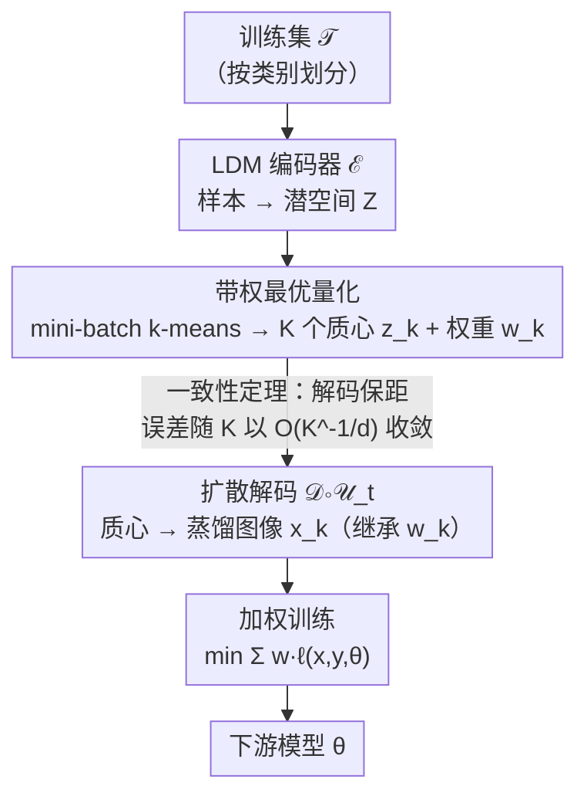

# Dataset Distillation as Pushforward Optimal Quantization

**会议**: ICLR2026  
**arXiv**: [2501.07681](https://arxiv.org/abs/2501.07681)  
**代码**: 无  
**领域**: 模型压缩  
**关键词**: 数据集蒸馏, 最优量化, Wasserstein 距离, 扩散模型, 潜空间聚类  

## 一句话总结
将解耦式数据集蒸馏重新形式化为最优量化问题，证明通过扩散先验的潜空间聚类+权重可收敛逼近真实数据分布，提出 DDOQ 算法在 ImageNet-1K 上以极低额外计算量超越 D4M 等基线。

## 研究背景与动机

**领域现状**：数据集蒸馏（Dataset Distillation, DD）旨在找到小型合成训练集，使得在其上训练的模型性能接近完整数据训练。早期双层优化方法计算复杂度高且依赖模型架构；解耦方法（如 SRe2L、D4M）通过匹配数据分布、用生成技术绕过像素空间优化，效率大幅提升。

**现有痛点**：解耦方法虽然高效，却缺乏理论保证——没有先前工作从理论上证明蒸馏出的数据集能否合理近似原始数据分布，整条范式更像「经验上 work」而非「可证明地 work」。

**关键观察**：D4M 等方法在潜空间做 $k$-means 聚类再解码，本质上是在求 **Wasserstein 重心**（均匀权重）。而经典**最优量化**（optimal quantization）理论告诉我们：在质心数固定时，给每个质心配上自动学习的权重，能进一步压低与真实分布的 Wasserstein 距离。这条「重心 → 带权量化」的升级正是本文的切入点。

## 方法详解

### 整体框架
DDOQ（Dataset Distillation by Optimal Quantization）把解耦式蒸馏重新看成一个**最优量化**问题。整条流水线分四步：先用 LDM 编码器把每个类别的训练样本映射到潜空间，在潜空间上做**带权重的聚类**得到一组量化点（质心 + 权重），再用扩散解码把质心还原成蒸馏图像、让图像继承质心的权重，最后把「图像 + 权重」一起喂给下游做**加权训练**。

相对 D4M，整套流程几乎只多了「自动学习权重」这一步，却把潜空间近似从 Wasserstein 重心升级为带权最优量化；而一致性与收敛率两条定理则保证了「在潜空间压低距离」的收益能保距地传到图像空间、并随量化点数可量化地收敛——这是 DDOQ 区别于过往纯经验解耦方法的地方。

### 关键设计

**1. 带权最优量化：把均匀权重的聚类升级为带权量化**

D4M 等方法在潜空间对每类做 $k$-means 再解码，本质是在求均匀权重下的 Wasserstein 重心——这意味着每个质心被等同看待，丢掉了「不同区域样本密度不同」这条信息。本文指出聚类其实是经典**最优量化**问题的特例，而最优量化理论表明：给每个质心配上权重 $w_k$（即该质心 Voronoi 单元下的测度），能在质心数固定时进一步压低与真实分布的 Wasserstein-2 距离。实现上对每个类别跑 mini-batch $k$-means（对应 CLVQ 竞争学习量化算法），把样本编码 $Z=\mathcal{E}(\mathcal{T})$ 聚成 $K$ 个质心 $z_k^{(L)}$，并直接读出落入每个单元的样本比例作为权重 $w_k^{(L)}$。权重在聚类过程中自然产出、几乎不增加计算，却让量化点分布显著更贴近原始数据——实测潜空间 $\mathcal{W}_2$ 距离在 IPC=10 平均降低 **15.7%**、IPC=50 平均降低 **16.1%**。

**2. 一致性与收敛率：证明潜空间近似可保距迁移、并可量化地收敛**

在潜空间做近似有个隐含前提——「潜空间近似得好，解码回图像空间仍然近似得好」，否则量化的收益会在扩散解码中流失。本文用两条结果把这件事钉死。**一致性定理**（定理 1）对 VESDE / VPSDE 两类扩散过程证明：若两个潜空间分布的距离为 $\mathcal{W}_2(\mu_T,\nu_T)$，则经反向扩散到图像空间后，任意 Lipschitz 函数 $f$ 上的期望差被该距离线性控制，

$$\|\mathbb{E}_{\mu_\delta}[f]-\mathbb{E}_{\nu_\delta}[f]\| \leq C\cdot L\cdot \mathcal{W}_2(\mu_T,\nu_T)$$

其中 $L$ 为 $f$ 的 Lipschitz 常数。也就是说扩散解码是「保距」的，设计 1 在潜空间压低 $\mathcal{W}_2$ 的努力会等比例转化为图像空间的更好近似——这从理论上支撑了「在潜空间而非像素空间操作」这一解耦范式。**收敛率推论**（推论 1）进一步刻画量化点数 $K$ 与误差的关系：随 $K$ 增大，误差以 $\mathcal{O}(K^{-1/d})$ 的速率收敛（$d$ 为潜空间维度）。这是首个对解耦蒸馏给出收敛率的结果，把「IPC 越大效果越好」的经验现象落到可量化的速率上；同时也暴露一个本质局限——速率随维度 $d$ 升高而变慢，高维潜空间下需要更多量化点才能达到同等精度。

**3. 加权解码与训练：让权重贯穿到下游模型**

量化阶段学到的权重若止步于潜空间，最优量化的收益就无法兑现。本文让权重一路贯穿到下游：得到带权质心后，用 LDM 解码器叠加扩散过程生成蒸馏图像 $x_k^{(L)}=\mathcal{D}\circ\mathcal{U}_t(z_k^{(L)},\text{emb})$，每张图像继承其质心的权重 $w_k^{(L)}$；下游训练不再对所有蒸馏样本一视同仁，而是用加权损失

$$\min_\theta \sum_{(x,y,w)} w\cdot \ell(x,y,\theta)$$

让占据更大测度的量化点在优化中获得更高权重。这样量化阶段的分布信息得以完整传递到模型训练，是「带权最优量化」真正兑现为下游精度的最后一环。

## 实验关键数据

**ImageNet-1K（UNet backbone，ResNet-18 评估）**：

### 主实验

| IPC | SRe2L | D4M | RDED | **DDOQ** |
|-----|-------|-----|------|----------|
| 10 | 21.3% | 27.9% | 42.0% | **33.1%** |
| 50 | 46.8% | 55.2% | 56.5% | **56.2%** |
| 100 | 52.8% | 59.3% | — | **60.1%** |
| 200 | 57.0% | 62.6% | — | **63.4%** |

- IPC 200 + ResNet-101：DDOQ 68.6% vs D4M 68.1%，相对全精度 69.8% 的**误差缩减 30%**
- 跨架构泛化（IPC=50）：DDOQ 在 CNN 学生模型上一致优于 D4M（如 MobileNet-V2: 52.1% vs 47.9%）

**DiT backbone（DDOQ-DiT）**：

### 消融实验

| 数据集 | IPC | Minimax-IGD | **DDOQ-DiT** |
|--------|-----|-------------|-------------|
| ImageNet-1K | 10 | 46.2% | **53.0%** |
| ImageWoof | 10 | 43.3% | **48.8%** |
| ImageNette | 10 | 65.3% | **68.2%** |

- 更强的 DiT backbone 将 ImageNet-1K IPC=10 准确率从 33.1% 提升至 **53.0%**（+19.9 点）

**跨架构泛化详情（IPC=50, ResNet-18 teacher）**：
- ResNet-18 student: DDOQ 56.2% vs D4M 55.2%
- MobileNet-V2 student: DDOQ 52.1% vs D4M 47.9%（+4.2 点）
- EfficientNet-B0 student: DDOQ 58.0% vs D4M 55.4%（+2.6 点）
- Swin-T student: DDOQ 57.4% vs D4M 58.1%（略低 0.7 点）

**Wasserstein 距离分析**：加入权重后，蒸馏潜点与编码训练数据的 $\mathcal{W}_2$ 距离在 IPC=10 平均降低 15.7%，IPC=50 平均降低 16.1%，证实最优量化优于 Wasserstein 重心。

## 亮点与洞察
1. **理论贡献扎实**：首次证明解耦式蒸馏方法在扩散先验下的一致性和收敛率，填补了该领域的理论空白
2. **改进极其简洁**：相比 D4M 仅添加自动学习的权重，几乎无额外计算（权重在 $k$-means 过程中自然产出）
3. **最优量化视角**：揭示 $k$-means 等聚类方法本质上在求解最优量化问题，权重是 Voronoi 单元的测度
4. **扩散模型的理论保证**：定理 1 证明扩散生成保持分布接近性，为在潜空间而非像素空间操作提供理论基础

## 局限与展望
- 低 IPC 设置下（如 IPC=10）仍落后于 RDED 的 patch-based 方法（RDED 42.0% vs DDOQ 33.1%，UNet backbone）
- Swin-T 等 Transformer 学生架构上 DDOQ 略逊于 D4M（57.4% vs 58.1%），可能需要更精细的超参调优
- 收敛率 $\mathcal{O}(K^{-1/d})$ 随潜空间维度 $d$ 增大而变慢，对高维潜空间场景效果可能减弱
- 依赖预训练的 LDM/DiT 质量，生成图像的保真度受限于基础模型能力
- 软标签依赖额外预训练分类器（如 ResNet-18），最大性能受限于该分类器精度（69.8%）
- 未探索与扩散引导方法（如 IGD）的结合可能性，二者可能互补

## 相关工作与启发
- 与 D4M 直接对比：仅添加权重即获得一致提升，说明 Wasserstein 重心 → 最优量化的升级是关键
- 与 RDED 比较：RDED 在低 IPC 强但不可扩展，DDOQ 在高 IPC 更优且内存恒定
- 最优量化理论可扩展到其他需要数据近似的场景（如联邦学习中的数据摘要）

## 评分
- 新颖性: ⭐⭐⭐⭐⭐ (最优量化视角 + 一致性证明，理论贡献突出)
- 实验充分度: ⭐⭐⭐⭐ (ImageNet-1K 多 IPC 多架构，但缺少更多数据集)
- 写作质量: ⭐⭐⭐⭐⭐ (理论推导严谨，算法描述清晰)
- 价值: ⭐⭐⭐⭐⭐ (为数据集蒸馏提供理论基础，方法简洁高效)

<!-- RELATED:START -->

## 相关论文

- [\[NeurIPS 2025\] Optimizing Distributional Geometry Alignment with Optimal Transport for Generative Dataset Distillation](../../NeurIPS2025/model_compression/optimizing_distributional_geometry_alignment_with_optimal_transport_for_generati.md)
- [\[ICLR 2026\] Dataset Color Quantization: A Training-Oriented Framework for Dataset-Level Compression](dataset_color_quantization_a_training-oriented_framework_for_dataset-level_compr.md)
- [\[ICLR 2026\] Compute-Optimal Quantization-Aware Training](compute-optimal_quantization-aware_training.md)
- [\[CVPR 2026\] Mitigating The Distribution Shift of Diffusion-based Dataset Distillation](../../CVPR2026/model_compression/mitigating_the_distribution_shift_of_diffusion-based_dataset_distillation.md)
- [\[CVPR 2026\] IMS3: Breaking Distributional Aggregation in Diffusion-Based Dataset Distillation](../../CVPR2026/model_compression/ims3_breaking_distributional_aggregation_in_diffusion-based_dataset_distillation.md)

<!-- RELATED:END -->
