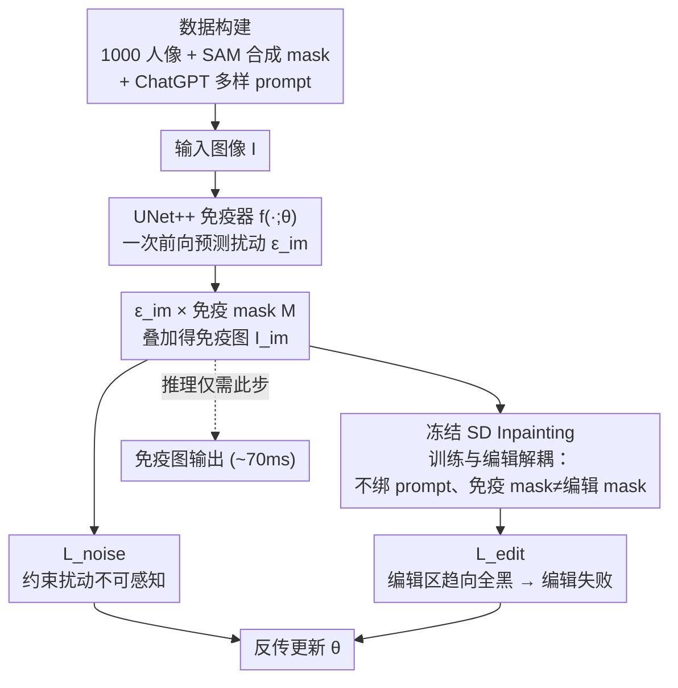

# DiffVax: Optimization-Free Image Immunization Against Diffusion-Based Editing

**会议**: ICLR 2026  
**arXiv**: [2411.17957](https://arxiv.org/abs/2411.17957)  
**代码**: 有（Project Webpage）  
**领域**: 扩散模型 / 安全  
**关键词**: 图像免疫, 对抗扰动, 扩散模型编辑防护, 前馈网络, 视频保护  

## 一句话总结

DiffVax 训练一个前馈免疫器（UNet++），对任意图像仅需一次前向传播（~70ms）即可生成不可感知的对抗扰动，使基于扩散模型的恶意编辑失败，相比先前逐图优化方法实现 250,000× 加速，并首次将免疫扩展到视频内容。

## 研究背景与动机

**领域现状**：扩散模型（如 Stable Diffusion）的编辑能力日益强大，inpainting 和 InstructPix2Pix 等工具可以对图片进行逼真修改，但也被恶意用户利用生成 deepfake、色情报复内容等。

**现有痛点**：现有图像免疫方法（PhotoGuard、DAYN）需要对每张图片单独运行投影梯度下降优化，单张图像消耗 10 分钟到数小时，GPU 显存需求高达 15GB+，无法泛化到未见内容。

**核心矛盾**：有效免疫需要通过扩散模型反向传播来制造对抗扰动，但逐图优化的范式根本无法扩展到社交媒体等大规模场景（每日上传数百万图片/视频）。

**本文目标**（a）将免疫从逐图优化转为前馈推理；（b）保证扰动不可感知同时编辑失败；（c）对反攻击（JPEG 压缩、去噪）保持鲁棒。

**切入角度**：训练一个图像条件的扰动生成器，从大量训练样本中学习"如何聪明地放置噪声"，而非每次从头优化。该设计可泛化到未见图像、未见 prompt、甚至视频帧。

**核心 idea**：用端到端训练的 UNet++ 免疫器取代逐图优化，通过 $\mathcal{L}_{\text{noise}} + \mathcal{L}_{\text{edit}}$ 双目标学习生成低频、不可感知且编辑破坏性强的扰动。

## 方法详解

### 整体框架

整篇要解决的问题是：怎么让"给图像加对抗扰动以抵御扩散编辑"这件事从逐图优化（每张图跑几百步、耗时几分钟到几小时）变成一次前向推理。DiffVax 把它拆成一个端到端的两阶段训练管线。Stage 1，免疫器 $f(\cdot;\theta)$ 读入图像 $\mathbf{I}$ 预测扰动 $\epsilon_{\mathrm{im}}$，再与免疫 mask $\mathbf{M}$ 相乘叠加到原图，得到免疫图 $\mathbf{I}_{\mathrm{im}}=\mathbf{I}+\epsilon_{\mathrm{im}}\odot\mathbf{M}$；Stage 2 把 $\mathbf{I}_{\mathrm{im}}$ 送进**冻结**的 SD Inpainting 模型走一遍编辑，用编辑失败损失反传去训练免疫器。训练用的图像、合成 mask 和多样 prompt 都来自精心构建的数据集，保证学到的扰动能泛化到未见内容。训练完成后，推理只跑 Stage 1 的单次前向（~70ms），Stage 2 整条扩散反传链路只在训练时存在。

### 关键设计

**1. UNet++ 免疫器：把"逐图优化"换成一次前向预测**

先前方法每来一张图都要在像素空间跑几百步 PGD，本文转而训练一个图像条件的生成器 $f(\cdot;\theta)$，直接把输入图像映射成扰动图 $\epsilon_{\mathrm{im}}$。骨干刻意选 UNet++ 而非普通 U-Net：对抗噪声预测本身训练很不稳定，需要在多个尺度上精确协作才能生成有效的扰动，而 UNet++ 的嵌套跳跃连接提供了更密集的多尺度特征聚合，实验中带来明显更稳的收敛。一旦训练完成，免疫一张图就只剩这一次前向传播（~70ms），这正是相比逐图优化能拿到 250,000× 加速的根本原因。

**2. 训练与编辑解耦：不绑 prompt、不绑 mask 形状，堵住绕过通道**

先前方法的一个漏洞是免疫扰动往往针对特定 prompt 或特定 mask 优化，攻击者换一个编辑 prompt 或挪动 mask 就能绕过防护。本文让免疫器**不以 prompt 为条件**——实验验证有效扰动其实是 prompt 无关的——也不绑定某一种 mask 形状，于是训练时用的免疫 mask 和推理/攻击时用的编辑 mask 可以完全不同。这样学到的扰动对 prompt 和 mask 的变化都更鲁棒，而不是只对训练时见过的那一种编辑设置有效。

**3. 数据构建：用合成 mask + LLM 生成的多样 prompt 撑起泛化**

要让前馈免疫器泛化到未见图像和未见 prompt，训练数据的多样性是关键。本文以 CCP 数据集的 1000 张人像为底，用 SAM 自动生成前景 mask，再用 ChatGPT 批量生成多样化的背景编辑 prompt，共 2000 个 prompt，并按 80/20 划分为 seen/unseen 以便评测泛化。正是这套"图像 + 合成 mask + 多样 prompt"的组合，让模型从样本中学到扰动的可迁移结构，而不是过拟合到某一类编辑。

### 损失函数 / 训练策略

$$\mathcal{L} = \alpha \cdot \mathcal{L}_{\text{noise}} + \mathcal{L}_{\text{edit}}$$

- $\mathcal{L}_{\text{noise}} = \frac{1}{\text{sum}(\mathbf{M})} \|(\mathbf{I}_{\mathrm{im}} - \mathbf{I}) \odot \mathbf{M}\|_1$：保证扰动不可感知
- $\mathcal{L}_{\text{edit}} = \frac{1}{\text{sum}(\sim\mathbf{M})} \|\text{SD}(\mathbf{I}_{\mathrm{im}}, \sim\mathbf{M}, \mathcal{P}) \odot (\sim\mathbf{M})\|_1$：强制编辑区域输出趋向全黑，即编辑完全失败

训练 350 epochs，batch size 5，Adam lr=1e-5，$\alpha=4$，A100 上约 22 小时，16-bit 精度。

## 实验关键数据

### 主实验

| 方法 | SSIM↓ (seen/unseen) | PSNR↓ (seen/unseen) | SSIM(Noise)↑ | CLIP-T↓ | Runtime(s)↓ | GPU(MiB)↓ |
|------|---------------------|---------------------|--------------|---------|-------------|-----------|
| PhotoGuard-E | 0.558/0.565 | 15.29/15.63 | 0.956 | 31.69/30.88 | 207.0 | 9,548 |
| PhotoGuard-D | 0.531/0.523 | 14.70/14.92 | 0.978 | 29.61/29.27 | 911.6 | 15,114 |
| DiffusionGuard | 0.551/0.556 | 14.37/14.71 | 0.965 | 26.98/27.10 | 131.1 | 6,750 |
| **DiffVax** | **0.510/0.526** | **13.96/14.32** | **0.989** | **23.13/24.17** | **0.07** | **5,648** |

### 反攻击鲁棒性

| 方法 | SSIM↓ (w/ Denoiser) | SSIM↓ (w/ JPEG 0.75) | SSIM↓ (w/ IMPRESS) |
|------|--------------------|-----------------------|--------------------|
| PG-D | 0.702/0.709 | 0.664/0.674 | 0.578/0.563 |
| DiffusionGuard | 0.708/0.719 | 0.680/0.684 | 0.604/0.595 |
| **DiffVax** | **0.552/0.565** | **0.522/0.538** | **0.488/0.500** |

### 关键发现

- DiffVax 学到的是低频扰动（非高频散射噪声），因此天然抵抗 JPEG 压缩和去噪器——这些方法主要移除高频分量
- 扰动平均 $L_1$ 幅度仅 0.001，远小于基线的 0.003~0.012，说明优势在于噪声的策略性放置而非力度
- 用户研究（67 人）中 DiffVax 平均排名 1.64（最不像原始编辑），远超 PG-D 的 2.63
- 视频免疫：64 帧视频处理仅 0.739 秒 vs PG-D 的 64 小时

## 亮点与洞察

- **前馈范式的可行性证明**：证明对抗扰动空间具有可学习的结构，可以用神经网络泛化到未见内容，而非必须逐图优化
- **低频扰动 = 鲁棒性**：$\mathcal{L}_{\text{noise}}$ 的 $L_1$ 约束让模型自动学到低频扰动分布，这比固定 $L_\infty$ budget 更高效也更抗攻击
- **视频免疫的开拓性**：此前所有方法因计算限制无法处理视频，DiffVax 的效率使该方向首次可行

## 局限与展望

- 多小物体场景防护效果下降（噪声分散不够集中）
- 免疫 mask 与编辑 mask 差异极大时防护可能部分失效
- 跨模型迁移性有限（SD v1.5 → v2 有效但不完美）
- 训练数据仅 1000 张人像，扩展到更多样的领域（动漫、数字艺术）是重要未来方向

## 相关工作与启发

- **vs PhotoGuard**：PG 通过 PGD 逐图优化，速度慢 3000×，且高频噪声容易被 JPEG 移除；DiffVax 学习低频策略性扰动
- **vs DiffusionGuard**：DG 扩展 PG 用增广 mask 优化，仍是逐图范式，131s/图；DiffVax 0.07s/图
- **vs DAYN**：基于注意力的语义攻击，降低计算但同样无法泛化
- 启发：前馈对抗扰动生成器的思路可迁移到其他安全场景（如音频 deepfake 防护）

## 评分

- 新颖性: ⭐⭐⭐⭐ 前馈免疫器范式新颖，但核心思想（训练噪声生成器）在对抗攻击领域有先例
- 实验充分度: ⭐⭐⭐⭐⭐ 消融、反攻击、跨模型、用户研究、视频、多种编辑工具全面覆盖
- 写作质量: ⭐⭐⭐⭐ 结构清晰，图表丰富
- 价值: ⭐⭐⭐⭐ 实用性强，250,000× 加速使大规模部署成为可能

<!-- RELATED:START -->

## 相关论文

- [\[ICCV 2025\] MotionFollower: Editing Video Motion via Lightweight Score-Guided Diffusion](../../ICCV2025/model_compression/motionfollower_editing_video_motion_via_score-guided_diffusion.md)
- [\[CVPR 2026\] On the Robustness of Diffusion-Based Image Compression to Bit-Flip Errors](../../CVPR2026/model_compression/on_the_robustness_of_diffusion-based_image_compression_to_bit-flip_errors.md)
- [\[CVPR 2026\] CADC: Content Adaptive Diffusion-Based Generative Image Compression](../../CVPR2026/model_compression/cadc_content_adaptive_diffusion-based_generative_image_compression.md)
- [\[ICLR 2026\] Modality-free Graph In-context Alignment](modality-free_graph_in-context_alignment.md)
- [\[ACL 2026\] LLM Prompt Duel Optimizer: Efficient Label-Free Prompt Optimization](../../ACL2026/model_compression/llm_prompt_duel_optimizer_efficient_label-free_prompt_optimization.md)

<!-- RELATED:END -->
