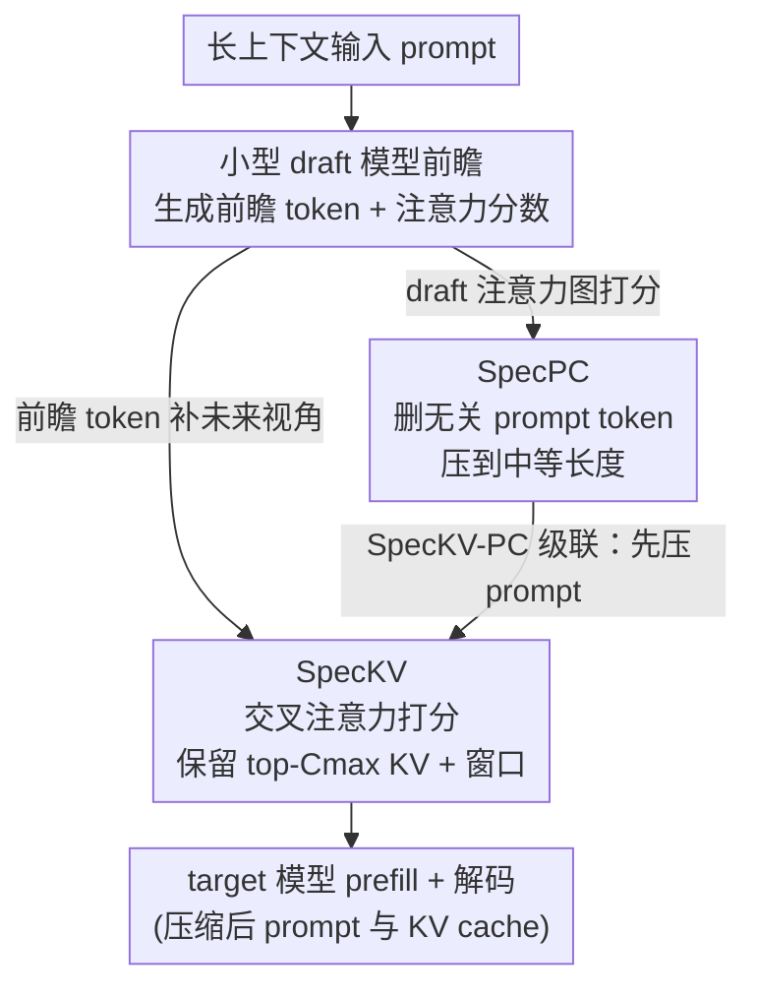

# Draft-based Approximate Inference for LLMs

**会议**: ICLR 2026  
**arXiv**: [2506.08373](https://arxiv.org/abs/2506.08373)  
**代码**: [GitHub](https://github.com/furiosa-ai/draft-based-approx-llm)  
**领域**: 模型压缩  
**关键词**: 近似推理, KV cache压缩, prompt压缩, 草稿模型, 稀疏注意力

## 一句话总结

提出 Draft-based Approximate Inference 框架，利用小型 draft 模型的前瞻（lookahead）预测来更准确地估计 token/KV pair 重要性，包含 SpecKV（KV cache dropping）、SpecPC（prompt 压缩）和 SpecKV-PC（级联压缩）三种方法，在长上下文 benchmark 上一致优于现有基线。

## 研究背景与动机

长上下文 LLM 推理面临两大瓶颈：注意力计算随上下文长度二次增长，KV cache 内存线性增长（128K token 在 Llama-3.1-8B 上需 16GB+）。现有近似推理方法包括 KV cache dropping（H2O、SnapKV）、稀疏注意力（MInference）和 prompt 压缩（LLMLingua-2），但它们都依赖当前输入 token 的注意力激活来估计重要性——这本质上是"后视镜"策略，无法准确预测**未来生成 token 真正需要哪些 KV pair**。

核心矛盾：重要性估计需要未来信息，但未来 token 尚未生成。LAQ++ 尝试用 target 模型自身的稀疏近似来生成 draft query，但它需要存储完整的 target KV cache，无法降低峰值内存。

本文的切入角度：用一个轻量级 draft 模型（如 0.5B-3B）来生成前瞻 token，以极低开销获取近似的未来信息，从而更准确地估计 token 重要性，同时避免 target 模型的内存和计算负担。

## 方法详解

### 整体框架

Draft-based Approximate Inference 用一个小型 draft 模型先对输入生成前瞻（lookahead）token，再借这些前瞻信息（draft 的输出或注意力激活）去判断 target 模型该保留哪些 KV pair、哪些 prompt token。与投机解码（speculative decoding）不同，这里 draft 的前瞻不是用来加速验证，而是为重要性估计补上"未来视角"，从而真正压低 target 模型的总计算与峰值内存。

框架在这套思路上落出两个独立算法和一个级联：SpecKV 用前瞻 token 给 target 的 KV cache 打分做丢弃，SpecPC 直接拿 draft 的注意力图给 prompt token 打分做删除，SpecKV-PC 则把两者串成一条流水线——先用 SpecPC 粗删 prompt，再用 SpecKV 细删 KV。三者共享同一个 draft 前瞻前端，只是用了它输出的不同信号。

### 关键设计

**1. SpecKV（Speculative KV Dropping）：让 draft 的前瞻 token 来决定哪些 KV 该留**

现有 KV dropping（如 SnapKV）只看当前输入 token 的注意力，等于用后视镜估计未来生成会用到谁。SpecKV 先让 draft 模型续写出 $n_{\text{lookahead}}$ 个前瞻 token，把它们和原输入拼在一起喂进 target 做 prefill；对每个注意力头，用最后 $n_{\text{window}}$ 个输入 token 加上这些前瞻 token 的 query，去对其余输入 key 做交叉注意力，以此打分，最终保留 top-$C_{\max}$ 个 KV pair 再加上窗口内的 KV pair。和同样用 lookahead 的 LAQ++ 相比，关键差别是它不需要存下 target 的完整 KV cache，因此峰值内存是真降下来的，而非只省了计算。理论上（Theorem 1）这套打分的误差被 draft 嵌入误差线性控制，$\|s - \hat{s}\|_2 \leq \epsilon \|W_q W_k^T\|_2$，意味着只要 draft 不太离谱，估出的重要性就足够可信。

**2. SpecPC（Speculative Prompt Compression）：直接拿 draft 的注意力图给 prompt token 打分**

prompt 压缩比 KV dropping 更狠，要在 prefill 之前就把无关 token 删掉。SpecPC 把完整 prompt 送进 draft 模型，直接抽出它的注意力激活张量 $A \in \mathbb{R}^{n_{\text{layer}} \times n_{\text{head}} \times (n_{\text{in}}+n_{\text{lookahead}}-1) \times n_{\text{in}}}$ 来衡量每个 token 的重要性。为了让分数更稳，它用大窗口配非均匀权重（离序列末尾越远的 query 权重越低）、跳过前 $l_{\text{skip}}$ 层（浅层注意力还没聚焦、噪声大），并采用先在窗口内平均、再跨头取最大的聚合方式。Theorem 2 给出保证：当输入满足压缩感知里的 RIP 条件时，注意力的近似误差与最终输出的近似误差成正比，把"删 token"这件事和可控的输出偏差挂上了钩。

**3. SpecKV-PC（级联压缩）：先粗删 prompt，再细删 KV**

单独一种压缩往往要在压缩率和精度间硬权衡，级联则能各取所长。SpecKV-PC 先用 SpecPC 把 prompt 压到中等长度（如 2048 token），再用 SpecKV 把 KV cache 进一步压到很小（如 256）。因为 target 模型只需处理已经变短的 prompt，延迟和内存都明显下降；更有意思的是级联效果反而比单用 SpecKV 更好——SpecPC 充当了一道预过滤器，先扔掉明显无关的 token，让后续 SpecKV 的打分在更干净的候选集上进行。

### 损失函数 / 训练策略

三种方法都是 training-free 的推理时优化，无需任何额外训练。实现上 SpecKV 把稀疏 prefill（Vertical-Slash 模式）与 KV cache dropping 结合，进一步压低 prefill 开销；SpecPC 则用局部池化代替静态分块来保持 token 的连续性，避免把一段语义切碎。

## 实验关键数据

### 主实验

**表1: LongBench 性能对比（Qwen2.5 32B，KV cache $C_{\max}$=256）**

| 类别 | 方法 | SingleQA | MultiQA | Summ. | Few-shot | Code | All |
|------|------|----------|---------|-------|----------|------|-----|
| Dense | Target | 56.01 | 43.99 | 25.90 | 64.06 | 44.74 | 47.78 |
| KV | SnapKV | 52.54 | 40.21 | 19.89 | 61.18 | 40.12 | 42.98 |
| KV | LAQ++ | 55.15 | 44.14 | 22.24 | 63.25 | 41.19 | 45.79 |
| KV | **SpecKV** | 53.48 | 43.77 | 24.02 | 63.79 | 44.80 | **46.06** |
| KV | **SpecKV-PC** | 52.60 | 44.52 | 24.11 | 63.38 | 48.45 | **46.48** |

**表2: Prompt 压缩对比（$C_{\max}$=1024）**

| 方法 | SingleQA | MultiQA | Summ. | Few-shot | Code | All |
|------|----------|---------|-------|----------|------|-----|
| LLMLingua-2 | 33.83 | 26.39 | 22.85 | 32.46 | 43.01 | 30.90 |
| SpecPrefill | 45.94 | 39.32 | 23.16 | 62.04 | 43.17 | 42.70 |
| **SpecPC** | 51.23 | 41.40 | 23.37 | 62.26 | 38.23 | **43.66** |

### 消融实验

- **Lookahead 长度**: SpecKV 用最大 token limit 效果最好，SpecPC 用 1 即可
- **Draft 模型大小**: 更大的 draft 模型（1.5B vs 0.5B）降低 $\epsilon$，提升下游分数
- **重要性分数相关性**: Draft (1.5B) 与 target (14B) 的 token 重要性分数高度相关（R² 接近 1）

### 关键发现

- SpecKV-PC 级联压缩优于单独 SpecKV，表明 SpecPC 的预过滤是有效的
- SpecKV 在 64K 上下文时比 LAQ++ 延迟降低 75%，峰值内存节省约 25GB
- 所有方法性能远超 draft 模型本身，说明该框架对弱 draft 模型也鲁棒
- RULER 合成 benchmark 上，随上下文增长，基于 lookahead 的方法优势越发明显

## 亮点与洞察

- 统一框架将 KV cache dropping 和 prompt 压缩纳入同一 draft-based 体系
- 理论分析优雅地连接了 compressed sensing（RIP）与注意力近似误差
- SpecKV 是首个利用 draft model lookahead 做 KV cache 优化的方法
- 级联压缩的设计思路值得借鉴：先粗后细，每步用最合适的信号

## 局限与展望

- Draft 模型引入额外的内存开销（虽然可以 offload 到 CPU）
- 在非常短的上下文（<4K）下，draft 开销可能不值得
- 目前仅验证了同系列模型做 draft（如 Qwen2.5-0.5B→32B），跨系列有效性未知
- Prompt 压缩会重新分配 position ID，可能影响依赖绝对位置的模型

## 相关工作与启发

- **SnapKV** (Li et al., 2024): 基于最后几个 token 的注意力做 KV 压缩，SpecKV 在此基础上引入前瞻
- **LAQ++** (Wang et al., 2025): 也用 lookahead，但需 target 模型完整 KV cache，峰值内存无法降低
- **SpecPrefill** (Liu et al., 2025): SpecPC 的前身，窗口大小固定为 1，SpecPC 改进为大窗口+非均匀权重
- 启发：draft model 除了 speculative decoding 外，在推理优化中有广泛应用前景

## 评分

- 新颖性: ⭐⭐⭐⭐ 框架统一性强，SpecKV 首创 draft lookahead 做 KV dropping，但每个单独方法增量有限
- 实验充分度: ⭐⭐⭐⭐⭐ RULER+LongBench+多模型+效率测量+多模态扩展，非常全面
- 写作质量: ⭐⭐⭐⭐ 理论分析清晰，但方法组合多导致篇幅略长
- 价值: ⭐⭐⭐⭐ 长上下文推理优化的实用方案，级联压缩思路有参考价值

<!-- RELATED:START -->

## 相关论文

- [\[NeurIPS 2025\] Universal Cross-Tokenizer Distillation via Approximate Likelihood Matching](../../NeurIPS2025/model_compression/universal_cross-tokenizer_distillation_via_approximate_likelihood_matching.md)
- [\[ACL 2025\] IAM: Efficient Inference through Attention Mapping between Different-scale LLMs](../../ACL2025/model_compression/iam_efficient_inference_through_attention_mapping_between_different-scale_llms.md)
- [\[ICLR 2026\] Steering MoE LLMs via Expert (De)Activation](steering_moe_llms_via_expert_deactivation.md)
- [\[ICLR 2026\] ParoQuant: Pairwise Rotation Quantization for Efficient Reasoning LLM Inference](paroquant_pairwise_rotation_quantization_for_efficient_reasoning_llm_inference.md)
- [\[ICLR 2026\] Highly Efficient and Effective LLMs with Multi-Boolean Architectures](highly_efficient_and_effective_llms_with_multi-boolean_architectures.md)

<!-- RELATED:END -->
