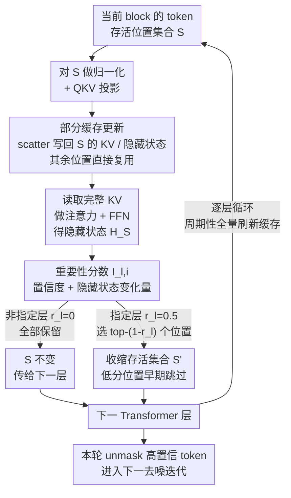

# ES-dLLM: Efficient Inference for Diffusion Large Language Models by Early-Skipping

**会议**: ICLR2026  
**arXiv**: [2603.10088](https://arxiv.org/abs/2603.10088)  
**代码**: [zhuzj19/ES-dLLM](https://github.com/zhuzj19/ES-dLLM)  
**领域**: 模型压缩  
**关键词**: Diffusion LLM, Inference Acceleration, Token Skipping, KV Cache, training-free

## 一句话总结

针对扩散大语言模型（dLLM）推理中大量 token 计算冗余的问题，提出无需训练的 Early-Skipping 加速框架 ES-dLLM，通过估计 token 重要性并在早期层跳过低重要性位置，在 LLaDA-8B 和 Dream-7B 上实现 5.6×–16.8× 加速且不损失生成质量。

## 背景与动机

扩散大语言模型（dLLM）如 LLaDA、Dream 通过迭代去噪生成文本，支持双向注意力和并行解码，是自回归模型（ARM）的有力替代。然而开源 dLLM 的推理效率远低于同等规模的 ARM，核心瓶颈在于：

1. **每轮迭代处理全序列**：dLLM 每次迭代需要对整个输入序列做前向计算，计算开销巨大
2. **大量无效计算**：每轮仅 unmask 少量高置信度 token，绝大多数 mask token 的计算结果并未被使用
3. **相邻迭代输入几乎不变**：相邻迭代仅在新 unmask 位置有差异，中间状态变化微小

作者通过实验分析发现：(a) 大多数位置的置信度变化近似指数分布且集中在零附近，超过 90% 的位置变化 < 0.05；(b) 隐藏状态在连续迭代间的变化同样微小。这揭示了大量可消除的冗余计算。

## 核心问题

如何在不引入额外训练的前提下，识别并跳过 dLLM 推理中低重要性 token 的计算，从而显著降低每轮迭代的计算量？

## 方法详解

### 整体框架

ES-dLLM 想解决的是：开源 dLLM 每轮去噪都要对整段序列做一次完整前向，可当轮真正被 unmask 的只有少数高置信度位置，绝大多数 mask token 算了也用不上。它的做法是给每个 token 位置打一个重要性分数，在 Transformer 的浅层（如 $1/8$、$1/4$ 深度）就把低分位置从存活集合里剔除，只让 top-$k$ 个重要位置继续往深层传递——一旦在某层把集合从 $|S|$ 缩到 $(1-r_l)|S|$，后面所有层的矩阵乘法规模都同步缩小。整套流程逐层在 Transformer block 内闭环：投影存活位置 → 部分更新 KV / 隐藏状态缓存 → 全段注意力 → 算分选新集合 → 传给下一层，缓存机制保证被跳的 token 在注意力和下一轮里仍拿得到状态，因此无需训练、不改权重就能削掉大量冗余 FLOPs。

### 关键设计

**1. 重要性分数估计：用两个免费信号认出当轮值得算的 token**

dLLM 每轮只 unmask 少量高置信度位置，绝大多数 mask token 的计算结果当轮根本用不上，难点是如何在不额外训练的情况下提前认出它们。ES-dLLM 把两个已有的免费信号线性融合：对第 $l$ 层、位置 $i$，重要性分数为

$$I_{l,i} = \alpha \cdot c_i^{(t-1)} + (1-\alpha) \cdot \frac{\| H_{l,i}^{(t)} - H_{l,i}^{(t-1)} \|_1}{\sqrt{d} \cdot \| H_{l,i}^{(t-1)} \|_2}$$

前一项 $c_i^{(t-1)}$ 是上一轮该位置的最大 softmax 概率，置信度越高越可能在本轮被 unmask；后一项是当前层隐藏状态（也可换成 query/key/value，论文取隐藏状态略优）相对上轮缓存的 L1 变化量，除以 $\sqrt{d}$ 与上轮 L2 范数做归一化，刻画该 token 对新生成内容的语义依赖。权重 $\alpha$ 默认取 0.5 让两项等权——消融显示只用置信度（$\alpha=1$）会明显退化，正是因为单看置信度会漏掉那些低置信、但隐藏状态剧烈变化的活跃位置。算完分数按该层 skip ratio $r_l$ 保留 top-$(1-r_l)|S|$ 个位置，其余直接跳过。

**2. 部分缓存更新与早期跳过：把"跳过"安全地塞进逐层前向**

跳过位置必须配合缓存，否则被跳的 token 做注意力时会缺 KV、下一轮也拿不到隐藏状态而崩坏。ES-dLLM 在每个 Transformer block 内的流程是：只对当前存活集合 $S$ 做归一化与 QKV 投影，用 in-place scatter 把新 KV 写回完整 KV Cache 的对应槽位（被跳位置的旧 KV 原样复用），再读取整段 KV 做注意力，FFN 输出的隐藏状态 $H_S$ 既是本层输出、也用来算上一节的重要性分数；据此选出新集合 $S'$，仅把 $S'$ 喂给下一层。跳得越早越省（后续层全部缩规模），但太早跳会让变化量项失去可靠参照（深层的 tensor variation 更可信），因此默认只在 $1/8$ 和 $1/4$ 深度各设一次 $r_l=0.5$（LLaDA 取 $r_4=r_8=0.5$、Dream 取 $r_4=r_7=0.5$，其余层 $r_i=0$），合计约减 60% FLOPs。生成开始时先对全部 prompt 与 output token 做一次完整前向初始化缓存；之后为防跳过误差逐轮累积，再按固定周期对 prompt token 或当前 block 的缓存做一次不跳过的全量刷新。相比 DualCache 只缓存当前 block 之外的 KV、block 内仍整段计算，ES-dLLM 把节省进一步推进到 block 内部，两者正交可叠加。

## 实验关键数据

在 NVIDIA H200 GPU 上的主要结果：

**LLaDA-8B-Instruct**：

| 基准 | 原始 TPS | ES-dLLM TPS | 加速比 | 精度变化 |
|------|---------|-------------|--------|---------|
| GSM8K | 8.56 | 143.93 | 16.8× | +0.23 |
| MATH | 14.04 | 103.63 | 7.4× | -0.90 |
| BBH | 11.06 | 159.89 | 14.5× | -2.24 |
| HumanEval | 23.65 | 226.57 | 9.6× | +1.21 |
| MBPP | 8.98 | 145.99 | 16.3× | -1.60 |

**Dream-7B-Instruct**：

| 基准 | 原始 TPS | ES-dLLM TPS | 加速比 | 精度变化 |
|------|---------|-------------|--------|---------|
| GSM8K | 19.80 | 267.13 | 13.5× | -1.06 |
| MATH | 26.38 | 147.44 | 5.6× | -0.50 |
| HumanEval | 44.34 | 308.51 | 7.0× | -1.83 |
| MBPP | 21.68 | 276.12 | 12.7× | -3.40 |

相比 DualCache，ES-dLLM 额外取得 1.20×–1.85× 加速，且多个基准上精度更优。

**消融实验要点**：
- $\alpha=0.5$（两项等权）整体最优；仅用置信度（$\alpha=1$）退化明显
- 隐藏状态作为变化指示器略优于 QKV 张量，但后者内存开销更小
- 额外内存开销极小：LLaDA-8B 每 output token 仅 528KB，Dream-7B 仅 70KB

## 亮点

1. **无需训练**：纯推理阶段优化，即插即用，兼容现有 dLLM
2. **观察驱动设计**：基于对 dLLM 生成过程中置信度和隐藏状态变化的系统分析，动机充分
3. **加速显著**：最高 16.8× 加速，在多数基准上精度变化在 ±2% 以内
4. **与现有方法正交**：可与稀疏注意力、并行解码等技术组合使用
5. **内存开销可忽略**：相比模型权重 10GB+，额外缓存仅需数百 MB

## 局限与展望

1. **重要性估计依赖简单启发式**：置信度 + L1 变化的线性组合可能不够精确，可训练轻量级模型预测重要性
2. **部分 KV 更新偏离训练假设**：dLLM 训练时假设完整状态更新，跳过可能引入分布偏移
3. **实际加速低于理论值**：减少 60% FLOPs 但仅提速 1.2×–1.85×（相比 DualCache），因推理进入 memory-bound 模式，权重和 KV 的内存访问未减少
4. **skip ratio 需手动调节**：不同任务可能需要不同的跳过比例，缺乏自适应调整机制

## 与相关工作的对比

| 方法 | 类型 | 是否需要训练 | 加速来源 | 局限 |
|------|------|-------------|---------|------|
| Semi-AR（LLaDA） | 生成策略 | 否 | 分块顺序生成 | 限制生成顺序 |
| BD3-LM | 模型设计 | 是 | 单向注意力+KV Cache | 丧失双向建模 |
| dKV-Cache | KV 缓存 | 否 | 延迟更新新 unmask 的 KV | 未利用 semi-AR |
| DualCache | KV 缓存 | 否 | block 外 KV 复用 | 仍计算整个 block |
| Sparse-dLLM | 稀疏注意力 | 否 | 稀疏化历史 token | 优化注意力范围，正交 |
| **ES-dLLM** | **token 跳过** | **否** | **block 内跳过低重要性位置** | **memory-bound 瓶颈** |

## 启发与关联

- **跳过与缓存的互补性**：ES-dLLM 与 DualCache 可叠加使用，前者减少 block 内计算，后者减少 block 外计算，思路可推广到其他迭代式生成模型
- **重要性分数的通用性**：置信度 + 变化量的双因子评估可迁移到扩散图像生成中的 token pruning
- **dLLM 推理优化发展迅速**：从 KV 缓存 → 稀疏注意力 → token 跳过 → 并行解码，各类技术正交互补，系统层面的整合是未来关键

## 评分
- 新颖性: 7/10（核心思路直觉明确，但技术设计相对简单）
- 实验充分度: 8/10（多模型、多基准、丰富消融，H200 实测吞吐）
- 写作质量: 8/10（动机清晰，实验组织有条理）
- 价值: 7/10（实用性强但实际加速受 memory-bound 限制，理论加速潜力未充分释放）

<!-- RELATED:START -->

## 相关论文

- [\[CVPR 2026\] Rejection Mixing: Fast Semantic Propagation of Mask Tokens for Efficient DLLM Inference](../../CVPR2026/model_compression/rejection_mixing_fast_semantic_propagation_of_mask_tokens_for_efficient_dllm_inf.md)
- [\[CVPR 2026\] Attention-aware Inference Optimizations for Large Vision-Language Models with Memory-efficient Decoding](../../CVPR2026/model_compression/attention-aware_inference_optimizations_for_large_vision-language_models_with_me.md)
- [\[AAAI 2026\] SkipCat: Rank-Maximized Low-Rank Compression of Large Language Models via Shared Projection and Block Skipping](../../AAAI2026/model_compression/skipcat_rank-maximized_low-rank_compression_of_large_language_models_via_shared_.md)
- [\[ICML 2026\] IDLM: Inverse-distilled Diffusion Language Models](../../ICML2026/model_compression/idlm_inverse-distilled_diffusion_language_models.md)
- [\[ICML 2026\] NanoQuant: Efficient Sub-1-Bit Quantization of Large Language Models](../../ICML2026/model_compression/nanoquant_efficient_sub-1-bit_quantization_of_large_language_models.md)

<!-- RELATED:END -->
