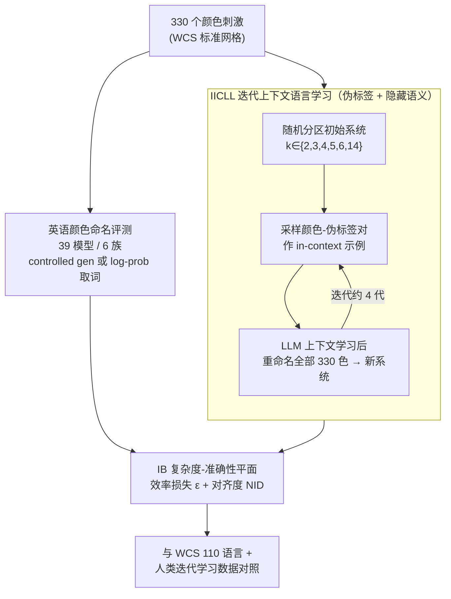

# Evolution and compression in LLMs: On the emergence of human-aligned categorization

**会议**: ICLR2026  
**arXiv**: [2509.08093](https://arxiv.org/abs/2509.08093)  
**代码**: [infocoglab/evolution-compression-llms](https://infocoglab.github.io/evolution-compression-llms)  
**领域**: 模型压缩  
**关键词**: information bottleneck, color naming, iterated learning, semantic categories, LLM alignment

## 一句话总结

通过 Information Bottleneck (IB) 框架和迭代上下文语言学习 (IICLL) 范式，证明 LLM 能够在未经 IB 目标训练的情况下，自发涌现出与人类语义分类系统高度对齐的、近最优压缩效率的类别结构。

## 背景与动机

**领域现状**：人类语义分类系统（如颜色命名）被大量证据表明遵循 Information Bottleneck (IB) 原则——在词汇的信息复杂度（complexity）和沟通准确性（accuracy）之间实现近最优的权衡。这一理论框架由 Zaslavsky et al. (2018) 提出，并在 World Color Survey (WCS) 的 110 种语言中得到了广泛验证。

**核心矛盾**：LLM 的训练目标是语言建模（next-token prediction），并非 IB 目标函数。这就引出核心疑问：LLM 是否仅仅在模仿训练数据中的分类模式，还是拥有一种内在的、类似人类的归纳偏置（inductive bias），能够自发驱动高效的语义压缩？

**为何选颜色**：颜色命名是认知科学中研究分类的经典领域，拥有独一无二的跨语言人类数据（WCS 数据集）和文化演化实验数据（Xu et al., 2013），因此成为评估 LLM 是否与人类对齐的理想测试平台。

**本文目标**：回答三个问题——(1) LLM 的英语颜色命名系统在 IB 效率和人类对齐度上表现如何？(2) LLM 是仅仅模仿训练数据中的模式，还是拥有真正的 IB 效率归纳偏置？(3) 这种偏置在颜色以外的语义域是否也存在？

## 方法详解

### 整体框架

本文不训练任何模型，而是把认知科学度量颜色命名系统的整套工具搬到 LLM 上：先用 Information Bottleneck (IB) 框架量化一个分类系统的压缩效率，再用两条路径探测 LLM——静态地评测它现成的英语颜色命名，以及动态地让它在迭代上下文语言学习 (IICLL) 中自发演化出一套命名系统；其中 IICLL 用伪标签 + 隐藏语义切断模型对训练数据的直接调用。两条路径的产物都落到同一张 IB 复杂度-准确性平面上，与 World Color Survey (WCS) 的人类语言数据直接对照。

### 关键设计

**1. IB 框架量化语义压缩效率：把"好分类"翻译成一个可优化的目标**

要判断 LLM 的颜色词系统是否"高效"，先得有一把信息论的尺子。本文沿用 Zaslavsky et al. (2018) 的 IB 目标函数

$$\mathcal{F}_\beta[q] = I_q(M;W) - \beta \cdot I_q(W;U)$$

其中 $I_q(M;W)$ 是复杂度（说话者含义 $M$ 与词汇 $W$ 之间的互信息，词越多越精细则越大），$I_q(W;U)$ 是准确性（词汇 $W$ 保留的世界状态 $U$ 信息），$\beta \geq 0$ 调节两者权衡，理论最优系统恰好落在这条 IB 界上。由此可定义效率损失 $\varepsilon = \min_\beta \frac{1}{\beta}(\mathcal{F}_\beta[q] - \mathcal{F}_\beta^*)$——一个系统离理论界越近，$\varepsilon$ 越小、压缩越接近最优；同时用归一化信息距离 (NID) 衡量它与人类英语命名系统的对齐度。这两个量是后续所有比较的统一货币，把抽象的"分类好不好"变成平面上一个可量化的点。

**2. 大规模英语颜色命名评测：先看 LLM 现成的颜色词系统长什么样**

第一个问题是 LLM 直接命名颜色时是否已经像人类一样高效。实验用 WCS 标准颜色网格的 330 个颜色片段作刺激，横跨 6 个模型族（Gemini、Gemma 3、Llama 3、Qwen 2.5、Olmo 2、GPT-2）共 39 个模型，输入同时覆盖文本（sRGB 坐标）和图像（多模态模型）两种模态。取词方式按模型能力区分：Gemini 用 controlled generation 约束输出，开源模型则通过对候选词的 log-probability 评分得到命名分布。最后把每个模型的系统打到 IB 平面上，用 $\varepsilon$ 和 NID 与人类英语系统对照，从而回答"规模、指令微调如何影响 IB 效率"。

**3. IICLL 范式：让 LLM 像人类语言一样代际演化**

静态评测只能看到模仿的结果，无法分辨 LLM 是真有归纳偏置还是单纯复述训练数据。本文的核心创新是把认知科学的迭代学习 (Iterated Learning) 嫁接到 LLM 的上下文学习上：先用随机分区初始化一套伪颜色命名系统，类别数 $k \in \{2, 3, 4, 5, 6, 14\}$；每一代从上一代系统 $L_{t-1}$ 中采样少量"颜色-伪标签"对作为 in-context 示例 $d_{t-1}$，LLM 在上下文里学完后对全部 330 个颜色重新命名，产出新系统 $L_t$；如此迭代多代，观察系统在 IB 平面上的演化轨迹。这相当于用 LLM 复刻人类文化传递实验，看它的命名系统会不会自发漂向 IB 界。

**4. 伪标签 + 隐藏语义：切断对训练数据的直接调用**

IICLL 要成立，关键是不能让模型偷看自己学过的颜色知识。为此标签词全部用伪造的非英语词，且提示里从不说明刺激是"颜色"，只称其为带有某种"特征"的刺激。这样模型无法直接套用训练语料里的英语颜色词，迭代中表现出的任何 IB 高效结构都只能归因于其内在的压缩偏置，而非数据模仿——这正是把"涌现"和"记忆"区分开的核心控制变量。

### 一个完整示例

以 Gemini 2.0、初始类别数 $k=6$ 为例走一遍 IICLL：第 0 代用随机分区给 330 个颜色贴上 6 个伪标签，此时系统在 IB 平面上远离理论界、$\varepsilon$ 很大。第 1 代从这套随机系统里抽几对"颜色-伪标签"塞进 prompt，Gemini 在上下文中归纳规律后重新命名全部颜色，输出的新系统已经比随机分区更紧凑。随后每一代都以上一代的输出为示例继续传递，命名边界逐代变得规整。约 4 代后系统收敛到 IB 界附近并稳定下来，其复杂度-准确性位置与 WCS 真实语言、以及人类迭代学习实验的数据高度重合——演化终点不是被指定的，而是从模型自身偏置里"长"出来的。

## 实验关键数据

### 英语颜色命名结果

- LLM 在复杂度和英语对齐度上差异巨大
- **模型规模和指令微调**是两个关键因素：更大的指令微调模型达到更好的对齐和 IB 效率
- Gemini 2.0 和 Gemma 3 27B (inst.) 最接近人类英语命名系统
- 令人惊讶的是，许多 SOTA 模型无法重现英语颜色命名（如 Llama 3.3 70B inst.）
- 部分模型（Olmo 2 32B inst., Qwen 2.5 VL 7B inst.）产生的系统更像 WCS 中的低资源语言而非英语
- 图像输入并不总是优于文本输入；CIELAB 坐标表现普遍差于 sRGB

### IICLL 文化演化结果

- **Gemini 2.0**：唯一能覆盖人类语言中观察到的完整复杂度范围的模型，IICLL 链收敛到与 WCS 语言和人类迭代学习数据相似的近最优 IB 解
- **Gemma 3 27B, Qwen 2.5 32B, Llama 3.3 70B**：也收敛到 IB 高效解，但限于低复杂度区域
- 所有模型约在 4 代后收敛到 IB 界附近，与人类迭代学习的动态平行
- 旋转分析（rotation analysis）证实 Gemini 的效率和对齐非平凡——随机旋转颜色映射导致显著下降

### Shepard 圆形域扩展

- 在由半径和辐条角度定义的二维 Shepard 圆形空间（64 个刺激）上测试 Gemini
- 经过 IICLL 代际传递，类别逐渐变得空间紧凑且基于两个维度区分区域
- 初步证据表明 LLM 的 IB 偏置可能具有跨域通用性

## 亮点与洞察

1. **理论-实验深度结合**：将认知科学的 IB 框架和迭代学习范式无缝迁移到 LLM 研究，方法论极具说服力
2. **IICLL 范式创新**：使用伪标签消除了训练数据模仿的混淆因素，直接探测 LLM 的内在归纳偏置
3. **大规模模型比较**：39 个模型、6 个族系的系统比较，揭示了模型规模、指令微调与 IB 效率的清晰关系
4. **跨域泛化**：Shepard 圆实验提供了颜色以外的初步泛化证据
5. **人类-AI 对齐的新视角**：表明 IB 效率可能是智能行为的一种涌现属性，无论人类还是 LLM 都未被显式训练优化该目标

## 局限与展望

1. **仅 Gemini 2.0 达到完整复杂度范围**：其他 SOTA 模型限于低复杂度解，说明 IICLL 对 in-context learning 能力要求极高，结论的通用性有待验证
2. **偏置来源不明**：IB 效率偏置究竟来自训练数据分布、指令微调还是模型架构？论文未能解耦这些因素
3. **颜色域的特殊性**：颜色在互联网文本中有丰富的数值表示（hex, RGB），LLM 可能对此域有天然优势，跨域泛化仅有 Shepard 圆的初步结果
4. **缺乏通信压力**：IICLL 仅模拟文化传递，未整合实际通信的功能性压力，与真实语言演化仍有差距
5. **评估局限于英语**：虽然使用了 WCS 数据，但 LLM 的直接评测仅在英语颜色词上进行

## 相关工作与启发

| 工作 | 关注点 | 本文区别 |
|------|--------|----------|
| Marjieh et al. (2024) | GPT-3/4 等少数模型的颜色命名 | 39 个模型的系统比较 + IB 分析 + IICLL |
| Abdou et al. (2021) | LLM 内部颜色表征 | 聚焦 prompt 交互下的命名行为 |
| Zhu & Griffiths (2024) I-ICL | LLM 的 in-context 先验 | 扩展为 IICLL，直接复现人类迭代语言学习实验 |
| Carlsson et al. (2024) | 神经网络 agent 的 IB 高效颜色命名 | 使用 LLM 而非从头训练的 agent |
| Ren et al. (2020) NIL | 神经迭代学习中的组合性语言 | 聚焦语义压缩效率而非组合性 |

- **对 LLM 对齐研究的启示**：IB 效率作为人类-AI 对齐的一个可量化维度，比传统的 benchmark 评测更深入地捕捉语义层面的对齐
- **对模型压缩的启示**：虽归类于 model_compression，本文实际讨论的是"语义压缩"而非参数压缩，但其信息论视角（IB 原则）对理解模型如何在有限表征中编码语义有重要参考价值
- **指令微调的认知效应**：指令微调不仅提升任务性能，还可能重塑模型的语义组织方式，使其更接近人类认知结构
- **文化演化 × AI**：IICLL 为研究 LLM 中的文化演化动态提供了可扩展的实验范式

## 评分
- 新颖性: ⭐⭐⭐⭐⭐ (将认知科学的 IB 框架与 LLM 结合，IICLL 范式是重要方法创新)
- 实验充分度: ⭐⭐⭐⭐ (39 模型大规模比较，但跨域泛化证据较初步)
- 写作质量: ⭐⭐⭐⭐⭐ (结构清晰、理论动机充分、图示精美)
- 价值: ⭐⭐⭐⭐ (为理解 LLM 的语义组织能力提供了全新理论视角)

<!-- RELATED:START -->

## 相关论文

- [\[ICLR 2026\] LLM DNA: Tracing Model Evolution via Functional Representations](llm_dna_tracing_model_evolution_via_functional_representations.md)
- [\[ICML 2026\] xKV: Cross-Layer KV-Cache Compression via Aligned Singular Vector Extraction](../../ICML2026/model_compression/xkv_cross-layer_kv-cache_compression_via_aligned_singular_vector_extraction.md)
- [\[ICLR 2026\] Paper Copilot: Tracking the Evolution of Peer Review in AI Conferences](paper_copilot_tracking_the_evolution_of_peer_review_in_ai_conferences.md)
- [\[CVPR 2026\] Towards Unified Human Perception and Machine Understanding: Token Flow Guided Compression Framework](../../CVPR2026/model_compression/towards_unified_human_perception_and_machine_understanding_token_flow_guided_com.md)
- [\[NeurIPS 2025\] TokenSqueeze: Performance-Preserving Compression for Reasoning LLMs](../../NeurIPS2025/model_compression/tokensqueeze_performance-preserving_compression_for_reasoning_llms.md)

<!-- RELATED:END -->
