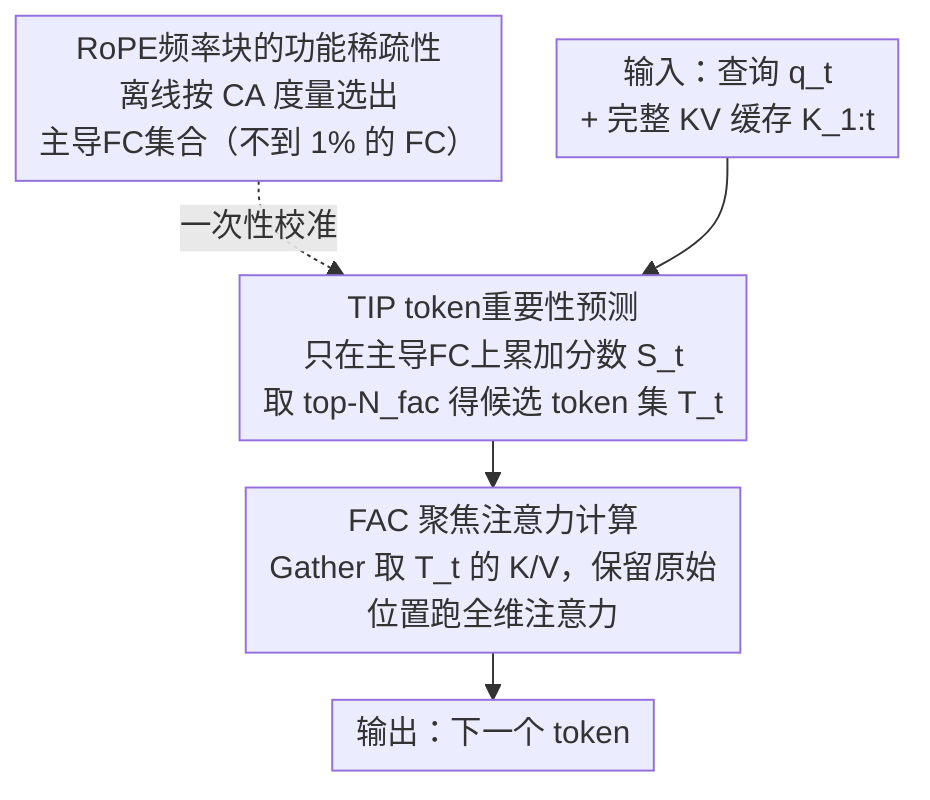

# FASA: Frequency-Aware Sparse Attention

**会议**: ICLR 2026  
**arXiv**: [2602.03152](https://arxiv.org/abs/2602.03152)  
**代码**: [GitHub](https://github.com/AMAP-ML/FASA-ICLR2026)  
**领域**: 信号通信  
**关键词**: KV缓存压缩, 稀疏注意力, RoPE频率分析, token剪枝, 长上下文推理

## 一句话总结
本文发现RoPE中频率块（FC）级别的功能稀疏性——少数"主导FC"可有效预测token重要性，据此提出FASA框架，通过主导FC预估token重要性+聚焦注意力计算两阶段实现无训练的KV缓存压缩，在LongBench上仅保留256个token接近100%全KV性能，AIME24上用18.9%缓存实现2.56×加速。

## 研究背景与动机

1. **领域现状**: LLM长上下文处理面临KV缓存线性增长的内存瓶颈。主流压缩方向包括token剪枝（StreamingLLM, SnapKV）、低秩压缩、量化、KV合并和预算分配。
2. **现有痛点**: (1)静态策略（StreamingLLM）固定保留首尾token，不可逆信息丢失；(2)自适应策略（SnapKV, H2O）启发式排名不能充分捕获token重要性的查询依赖性；(3)学习策略需要训练token预测器，在不同数据集上泛化性差。
3. **核心矛盾**: token重要性本质上是查询依赖的，但现有方法要么用与查询无关的静态规则，要么用计算全注意力一样昂贵的方式评估重要性。能否用更廉价的方式实现查询感知的重要性预测？
4. **本文目标**: 如何在不训练的前提下，以极低计算代价实现查询感知的token重要性预测？
5. **切入角度**: RoPE将注意力计算分解为$d/2$个2D频率块（FC）的独立贡献。不同FC因旋转频率不同而具有不同功能：高频FC负责位置模式，低频FC负责语义信息。只需少数"主导FC"即可近似重建全头的注意力模式。
6. **核心 idea**: 利用RoPE内在的FC级功能稀疏性，用少量主导FC的低开销计算代替全维度注意力来预测token重要性。

## 方法详解

### 整体框架
FASA把一次注意力拆成"先粗筛、再精算"两步：先用一组离线校准好的主导频率块（frequency chunk，FC）以极低代价为每个token打重要性分数（Token重要性预测，TIP），再只在被选中的关键token子集上跑全维度注意力（聚焦注意力计算，FAC）。主导FC的识别是一次性离线校准，推理时不再产生额外训练成本——这也正是FASA无训练却能做查询感知预测的关键。

### 关键设计

**1. RoPE频率块的功能稀疏性：用一个度量证明少数FC就够了**

整套方法的地基是一个观察：RoPE把$d$维向量切成$d/2$个2D频率块，第$i$个FC的旋转频率$\theta_i = B^{-2(i-1)/d}$各不相同，于是它们的功能也分化——高频FC编码位置模式（近因偏差），低频FC承载语义信息。为了量化"某个FC单独能多大程度代表整个头的选择行为"，本文定义上下文一致性（CA）度量 $\text{CA}_\mathcal{K}^{l,h,i} = |\text{TopK-I}(\alpha_{l,h}, \mathcal{K}) \cap \text{TopK-I}(\alpha_{l,h}^{(i)}, \mathcal{K})| / \mathcal{K}$，即单FC注意力分布与全头注意力的top-$\mathcal{K}$ token集合的重合比例。

实证结果给了三条强结论：主导FC极稀疏（不到1%的FC就贡献了>90%的上下文一致性）、跨任务普适（不同校准数据集选出的主导FC重合度>70%）、跨模型一致。这意味着FC级稀疏性是RoPE的结构固有属性而非任务特定，高频FC既然主要管位置就可以被安全忽略——这正是后续敢用极少FC做预测的依据。

**2. TIP token重要性预测：只聚合主导FC，把重要性估计的开销压到全注意力的几分之一**

离线阶段挑出能最大化期望CA之和的$N_{tip}$个FC作为主导集合 $\mathcal{I}_{dom}^{l,h} = \text{TopK-I}(\{\overline{\text{CA}}_\mathcal{K}^{l,h,i}\}, N_{tip})$。在线阶段不再算全维注意力，而只在这些主导FC上累加分数 $S_t^{l,h} = \sum_{i \in \mathcal{I}_{dom}} \alpha^{l,h,i}(q_t, K_{1:t})$，再取top-$N_{fac}$得到候选token集 $\mathcal{T}_t = \text{TopK-I}(S_t^{l,h}, N_{fac})$。由于主导FC只占全维度的1/8到1/4，TIP复杂度为$O(2tN_{tip})$，远低于全注意力的$O(td)$，却能近似重建原本的token选择，且因校准结果任务无关，校准一次即可长期复用。

**3. FAC 聚焦注意力计算：只对关键token做全保真注意力，并守住位置编码**

拿到$\mathcal{T}_t$后，用Gather从完整KV缓存里取出对应的Key和Value $K_{\mathcal{T}_t} = \text{Gather}(K_{1:t}, \mathcal{T}_t)$、$V_{\mathcal{T}_t} = \text{Gather}(V_{1:t}, \mathcal{T}_t)$，在这个缩减集上跑全精度注意力，复杂度仅$O(N_{fac}d)$。关键细节是保留每个token的原始绝对位置以维持RoPE位置编码完整，避免位置失真带来的退化。实现给了两个变体以适配不同瓶颈：FASA-M把KV缓存卸到CPU换显存（内存优化），FASA-C把全缓存留在GPU但只稀疏访问Key（计算优化）。

### 损失函数 / 训练策略
FASA完全无训练，主导FC识别只需少量校准样本的一次性离线过程，并与层级预算分配（如PyramidKV）正交、可叠加组合。当$N_{fac} \ll t$时理论加速比为 $\text{Speedup} = d / N_{tip}$。

## 实验关键数据

### 主实验

| 任务/方法 | Stream | SnapKV | Quest | FASA | Full KV | Oracle |
|--------|------|------|-------|------|---------|--------|
| LongBench (K=256) | ~80% | ~92% | ~90% | **~99%** | 100% | 100% |
| AIME24 加速 | — | — | — | **2.56×** | 1× | — |
| KV缓存用量 | — | — | — | **18.9%** | 100% | — |

跨模型验证: Llama-3.1-8B, Mistral-7B, Qwen2-7B等均一致有效。

### 消融实验

| FC数量(F) / KV预算(K) | K=64 | K=256 | K=512 | K=1024 |
|------|------|------|------|------|
| Random FC | 2.0 | 3.6 | 6.4 | 25.5 |
| Stream | 34.4 | 26.8 | 24.4 | 30.7 |
| SnapKV | 37.9 | 40.9 | 41.9 | 49.5 |
| F=8 (1/8) | **43.0** | **49.4** | **54.3** | **62.6** |
| F=16 (1/4) | 55.3 | 59.7 | 62.8 | 70.1 |

### 关键发现
- 仅1/8的FC即可在所有预算水平上超越SnapKV 10.3%的复合CA分数
- FC的功能稀疏性是模型固有属性：跨架构/规模/任务高度一致
- FASA-C在AIME24长CoT推理任务上实现2.56×加速且性能损失<0.7%
- 主导FC不到全部FC的1%但贡献绝大多数上下文信息
- LongBench上仅保留256个token即达到接近100%的全KV性能

## 亮点与洞察
- 对RoPE的全新理论视角：频率块级功能稀疏性——高频FC位置编码 vs 低频FC语义承载的优雅分工
- 完全无训练、一次校准终身使用：主导FC的任务无关性使得校准极其高效
- 与现有方法正交：可与量化、层级预算分配等技术无缝组合
- 从token级到频率块级的粒度创新：相比页级（Quest）或token级（SnapKV）更精细

## 局限与展望
- 主导FC的1/4选取比例在极长上下文（100K+）下是否仍最优有待验证
- 当前实现聚焦于decoder-only架构，encoder-decoder和非RoPE模型需适配
- FASA-M的CPU-GPU数据传输延迟在高吞吐场景中可能成为瓶颈
- 未探索与投机采样（speculative decoding）的结合

## 相关工作与启发
- **vs StreamingLLM**: 静态保留策略，丢弃中间位置可能关键的token
- **vs SnapKV**: 预填充阶段一次性过滤，无法适应生成过程中token重要性变化
- **vs Quest**: 页级粒度过粗，检索整页即使仅需少量token
- **vs SparQ/LoKi**: 低秩方法需要辅助内存存储投影矩阵

## 评分
- 新颖性: ⭐⭐⭐⭐⭐ FC级功能稀疏性是RoPE的全新理论发现，具有普遍意义
- 实验充分度: ⭐⭐⭐⭐⭐ 长上下文基准+序列建模+长CoT推理三大范式全覆盖
- 写作质量: ⭐⭐⭐⭐ 从观察到假设到验证到方法的逻辑链完整
- 价值: ⭐⭐⭐⭐⭐ 无训练、高效、通用的KV缓存压缩方案，极具实用价值

<!-- RELATED:START -->

## 相关论文

- [\[ICLR 2026\] TurboBoA: Faster and Exact Attention-aware Quantization without Backpropagation](turboboa_faster_and_exact_attention-aware_quantization_without_backpropagation.md)
- [\[NeurIPS 2025\] SpecAttn: Speculating Sparse Attention](../../NeurIPS2025/model_compression/specattn_speculating_sparse_attention.md)
- [\[ICLR 2026\] Token Distillation: Attention-Aware Input Embeddings for New Tokens](token_distillation_attention-aware_input_embeddings_for_new_tokens.md)
- [\[ICLR 2026\] FreqKV: Key-Value Compression in Frequency Domain for Context Window Extension](freqkv_key-value_compression_in_frequency_domain_for_context_window_extension.md)
- [\[CVPR 2026\] Trainable Log-linear Sparse Attention for Efficient Diffusion Transformers](../../CVPR2026/model_compression/trainable_log-linear_sparse_attention_for_efficient_diffusion_transformers.md)

<!-- RELATED:END -->
