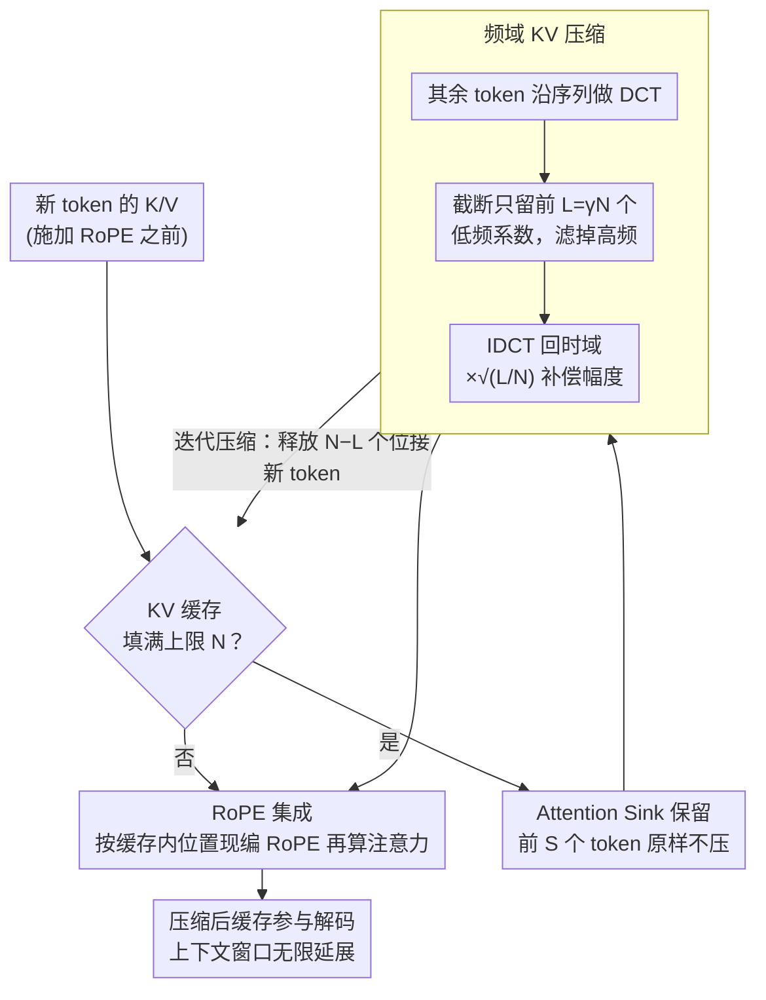

# FreqKV: Key-Value Compression in Frequency Domain for Context Window Extension

**会议**: ICLR 2026  
**arXiv**: [2505.00570](https://arxiv.org/abs/2505.00570)  
**代码**: [GitHub](https://github.com/LUMIA-Group/FreqKV)  
**领域**: 模型压缩 / LLM效率  
**关键词**: KV缓存压缩, 频域变换, 上下文窗口扩展, DCT, 长文本推理

## 一句话总结

提出 FreqKV，一种无参数、架构无关的 KV 缓存压缩方法，通过在频域中迭代压缩 KV 状态（保留低频丢弃高频），仅需 8K 长度的少量微调即可将 LLaMA-2-7B 的上下文窗口扩展至 256K，同时保持稳定的困惑度。

## 研究背景与动机

LLM 的推理能力受限于预训练时设定的上下文窗口大小，超出窗口后性能急剧下降。现有解决方案各有局限：

**位置编码方法**（ALiBi、PI、LongRoPE）：依赖完整自注意力，二次计算成本过高

**KV 缓存驱逐方法**（SnapKV、PyramidKV、FastKV）：根据注意力分数丢弃不重要的 token，但被丢弃 token 的信息永久丢失，导致后续解码性能下降，且无法外推超出上下文窗口

**Token 合并方法**（CaM、KVMerger、D2O）：虽保留更多信息但不微调时效果不佳

**额外模块方法**（LoCoCo、Activation Beacon）：引入额外参数压缩 KV 状态，增加内存开销

**关键观察**：作者发现 LLM 的 KV 状态在频域中展现出强烈的能量集中特性——能量主要集中在低频分量中。虽然第一层的初始嵌入没有明显的低频偏置，但随着解码过程推进，后续层逐渐将能量转移至低频。这意味着高频分量基本是冗余的，可以丢弃而损失极小。

进一步的扰动实验证实：低频分量编码全局语义信息和长程依赖，对输入扰动具有鲁棒性；高频分量捕获局部细节，对扰动敏感。在摘要任务上，保留低频分量的性能远优于保留高频分量（如 GovReport: 25.51 vs 14.21）。

## 方法详解

### 整体框架

FreqKV 把 KV 缓存沿序列维度做离散余弦变换（DCT）搬到频域，只保留能量集中的低频分量、丢弃冗余的高频分量，再经逆变换（IDCT）回到时域得到一份更短的缓存。整条流水线围绕一个缓存上限 $N$ 运转：窗口内的 token 走标准注意力，一旦缓存被填满，就把开头几个 attention sink token 挑出来原样保留、其余 token 做一次频域压缩，腾出空位继续接收新 token，填满了再压——如此循环，上下文窗口便被无限延展。关键的细节是压缩发生在给 Key 施加 RoPE 之前，因此整个过程不引入任何参数、不改动模型结构，也无需位置外推。

### 关键设计

**1. 频域 KV 压缩：把冗余的高频砍掉而非丢整个 token**

驱逐类方法直接扔掉低注意力的 token，被扔的信息就永久消失了；FreqKV 换一个视角——既然 KV 状态的能量主要集中在低频，那就只压精度、不丢 token。具体地对 Key、Value 沿序列维度做 DCT 得到频谱 $Z_K = \mathrm{DCT}(K)$、$Z_V = \mathrm{DCT}(V)$，给定保留比率 $\gamma$，缓存长度从 $N$ 截到 $L = \gamma N$，即只留前 $L$ 个低频系数、滤掉 $N-L$ 个高频系数。截断后做 IDCT 回到时域，并乘以缩放因子 $\sqrt{L/N}$ 恢复原始幅度——因为 DCT 按 $\sqrt{N}$、IDCT 按 $\sqrt{L}$ 归一化，多轮迭代下这一尺度失配会让重建信号被逐步放大，缩放因子正是为了消掉它：

$$K_{\text{comp}} = \sqrt{L/N}\,\mathrm{IDCT}(Z_K[0{:}L]),\quad V_{\text{comp}} = \sqrt{L/N}\,\mathrm{IDCT}(Z_V[0{:}L])$$

压缩结果直接替换原缓存参与后续注意力，所有 token 的全局语义都被低频分量保留了下来，只是表示精度降低。

**2. 迭代压缩：让远端 token 自然降质、近端 token 保持高精度**

单次压缩只能缩一次，要支撑无限长上下文得反复做。FreqKV 设定缓存上限 $N$：窗口内 token 走标准注意力，一旦缓存填满就触发一次频域压缩，释放出 $N-L$ 个位置接收新 token，填满后再压，如此循环。这样越早进入缓存的 token 会经历越多轮压缩、精度越低，越靠近当前位置的 token 压得越少——恰好契合自回归 LLM「近期 token 更重要」的特性。由于压缩每 $N-L$ 个 token 才触发一次、单次代价为 $O(N\log N)$，摊到每步的额外开销可忽略，整体自注意力成本随输入长度近似线性增长（类似滑动窗口注意力）。正是这套迭代策略让仅在 8K 训练的模型把上下文外推到 256K。

**3. Attention Sink 保留：别动模型当锚点的开头几个 token**

LLM 存在 attention sink 现象，会给序列最初的若干 token 分配异常高的注意力、把它们当全局锚点，若压掉这部分会显著破坏注意力分布。因此 FreqKV 让前 $S$ 个初始 token（实验取 $S=4$）始终原样留在缓存里不参与压缩，频域压缩只作用于 sink token 之后的内容。于是每次压缩后，新进来的 token 会同时注意到 $S$ 个 sink token、$L$ 个压缩后的历史「token」与窗口内尚未压缩的近期 token。

**4. RoPE 集成：在加位置编码之前压缩，绕开外推难题**

旋转位置编码 RoPE 把绝对位置写进了 Key，若先编码再压缩，压完的位置索引就会错乱，逼着方法去做位置外推或插值——论文的对照实验证实，「先 RoPE 后压缩」的变体确实因用到越界位置编码而显著掉点。FreqKV 的做法是把 Key 在施加 RoPE 之前就压缩并缓存，注意力计算时才按缓存内的当前位置索引现编码 RoPE。这样压缩后的 Key 用的始终是缓存内的合法位置，天然无需任何外推或插值即可扩展上下文。

### 损失函数 / 训练策略

FreqKV 是无参数方法，只需少量微调让模型适配频域压缩后的缓存分布。对 LLaMA-2，用 RedPajama 在 8K 长度上微调做语言建模、用 LongAlpaca 指令数据微调 chat 模型；对 LLaMA-3 则在 16K 长度上同样微调。训练全程采用与推理一致的 chunk-wise 流程——交替执行注意力计算与频域压缩，从而让模型在训练阶段就见到压缩后的缓存。

## 实验关键数据

### 主实验

**表1：PG-19 困惑度评估（LLaMA-2-7B）**

| 训练长度 | 方法 | 推理缓存 | 2K | 4K | 8K | 16K | 32K |
|:---:|------|:---:|:---:|:---:|:---:|:---:|:---:|
| 8K | Full FT | Full | 7.55 | 7.21 | 6.98 | - | - |
| 8K | LoCoCo | Comp. | 8.15 | 8.08 | 7.27 | - | - |
| 8K | LongLoRA | Full | 7.70 | 7.35 | 7.14 | - | - |
| 8K | **FreqKV** | Comp. | **7.45** | **7.12** | **7.04** | **7.02** | **7.02** |
| 32K | LongLoRA | Full | 8.29 | 7.83 | 7.54 | 7.35 | 7.22 |
| 32K | **FreqKV** | Comp. | **7.47** | **7.14** | **7.04** | **7.00** | **6.98** |

FreqKV 仅需 8K 训练就能将上下文扩展到 32K（PPL 7.02），甚至优于 LongLoRA 在 32K 训练后的结果（7.22）。FreqKV 在短上下文（2K/4K）上也不损失性能，甚至优于 Full FT。

**表2：LongBench 长文本理解基准（LLaMA-2-chat-7B, 50% 保留率）**

| 方法 | 单文档QA | 多文档QA | 摘要 | Few-shot | 代码 | 平均 |
|------|:---:|:---:|:---:|:---:|:---:|:---:|
| Full Cache | 24.9 | 22.5 | 24.6 | 60.0 | 48.1 | 35.17 |
| SnapKV | 25.4 | 22.3 | 24.0 | 59.1 | 48.0 | 36.81 |
| FastKV | 25.5 | 22.9 | 23.7 | 57.6 | 54.5 | 36.33 |
| PyramidKV | 25.3 | 21.3 | 23.9 | 59.8 | 48.0 | 36.84 |
| **FreqKV** | **24.2** | **27.9** | **24.7** | 56.0 | **58.8** | **37.85** |

FreqKV 在 50% 压缩率下超越所有 KV 驱逐和合并方法，尤其在多文档 QA（+5.4 vs SnapKV）和代码任务（+10.8 vs Full Cache）上优势显著。

### 消融实验

论文在附录中提供了多组消融：

- **保留频率分量选择**：仅保留低频远优于仅保留高频（证实低频信息的重要性）
- **保留比率 gamma**：gamma=0.5 是较好的权衡点
- **Sink token 数量 S**：S=4 即可，增大 S 带来的收益递减
- **LLaMA-2-13B**：在更大模型上同样有效，PPL 从 6.95（Full FT at 8K）降至 6.41（FreqKV at 32K）

### 关键发现

1. **频域压缩无信息永久丢失**：与驱逐方法不同，FreqKV 保留了所有 token 的信息（通过低频分量），只是降低了表示精度
2. **少量训练即可大幅扩展**：仅在 8K 训练就可以维持 256K 的稳定 PPL，远优于需要 32K 训练的 LongLoRA
3. **短上下文不退化**：在原始窗口内（2K/4K）性能甚至略有提升
4. **MHA 和 GQA 通用**：在 LLaMA-2（MHA）和 LLaMA-3（GQA）上都有效
5. **迭代压缩的自然对齐**：越早的 token 被压缩越多次，与自回归 LLM 中近期 token 更重要的直觉一致

## 亮点与洞察

- 从频域视角审视 KV 缓存压缩是一个全新且优雅的思路，DCT 的低频能量集中性质为方法提供了坚实的数学基础
- 完全无参数，不需要修改模型架构，即插即用
- 迭代压缩策略自然实现了"近期 token 高精度、远期 token 低精度"的渐进降质
- 通过在 RoPE 之前压缩 key 并重新编码位置，巧妙绕过了位置外推问题

## 局限与展望

1. DCT 假设信号在边界处的对称延拓可能在某些极端 KV 分布下不成立
2. 固定的保留比率 gamma 可能不是所有层和头的最优选择，自适应 gamma 可能带来进一步提升
3. 压缩后的"token"不再对应真实的 token 位置，可能影响某些需要精确位置信息的任务
4. 未在更大规模模型（70B+）上验证
5. 与 Token 驱逐方法正交，未探索两者结合的可能

## 相关工作与启发

FreqKV 首次将频域学习的思想引入 decoder-only LLM 的 KV 缓存压缩。此前频域方法主要用于 CNN 图像处理和 Transformer encoder（如 FNet）。该方法可以与 token 驱逐方法互补使用，也可以启发其他信号处理技术（如小波变换）在 LLM 推理优化中的应用。

## 评分

- 新颖性: ⭐⭐⭐⭐⭐（首次在 decoder-only LLM 中使用频域 KV 压缩）
- 技术深度: ⭐⭐⭐⭐（DCT/IDCT 理论清晰，迭代压缩设计精巧）
- 实验充分度: ⭐⭐⭐⭐⭐（PPL + LongBench + RULER + 大海捞针 + LongGenBench，多模型多任务）
- 实用性: ⭐⭐⭐⭐⭐（无参数、架构无关、少量训练即可）
- 写作质量: ⭐⭐⭐⭐（频域动机阐述清楚，实验全面）

<!-- RELATED:START -->

## 相关论文

- [\[ACL 2025\] SCOPE: Optimizing Key-Value Cache Compression in Long-context Generation](../../ACL2025/model_compression/scope_optimizing_key-value_cache_compression_in_long-context_generation.md)
- [\[ICLR 2026\] FASA: Frequency-Aware Sparse Attention](fasa_frequency-aware_sparse_attention.md)
- [\[CVPR 2026\] FreqSIC: Frequency-aware Stereo Image Compression with Bi-directional Checkerboard Context Model](../../CVPR2026/model_compression/freqsic_frequency-aware_stereo_image_compression_with_bi-directional_checkerboar.md)
- [\[AAAI 2026\] Earth-Adapter: Bridge Geospatial Domain Gaps with Mixture of Frequency Adaptation](../../AAAI2026/model_compression/earth-adapter_bridge_the_geospatial_domain_gaps_with_mixture_of_frequency_adapta.md)
- [\[NeurIPS 2025\] QSVD: Efficient Low-Rank Approximation for Unified Query-Key-Value Weight Compression](../../NeurIPS2025/model_compression/qsvd_efficient_low-rank_approximation_for_unified_query-key-value_weight_compres.md)

<!-- RELATED:END -->
