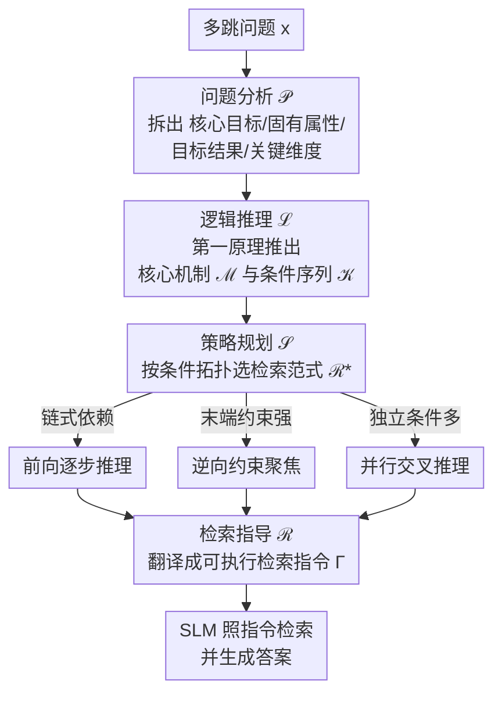

# FutureMind: Equipping Small Language Models with Strategic Thinking-Pattern Priors via Adaptive Knowledge Distillation

**会议**: ICLR 2026  
**arXiv**: [2602.01222](https://arxiv.org/abs/2602.01222)  
**代码**: 无  
**领域**: 知识蒸馏/RAG  
**关键词**: 小语言模型, 思维模式蒸馏, 检索策略, 多跳问答, 模块化推理

## 一句话总结
提出FutureMind无训练框架，将LLM的结构化推理和检索策略蒸馏为可复用的思维模式先验，通过四阶段pipeline（问题分析→逻辑推理→策略规划→检索指导）和三种检索范式，使SLM在多跳QA上达到SOTA。

## 研究背景与动机

**领域现状**：LLM在复杂推理任务上表现优秀但推理延迟高、成本大；SLM高效低成本但在知识密集型多跳推理上能力不足。RAG帮助SLM获取外部知识，但单步检索难以处理复杂多跳问题。

**现有痛点**：现有的"深度搜索"方法（如Search-o1）将检索嵌入推理链，但对SLM的记忆容量和上下文保持能力要求太高。CoT蒸馏传递推理痕迹但缺乏适应性；Prompt蒸馏编码静态模板不支持动态规划。

**核心矛盾**：SLM需要"显式检索逻辑"来决定何时、搜什么、怎么搜，但这种逻辑需要强大的推理能力来执行——而这正是SLM所缺乏的。

**本文目标**：如何让SLM获得结构化推理和战略性检索规划的能力，而无需梯度更新？

**切入角度**：不蒸馏具体知识（会过时），而蒸馏思维模式——先让LLM生成完整的推理-检索策略，再将这个策略模板以prompt形式注入SLM。

**核心 idea**：用LLM生成结构化检索策略作为SLM的思维先验，四阶段流水线保证推理的系统性。

## 方法详解

### 整体框架
FutureMind 要解决的问题是：让小语言模型（SLM）也能完成需要结构化推理 + 多跳检索的复杂问答，但又不付出训练代价。它的做法是把"怎么想、怎么搜"外包给一个 LLM 教师——教师在单轮内把推理-检索策略想清楚，SLM 只负责照着执行。整条 pipeline 由思维模块（Thinking Module $\mathcal{M}$）统一协调，串起四个阶段：$F = \mathcal{M}\langle\mathcal{P}, \mathcal{L}, \mathcal{S}, \mathcal{R}\rangle$——问题分析 $\mathcal{P}$ 把问题拆开、逻辑推理 $\mathcal{L}$ 推出条件、策略规划 $\mathcal{S}$ 从三种检索范式里挑最合适的一种、检索指导 $\mathcal{R}$ 把策略落成可执行的检索指令，最后 SLM 按指令检索并作答。全程无梯度更新（training-free）。

### 关键设计

**1. 问题分析模块 $\mathcal{P}$：先把混乱的复杂问题拆成结构化的几块**

SLM 直接面对一个多跳问题往往抓不住要点，这个模块先把输入 query 拆解为四个要素：核心目标 $\mathcal{O}$、固有属性 $\mathcal{A}$、目标结果 $\mathcal{T}$ 和关键维度 $\mathcal{C}$。拆完之后，原本一团乱的问题变成一组有标签的子目标，为后面的逻辑推理和检索规划建立结构化基础，避免 SLM 一上来就被复杂语义淹没。

**2. 逻辑推理模块 $\mathcal{L}$：用第一原理从因果结构里推条件，而不是靠记忆**

SLM 的先验知识往往不完整，如果让它凭记忆补答案很容易出错。这个模块改走第一原理路线，从问题的因果结构出发推导出核心机制 $\mathcal{M}$ 和关键条件序列 $\mathcal{K}$。把"要满足哪些条件、按什么顺序"显式推出来，等于给后续检索画好了路线图，减少了 SLM 对自身不完整先验的依赖。

**3. 策略规划模块 $\mathcal{S}$：按条件拓扑动态挑一种最合适的检索范式**

不同问题的结构差别很大，用同一种检索套路并不划算。这个模块根据上一步得到的条件拓扑，动态选择最优检索策略 $\mathcal{R}^*$，候选是三种通用范式：(A) 前向逐步推理，从通用到具体逐步收窄候选集，$X_j = \{x \in X_{j-1} \mid \phi(K_j, x)=1\}$，适合链式依赖的问题；(B) 逆向约束聚焦，从最紧的约束开始反向扩展，适合末端约束很强的问题；(C) 并行交叉推理，对相互独立的条件并行搜索后取交集，适合独立条件多的问题。匹配问题结构来选范式，比固定一种检索方式更能压缩搜索空间。

**4. 检索指导模块 $\mathcal{R}$：把抽象策略翻译成 SLM 能直接执行的检索指令**

前面三步产出的还是认知层面的策略，SLM 没法直接拿去搜。这个模块负责弥合策略与实际检索之间的鸿沟，把推理策略落地成可执行的检索指令——具体到用哪些关键词、查哪些资源、按什么顺序发起查询、怎么筛选结果。这样 SLM 只需照着指令执行，把"想清楚怎么搜"的重活交给了前面的教师策略。

### 损失函数 / 训练策略
- 完全无训练（training-free），纯prompt engineering
- 用Google Web Search API检索top-10结果
- 结合ToolCall(TC)框架实现并行搜索

## 实验关键数据

### 主实验
四个多跳QA基准（3B SLM上）：

| 方法 | 2WikiMQA | MuSiQue | Bamboogle | FRAMES | 平均 |
|------|----------|---------|-----------|--------|------|
| Naive (无检索) | 低 | 低 | 低 | 低 | 低 |
| Standard RAG | 中 | 中 | 中 | 中 | 中 |
| Search-o1 | 高 | 高 | 高 | 高 | 高 |
| FutureMind (3B) | **最高** | **最高** | **最高** | **最高** | **SOTA** |

### 跨模型验证

| 模型规模 | Qwen-2.5 3B | Qwen-2.5 7B | Qwen-2.5 72B | Llama-3.1 8B |
|----------|------------|------------|-------------|-------------|
| FutureMind增幅 | **最大** | 大 | 中 | 大 |

### 关键发现
- FutureMind在SLM(3B)上的增幅最大，说明思维模式蒸馏对能力弱的模型帮助更大
- 在72B LLM上也有提升，说明显式检索策略对大模型也有价值
- 发现"认知偏差瓶颈"：当教师策略超出学生认知能力时，蒸馏变成有损的——推理链断裂并放大噪声
- 三种检索范式中，并行交叉在独立条件多的问题上优势明显

## 亮点与洞察
- **思维模式蒸馏 vs 知识蒸馏**：不蒸馏具体答案或推理步骤，而蒸馏"如何思考和规划检索"的策略模式。这种策略不依赖具体知识，可泛化到未见问题。
- **认知偏差瓶颈**的发现：教师太强反而可能生成学生无法理解的策略，教师-学生兼容性比教师大小更重要。对蒸馏研究有指导意义。
- **三种检索范式**：将多跳检索抽象为三种通用模式（前向/后向/并行），可迁移到其他需要结构化检索的任务。

## 局限与展望
- 依赖LLM教师生成策略，教师质量直接限制上界
- 完全无训练意味着无法从错误中学习和改进
- Google搜索API的质量影响最终效果
- 策略选择（A/B/C）由LLM教师决定，SLM本身无法自主选择

## 相关工作与启发
- **vs Search-o1**: Search-o1在推理中嵌入检索但对SLM要求高，FutureMind预先生成检索策略降低SLM执行难度
- **vs ReAct**: ReAct是通用reasoning-acting范式，FutureMind专门为检索策略设计了三种范式更有针对性
- **vs CoT蒸馏**: CoT蒸馏传递推理步骤，FutureMind传递检索策略，层次更高

## 评分
- 新颖性: ⭐⭐⭐⭐ 思维模式蒸馏概念新颖，三种检索范式设计合理
- 实验充分度: ⭐⭐⭐⭐ 多模型、多数据集、多规模验证
- 写作质量: ⭐⭐⭐⭐ 框架描述清晰，形式化定义完整
- 价值: ⭐⭐⭐⭐ 对SLM部署和RAG优化有实用价值

<!-- RELATED:START -->

## 相关论文

- [\[ICLR 2026\] Knowledge Fusion of Large Language Models Via Modular Skillpacks](knowledge_fusion_of_large_language_models_via_modular_skillpacks.md)
- [\[ACL 2026\] LightReasoner: Can Small Language Models Teach Large Language Models Reasoning?](../../ACL2026/model_compression/lightreasoner_can_small_language_models_teach_large_language_models_reasoning.md)
- [\[ICLR 2026\] Pedagogically-Inspired Data Synthesis for Language Model Knowledge Distillation](pedagogically-inspired_data_synthesis_for_language_model_knowledge_distillation.md)
- [\[ICLR 2026\] Efficient Reasoning with Balanced Thinking](efficient_reasoning_with_balanced_thinking.md)
- [\[ICLR 2026\] Distillation of Large Language Models via Concrete Score Matching](distillation_of_large_language_models_via_concrete_score_matching.md)

<!-- RELATED:END -->
