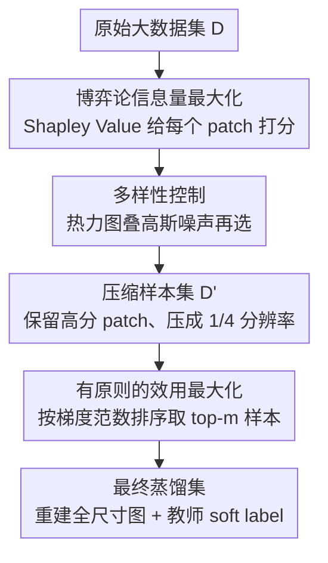

# Grounding and Enhancing Informativeness and Utility in Dataset Distillation

**会议**: ICLR 2026  
**arXiv**: [2601.21296](https://arxiv.org/abs/2601.21296)  
**代码**: 无  
**领域**: 数据集蒸馏  
**关键词**: Dataset Distillation, Shapley Value, 梯度范数, 信息量, 效用

## 一句话总结
提出InfoUtil框架，用博弈论Shapley Value最大化样本信息量（找到最重要的patch），用梯度范数最大化样本效用（选择对训练最有价值的样本），在ImageNet-1K上比前SOTA提升6.1%。

## 研究背景与动机

**领域现状**：数据集蒸馏旨在从大数据集中合成小型数据集，使模型训练效果接近原始数据。主流方法分为匹配类（matching-based, 如梯度匹配/轨迹匹配）和知识蒸馏类。知识蒸馏类方法（如RDED）性能更好但缺乏理论解释。

**现有痛点**：匹配类方法效率与性能难以兼顾（如轨迹匹配需4×A100）；知识蒸馏类方法（如RDED）用随机裁剪+启发式评分选patch，缺乏principled的理论保证——随机选的patch经常错过语义关键区域。

**核心矛盾**：如何在理论可解释的框架下同时解决两个问题：(1) 每个样本中哪些区域最重要（Informativeness）？(2) 哪些样本对训练最有价值（Utility）？

**本文目标**：为数据集蒸馏提供理论基础，定义最优蒸馏，并据此设计算法。

**切入角度**：提出Informativeness（patch级别，衡量信息量）和Utility（样本级别，衡量训练价值）两个概念，数学化定义最优蒸馏，用Shapley Value做信息量归因，用梯度范数做效用评估。

**核心 idea**：Shapley Value选最重要的patch + 梯度范数选最有价值的样本 = 理论有基础的最优蒸馏。

## 方法详解

### 整体框架
InfoUtil 先把"什么是好的蒸馏数据集"拆成两个可量化的问题——每张图里哪些区域最值得保留（Informativeness，patch 级别），以及哪些样本最值得放进蒸馏集（Utility，样本级别）——再分别用一个有理论根据的指标去近似它们。整条流水线分两个阶段：第一阶段用 Shapley Value 给每张图的所有 patch 打信息量分，并在热力图上叠一层高斯噪声做多样性控制，挑出最 informative 的 patch 压缩成 $\mathcal{D}'$；第二阶段用梯度范数给 $\mathcal{D}'$ 里每个压缩样本估训练价值，取 top-$m$ 得到最终蒸馏集 $\tilde{\mathcal{D}}$。最后把保留的 patch 重建成正常分辨率图像，并从教师模型生成 soft label。

### 关键设计

**1. 博弈论信息量最大化：把"哪个 patch 重要"变成可证明的归因问题**

RDED 这类方法靠随机裁剪加启发式评分挑 patch，经常错过语义关键区域，且没有任何理论保证哪块该留。InfoUtil 把一张图看成一局合作博弈：每个 patch 是一个玩家，模型对图的预测是这局博弈的收益，单个 patch 的信息量就用它的 Shapley Value 来衡量——

$$\phi_f(x^{(i)}) = \frac{1}{d}\sum_{s:s_i=0}\binom{d-1}{\mathbf{1}^\top s}\bigl(f(x\circ(s+e_i)) - f(x\circ s)\bigr)$$

直观说，它枚举所有"已选 patch 子集 $s$"，看加进第 $i$ 个 patch 后预测变化多少，再按子集大小加权平均。Shapley Value 之所以被选中，是因为它是唯一同时满足线性、虚拟、对称、效率四条公理的归因方法，理论上最站得住脚；保留 Shapley 值最高的 patch，等价于保留对模型判别贡献最大的区域。精确计算需要 $2^{16}$ 量级的子集推理，无法承受，因此实际用 KernelShap 做快速估计。

**2. 多样性控制：给 Shapley 热力图加噪，避免所有样本都盯同一块**

纯 Shapley 归因有个副作用：同类样本往往把高分集中在相似位置（比如总挑动物头部），导致蒸馏集里 patch 选择高度同质。为此在挑 patch 之前，先在 Shapley 归因热力图上叠一层高斯噪声 $\phi + \varepsilon,\ \varepsilon \sim \mathcal{N}(0, \sigma^2)$ 再做选择，让不同样本在各自的高信息量区域里有机会选到不同 patch，从而提升蒸馏集的覆盖多样性。这一步还在 patch 级别上，是对设计 1 选区结果的一次去同质化校正。

**3. 有原则的效用最大化：用一个可算的上界替掉昂贵的"留一实验"**

知道每张图该留哪块之后，还要决定哪些样本整体最该进蒸馏集。理想的效用 $\mathcal{U}$ 衡量"有没有这个样本对训练的影响差多少"，但直接算它要对每个样本做一次有/无对照实验，开销不可接受。本文的 Theorem 1 给出一个可计算的上界，把效用绑定到样本在当前参数下的梯度范数上——

$$\mathcal{U}(x_i, y_i; f_{\theta^{(t)}}) \leq c\,\|\nabla_{\theta^{(t)}}\ell_t(f_{\theta^{(t)}}(x_i), y_i)\|$$

梯度范数越大，说明该样本对参数更新推动越强、训练影响越大，因此直接按梯度范数排序取 top-$m$ 就能近似挑出最高效用的样本。梯度范数用教师模型的中间检查点来算，避免依赖最终收敛模型。

### 损失函数 / 训练策略
- Shapley Value 用 KernelShap 快速估计，避免 $2^{16}$ 次精确子集推理。
- 梯度范数与 soft label 均从教师模型的中间检查点获取。
- patch 压缩为 1/4 分辨率，4 张压缩图拼成 1 张全尺寸图后再训练。

## 实验关键数据

### 主实验
ResNet-18, IPC=50 (每类50张)：

| 数据集 | 方法 | Top-1 Acc | 提升 |
|--------|------|-----------|------|
| ImageNet-1K | RDED (前SOTA) | 基线 | — |
| ImageNet-1K | **InfoUtil** | 基线+6.1% | +6.1% |
| ImageNet-100 | RDED | 基线 | — |
| ImageNet-100 | **InfoUtil** | 基线+16% | +16% |
| CIFAR-10 IPC50 | RDED | 62.1 | — |
| CIFAR-10 IPC50 | **InfoUtil** | **71.0** | +8.9% |

### 消融实验

| 配置 | ImageNet-1K Acc | 说明 |
|------|----------------|------|
| Full InfoUtil | 最优 | Shapley + 梯度范数 |
| 随机patch (无Shapley) | 显著下降 | 信息量选择很关键 |
| 随机样本选择 (无梯度范数) | 下降 | 效用排序有价值 |
| 无多样性噪声 | 略降 | 多样性有帮助 |

### 关键发现
- Shapley Value选的patch对准了语义关键区域（如动物的头部而非背景），RDED的随机裁剪经常选到无关背景
- 梯度范数作为效用评估指标简单有效——高梯度范数样本确实对训练更重要
- 在ImageNet-1K这样的大规模数据集上提升仍然显著(6.1%)，说明方法可扩展
- 跨架构泛化：用ResNet-18蒸馏的数据在ResNet-101上评估仍有显著提升

## 亮点与洞察
- **理论基础扎实**：从Informativeness和Utility两个概念出发定义最优蒸馏(Definition 4)，再用Shapley和梯度范数分别近似——整个流程有理论支撑而非启发式。
- **Shapley Value做图像归因**用于数据集蒸馏是首次，且效果远超随机裁剪。这个思路可以推广到其他需要"选最重要区域"的场景。
- **效用=梯度范数上界**的定理(Theorem 1)给出直觉清晰的计算替代——梯度大的样本对训练"动量"影响大，应优先保留。

## 局限与展望
- Shapley Value计算即使用KernelShap仍有一定开销，在超大规模(>1M图像)上效率待验证
- 压缩为1/4分辨率是固定设置，自适应压缩率可能更优
- 梯度范数只用了一个检查点，多检查点的集成评估可能更鲁棒
- 仅在分类任务上验证，检测/分割等密集预测任务未探索

## 相关工作与启发
- **vs RDED**: RDED随机裁剪+启发式评分，InfoUtil用Shapley+梯度范数，理论性更强，性能好6.1%-16%
- **vs SRe2L**: SRe2L是另一种知识蒸馏方法，InfoUtil在所有IPC设置上都大幅超越
- **vs 匹配类方法(MTT/DATM)**: 匹配类在小数据集上有竞争力但对大数据集不可扩展，InfoUtil兼顾大小数据集

## 评分
- 新颖性: ⭐⭐⭐⭐ Shapley Value用于蒸馏patch选择是首次，理论框架完整
- 实验充分度: ⭐⭐⭐⭐⭐ 7个数据集、3种架构、多IPC设置、跨架构泛化
- 写作质量: ⭐⭐⭐⭐ 理论定义清晰，定理证明完整
- 价值: ⭐⭐⭐⭐ 为数据集蒸馏提供了有理论基础的新范式

<!-- RELATED:START -->

## 相关论文

- [\[ICLR 2026\] Understanding Dataset Distillation via Spectral Filtering](understanding_dataset_distillation_via_spectral_filtering.md)
- [\[CVPR 2025\] Enhancing Dataset Distillation via Non-Critical Region Refinement](../../CVPR2025/model_compression/enhancing_dataset_distillation_via_non-critical_region_refinement.md)
- [\[ICLR 2026\] Rectified Decoupled Dataset Distillation: A Closer Look for Fair and Comprehensive Evaluation](rectified_decoupled_dataset_distillation_a_closer_look_for_fair_and_comprehensiv.md)
- [\[ICLR 2026\] Dataset Distillation as Pushforward Optimal Quantization](dataset_distillation_as_pushforward_optimal_quantization.md)
- [\[ICLR 2026\] Enhancing Multivariate Time Series Forecasting with Global Temporal Retrieval](enhancing_multivariate_time_series_forecasting_with_global_temporal_retrieval.md)

<!-- RELATED:END -->
