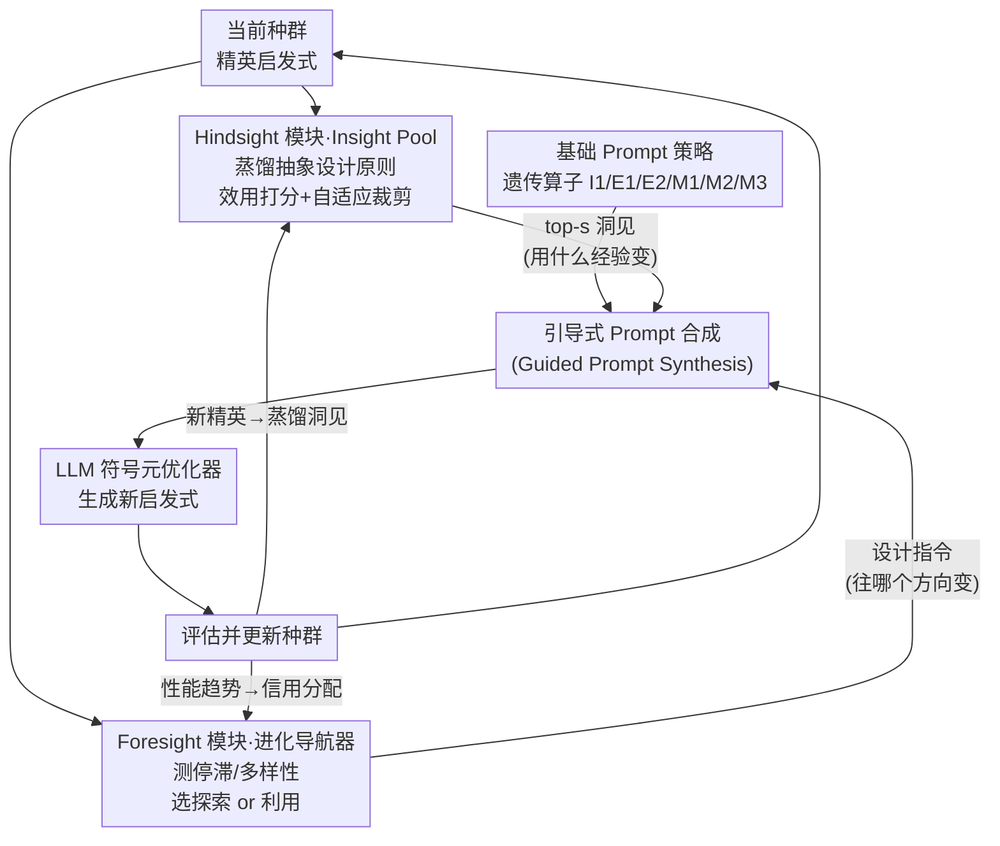

# HiFo-Prompt: Prompting with Hindsight and Foresight for LLM-based Automatic Heuristic Design

**会议**: ICLR 2026  
**arXiv**: [2508.13333](https://arxiv.org/abs/2508.13333)  
**代码**: [GitHub](https://github.com/Challenger-XJTU/HiFo-Prompt)  
**领域**: 模型压缩  
**关键词**: 自动启发式设计, LLM+进化计算, 知识管理, 探索-利用平衡, 组合优化

## 一句话总结
提出 HiFo-Prompt 框架，通过 Hindsight（回顾式知识池）和 Foresight（前瞻式进化导航器）两个协同模块提升 LLM 驱动的自动启发式设计（AHD），在 TSP 和 FSSP 等任务上显著超越现有方法。

## 研究背景与动机
LLM + 进化计算（EC）的范式（如 FunSearch、EoH）已展现出以 LLM 作为高层语义变异算子来自动设计启发式算法的潜力。但现有方法面临两个根本性挑战：

**缺乏全局自适应引导**：现有方法多依赖局部或反应式信号——ReEvo 仅对单个候选进行反思，MCTS-AHD 将探索-利用权衡被动嵌入搜索结构。这些局部控制无法对种群停滞或多样性崩溃等系统性问题做出主动干预。另一种方式如 EvoTune 直接微调 LLM 权重，但计算代价高昂且使知识不可解释。

**知识衰退（Knowledge Decay）**：成功的设计策略往往纠缠在具体代码实现中，当父代被淘汰后，底层逻辑也随之丢失。系统无法实现累积学习，反复重新发现相似概念。

核心idea：将 LLM 从"代码生成器"提升为"符号元优化器"，赋予其分层控制能力——Foresight 观察种群动态以引导宏观策略，Hindsight 从精英个体中蒸馏可复用的设计原则。

## 方法详解

### 整体框架
HiFo-Prompt 把 LLM 当成进化循环里的"符号元优化器"：每一代不是简单地让 LLM 生成代码，而是先合成一段"引导式 Prompt"（Guided Prompt Synthesis），再让 LLM 据此产出新启发式。这段 Prompt 由三部分拼成——基础 Prompt 策略（充当遗传算子，决定这次是初始化、重组还是变异）、Hindsight 模块（把历史精英里蒸馏出的设计原则注入进来）、Foresight 模块（根据当前种群状态下达"该探索还是该利用"的宏观指令）。前者负责"怎么变"，后两者分别负责"用什么经验变"和"往哪个方向变"。整个系统是一个自演化闭环：LLM 产出的新启发式经评估后更新种群，新精英又被蒸馏成洞见回灌 Hindsight、其性能趋势反馈给 Foresight，让两个引导模块越用越准。

### 关键设计

**1. Hindsight 模块：用自演化的 Insight Pool 对抗知识衰退**

现有 LLM+EC 方法的成功策略往往纠缠在具体代码里，父代一旦被淘汰，背后的设计逻辑也跟着丢失，系统只能反复重新发现相似概念。Hindsight 的做法是把"思维"和"代码"解耦：每代结束时从精英个体中提取抽象的设计原则（insights），单独存进一个持久的知识池。整个池子按三个阶段自演化——*洞见提取与准入*阶段用 Jaccard 相似度阈值 $\theta_{\text{novelty}}$ 给新洞见去重，避免重复入库；*洞见检索与信用分配*阶段挑出效用最高的 top-$s$ 个洞见注入 Prompt，效用函数同时平衡有效性、使用惩罚和新近度奖励：

$$U(k_i, t) = E_i(t) - w_u \log(N_i(t)+1) + B_r(t, t_i^{\text{last}})$$

*自适应裁剪*阶段在池容量超限时淘汰驱逐分数最低的洞见。信用如何分配是这套机制的关键：它用一个分段函数把种群的相对性能 $\tilde{\rho}$ 映射成信用信号——超越当前最优时 $g_{\text{eff}} = 0.8 + 0.2\tilde{\rho}$，高于均值时 $0.2 + 0.6\tilde{\rho}$，低于均值时 $-0.3 + 0.5\tilde{\rho}$，再通过 EMA 平滑更新每个洞见的效用分数。这样一来，带来真实进步的洞见效用会被持续抬高、长期保留，而无效洞见会逐渐被惩罚、被裁掉，相当于把强化学习里"稀疏奖励的信用分配"搬到了知识管理上，让一时的进化成功沉淀成可复用的资产。

**2. Foresight 模块：用进化导航器提供可解释的全局控制**

EoH、ReEvo 这类方法的控制信号是局部或反应式的——只对单个候选反思，无法对种群停滞、多样性崩溃这种系统性问题主动干预。Foresight 把全局状态显式建模出来：它维护两个互斥计数器 $C_{\text{prog}}$（进步）和 $C_{\text{stag}}$（停滞）跟踪性能趋势，同时计算表型多样性 $\Delta_p(t)$，即种群中所有算法描述文本两两之间的非重复对比例。基于这些信号，一套阈值规则在三种进化体制间切换：停滞或多样性偏低时走 $\theta_{\text{explore}}$（鼓励探索），持续进步时走 $\theta_{\text{exploit}}$（加紧利用），其余情况走 $\theta_{\text{balance}}$。值得注意的是，多样性度量刻意用精确字符串匹配而非嵌入相似度——因为嵌入会把语义"抹平"，让细微但关键的逻辑差异被误判成重复。这个模块本质上是"语言梯度"的符号替代品：不去微调权重，而是用一条自然语言"设计指令"显式告诉 LLM 当前该往哪个方向走，控制策略因此是可解释的。

**3. 基础 Prompt 策略：LLM 版的遗传算子**

这部分给进化过程提供"怎么变"的原子操作，相当于把传统 EC 的遗传算子翻译成 LLM 能执行的 Prompt 指令：初始化策略 I1 负责生成第一代候选；重组策略有两种——E1 综合多个父代拼出新结构、E2 抽象出共性再产生变体；变异策略有三种——M1 做结构修改、M2 做参数调优、M3 做简化以防过拟合。Foresight 给出的宏观指令最终就是通过选择和组合这些基础算子来落地的。

### 训练策略
种群大小 8，组合优化（CO）任务运行 8 代、贝叶斯优化（BO）任务 4 代。LLM 使用 Qwen2.5-Max。Insight Pool 容量 30，Jaccard 阈值 0.7，检索 top-3，EMA 率 0.3，停滞阈值 3，进步阈值 2，多样性阈值 0.3。

## 实验关键数据

### TSP Step-by-step Construction 主实验

| 方法 | TSP50 Gap(%) | TSP100 Gap(%) | TSP200 Gap(%) |
|------|-------------|---------------|---------------|
| LKH3 | 0.000 | 0.000 | 0.000 |
| EoH | 12.820 | 15.361 | 16.658 |
| ReEvo | 10.239 | 12.577 | 14.890 |
| MCTS-AHD | 10.642 | 12.521 | 13.510 |
| **HiFo-Prompt** | **6.625** | **8.582** | **8.877** |

### TSP Guided Local Search

| 方法 | TSP100 Gap(%) | TSP200 Gap(%) | TSP500 Gap(%) |
|------|-------------|---------------|---------------|
| EoH | 0.026 | 0.453 | 2.037 |
| ReEvo | 0.049 | 0.424 | 2.090 |
| HSEvo | 0.087 | 0.886 | 2.507 |
| **HiFo-Prompt** | **0.015** | **0.382** | **1.520** |

### 关键发现
- TSP step-by-step 上 HiFo-Prompt 将 Gap 从 ~13% 降至 ~8%，相对改进约40%
- Insight Pool 的信用分配机制有效引导知识演化，避免低效洞见持续占用资源
- Foresight 的自适应策略切换对避免早熟收敛至关重要
- 在 Bayesian Optimization 任务上表现竞争力和可靠性

## 亮点与洞察
- "代码与思维解耦"理念新颖——独立更新和评价insights而非直接进化代码，大幅降低评估成本
- Insight Pool 的生命周期管理（提取→检索→信用分配→裁剪）设计精巧，类比强化学习中稀疏奖励的处理
- 探索-利用的显式控制通过自然语言"设计指令"实现，是参数调优的符号替代方案

## 局限与展望
- 种群动态的判断依赖多个手工阈值（停滞=3、进步=2、多样性=0.3），缺乏自适应调节
- 实验基模型仅为 Qwen2.5-Max，不同LLM对Prompt策略的响应可能差异显著
- Insight Pool 中洞见的语义相似度仅用 Jaccard 度量，可能遗漏语义相近但词汇不同的重复洞见

## 相关工作与启发
- **vs EoH**: EoH缺乏知识持久化和全局控制，HiFo-Prompt通过Insight Pool和Navigator弥补这两个不足
- **vs ReEvo**: ReEvo仅对单个候选反思，HiFo-Prompt对整个种群进行宏观监控

## 评分
- 新颖性: ⭐⭐⭐⭐⭐ 代码-思维解耦和符号元优化的idea非常新颖
- 实验充分度: ⭐⭐⭐⭐ 覆盖TSP/BPP/FSSP/BO多任务，但缺少更大规模实例
- 写作质量: ⭐⭐⭐⭐ 方法描述详细清晰，公式丰富
- 价值: ⭐⭐⭐⭐ 为LLM驱动的自动算法设计提供了系统性框架

<!-- RELATED:START -->

## 相关论文

- [\[ACL 2026\] LLM Prompt Duel Optimizer: Efficient Label-Free Prompt Optimization](../../ACL2026/model_compression/llm_prompt_duel_optimizer_efficient_label-free_prompt_optimization.md)
- [\[ICLR 2026\] ODESteer: A Unified ODE-Based Steering Framework for LLM Alignment](odesteer_a_unified_ode-based_steering_framework_for_llm_alignment.md)
- [\[ICLR 2026\] ParoQuant: Pairwise Rotation Quantization for Efficient Reasoning LLM Inference](paroquant_pairwise_rotation_quantization_for_efficient_reasoning_llm_inference.md)
- [\[ICLR 2026\] NerVE: Nonlinear Eigenspectrum Dynamics in LLM Feed-Forward Networks](nerve_nonlinear_eigenspectrum_dynamics_in_llm_feed-forward_networks.md)
- [\[ICLR 2026\] Multi-View Encoders for Performance Prediction in LLM-Based Agentic Workflows](multi-view_encoders_for_performance_prediction_in_llm-based_agentic_workflows.md)

<!-- RELATED:END -->
