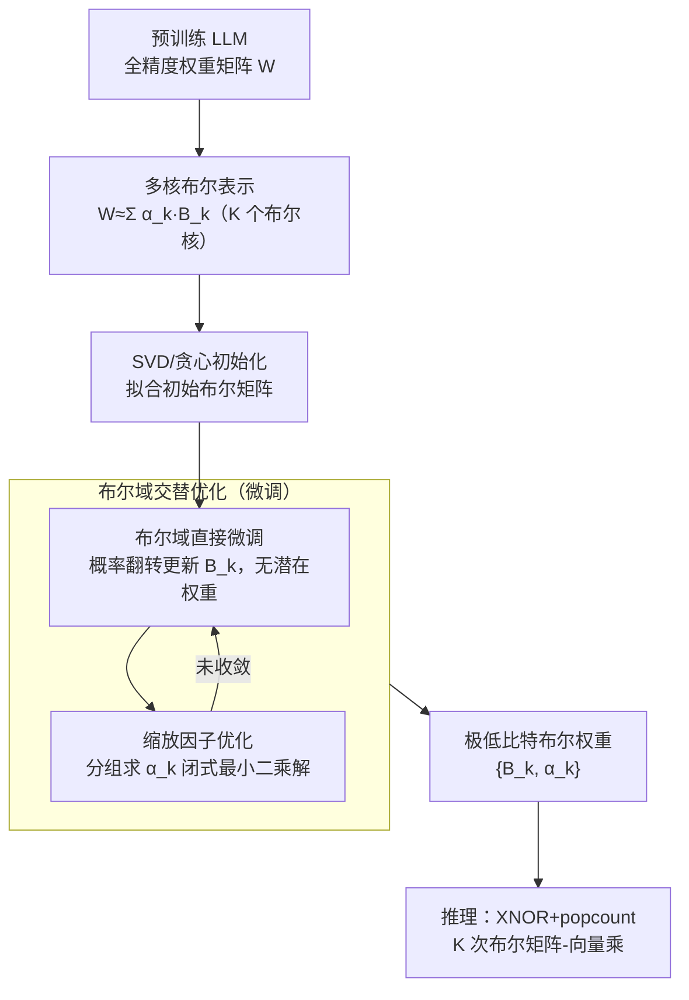

# Highly Efficient and Effective LLMs with Multi-Boolean Architectures

**会议**: ICLR 2026  
**arXiv**: [2505.22811](https://arxiv.org/abs/2505.22811)  
**代码**: 无  
**领域**: 模型压缩  
**关键词**: 权重二值化, 布尔参数, 极低比特量化, 大语言模型, 直接微调

## 一句话总结

提出一种用多核布尔参数（multi-kernel Boolean parameters）表示 LLM 权重的新框架，首次实现在布尔域中直接微调大语言模型，无需全精度潜在权重，在表征能力和计算效率上同时超越现有超低比特量化和二值化方法。

## 研究背景与动机

权重二值化（weight binarization）是降低大语言模型复杂度的有力策略，将权重从32位浮点压缩到1位，理论上可实现32倍压缩比和显著的推理加速（乘法变为加减法）。

**现有二值化方法的根本困境**：

**后训练二值化（Post-training binarization）**：
   - 方法简单，将训练好的权重直接二值化
   - 但造成**严重的性能损失**——1-bit 量化的信息丢失太大，模型质量急剧下降
   - 对于大语言模型，这种性能退化往往是不可接受的

**训练感知二值化（Training-aware binarization）**：
   - 在训练/微调过程中进行二值化，通过梯度信号调整二值权重
   - 需要维护**全精度的潜在权重**（latent weights）来累积梯度
   - 前向传播用二值权重，反向传播用全精度权重更新
   - 问题：潜在权重增加了额外的复杂性和内存开销，严重限制了效率优势
   - 二值权重的表达能力有限（每个权重只有 +1/-1 两个状态）

**核心矛盾**：后训练方法太粗糙，训练感知方法太笨重。能否在**不使用全精度潜在权重**的情况下，直接在布尔域微调？

## 方法详解

### 整体框架

这篇论文要解决的是「超低比特下既要表达力、又不想背上全精度潜在权重」这对矛盾。它的做法是把 LLM 的每个权重矩阵表示成多个布尔矩阵的加权组合（多核布尔架构）：每个权重元素不再被压成单一的 $\{-1, +1\}$，而是若干布尔核（Boolean kernel）的线性叠加，在保持布尔运算友好性的前提下把表达力撑回到接近多比特量化。整条流水线从预训练权重出发——先用 SVD/贪心拟合出初始的多核布尔矩阵，再在布尔域内交替优化：靠概率翻转直接更新布尔矩阵 $B_k$（不保留任何全精度副本），同时用闭式解按分组刷新缩放因子 $\alpha_k$，两步轮流迭代直到收敛，最终得到一组可直接用 XNOR+popcount 推理的极低比特权重。

### 关键设计

**1. 多核布尔参数表示：用 $2^K$ 个级别突破单核二值化的表达瓶颈**

单核二值化把权重写成 $W \approx \alpha \cdot B$，其中 $B \in \{-1, +1\}^{m \times n}$、$\alpha$ 是单个缩放因子，每个权重元素只有正负两种状态，信息容量被压到极限，这正是后训练二值化掉点严重的根源。本文改为多核形式 $W \approx \sum_{k=1}^{K} \alpha_k \cdot B_k$，用 $K$ 个独立布尔矩阵 $B_k$ 配各自的缩放因子 $\alpha_k$ 加权求和。这样 $K$ 个核的组合就能表达 $2^K$ 个不同权重级别，$K=2$ 大致等效 2-bit 量化、$K=3$ 约等于 3-bit，表达力随核数指数增长而非线性堆叠。关键是这并不牺牲布尔运算的硬件优势：矩阵乘法 $Wx$ 被自然分解成 $K$ 次布尔矩阵与向量的乘法，每次都能用 XNOR+popcount 高效实现，于是「表达力涨上去、算子留在布尔域」二者兼得。

**2. 布尔域直接微调：把离散翻转建模为概率事件，彻底甩掉潜在权重**

这是全文最核心的贡献，针对的是训练感知二值化「为了能用梯度下降而被迫背上全精度影子权重」的笨重。布尔变量 $\{-1, +1\}$ 是离散的，无法直接用连续梯度优化，传统做法只能额外维护一份全精度潜在权重 $W_{\text{latent}} \in \mathbb{R}$，前向取 $\text{sign}(W_{\text{latent}})$ 当布尔值、反向靠直通估计器（straight-through estimator, STE）把梯度灌回 $W_{\text{latent}}$——这份影子权重正是内存开销和效率退化的来源。本文索性不保留潜在权重，而是把每个布尔元素的「翻转（flip）」建模成概率事件，依据损失函数对该元素翻转所带来的预期改进来决定翻不翻。由于优化对象始终是布尔矩阵本身，既避开了 STE 的梯度偏差，又省掉全精度副本的存储，训练和推理因此统一在极低精度下完成。

**3. 缩放因子的分组闭式优化：让 $\alpha_k$ 几乎免费地跟上 $B_k$**

布尔矩阵 $B_k$ 一旦确定，对应的缩放因子 $\alpha_k$ 就退化成一个最小二乘问题，可直接用闭式解求出、无需迭代搜索。于是训练采用交替优化：固定 $\alpha$ 更新布尔矩阵 $B$（用设计 2 的概率翻转），再固定 $B$ 用闭式解刷新 $\alpha$，两步轮流，因为 $\alpha$ 那一步是解析解，整个过程几轮即收敛、几乎不增加计算负担。而要让 $\alpha$ 真正发挥作用还需控制粒度：若整层只共享一组缩放因子则太粗、会丢精度，所以按列或按块把权重矩阵切成若干组，每组配一套独立的 $\alpha_k$。多出来的参数仅是这些缩放因子、量级极小，却能明显抬高量化精度；分组大小就是精度与压缩率之间的旋钮——组越小越精细、压缩率略降，实验中 128 是常用折中点。

### 损失函数 / 训练策略

微调直接沿用标准的语言模型交叉熵损失，优化目标就是这套布尔参数 $\{B_k, \alpha_k\}$：

$$\mathcal{L} = -\sum_{t} \log P(x_t | x_{<t}; \{B_k, \alpha_k\})$$

整个流程从预训练权重出发，先用 SVD 或贪心搜索把初始的多核布尔矩阵拟合出来，再在小规模数据上交替优化布尔矩阵与缩放因子。由于不需要全精度潜在权重，微调时的内存占用远低于传统训练感知方法，而且对数据量要求很低，通常几千条样本就足以收敛。

## 实验关键数据

### 主实验

在多个 LLM 架构上评估（包括 LLaMA 系列等），测量困惑度（perplexity）和下游任务性能：

| 方法 | 比特宽度 | LLaMA-7B PPL ↓ | LLaMA-13B PPL ↓ | 压缩比 |
|------|---------|----------------|-----------------|--------|
| 全精度 | 16 bit | 基线 | 基线 | 1× |
| GPTQ | 3 bit | 中等 | 中等 | ~5× |
| RTN | 2 bit | 较高 | 较高 | ~8× |
| BiLLM | 1 bit | 很高 | 很高 | ~16× |
| OneBit | 1 bit | 高 | 高 | ~16× |
| **多核布尔 (K=2)** | **~1.5 bit** | **较低** | **较低** | **~10×** |
| **多核布尔 (K=3)** | **~2 bit** | **最低** | **最低** | **~8×** |

在超低比特（1-2 bit）范围内，多核布尔方法显著优于所有现有二值化和量化技术。

### 消融实验

| 配置 | 效果说明 |
|------|---------|
| K=1（标准二值化） | 性能最差，但压缩最大 |
| K=2 | 性能大幅提升，接近 2-bit 量化 |
| K=3 | 性能进一步提升，与 3-bit GPTQ 竞争力强 |
| 有潜在权重 vs. 无潜在权重 | 布尔域直接微调性能**不低于**使用潜在权重的方法 |
| 分组大小 128 vs. 256 vs. 全层 | 分组越小越精确，128为常用选择 |
| 不同初始化策略 | SVD 初始化优于随机初始化 |

### 关键发现

1. **多核布尔显著提升表达能力**：从 $K=1$ 到 $K=2$，困惑度下降幅度远大于从 2-bit 到 3-bit 量化的提升
2. **消除潜在权重是可行的**：布尔域直接微调不仅不损失性能，还简化了训练流程和内存占用
3. **在极低比特下优势最明显**：在 1-2 bit 范围内，多核布尔方法相比传统量化的优势最大
4. **跨架构泛化**：方法在 LLaMA-7B、13B 等不同规模模型上均表现一致
5. **训练效率显著**：无需全精度潜在权重，微调时内存占用减少约50%

## 亮点与洞察

1. **突破二值化的表达力瓶颈**：通过多核组合，将布尔参数从2个离散值扩展到 $2^K$ 个级别，这是一个简单而有效的想法
2. **首次布尔域直接微调**：消除对全精度潜在权重的依赖是重要的理论和实践突破——这意味着整个训练和推理流程都可以在极低精度下完成
3. **硬件友好**：多核布尔乘法本质上是 $K$ 次 XNOR+popcount 操作，在专用硬件上可实现极高吞吐量
4. **理论优雅性**：多核一值化可以看作一种结构化的低比特量化，其中每个量化级别由布尔组合确定，反可换一种理论分析视角
5. **实用性强**：微调数据需求小、内存占用低、部署简单

## 局限与展望

1. **推理速度依赖专用硬件**：虽然理论上 XNOR+popcount 极快，但现有 GPU 对布尔运算的硬件支持有限，实际加速可能不如理论预期
2. **K 值增大的边际收益递减**：K=4 以上的改进可能不够显著，而额外的核增加了并行度需求
3. **仅在语言模型上验证**：视觉模型、多模态模型等是否同样适用需要额外实验
4. **微调数据选择的影响**：文中未深入分析不同微调数据集对最终性能的影响
5. **与知识蒸馏的结合**：使用全精度教师模型指导布尔学生模型可能进一步提升性能
6. **激活也是布尔？**：当前仅二值化权重，激活仍为全精度，完全布尔化（权重+激活）是更激进的方向

## 相关工作与启发

- **BiLLM / OneBit**：现有 LLM 二值化方法，单核布尔表示，性能损失严重
- **GPTQ / AWQ**：后训练量化方法，支持 3-4 bit，但二值化支持差
- **BinaryBERT / BiBERT**：早期二值化 BERT 的工作，但规模远小于 LLM
- **QLoRA**：量化加低秩适配，但量化精度通常不低于4位

本文的核心启发：**将量化视为布尔空间中的表征问题**，而非简单的精度截断。多核布尔参数本质上是在极低比特预算下最大化表达能力的结构化方法。未来可探索：自适应核数分配（不同层使用不同 $K$）、与稀疏化的结合、在推理芯片上的实际加速效果。

## 评分
- 新颖性: ⭐⭐⭐⭐⭐
- 实验充分度: ⭐⭐⭐⭐
- 写作质量: ⭐⭐⭐⭐
- 价值: ⭐⭐⭐⭐

<!-- RELATED:START -->

## 相关论文

- [\[ICLR 2026\] AnyBCQ: Hardware Efficient Flexible Binary-Coded Quantization for Multi-Precision LLMs](anybcq_hardware_efficient_flexible_binary-coded_quantization_for_multi-precision.md)
- [\[AAAI 2026\] Don't Start Over: A Cost-Effective Framework for Migrating Personalized Prompts Between LLMs](../../AAAI2026/model_compression/dont_start_over_a_cost-effective_framework_for_migrating_personalized_prompts_be.md)
- [\[CVPR 2026\] TaskIT: Memory-Efficient Fine-Tuning of Multi-LoRA LLMs via Cross-Task Importance Transfer](../../CVPR2026/model_compression/taskit_memory-efficient_fine-tuning_of_multi-lora_llms_via_cross-task_importance.md)
- [\[ICML 2026\] BioArc: Discovering Optimal Neural Architectures for Biological Foundation Models](../../ICML2026/model_compression/bioarc_discovering_optimal_neural_architectures_for_biological_foundation_models.md)
- [\[ICLR 2026\] Draft-based Approximate Inference for LLMs](draft-based_approximate_inference_for_llms.md)

<!-- RELATED:END -->
