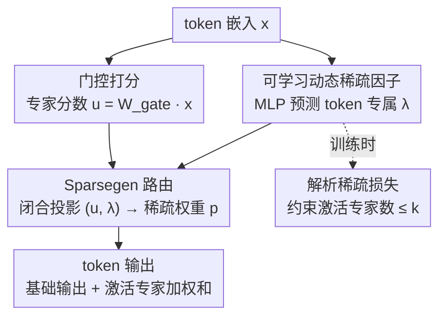

# LD-MoLE: Learnable Dynamic Routing for Mixture of LoRA Experts

**会议**: ICLR 2026  
**arXiv**: [2509.25684](https://arxiv.org/abs/2509.25684)  
**代码**: [GitHub](https://github.com/eshentw/LD-MoLE)  
**领域**: 模型压缩  
**关键词**: LoRA, Mixture-of-Experts, 动态路由, Sparsegen, parameter-efficient fine-tuning

## 一句话总结
提出 LD-MoLE，用 Sparsegen 闭合形式投影替代传统 TopK 路由，实现可微分、动态、token自适应的 LoRA 专家分配，配合轻量 MLP 预测稀疏因子和解析稀疏损失，在多个基准上超越固定路由和 ReLU 路由基线。

## 研究背景与动机
LoRA + MoE（即 MoLE）是大模型高效微调的有前途方向：多个低秩 LoRA 模块作为专家，路由网络决定每个 token 使用哪些专家。但现有方法普遍依赖 TopK 路由，存在三个痛点：

**超参敏感**: k 值需要仔细调节，不同任务最优 k 不同

**不可微分**: TopK 选择是离散操作，阻碍端到端优化

**固定分配**: 每个 token 激活相同数量的专家，无法适应复杂度差异

ReMoE 用 ReLU 路由尝试解决，但存在某些 token 可能分配不到任何专家的不稳定问题。核心问题是：能否设计一种既稳定可微又能自适应控制专家数量的路由机制？

LD-MoLE 的切入角度是利用 Sparsegen——一种概率单纯形上的闭合形式投影，保证每个 token 至少分配一个专家，同时通过可学习的稀疏参数 $\lambda$ 实现动态专家选择。

## 方法详解

### 整体框架
LD-MoLE 要解决的是「TopK 路由不可微、还要手调 k」这个老问题。它在每个 Transformer 层的线性投影处挂上多个 LoRA 专家，每来一个 token，路由模块读它的嵌入，沿两条并行支路工作：一条做门控打分给出专家分数 $\bm{u}$，另一条用轻量 MLP 预测这个 token 专属的稀疏因子 $\lambda$；两者一起喂进 Sparsegen 闭合投影，得到落在概率单纯形上的稀疏权重 $\bm{p}$——哪些专家被激活、各占多少分量全由它决定。最终该 token 的输出是基础权重的输出，再加上所有被激活专家的加权输出之和。训练时另有一支解析稀疏损失，直接借 $\lambda$ 把激活专家数压进目标范围。整条路由从打分到稀疏分配都是闭合形式、处处可微，因此能和主模型一起端到端训。

### 关键设计

**1. Sparsegen 路由：用闭合形式投影替代离散 TopK**

TopK 的毛病在于它是离散选择，选谁不选谁是硬跳变，没有良定义的梯度，端到端优化走不通。LD-MoLE 改用 Sparsegen：给定门控打出的专家分数 $\bm{u} = \bm{W}_{\text{gate}} \bm{x}$，求解带稀疏正则的投影问题

$$\bm{p} = \arg\min_{\bm{p}} \|\bm{p} - \bm{u}\|^2 - \lambda\|\bm{p}\|^2, \quad \text{s.t. } \bm{p} \geq 0,\ \mathbf{1}^\top \bm{p} = 1$$

它有闭合形式解 $\bm{p}_i = \left[\frac{\bm{u}_i - \tau}{1-\lambda}\right]_+$，其中 $\tau$ 是满足单纯形约束的阈值。这个解天然带稀疏性（被减到负的分量直接截成 0），同时处处有良定义的次梯度、上界有界，因此优化稳定。稀疏因子 $\lambda$ 像一个旋钮：$\lambda \to 1^-$ 时分配趋向极稀疏（只留少数专家），$\lambda \to -\infty$ 时趋向均匀分布（所有专家平摊）。

**2. 可学习动态稀疏因子：让每个 token 自己决定要多少专家**

固定 k 的根本问题是「一刀切」——所有 token 不论难易都激活同样数量的专家。但不同 token 的建模复杂度天差地别，复杂的 token 需要多个专家协同，简单的 token 一个就够。LD-MoLE 用一个轻量的共享 MLP $f(\bm{x}) = \lambda \in \mathbb{R}$，直接从 token 嵌入预测它专属的 $\lambda$，再喂给上面的 Sparsegen，从而 token 级地控制激活专家数。这个 MLP 按输入维度共享（通常只有 2 种），参数开销极小，却把「k 该设多少」从超参变成了模型自己学出来的量。

**3. 解析稀疏损失：直接用数学性质约束激活专家数**

光有动态 $\lambda$ 还不够，还需要一种机制把活跃专家数压到目标范围内，而且不能靠启发式硬调。LD-MoLE 利用 Sparsegen 的解析特性：根据 Proposition 2，恰好激活 $k$ 个专家对应一段确定的 $\lambda$ 区间 $[\lambda_{\text{lower}}(k), \lambda_{\text{upper}}(k))$。于是稀疏损失就写成 $\mathcal{L}_{\text{sparse}} = \text{ReLU}(\lambda_{\text{lower}}(k) - \lambda)$——当预测的 $\lambda$ 还没进入「至多 $k$ 个专家」的区间时施加惩罚，把它往稀疏方向推。整个约束直接从路由的数学性质推导出来，不需要任何启发式调参。

### 损失函数 / 训练策略
总损失：$\mathcal{L}_{\text{total}} = \mathcal{L}_{\text{LM}} + \alpha \mathcal{L}_{\text{lb}} + \beta \mathcal{L}_{\text{sparse}}$
- $\mathcal{L}_{\text{LM}}$: 标准交叉熵（下一token预测或序列分类）
- $\mathcal{L}_{\text{lb}}$: 负载均衡损失，防止路由崩溃
- $\mathcal{L}_{\text{sparse}}$: 稀疏控制损失

8个LoRA专家，rank=8，scaling=16。4×H200 GPU训练10 epoch。

## 实验关键数据

### 主实验

| 方法 | 模型 | MMLU-P | ARC-C | ARC-E | OBQA | CommQA | SWAG | HellaS | CoLA | RTE | Avg |
|------|------|--------|-------|-------|------|--------|------|--------|------|-----|-----|
| MoLA(8888) | Llama-3B | 40.3 | 71.6 | 83.5 | 81.0 | 79.8 | 83.6 | 87.5 | 85.8 | 90.6 | 78.2 |
| MoLA(2468) | Llama-3B | 42.3 | 71.9 | 83.9 | 83.6 | 80.0 | 84.0 | 87.3 | 86.0 | 89.5 | 78.7 |
| ReMoLE | Llama-3B | 48.0 | 75.3 | 89.3 | 83.4 | 79.5 | 90.5 | 93.4 | 84.0 | 89.5 | 81.4 |
| **LD-MoLE** | Llama-3B | **49.6** | 74.6 | **89.5** | 83.8 | 80.3 | **90.8** | **93.6** | 85.5 | **91.0** | **82.0** |
| **LD-MoLE** | Llama-8B | **56.0** | **83.7** | **91.6** | **88.0** | 83.0 | **92.3** | **95.5** | 85.3 | **91.3** | **85.2** |

### 消融实验

| 配置 | 平均分 | 说明 |
|------|--------|------|
| LD-MoLE (β=0) | 82.0 | 无稀疏损失，全性能 |
| LD-MoLE (β>0, k≤4) | ~81.5 | 减少活跃专家，轻微性能下降 |
| MoLA(2468) vs MoLA(8888) | 78.7→78.2 | 固定路由中层间分配更重要 |
| ReMoLE (不稳定) | CoLA急剧下降 | ReLU路由可能分配0专家 |

### 关键发现
- 动态路由在指令微调任务上普遍优于固定路由，而分类任务两者差异较小
- LD-MoLE 保证每个 token 至少一个专家（Lemma 1），避免了 ReMoLE 的不稳定问题
- 稀疏损失可有效减少活跃专家数量而不显著影响性能
- MoLA(2468) 优于 MoLA(8888)，说明固定路由下许多专家被浪费

## 亮点与洞察
- Sparsegen 在 MoE 路由中的应用是关键创新点，兼顾可微分性和稀疏性
- 共享 MLP 预测 $\lambda$ 的设计简洁高效，参数开销极小
- 解析稀疏损失直接从数学性质推导，不需要启发式

## 局限与展望
- 主实验只在 3B 和 1.7B 级别模型上验证，更大模型尚未测试
- 训练成本（4×H200, 10epoch）对于PEFT方法来说仍然较高
- 推理时的路由计算（排序+MLP）的具体延迟未报告

## 相关工作与启发
- **vs MoLA (TopK)**: LD-MoLE 自适应 k 值，避免超参调节
- **vs ReMoE (ReLU)**: LD-MoLE 保证至少分配一个专家，更稳定
- **vs Soft MoE**: LD-MoLE 是稀疏的，计算效率更高

## 评分
- 新颖性: ⭐⭐⭐⭐ Sparsegen路由在MoLE中的应用新颖，理论分析扎实
- 实验充分度: ⭐⭐⭐⭐ 多模型多任务评估，但缺少推理效率对比
- 写作质量: ⭐⭐⭐⭐ 数学推导清晰，但符号较多
- 价值: ⭐⭐⭐⭐ 为MoE路由提供了更好的数学框架

<!-- RELATED:START -->

## 相关论文

- [\[ICLR 2026\] Unveiling Super Experts in Mixture-of-Experts Large Language Models](unveiling_super_experts_in_mixture-of-experts_large_language_models.md)
- [\[ICLR 2026\] Coupling Experts and Routers in Mixture-of-Experts via an Auxiliary Loss](coupling_experts_and_routers_in_mixture-of-experts_via_an_auxiliary_loss.md)
- [\[CVPR 2026\] Teacher-Guided Routing for Sparse Vision Mixture-of-Experts](../../CVPR2026/model_compression/teacher-guided_routing_for_sparse_vision_mixture-of-experts.md)
- [\[CVPR 2026\] TAS-LoRA: Transformer Architecture Search with Mixture-of-LoRA Experts](../../CVPR2026/model_compression/tas-lora_transformer_architecture_search_with_mixture-of-lora_experts.md)
- [\[ICML 2026\] Parameters as Experts: Adapting Vision Models with Dynamic Parameter Routing](../../ICML2026/model_compression/parameters_as_experts_adapting_vision_models_with_dynamic_parameter_routing.md)

<!-- RELATED:END -->
