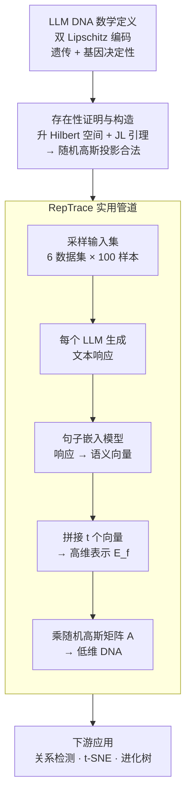

# LLM DNA: Tracing Model Evolution via Functional Representations

**会议**: ICLR 2026 Oral  
**arXiv**: [2509.24496](https://arxiv.org/abs/2509.24496)  
**代码**: [GitHub](https://github.com/Xtra-Computing/LLM-DNA)  
**领域**: 模型压缩  
**关键词**: LLM DNA, 模型进化树, 功能表示, 系统发育分析, 模型溯源

## 一句话总结
从生物学 DNA 类比出发，将 LLM DNA 数学定义为模型功能行为的低维双 Lipschitz 表示，证明其满足遗传和基因决定性属性，并设计了无需训练的 RepTrace 管道在 305 个 LLM 上提取 DNA、构建进化树。

## 研究背景与动机
Hugging Face 上有数百万个 LLM，它们通过微调、蒸馏、适配等方式相互衍生，但进化关系通常缺乏文档记录。追踪模型进化对安全审计（后门传递追踪）、模型治理（许可证合规验证）和多智能体系统设计都至关重要。

现有方法的局限：

**任务特定表示**（HybridLLM, RouteLLM）：为特定下游任务训练，不具通用性

**固定模型集表示**（EmbedLLM）：添加新模型需要重训练，非内在属性

**token/参数级比较**（Nikolic等）：依赖相同的分词器或架构，无法跨异构模型泛化

核心问题是：能否定义一种内在的、通用的 LLM "DNA"，使得功能相似的模型具有相近的 DNA，且 DNA 对微调等小扰动保持稳定？

核心idea：定义 LLM DNA 为从功能空间到低维空间的双 Lipschitz 映射，利用 Johnson-Lindenstrauss 引理证明存在性，用随机线性投影实现提取。

## 方法详解

### 整体框架
论文要回答的是：能不能给每个 LLM 算一个内在的、低维的"DNA"向量，使得功能相近的模型 DNA 也相近、微调这类小改动又不会让 DNA 漂走。整套方案分两层：理论层先把"DNA"形式化成功能空间到低维空间的双 Lipschitz（bi-Lipschitz）映射，并用 JL 引理证明这样的映射一定存在、并顺带导出"随机线性投影"就是合法构造；实现层则把这个构造落地成一条无需训练的 RepTrace 管道——给一组采样输入，让每个 LLM 生成文本响应，用句子嵌入模型把响应编码成语义向量并拼接，最后用一个随机高斯矩阵投影到低维 DNA 空间，得到的 DNA 再喂给下游的关系检测与进化树重建。

### 关键设计

**1. LLM DNA 的数学定义：用双 Lipschitz 把"遗传"和"基因决定性"写成不等式**

要让 DNA 真正像生物 DNA，得同时满足两件事：功能相近的模型 DNA 要近（基因决定性），功能上小改动不能让 DNA 突变（遗传性）。论文把这两点直接编码进一个双 Lipschitz 条件：$c_1 \cdot d_H(f_1, f_2) \leq d_\tau(\tau_{f_1}, \tau_{f_2}) \leq c_2 \cdot d_H(f_1, f_2)$，其中 $d_H$ 是功能空间里的距离、$d_\tau$ 是 DNA 空间里的距离。下界 $c_1$ 保证相近的 DNA 必对应相似功能（基因决定性），上界 $c_2$ 保证功能上的小修改只会带来有限的 DNA 变化（遗传性）。比起把"相似"当成一个直觉概念，这种写法给了 DNA 一个可证明的语义保证。

**2. 存在性证明与构造：先升到 Hilbert 空间，再用 JL 引理降维**

定义写得漂亮，但满足它的 DNA 真的存在吗？论文给出构造性的回答：先把 LLM 的功能表示成高维 Hilbert 空间中的一个向量（Lemma A.4），此时双 Lipschitz 等价于一个保距嵌入问题；再调用 Johnson–Lindenstrauss 引理——随机线性投影能以高概率把高维点集近似保距地压到低维。由此推出 DNA 的维度只需 $L = O\left(\left[\frac{c_2+c_1}{c_2-c_1}\right]^2 \log K\right)$（$K$ 为模型数量），即维度随模型数仅对数增长，而上下界之比 $\frac{c_2+c_1}{c_2-c_1}$ 越接近 1（保真度要求越高）所需维度越大。选随机投影而非学一个降维器，是因为它被证明是最优的线性降维方式（Larsen & Nelson, 2014），且无需训练、计算极省。

**3. RepTrace 实用管道：把理论里的功能距离落地成可采样、可估计的流程**

理论里的功能距离 $d_H$ 是对全部可能输入定义的，没法真算，RepTrace 用三步把它变得可操作。其一是语义感知表示：不在表层比对文本，而是用句子嵌入模型（如 Qwen3-Embedding-8B）把每个模型的文本响应编码成语义向量，绕开"换了措辞但意思相同"被误判为不同的问题。其二是随机功能距离估计：只采样 $t$ 个代表性提示、用经验距离 $\hat{d}_f$ 近似真实 $d_H$，并给出集中不等式 $P\left(\left|\frac{1}{t}\hat{d}_f^2 - d_H^2\right| \geq \epsilon\right) \leq 2\exp\left(-\frac{2t\epsilon^2}{C_{\max}^2}\right)$，说明采样足够多时估计以指数速率收敛到真值。其三是具体实现：取 6 个数据集各 100 个样本作为输入集，把每个模型在这些输入上的响应嵌入后拼接成高维向量，再乘以随机高斯矩阵 $A \sim \mathcal{N}(0, 1/\sqrt{L})$ 投影出最终 DNA。

### 损失函数 / 训练策略
RepTrace 完全无需训练。唯一需要的是采样输入集和预计算的随机投影矩阵，都是一次性操作。

## 实验关键数据

### 主实验 (关系检测, 305个LLM)

| 方法 | Accuracy | Precision | Recall | F1 | AUC |
|------|----------|-----------|--------|-----|-----|
| Random | 50.0 | 50.0 | 50.0 | 50.0 | 0.500 |
| Greedy | ~65 | - | - | - | - |
| PhyloLM | ~80 | - | - | ~80 | ~0.85 |
| **DNA (Qwen-8B)** | **~95** | - | - | **~95** | **0.992** |
| DNA (BGE-0.3B) | ~95 | - | - | ~95 | 0.99+ |
| DNA (MPNet-0.1B) | ~95 | - | - | ~95 | 0.99+ |

### 消融实验

| 配置 | AUC | 说明 |
|------|-----|------|
| 6个数据集混合 (默认) | 0.992 | 多样性输入 |
| 单一数据集 | 略低 | 覆盖不足 |
| Qwen3-Embedding-8B | 0.992 | 默认嵌入模型 |
| BGE-large-0.3B | 0.99+ | 小模型同样有效 |
| MPNet-0.1B | 0.99+ | 极小模型也可用 |
| 合成随机输入 | 仍有效 | 鲁棒性强 |

### 关键发现
- DNA在305个LLM上实现0.992的关系检测AUC，远超PhyloLM
- t-SNE可视化清晰展示模型家族聚类（Qwen、Llama等）和微调衍生关系
- 发现多个未文档化的模型关系（如vicuna来自Llama-base，orca-2来自Llama-chat）
- DNA对嵌入模型选择、输入数据分布、chat模板变化均具鲁棒性
- 构建的系统发育进化树反映了从encoder-decoder到decoder-only的架构变迁

## 亮点与洞察
- LLM DNA的形式化定义（双Lipschitz + 遗传 + 基因决定性）为模型分析提供了严格的理论基础
- 无需训练、无需访问模型参数的设计使其适用于闭源模型（仅需API调用）
- DNA独立于固定模型集合——新模型的DNA可独立计算而不影响已有模型
- 系统发育树的构建将生物学工具引入AI模型管理领域

## 局限与展望
- DNA维度 $L$ 与双Lipschitz常数的紧致性权衡——高保真度需要高维DNA
- 采样输入集的选择对特定关系的检测可能有偏
- 当前聚焦文本生成模型，多模态模型尚未覆盖
- "误报"分析表明召回率高于精度，可能存在未记录的真实关系

## 相关工作与启发
- **vs EmbedLLM**: DNA是内在属性，不依赖固定模型集合
- **vs PhyloLM**: 基于语义而非token分布，跨分词器泛化更好
- **vs 水印方法**: DNA是事后提取，不需要修改训练过程

## 评分
- 新颖性: ⭐⭐⭐⭐⭐ 将生物DNA概念严格形式化到LLM领域，理论优美
- 实验充分度: ⭐⭐⭐⭐⭐ 305个模型的大规模验证，丰富的消融和鲁棒性分析
- 写作质量: ⭐⭐⭐⭐⭐ 理论推导严谨，实验展示清晰
- 价值: ⭐⭐⭐⭐⭐ 对模型治理、安全审计和生态分析有深远意义

<!-- RELATED:START -->

## 相关论文

- [\[ACL 2025\] Who Taught You That? Tracing Teachers in Model Distillation](../../ACL2025/model_compression/who_taught_you_that_tracing_teachers_in_model_distillation.md)
- [\[ICLR 2026\] Evolution and compression in LLMs: On the emergence of human-aligned categorization](evolution_and_compression_in_llms_on_the_emergence_of_human-aligned_categorizati.md)
- [\[ICLR 2026\] Paper Copilot: Tracking the Evolution of Peer Review in AI Conferences](paper_copilot_tracking_the_evolution_of_peer_review_in_ai_conferences.md)
- [\[ICML 2025\] Generalization Bounds via Meta-Learned Model Representations: PAC-Bayes and Sample Compression Hypernetworks](../../ICML2025/model_compression/generalization_bounds_via_meta-learned_model_representations_pac-bayes_and_sampl.md)
- [\[ICML 2026\] Event2Vec: Processing Neuromorphic Events Directly by Representations in Vector Space](../../ICML2026/model_compression/event2vec_processing_neuromorphic_events_directly_by_representations_in_vector_s.md)

<!-- RELATED:END -->
