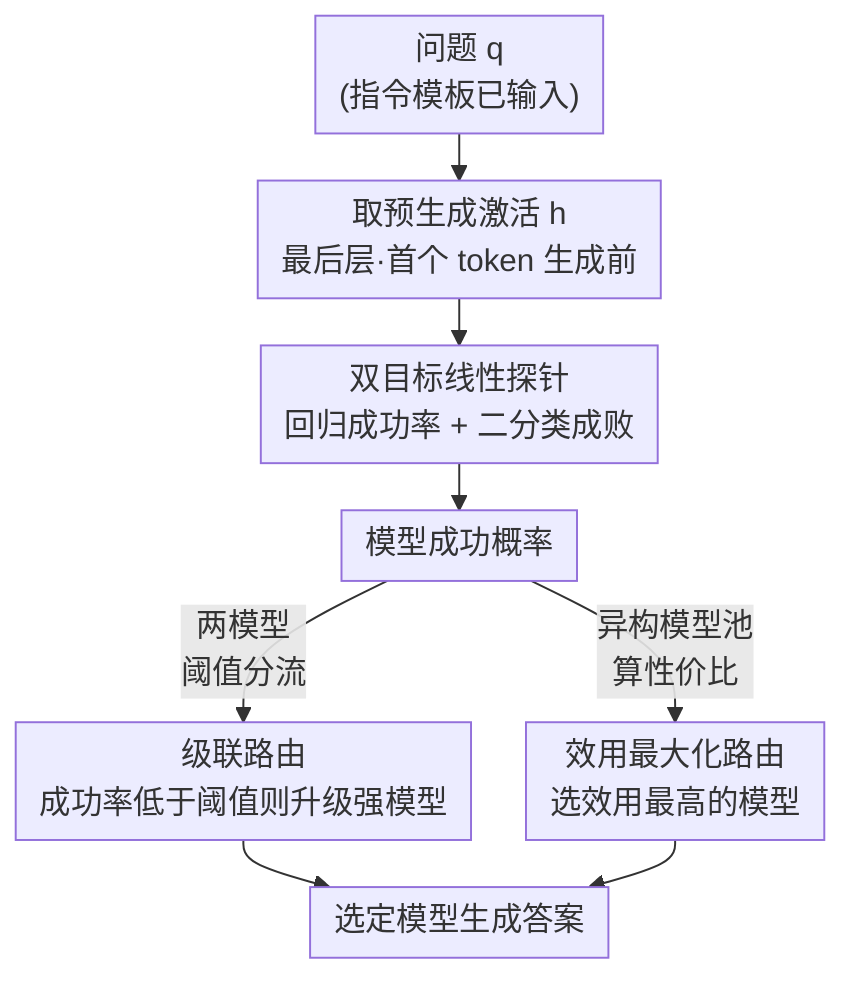

# LLMs Encode Their Failures: Predicting Success from Pre-Generation Activations

**会议**: ICLR 2026  
**arXiv**: [2602.09924](https://arxiv.org/abs/2602.09924)  
**代码**: [https://github.com/KabakaWilliam/llms_know_difficulty](https://github.com/KabakaWilliam/llms_know_difficulty)  
**领域**: 模型压缩  
**关键词**: 难度预测, 线性探针, 模型路由, 推理时计算, 成功预测

## 一句话总结
本文证明 LLM 在生成前的内部激活中编码了模型特有的成功概率信息，训练线性探针可以提取该信号用于高效的模型路由，在 MATH 等基准上实现匹配最强模型精度的同时降低 70% 推理成本。

## 研究背景与动机

**领域现状**：LLM 在数学和编程任务上取得了显著成果，但运行扩展推理（如 CoT）对每个问题都很昂贵。模型路由系统需要准确估计模型在给定输入上的成功概率，但低方差估计需要多次昂贵的采样。

**现有痛点**：先前工作已展示模型包含正确性相关信号，但不清楚这些信号代表的是人类难度还是模型特有难度，也不清楚它们是否可靠到足以支持实际决策。现有路由方法依赖间接代理如输入长度、困惑度或启发式置信度。

**核心矛盾**：人类对难度的判断与模型对难度的"感知"是两回事——随着扩展推理能力增强，模型越来越能解决人类觉得难的问题，导致两种难度概念的分离加剧。

**本文目标** 1) 区分 LLM 内部激活中编码的人类难度和模型难度信号；2) 评估这些信号在不同推理策略下的可靠性；3) 将探针用于实际的模型路由以降低推理成本。

**切入角度**：使用 E2H-AMC 数据集（同时有人类 IRT 难度标签和模型表现），直接比较从相同预生成激活中提取的人类难度和模型难度信号。

**核心 idea**：LLM 在生成答案之前就在激活中编码了自身成功概率的信息，通过线性探针提取该信号可实现高效的成本-准确率权衡路由。

## 方法详解

### 整体框架
这篇论文想回答一个很实际的问题：能不能在模型动笔之前，就预判它这道题做不做得对，从而把昂贵的扩展推理只花在真正难的题上。它的做法是：对给定 LLM，在指令 token 输入完、生成第一个 token 之前，取出最后一层那一刻的残差流激活向量 $\mathbf{h} \in \mathbb{R}^d$，它编码了模型对当前问题"心里有没有底"的信息；在这个激活上训练一个轻量线性探针，输出模型在特定解码策略下答对的概率；最后把这个成功概率当作路由信号，按两种策略（两模型阈值分流、或多模型池挑性价比）决定把查询交给哪个模型生成答案。整条链路推理时不需要任何额外生成，探针只是一个线性层。

### 关键设计

**1. 双目标线性探针：把人类难度和模型难度分开测**

先前工作含糊地说"激活里有正确性信号"，但没分清这个信号反映的是人类觉得题难，还是模型自己觉得题难——两者其实是不同的东西。本文借助 E2H-AMC 数据集（同一批 AMC 竞赛题同时带人类 IRT 难度标签和模型 rollout 表现），对同一份预生成激活 $\mathbf{h}$ 训练两类探针来区分它们。一类是回归探针，预测期望成功率 $\hat{s}_{MC}(\pi, q) = \frac{1}{K}\sum_{k=1}^{K}\mathbb{I}(\mathrm{parser}(a_k)=y^*)$（$K=50$ 次蒙特卡洛采样估计的连续成功率），用 MSE 损失拟合，给问题按难度排序；另一类是二分类探针，直接预测在某个固定解码策略（Greedy 或 Maj@K）下答对还是答错，用 BCE 损失训练并做 Platt 校准，给路由提供可直接拿来决策的成功概率。关键在于用**监督**探针而非无监督的均值差方向来提取信号——后者（如 Cencerrado et al.）在数学推理任务上判别力只有 AUROC 0.6–0.7，而监督线性探针能把模型成功率信号拉到 0.7 以上，因为模型难度这个对路由真正有用的信号需要标签才能从激活中干净地分离出来。

**2. 级联路由：一个阈值搞定大小模型分流**

有了成功概率探针后，最朴素的用法是在一个基础模型 $M_s$ 和一个强模型 $M_l$ 之间做成本感知的分流。规则只是一条阈值判断：当基础模型在该查询上的预测成功率 $\hat{p}_s(x)$ 低于阈值 $\tau$ 时，说明基础模型大概率搞不定，就把查询升级给强模型 $M_l$，否则就让便宜的基础模型自己处理。调节 $\tau$ 即可在精度和成本之间滑动。这条简单规则之所以够用，是因为探针信号本身已经足够干净——论文的核心论点正是"决定路由效果的是难度估计是否可靠，而不是路由策略有多复杂"，所以不需要再叠一层复杂的路由学习。

**3. 效用最大化路由：异构模型池里挑性价比最高的那个**

当候选不止两个、而是一池子大小不一、推理预算不同的模型 $\{M_1, \ldots, M_K\}$ 时，单纯比成功率会一律选最强最贵的，所以要把成本一起算进来。给每个模型配一个归一化成本 $\hat{c}_i$，对每条查询选效用最高的模型 $\hat{M}(x) = \arg\max_i (\hat{p}_i(x) - \lambda \hat{c}_i)$，其中 $\lambda$ 是成功概率和成本之间的兑换率。这样每个查询都会被分给"既大概率答对又不太贵"的那个模型，在 5 模型池上能匹配最强单模型精度的同时砍掉最多 70% 成本。

### 损失函数 / 训练策略
探针训练用 80/20 的训练-验证分割，具体探测哪一层、哪个 token 位置都按验证集表现来选；回归探针用 MSE，分类探针用 BCE。整套探针极轻——只是一个线性层，相对于生成本身训练成本可以忽略，这也是它能零额外开销地嵌进路由系统的前提。

## 实验关键数据

### 主实验

| 模型 | 推理方式 | 任务准确率 | 线性探针 AUROC | TF-IDF AUROC | 长度 AUROC |
|------|---------|-----------|---------------|-------------|-----------|
| Qwen2.5-Math-1.5B | Greedy | 0.724 | 0.84 | 0.64 | 0.61 |
| Qwen2.5-Math-1.5B | Maj@5 | 0.763 | 0.76 | 0.63 | 0.66 |
| Qwen2.5-Math-7B | Greedy | 0.809 | 0.79 | 0.68 | 0.67 |
| Qwen2.5-Math-7B | Maj@5 | 0.827 | 0.80 | 0.72 | - |
| GPT-OSS-20B (低推理) | Maj@5 | 0.866 | 0.78 | - | - |
| GPT-OSS-20B (高推理) | Maj@5 | 0.920 | 0.64 | - | - |

### 消融实验

| 信号类型 | Spearman ρ 范围 | 说明 |
|---------|----------------|------|
| 人类 IRT 难度 | 0.83-0.87 | 高度线性可提取 |
| 模型成功率（低推理）| 0.58 | 中等可提取 |
| 模型成功率（高推理）| 0.40 | 推理增强后显著退化 |

| 路由策略 | 准确率 | 成本节省 | 基准 |
|---------|--------|---------|------|
| 级联 (τ=0.6) | 91.2% (匹配) | 17% | MATH |
| 效用路由 (5模型) | 92% (匹配) | 70% | MATH |
| 效用路由 | 93.3% (匹配) | 37% | AIME 2025 |

### 关键发现
- 线性探针大幅超越表面特征（TF-IDF、问题长度），AUROC 通常高 10-20 个点
- 扩展推理提升了任务准确率但降低了探针质量（AUROC 从 0.78 降至 0.64），表明难度信息在推理链中变得不那么线性可分
- 人类难度和模型难度是不同的信号，模型推理能力越强，两者越分离
- 推理链长度与人类难度正相关但与模型成功负相关——模型在"人类觉得难"的问题上花更多 token，即使自己能轻松解决

## 亮点与洞察
- **预生成激活包含丰富的决策信号**：模型在开始生成前就"知道"自己能否解对，这个发现对自适应推理系统有深远影响
- **人类难度≠模型难度的实证证明**：随着推理能力增强，两者分离加剧，这意味着用人类难度标签来评估模型可能越来越不可靠

## 局限与展望
- 仅使用线性探针在单一位置探测，可能遗漏非线性编码的难度信息
- 未探索跨域/跨数据集的探针迁移能力
- 路由策略较简单（固定阈值），自适应路由策略可能进一步缩小与 oracle 差距
- 探针性能对 token 位置敏感，限制了实用性

## 相关工作与启发
- **vs Kadavath et al. (P(True))**: 他们通过显式提示获取模型自评，需要额外生成开销；本文从预生成激活零成本提取信号
- **vs Cencerrado et al. (正确性方向)**: 他们用无监督均值差方法在推理任务上 AUROC 仅 0.6-0.7，本文训练监督探针达到 >0.7

## 评分
- 新颖性: ⭐⭐⭐⭐ 首次系统区分人类/模型难度信号并展示推理与探针质量的反比关系
- 实验充分度: ⭐⭐⭐⭐ 跨模型、跨数据集、跨推理策略的全面评估
- 写作质量: ⭐⭐⭐⭐⭐ 逻辑推进清晰，发现层层递进
- 价值: ⭐⭐⭐⭐ 对模型路由和自适应推理有直接应用价值

<!-- RELATED:START -->

## 相关论文

- [\[ICML 2026\] Easier to Judge Than to Find: Predicting In-Context Learning Success for Demonstration Selection](../../ICML2026/model_compression/easier_to_judge_than_to_find_predicting_in-context_learning_success_for_demonstr.md)
- [\[ACL 2025\] Predicting Through Generation: Why Generation Is Better for Prediction](../../ACL2025/model_compression/predicting_through_generation_why_generation_is_better_for_prediction.md)
- [\[ICLR 2026\] QKV Projections Require a Fraction of Their Memory](qkv_projections_require_a_fraction_of_their_memory.md)
- [\[ICLR 2026\] LightMem: Lightweight and Efficient Memory-Augmented Generation](lightmem_lightweight_and_efficient_memory-augmented_generation.md)
- [\[ICLR 2026\] π-Flow: Policy-Based Few-Step Generation via Imitation Distillation](pi-flow_policy-based_few-step_generation_via_imitation_distillation.md)

<!-- RELATED:END -->
