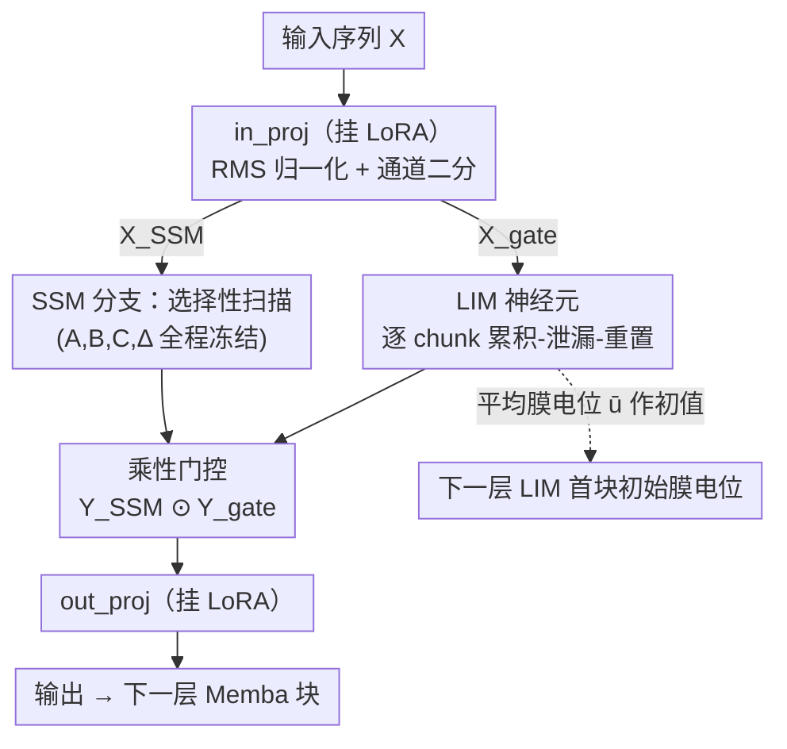

# Memba: Membrane-driven Parameter-Efficient Fine-Tuning for Mamba

**会议**: ICLR 2026  
**arXiv**: [2506.18184](https://arxiv.org/abs/2506.18184)  
**代码**: [GitHub](https://github.com/Intelligent-Computing-Lab-Panda/Memba)  
**领域**: 模型压缩  
**关键词**: Mamba, PEFT, 膜电位, 泄漏积分, 状态空间模型

## 一句话总结
提出 Memba，一种受生物神经元膜电位启发的参数高效微调方法，通过在 Mamba 门控分支引入泄漏积分膜（LIM）神经元实现时序自适应，结合 LoRA 放置优化和跨层膜传递，以极少参数在语言和视觉任务上超越现有 Mamba PEFT 方法。

## 研究背景与动机
状态空间模型（SSM）/ Mamba 以线性复杂度替代 Transformer 的注意力机制，随着模型规模增大，PEFT成为必要。但现有 PEFT 方法直接从 Transformer 迁移到 Mamba，忽略了 SSM 独特的时序处理动态：

关键痛点：
1. Mamba的门控机制仅是简单的线性变换+SiLU，缺乏像LSTM/GRU那样的多门控时序控制能力
2. 直接微调SSM核心组件（选择性扫描中的A, B, C, Δ）会导致性能退化（已有研究验证）
3. 如何在不破坏预训练SSM平衡动态的前提下引入时序适应能力？

核心idea：在Mamba的门控分支（而非SSM分支）引入生物启发的泄漏积分膜神经元。LIM神经元通过膜电位的累积-泄漏-重置动态，天然提供时序选择性记忆，且不需要额外可学习参数。

## 方法详解

### 整体框架
Memba要解决的是：怎么给 Mamba 做参数高效微调，又不破坏它预训练时学到的 SSM 平衡动态。它的做法是只在三个地方动刀，而把承担时序建模的选择性扫描（A、B、C、Δ）完全保留不碰。具体来说，输入先经过 in_proj 投影、归一化后按通道二分成 SSM 分支和门控分支：SSM 分支照常走冻结的选择性扫描，门控分支被 Memba 塞进一个泄漏积分膜（LIM）神经元，让门控具备 LSTM/GRU 式的时序选择能力；两条分支再做乘性门控、经 out_proj 输出。可学习参数则只通过 LoRA 加在 in_proj 和 out_proj 这两个信息瓶颈上；最后把每层 LIM 累积出来的平均膜电位往下一层传递，保证时序上下文沿深度不丢。整条路径里，真正改写预训练权重的只有两处 LoRA，其余都是无额外可学习参数的膜动态。

### 关键设计

**1. 泄漏积分膜（LIM）神经元：给门控分支补上时序选择性记忆**

Mamba 的门控原本只是「线性变换 + SiLU」，没有 LSTM/GRU 那种跨步的门控记忆。LIM 把输入序列切成 $T$ 个等大 chunk 逐块处理，每个 chunk 的膜电位在累积、泄漏、重置之间演化：$\mathbf{u}[i+1]^l = r(\tau \mathbf{u}[i]^l + \mathbf{W}^l X[i])$，其中阈值函数 $r(x)=0$（当 $x>V_{th}$）否则 $r(x)=x$，泄漏率 $\tau\in(0,1]$ 决定旧膜电位衰减多快，$V_{th}$ 是触发重置的阈值。这套动态天然做出了信息的选择性保留：落在关键路径上的特征会把膜电位顶出明显峰值，而无关的基线电位随 chunk 推进逐步泄漏下降，恰好复现了 SSM 对近期 token 的偏好。整个机制不引入任何额外可学习参数。

论文的 Theorem 1 进一步把这种「有用」拆成两层：膜电位的均值成分通过泄漏动态完成时序上下文的集成，而它的波动成分相当于给训练加了一个有界正则项 $\mathcal{R}(\mathbf{y}_t, \bar{\mathbf{u}}_t) \leq \frac{\gamma}{2} \cdot \lambda_{\max} \cdot \epsilon^2$，从而把损失曲面磨得更平滑——这也解释了为什么 LIM 不只是补了记忆，还顺带抑制了过拟合。

**2. LoRA 放置优化：只在信息瓶颈上加可学习参数**

PEFT 该把 LoRA 加在 Mamba 的哪些投影层，并不是随便选的。消融结果显示 in_proj 和 out_proj 才是关键，移除它们分别掉 1.2% 和 0.8%，而 dt_proj、x_proj 拿掉几乎没有影响。原因在于 in/out 投影是 Mamba 进出信息的瓶颈，调它们能高效改变表征；而 dt、x 属于 SSM 内部参数，直接动会破坏选择性扫描的平衡。所以 Memba 干脆只在 in_proj + out_proj 上挂 LoRA——参数极少，却已经能反超全参数微调。

**3. 跨层膜电位传递：让时序上下文沿深度不丢**

LIM 是逐层独立工作的，深层网络里很容易把浅层积累的时序上下文丢掉。Memba 的做法是在第 $l$ 层把所有 chunk 处理完后，取平均膜状态 $\bar{\mathbf{u}}^l = \frac{1}{T}\sum_{i=1}^T \mathbf{u}^l[i]$，把它当作第 $l+1$ 层第一个 chunk 的初始膜电位：$\mathbf{u}^{l+1}[1] = \bar{\mathbf{u}}^l$。这里用平均值而不是末状态，是为了避免只携带序列尾部信息造成的损失，让传下去的是整段序列的时序摘要。

## 实验关键数据

### 主实验 (常识推理, Mamba-130M)

| 方法 | #Params(%) | BoolQ | PIQA | SIQA | HellaS | WinoG | ARC-e | ARC-c | OBQA | Avg |
|------|-----------|-------|------|------|--------|-------|-------|-------|------|-----|
| Full FT | 100 | 56.1 | 65.3 | 38.7 | 35.3 | 52.0 | 46.4 | 25.7 | 32.8 | 43.8 |
| SLL LoRA | 1.45 | 56.3 | 63.3 | 38.2 | 34.6 | 51.6 | 43.5 | 23.6 | 30.6 | 42.7 |
| LoRA (in_proj) | 2.23 | 53.5 | 62.9 | 38.2 | 33.8 | 53.1 | 46.4 | 23.7 | 30.8 | 42.8 |
| LoRAp (X) | 2.67 | 61.7 | 64.0 | 39.5 | 34.3 | 52.2 | 43.5 | 25.3 | 29.4 | 43.7 |
| **Memba (in+out)** | **5.20** | **58.8** | **65.8** | **40.1** | **34.7** | 51.6 | 47.7 | **24.7** | **31.2** | **44.3** |

### 消融实验

| 配置 | Avg Acc(%) | 说明 |
|------|-----------|------|
| All projectors LoRA | 43.9 | 所有投影层 |
| -dt_proj | 43.9 | 移除dt影响极小 |
| -x_proj | 43.7 | 移除x影响小 |
| -out_proj | 43.1 | 输出投影重要 |
| -in_proj | 42.7 | 输入投影最重要 |
| Memba vs Full FT (790M) | Memba更高 | PEFT优于全微调 |
| Memba vs Full FT (1.4B) | Memba更高 | 全微调容易过拟合 |

### 关键发现
- Memba以5.2%参数超过全参数微调（130M/790M/1.4B均是如此），全微调容易过拟合
- LIM的膜电位可视化清晰展示关键特征的峰值和跨chunk的渐进衰减
- in_proj和out_proj是Mamba PEFT的关键位置，SSM组件（dt_proj, x_proj）不适合微调
- 跨层膜传递比无传递提升约0.5%，对深层网络更重要

## 亮点与洞察
- 生物启发的LIM设计与Mamba的SSM天然互补——SSM处理线性时序，LIM（在门控分支）提供非线性时序选择性
- "不触碰SSM"的设计哲学有说服力：已有研究证明直接微调SSM会退化
- 膜电位的chunking策略巧妙解决了逐token处理长序列的效率问题
- 理论正则化分析为膜电位波动的有益作用提供了解释

## 局限与展望
- chunk大小和chunk数T为超参数，需要调优
- LIM神经元的泄漏因子τ和阈值Vth的敏感性需要关注
- 未在最新的Mamba-2架构上验证
- 视觉任务的评测仅限于VTAB-1k，大规模视觉基准缺失

## 相关工作与启发
- **vs SLL LoRA**: Memba通过LIM提供更好的时序处理，平均准确率高1.6%
- **vs Affix-tuning**: 以5.2%对64.6%的参数量实现更好性能
- **vs 全参数微调**: 避免过拟合，PEFT反而更优

## 评分
- 新颖性: ⭐⭐⭐⭐⭐ 生物膜电位与SSM的结合是全新方向
- 实验充分度: ⭐⭐⭐⭐ 多尺度语言+视觉评测，但缺少大规模基准
- 写作质量: ⭐⭐⭐⭐ 膜电位可视化直观，结构清晰
- 价值: ⭐⭐⭐⭐ 为Mamba时代的PEFT开辟了生物启发的新路线

<!-- RELATED:START -->

## 相关论文

- [\[ICML 2025\] Parameter-Efficient Fine-Tuning of State Space Models](../../ICML2025/model_compression/parameter-efficient_fine-tuning_of_state_space_models.md)
- [\[CVPR 2026\] S2FT: Parameter-Efficient Fine-Tuning in Sparse Spectrum Domain](../../CVPR2026/model_compression/s2ft_parameter-efficient_fine-tuning_in_sparse_spectrum_domain.md)
- [\[ACL 2025\] State-offset Tuning: State-based Parameter-Efficient Fine-Tuning for State Space Models](../../ACL2025/model_compression/state_offset_tuning_ssm_peft.md)
- [\[CVPR 2025\] Expert Pyramid Tuning: Efficient Parameter Fine-Tuning for Expertise-Driven Task Allocation](../../CVPR2025/model_compression/expert_pyramid_tuning_efficient_parameter_fine-tuning_for_expertise-driven_task_.md)
- [\[ICLR 2026\] ABBA-Adapters: Efficient and Expressive Fine-Tuning of Foundation Models](abba-adapters_efficient_and_expressive_fine-tuning_of_foundation_models.md)

<!-- RELATED:END -->
