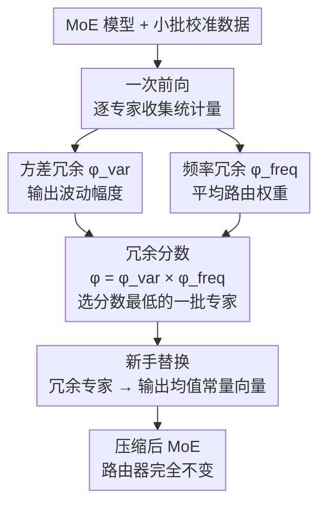

# MoNE: Replacing Redundant Experts with Lightweight Novices for Structured Pruning of MoE

**会议**: ICLR 2026  
**arXiv**: [2507.00390](https://arxiv.org/abs/2507.00390)  
**代码**: [GitHub](https://github.com/zxgx/mode-pd)  
**领域**: 模型压缩  
**关键词**: MoE剪枝, 专家冗余, 新手替换, 结构化压缩, 访问频率

## 一句话总结
提出 MoNE（Mixture-of-Novices-and-Experts），通过联合评估专家的访问频率和输出方差来识别冗余专家，并用其输出均值（"新手"常量向量）替换之，在5种MoE模型上实现比现有剪枝方法更有效且更鲁棒的压缩，25%剪枝率下平均准确率下降仅0.14。

## 研究背景与动机
MoE架构通过稀疏激活扩展模型容量，但部署时需将所有专家保留在内存中，带来巨大开销。例如将所有64个专家（包括未被激活的）放在GPU上。结构化剪枝可直接减少专家数量来降低内存成本。

现有方法存在三维不稳定性：

**跨架构不稳定**: 层剪枝（Angular）和通道剪枝（FLAP）未考虑MoE的稀疏计算特性

**跨校准数据不稳定**: 不同校准数据源导致性能波动大

**跨样本数不稳定**: 100/500/1000样本的效果差异显著

核心问题是：现有专家剪枝主要依赖访问频率，但频率不能完全刻画冗余性。一个频率不高但输出高度变化的专家可能携带关键区分信息；反之，一个频率不低但输出极稳定的专家可以被常数替代。

核心idea：冗余 = 低频率 × 低方差。冗余专家用其输出均值（"新手"）替换，而非简单删除，最小化输出差异。

## 方法详解

### 整体框架
MoNE 要回答的问题是：MoE 部署时把几十个专家全压在显存里太贵，到底哪些专家可以安全拿掉？它的判断不只看一个专家被路由器选中得有多频繁，而是把"频率"和"输出方差"两件事乘在一起算冗余分。整条流程只需要一次前向：先在一小批校准数据上跑一遍，记录每个专家被选中时的平均路由分数（频率）和输出的方差；接着分别算出"方差冗余"和"频率冗余"两个维度，两者相乘得到最终冗余分数，挑出分数最低的一批专家；最后不是直接删掉它们，而是用它们在校准集上的输出均值——一个常量向量，称作"新手"——把它们替换掉。路由器本身完全不动，这些被替换的专家仍可能被选中，只是无论输入是什么都吐出同一个常数。

### 关键设计

**1. 方差冗余 $\phi^{var}$：用输出的波动幅度判断一个专家"能不能被常数代替"**

光看频率会漏判：一个不常被选中、但每次输出都差异很大的专家，其实携带了关键的区分信息，删不得。MoNE 因此先量化每个专家输出的稳定程度——专家 $E_i$ 被选中时，统计它输出的无偏方差估计并取 L2 范数：

$$\phi_i^{var} = \left\|\sqrt{\frac{\sum(E_i(\mathbf{x}) - \overline{E_i})^2 \cdot \mathbb{I}(E_i \in \mathcal{S}_k)}{\sum\mathbb{I} - 1}}\right\|_2$$

其中 $\mathcal{S}_k$ 是该 token 实际被路由到的 top-k 专家集合，$\mathbb{I}(\cdot)$ 只在专家被选中时计入统计。直觉很直接：高方差专家输出随输入剧烈变化，用一个常数去近似会丢掉大量信息；低方差专家输出本就稳定，换成均值引入的偏差很小——这类专家才是真正可替换的对象。

**2. 频率冗余 $\phi^{freq}$：用平均路由权重判断路由器对一个专家"有多依赖"**

频率这一维仍然有用，但要算得更细——不是简单数被选中的次数，而是看被选中时拿到的路由权重有多大：

$$\phi_i^{freq} = \frac{\sum G_i(\mathbf{x}) \cdot \mathbb{I}(E_i \in \mathcal{S}_k)}{\sum \mathbb{I}(E_i \in \mathcal{S}_k)}$$

$G_i(\mathbf{x})$ 是路由器给专家 $i$ 的门控分数。平均路由分数低，说明即使被选中路由器也不太"看重"它，对最终输出贡献小。但论文反复强调：单靠频率不够——有些高频专家输出其实非常稳定，光看频率会把它们误判成不可剪，所以频率必须和方差配合使用。

**3. 新手替换：用一个常量向量顶替被剪专家，而不是直接删除**

两个维度相乘得到最终冗余分数 $\phi = \phi^{var} \cdot \phi^{freq}$，分数最低的一批专家被标记为冗余。MoNE 的关键之处在于剪枝方式：不是把这些专家整个删掉，而是用它们在校准集上的输出均值 $N_i = \overline{E_i}$ 顶替，称为"新手"。这个均值不是随手取的——它正是在 L2 意义下最小化"替换前后输出差异"的闭式最优解，即对一组输出用常数去逼近时，均值就是误差最小的那个常数。新手的代价几乎为零：$N_i$ 不参与任何与输入 token 相关的计算，只需存一个 $d$ 维向量，相当于用一个常数顶掉了整个 MLP 专家，同时还保留了它的"平均行为"这一层知识估计。

### 损失函数 / 训练策略
MoNE 是无需训练的后处理方法，不更新任何权重。整个剪枝只需在校准集上做一次前向传播收集频率和方差统计量即可完成。

## 实验关键数据

### 主实验 (25%剪枝, OLMoE-7B, 100样本Zyda2)

| 方法 | Arc-c | Arc-e | BoolQ | COPA | MMLU | OBQA | PIQA | RTE | WinoG | Avg |
|------|-------|-------|-------|------|------|------|------|-----|-------|-----|
| 原始模型 | 49.23 | 76.89 | 70.09 | 85.0 | 53.54 | 44.4 | 79.76 | 71.84 | 68.90 | 66.63 |
| Angular(层剪枝) | 32.76 | 61.91 | 61.71 | 74.0 | 23.13 | 37.6 | 71.65 | 53.07 | 55.09 | 52.33 |
| FLAP(通道剪枝) | 40.53 | 67.55 | 62.69 | 78.0 | 41.16 | 37.8 | 74.81 | 61.37 | 60.93 | 58.32 |
| MC-SMoE(专家合并) | 35.67 | 54.92 | 63.49 | 73.0 | 29.04 | 30.6 | 67.19 | 55.23 | 65.75 | 52.77 |
| RS(频率剪枝) | 25.85 | 43.01 | 59.08 | 74.0 | 29.63 | 36.2 | 66.16 | 56.68 | 59.98 | 50.07 |
| **MoNE** | **42.32** | **64.81** | **67.19** | **85.0** | **40.13** | **40.8** | **78.07** | **64.62** | **66.46** | **61.04** |

### 鲁棒性实验

| 维度 | 现有方法 | MoNE | 说明 |
|------|---------|------|------|
| 跨架构(5种模型) | 波动大 | 一致优于 | OLMoE/Moonlight/DS-V2/Qwen2-57B/Qwen3-30B |
| Zyda2 vs C4 | 差异显著 | 差异小 | 校准数据鲁棒 |
| 100/500/1000样本 | 波动大 | 稳定 | 样本量鲁棒 |
| Qwen2-57B-A14B@25% | 基线下降大 | 仅下降0.14 | 大模型上优势更明显 |

### 关键发现
- MoNE在Qwen2-57B上25%剪枝仅下降0.14准确率，比基线最高提升2.72
- 频率和方差信息互补：高频高方差(蓝)、仅高方差(红)、仅高频(绿)三类专家跨任务一致
- RS（仅频率）表现最差，验证了单一指标的不足
- 新手（常数向量）替换比完全删除更好：保留了知识估计，且减少了部分token的激活参数

## 亮点与洞察
- "新手"替换概念简洁而有效——用一个向量代替整个MLP，实现近零计算/内存开销
- 频率×方差的冗余度量设计有说服力，且跨任务一致性强
- 无需训练、无需权重更新的特性使其实际部署非常方便
- 跨3个维度的鲁棒性分析是亮点，填补了现有方法评测的不足

## 局限与展望
- 仅在零样本评估，复杂任务（代码、数学、推理）可能需要额外微调
- 新手是固定常数，不随输入变化——对于高度数据依赖的专家可能偏差较大
- 50%高剪枝率下性能下降仍然明显
- 未探索分层学习适应性的新手（如低秩新手）

## 相关工作与启发
- **vs MC-SMoE**: 新手替换比专家合并更简单且更有效
- **vs RS**: 增加方差维度后全面领先，单一频率指标不够
- **vs Angular/FLAP**: MoE专用剪枝比通用结构化剪枝更合适

## 评分
- 新颖性: ⭐⭐⭐⭐ "新手"替换概念新颖，双指标冗余度量有洞察力
- 实验充分度: ⭐⭐⭐⭐⭐ 5模型×2校准源×3样本量的全面鲁棒性分析
- 写作质量: ⭐⭐⭐⭐ 动机清晰，但符号较重
- 价值: ⭐⭐⭐⭐⭐ 对MoE部署有实际价值，方法简单高效

<!-- RELATED:START -->

## 相关论文

- [\[ACL 2025\] STUN: Structured-Then-Unstructured Pruning for Scalable MoE Pruning](../../ACL2025/model_compression/stun_moe_pruning.md)
- [\[ICLR 2026\] Unveiling Super Experts in Mixture-of-Experts Large Language Models](unveiling_super_experts_in_mixture-of-experts_large_language_models.md)
- [\[ICLR 2026\] KBVQ-MoE: KLT-guided SVD with Bias-Corrected Vector Quantization for MoE Large Language Models](kbvq-moe_klt-guided_svd_with_bias-corrected_vector_quantization_for_moe_large_la.md)
- [\[ICLR 2026\] Steering MoE LLMs via Expert (De)Activation](steering_moe_llms_via_expert_deactivation.md)
- [\[ACL 2026\] Two-Stage Regularization-Based Structured Pruning for LLMs](../../ACL2026/model_compression/two-stage_regularization-based_structured_pruning_for_llms.md)

<!-- RELATED:END -->
