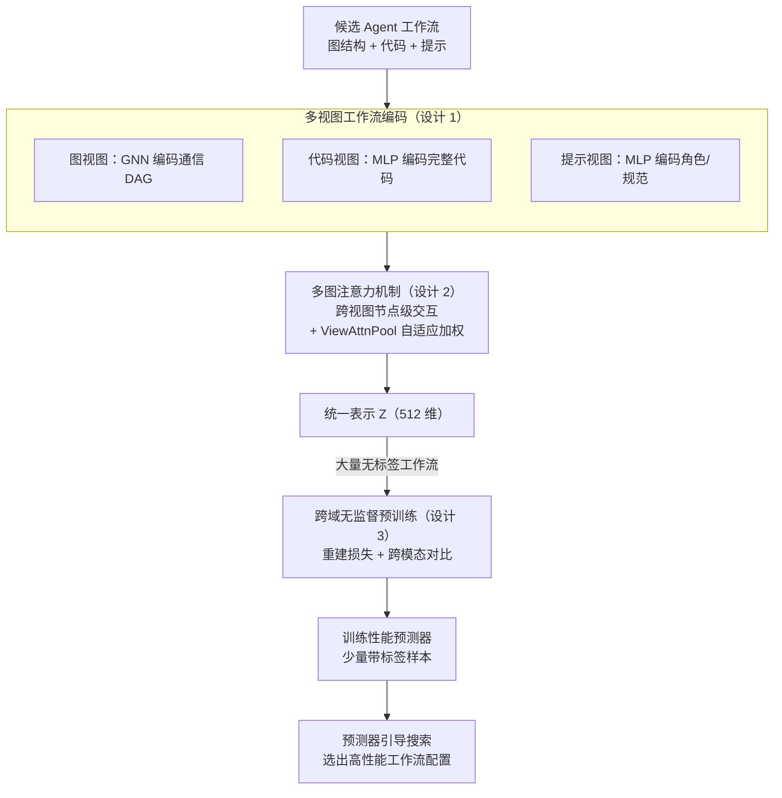

# Multi-View Encoders for Performance Prediction in LLM-Based Agentic Workflows

**会议**: ICLR 2026  
**arXiv**: [2505.19764](https://arxiv.org/abs/2505.19764)  
**代码**: [GitHub](https://github.com/deepauto-ai/agentic-predictor)  
**领域**: 模型压缩  
**关键词**: 性能预测, 多视图编码, Agent工作流, 图神经网络, 无监督预训练

## 一句话总结

提出 Agentic Predictor，一种多视图工作流编码框架，通过联合建模图结构、代码语义和提示信息来预测 LLM Agent 工作流的性能，显著减少昂贵的试错评估。

## 研究背景与动机

LLM Agent 系统近年发展迅速，但优化其工作流配置面临巨大搜索空间挑战。现有的自动化设计方法（如 ADAS、AFlow）依赖大量 LLM API 调用进行评估，计算代价极高。本文提出用**性能预测器**替代完整执行评估，类似于神经架构搜索（NAS）中的预测器方法。

核心挑战有两个：

**工作流异构性**：不同工作流在通信结构、提示策略、工具调用模式上差异巨大，难以用统一模型建模

**标注数据稀缺**：通过完整执行获取性能标签代价高昂，监督学习数据不足

## 方法详解

### 整体框架

Agentic Predictor 的核心思路是：先把一个 Agent 工作流压缩成统一的低维表示，再用一个轻量预测器从这个表示直接判断工作流好不好，从而跳过昂贵的真实执行。整条流水线分三段——先用多视图编码器把工作流的图结构、代码、提示三类异构信息（经多图注意力交互）融成统一向量 $\mathbf{Z}$；再在大量无标签工作流上做跨域无监督预训练，让编码器学到通用表示；最后只用少量带性能标签的样本训练预测器，并以它引导工作流搜索。前两件事是论文真正的创新（多视图编码 + 多图注意力 + 跨域预训练），预测器和搜索是复用 NAS 思路的下游脚手架。

### 关键设计

**1. 多视图工作流编码：用三种互补视角刻画异构工作流**

单一视角不足以描述一个 Agent 工作流——只看通信图会丢掉具体逻辑，只读代码又难以建模 Agent 之间的依赖结构。本文同时从三个视图编码：图视图 $\mathcal{G}$ 把工作流建模为 DAG，用 GNN 编码 Agent 间的通信依赖；代码视图 $\mathcal{C}$ 用 MLP 编码工作流完整代码，捕获逻辑结构与工具调用模式；提示视图 $\mathcal{P}$ 则用 MLP 编码系统提示里的角色描述和行为规范。三个视图各自得到表示后，经聚合层融合为统一向量 $\mathbf{Z} = \text{MLP}([\mathbf{Z}_\mathcal{G}, \mathbf{Z}_\mathcal{C}, \mathbf{Z}_\mathcal{P}])$。其中文本由 all-MiniLM-L6-v2 编成 384 维、代码由 CodeRankEmbed 编成 768 维，再统一映射到 512 维空间，使三类异构信号能在同一表示里对齐。

**2. 多图注意力机制：让三类视图在节点级互相交换信息**

简单拼接三个视图的表示无法让它们彼此感知，而工作流中代码片段、提示文本、算子节点本就高度耦合。本文把工作流进一步拆成提示图 $\mathcal{G}_\text{prompt}$、代码图 $\mathcal{G}_\text{code}$、算子图 $\mathcal{G}_\text{operator}$ 三张图，通过跨视图自注意力在节点级进行信息交互，使某个算子节点能直接关注到与之相关的代码和提示。融合时再用 ViewAttnPool 自适应学习各视图的重要性权重，让模型按工作流特性动态决定该更信任结构、代码还是语义，而非给三者固定配比。

**3. 跨域无监督预训练：在无标签工作流上学通用表示以缓解标签稀缺**

性能标签要靠完整执行才能拿到，代价高、数量少，直接监督学习很容易过拟合。本文先在大量无标签工作流上预训练编码器，目标由两部分组成。一是重建损失，要求编码器能从隐表示还原出三个视图本身：$\mathcal{L}_{rec} = \frac{1}{M}\sum_{i=1}^{M}\|\mathcal{G}_i - \hat{\mathcal{G}}_i\|^2 + \|\mathcal{C}_i - \hat{\mathcal{C}}_i\|^2 + \|\mathcal{P}_i - \hat{\mathcal{P}}_i\|^2$；二是跨模态对比损失，在 $(\mathcal{G}, \mathcal{C})$、$(\mathcal{G}, \mathcal{P})$、$(\mathcal{C}, \mathcal{P})$ 三对视图之间施加 InfoNCE，把同一工作流的不同视图在表示空间里拉近、不同工作流推远。整个预训练不接触任何性能标签，从根本上避免了标签泄漏，学到的通用表示在下游少标签场景里提升尤为明显。

### 损失函数 / 训练策略

预训练阶段的总损失为重建与对比之和 $\mathcal{L}_{enc} = \mathcal{L}_{rec} + \mathcal{L}_{con}$；进入预测器阶段后，编码器表示被冻结复用，预测器按任务选择目标——二分类（工作流是否成功）用交叉熵损失，性能回归用 MSE 损失。

## 实验关键数据

### 主实验

| 领域 | 指标 | Agentic Predictor | 最强基线 | 提升 |
|------|------|-------------------|----------|------|
| Code Generation (GD) | Accuracy | 85.33% | 85.24% (Graph Trans.) | +0.09% |
| Code Generation (AF) | Accuracy | 85.62% | 84.71% (Graph Trans.) | +0.91% |
| Math (GD) | Accuracy | 66.20% | 64.84% (GAT) | +1.36% |
| Math (AF) | Accuracy | 79.56% | 76.44% (GAT) | +3.12% |
| Average | Accuracy | **79.97%** | 78.36% (GAT) | +2.05% |
| Average | Utility | **76.33%** | 73.54% (Dir-GNN) | +3.79% |

### 消融实验

| 配置 | 平均 Accuracy | 平均 Utility | 说明 |
|------|-------------|-------------|------|
| Code + Graph + Text (Full) | **84.38%** | **81.88%** | 完整模型 |
| 去除 Code | 降低 | 降低 | 代码视图对逻辑理解重要 |
| 去除 Graph | 降低 | 降低 | 图结构对交互建模重要 |
| 去除 Text | 降低 | 降低 | 提示语义不可或缺 |

### 关键发现

- 三视图编码互补性强，任何单一视图的移除都导致性能下降
- 跨域无监督预训练在标签稀少时尤其有效（预训练版 Agentic Predictor+ 在少标签场景提升更大）
- 方法对搜索算法无关（search-agnostic），可与任意搜索策略组合

## 亮点与洞察

- 将 NAS 中的性能预测思想迁移到 Agent 工作流优化领域，方向新颖
- 多视图编码充分利用了 Agent 工作流的异构信息（结构、代码、语义）
- 跨域预训练策略有效缓解标签稀缺问题，体现了自监督学习在新领域的潜力

## 局限与展望

- 仅在 FLORA-Bench 上验证，数据集覆盖面有限
- 预测器对工作流变化的泛化能力需进一步验证
- 未探索更大规模 Agent 系统和更复杂的多模态工作流
- 代码和提示编码器使用的是固定的预训练模型，未进行端到端微调

## 相关工作与启发

- 与 FLORA-Bench 对比：本文引入多视图编码和无监督预训练，而非单一图视图
- 与 MAS-GPT 对比：本文使用轻量预测器而非 LLM 微调来生成工作流
- NAS 预测器（如 CAP、FlowerFormer）的思路可直接迁移到 Agent 领域

## 评分

- 新颖性: ⭐⭐⭐⭐ 将性能预测引入 Agent 工作流设计是新方向
- 实验充分度: ⭐⭐⭐ 仅一个 benchmark，但消融详细
- 写作质量: ⭐⭐⭐⭐ 问题定义清晰，框架描述完整
- 价值: ⭐⭐⭐⭐ 对减少 Agent 系统开发成本有实际意义

<!-- RELATED:START -->

## 相关论文

- [\[ICLR 2026\] Incentivizing Agentic Reasoning in LLM Judges via Tool-Integrated Reinforcement Learning](incentivizing_agentic_reasoning_in_llm_judges_via_tool-integrated_reinforcement_.md)
- [\[ICLR 2026\] Parallel Token Prediction for Language Models](parallel_token_prediction_for_language_models.md)
- [\[ICLR 2026\] Towards Reliable Benchmarking: A Contamination Free, Controllable Evaluation Framework for Multi-step LLM Function Calling](towards_reliable_benchmarking_a_contamination_free_controllable_evaluation_frame.md)
- [\[ICLR 2026\] A Fano-Style Accuracy Upper Bound for LLM Single-Pass Reasoning in Multi-Hop QA](a_fano-style_accuracy_upper_bound_for_llm_single-pass_reasoning_in_multi-hop_qa.md)
- [\[CVPR 2026\] Parallax to Align Them All: An OmniParallax Attention Mechanism for Distributed Multi-View Image Compression](../../CVPR2026/model_compression/parallax_to_align_them_all_an_omniparallax_attention_mechanism_for_distributed_m.md)

<!-- RELATED:END -->
