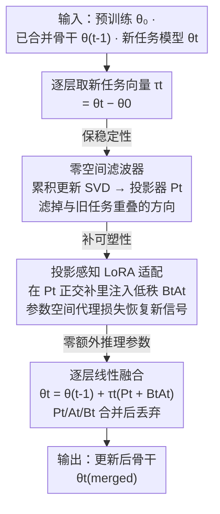

# Null-Space Filtering for Data-Free Continual Model Merging: Preserving Stability, Promoting Plasticity

**会议**: ICLR 2026  
**arXiv**: [2509.21413](https://arxiv.org/abs/2509.21413)  
**代码**: [GitHub](https://github.com/zihuanqiu/NUFILT)  
**领域**: 模型压缩  
**关键词**: 模型合并, 持续学习, 零空间投影, 稳定性-可塑性, 无数据

## 一句话总结

提出 NUFILT 框架，利用"任务向量与表示子空间近似对齐"的几何性质，通过零空间滤波压制对旧任务的干扰、投影感知 LoRA 恢复新任务可塑性，在完全不访问数据的条件下实现持续模型合并，在视觉/NLP/多模态基准上比 OPCM 提升 4-8%，逼近独立微调的上界。

## 研究背景与动机

**领域现状**：数据无关持续模型合并（Data-Free Continual Model Merging, DFCMM）是近年模型复用的热门方向。场景是：多个任务各自独立微调得到若干模型，需要将这些模型**逐步合并**为一个通用骨干网络，但过程中**不能接触任何任务原始数据**——这既出于隐私保护需求，也出于存储开销的考虑。整个合并过程只能在参数空间中进行操作。

**现有痛点**：DFCMM 的核心矛盾是稳定性与可塑性的平衡——合并新任务时不能破坏已有任务的知识（稳定性），同时要忠实吸收新任务的能力（可塑性）。现有方法各有短板：(1) Weight Averaging 和 Task Arithmetic 这类简单算术操作会导致参数干扰，新旧任务信号相互抵消，稳定性差；(2) OPCM 等正交投影方法强制将任务向量投影到正交子空间，但当任务之间存在天然相关性时（比如 EuroSAT 和 RESISC45 都是遥感分类），正交约束会过度削减新任务信号，牺牲可塑性；(3) AdaMerging、WEMOE 等自适应策略需要辅助数据来调整融合系数，直接违反无数据约束。

**核心矛盾**：问题的根源在于——稳定性和可塑性本质上是**数据层面**的概念（需要在旧任务数据上评估干扰、在新任务数据上评估适配），但 DFCMM 不允许访问数据。如何在**参数空间**中找到数据层面目标的有效代理，是所有方法都未能很好解决的开放问题。

**切入角度**：作者通过实验观察到一个关键几何性质——**任务向量的主方向与该任务数据表示子空间近似对齐**。直觉上说，微调导致的参数变化主要沿着任务数据驱动的方向发生。这意味着可以用任务向量的 SVD 子空间来作为数据表示子空间的无数据代理，从而将数据层面的稳定性/可塑性损失转化为参数空间中的投影操作。

**核心 idea**：既然任务向量近似对齐数据子空间，就用零空间投影保证旧任务特征不被扰动（稳定性），再用投影感知 LoRA 在不干扰旧任务的子空间中注入新任务信号（可塑性），两者线性融合后不增加推理开销。

## 方法详解

### 整体框架

NUFILT 的输入是预训练模型 $\theta_0$、已合并的骨干 $\theta_{t-1}^{\text{merged}}$ 和新任务模型 $\theta_t$，输出是更新后的骨干 $\theta_t^{\text{merged}}$。整个流程逐层执行，分三个阶段：**滤波**（Filtering）→ **适配**（Adapting）→ **融合**（Fusing）。滤波阶段构建零空间投影器，去除新任务向量中与旧任务重叠的分量；适配阶段在投影器约束下，用轻量 LoRA 模块恢复被过度滤除的新任务信号；融合阶段将投影器、任务向量和 LoRA 参数线性融合回骨干，不引入额外推理参数。这三个阶段恰好对应稳定性（滤波保旧）→ 可塑性（适配补新）→ 零开销部署（融合落地）的递进。

### 关键设计

**1. 零空间滤波器（Null-Space Filter）：先把新任务向量里和旧任务重叠的方向滤掉，保证旧任务响应不变**

合并新任务时若直接相加，新旧信号会相互干扰、旧任务被破坏，稳定性无从谈起。NUFILT 的做法是先算出从预训练到当前已合并模型的累积更新 $\tilde{\tau}_{\leq t-1}^{(l)} = \theta_{t-1}^{\text{merged},(l)} - \theta_0^{(l)}$，对它做 SVD 取 top-$r_p$ 个右奇异向量 $\hat{V}_{\leq t-1}^{(l)}$，再构造零空间投影矩阵 $P_t^{(l)} = I - \hat{V}_{\leq t-1}^{(l)} \hat{V}_{\leq t-1}^{(l)\top}$。这个投影器把落在旧任务子空间内的分量完全置零——对任意 $x^{(l)} \in \text{span}(\hat{V}_{\leq t-1}^{(l)})$ 都有 $P_t^{(l)} x^{(l)} = 0$——于是旧任务的中间表示在新一轮合并后丝毫不受影响。

和 OPCM 的正交投影不同，NUFILT 是对**累积更新**而非单个任务向量做投影，更精确地刻画了旧任务实际占据的参数空间。但纯投影有个副作用：当新旧任务共享某些方向时，滤波会把新任务的有用信号也一并抹掉，可塑性随之下降——这正是下一步要补偿的地方。

**2. 投影感知 LoRA 适配（Projection-Aware LoRA）：在滤波留下的子空间里注入低秩适配器，把被过度削掉的新任务信号补回来**

上一步保住了稳定性，却牺牲了可塑性，所以这里把投影器扩展成 $P_t^{(l)} + B_t^{(l)} A_t^{(l)}$，其中 $A_t^{(l)} \in \mathbb{R}^{r_l \times d_i}$、$B_t^{(l)} \in \mathbb{R}^{d_o \times r_l}$ 是低秩矩阵，LoRA 的自由度允许 $\tau_t^{(l)} B_t^{(l)} A_t^{(l)}$ 在旧任务子空间的正交补里引入新方向。训练目标是一个纯参数空间的代理损失

$$\mathcal{L}(A_t, B_t) = \|\mathcal{T} - (M + \tau_t^{(l)} B_t^{(l)} A_t^{(l)}) \hat{V}\|_F^2$$

其中 $\mathcal{T}$ 拼接了旧任务和新任务的目标投影，$M$ 是已滤波的基础参数。这个损失同时压两个方向：对旧任务子空间 $\hat{V}_{\leq t-1}$ 保持一致（稳定性），对新任务子空间 $\hat{V}_t$ 追踪原模型行为（可塑性）。它最妙的地方是完全不需要数据——Theorem 1 的子空间对齐保证让参数空间的投影项成为数据层面损失的有效上界。LoRA 的秩 $r_l$ 是可塑性的旋钮：太小恢复不足，太大则会把干扰重新引回来。

**3. 逐层线性融合（Layer-Wise Linear Fusion）：把滤波器、任务向量、LoRA 参数一次性合并回骨干，推理时零额外开销**

最终的更新公式是 $\theta_t^{\text{merged},(l)} = \theta_{t-1}^{\text{merged},(l)} + \tau_t^{(l)}(P_t^{(l)} + B_t^{(l)} A_t^{(l)})$。由于 $\tau_t^{(l)}$、$P_t^{(l)}$ 和 $B_t^{(l)} A_t^{(l)}$ 都是线性运算，三者乘积可以直接算成一个矩阵加到权重上；合并完成后 $P$、$A$、$B$ 全都不用保留，模型参数量和推理成本与单模型完全相同。这正是 NUFILT 相比 WEMOE 这类方法的核心优势——后者要保留额外的专家模块、推理时参数变大，而 NUFILT 的所有辅助结构都在合并那一刻被消化掉了。

### 损失函数 / 训练策略

**理论基础**：Theorem 1 建立了任务向量与数据表示子空间的近似对齐保证。定义子空间亲和度 $\mathcal{A}(V_d^{(l)}, \hat{V}^{(l)}) = \frac{1}{r_d}\|\hat{V}^\top V_d\|_F^2 \in [0,1]$，实验中跨 8 个数据集和 ViT-B/16 的各层，匹配任务对的亲和度显著高于非匹配对（对角线主导模式），证实了对齐假设的普遍性。

**数据无关上界**：Corollary 1 将数据层面的稳定性/可塑性损失上界转化为参数空间的投影项。当子空间错位度 $\zeta$ 足够小时，$\|\Delta \tau \cdot X^\top\|_F^2$ 可被 $\|{\Delta \tau} \cdot \hat{V}\|_F^2$ 的常数倍控制，这就是代理损失能替代真实损失的理论依据。

**优化配置**：全局统一超参，不做任务特定调参。零空间秩 $r_p=128$，LoRA 秩 $r_l=64$，任务投影秩 $r_v=8$。每个任务仅需 50 步 Adam 优化（学习率 $10^{-3}$），总求解时间约 18 秒/任务。

## 实验关键数据

### 主实验（视觉任务，10 次随机任务顺序取均值）

| 方法 | 额外参数/数据 | ViT-B/32 ACC (8任务) | ViT-B/32 ACC (20任务) | ViT-L/14 ACC (8任务) | ViT-L/14 ACC (20任务) |
|------|:---:|:---:|:---:|:---:|:---:|
| Pre-Trained | - | 48.1 | 55.6 | 64.9 | 65.6 |
| Individual Fine-Tuned | - | 90.4 | 89.8 | 94.3 | 93.5 |
| Weight Averaging | ✗/✗ | 66.3 | 61.1 | 80.0 | 71.1 |
| Task Arithmetic | ✗/✗ | 67.5 | 60.0 | 82.1 | 70.3 |
| OPCM | ✗/✗ | 75.5 | 65.7 | 87.0 | 76.0 |
| WUDI-Merging | ✗/✗ | 74.7 | 63.7 | 87.5 | 78.1 |
| Iso-C | ✗/✗ | 71.7 | 67.6 | 86.9 | 80.9 |
| **NUFILT** | **✗/✗** | **83.6** | **71.0** | **91.6** | **84.7** |

NUFILT 在 ViT-B/32 的 8 任务设置上达到 83.6% ACC，比 OPCM 高 8.1%，比 WUDI-Merging 高 8.9%；在 ViT-L/14 上仅落后 Individual Fine-Tuning 2.7%（91.6% vs 94.3%）。同时 BWT 指标也领先：ViT-L/14 8 任务 BWT 为 -1.1%（OPCM 为 -2.6%），表明遗忘更少。NLP 任务（Flan-T5 在 GLUE 8 任务）上 NUFILT 也达到 83.7% ACC，超过 WUDI-Merging 1.5%、OPCM 3.1%。多模态任务（LLaVA-1.5-7B 4 任务）上平均 70.5%，超 OPCM 2.9%。

### 消融实验（ViT-B/32）

| 配置 | 零空间/LoRA | ACC 8任务 | ACC 20任务 | BWT 8任务 | BWT 20任务 |
|------|:---:|:---:|:---:|:---:|:---:|
| Naive Merging（直接加 $\tau_t$） | ✗/✗ | 62.1 | 34.3 | -18.5 | -24.7 |
| 仅零空间投影 | ✓/✗ | 80.0 | 67.0 | -1.7 | -6.2 |
| 仅 LoRA（无零空间） | ✗/✓ | 75.8 | 51.7 | -10.2 | -20.6 |
| **NUFILT（完整）** | **✓/✓** | **83.6** | **71.0** | **-2.7** | **-8.9** |

### 关键发现

- **两个组件高度互补**：零空间投影单独使用时稳定性极好（BWT -1.7%），但可塑性受限（ACC 80.0%）；LoRA 单独使用时可塑性尚可，但遗忘严重（BWT -10.2%）。两者结合后 ACC 再涨 3.6%，同时 BWT 仅略微增加 1%。
- **超参不敏感**：$r_p$ 在 64-256 范围内 ACC 波动 <2%，$r_l$ 从 16 到 128 性能单调上升并趋于饱和。全局统一超参即可跨视觉/NLP 任务工作良好。
- **计算开销可控**：每个任务求解仅需 18 秒（ViT-B/32），额外的 SVD 计算使总时间（139 秒）高于 WUDI-Merging（38 秒），但远低于 LW AdaMerging（724 秒），且最终不增加推理参数。
- **任务规模扩展性**：从 8→14→20 任务，NUFILT 对 OPCM 的优势基本保持（B/32 上 8.1→6.1→5.3%），说明零空间投影在任务数量增长时降级缓慢。

## 亮点与洞察

- **任务向量-子空间对齐的发现是核心贡献**：这个几何性质不仅支撑了 NUFILT 的方法设计，也为整个模型合并领域提供了新的理论视角——任务向量不只是参数差异，它携带的方向信息实际编码了任务的表示结构。
- **"滤波+适配"的分而治之策略**：先用投影器解决稳定性（一步到位，理论保证），再用 LoRA 补偿可塑性（数据无关优化），避免了让一个机制同时处理两个目标的困难。这种先保守再修正的思路可以迁移到其他需要平衡保守与自适应的场景。
- **线性融合消除推理开销**：所有辅助结构在合并时被吸收，这保证了实际部署时和单模型无异，是面向大规模模型合并落地的关键设计。

## 局限与展望

- **SVD 计算开销**：每个任务的每一层都需要对累积更新做 SVD，随着层数和参数维度增大（特别是 LLM），这部分开销会显著增长。可以考虑增量 SVD 或随机化 SVD 来加速。
- **任务顺序敏感性**：虽然论文用 10 次随机顺序取均值，但标准差随任务数增长而增大（20 任务时 ACC 标准差达 0.9%），极端任务顺序下性能可能进一步下降。
- **子空间对齐假设的局限**：当任务之间差异极大（如视觉 vs 语言混合合并）时，任务向量与表示子空间的对齐可能不再成立，零空间滤波的理论保证会减弱。
- **持续合并的累积误差**：零空间随着任务增多不断缩小（可用维度减少），20 任务后可塑性下降加速——从 8 任务到 20 任务 ACC 下降 12.6%（83.6→71.0），这暗示方法在超长任务序列上可能面临能力饱和。

## 相关工作与启发

- **vs OPCM**：OPCM 将每个新任务向量投影到之前所有任务向量张成的正交补空间，是"硬正交"策略。NUFILT 改为投影到**累积更新**的零空间，并额外引入 LoRA 适配来恢复被投影去除的有用成分。核心区别在于 NUFILT 承认任务之间的相关性并用 LoRA 来弥补，而非简单假设正交。
- **vs WUDI-Merging**：WUDI 也不需要数据但依赖任务向量之间的统计量估计来自适应调节合并权重。NUFILT 的优势在于有明确的理论保证（子空间对齐定理），且 BWT 远优于 WUDI（-2.7% vs -17.0%，8 任务）。
- **vs AlphaEdit**：同期 ICLR 2025 的工作用零空间约束做模型编辑（知识编辑场景），思路类似但应用场景不同。NUFILT 扩展到持续多任务合并，并加入了 LoRA 适配来处理更复杂的干扰模式。

## 评分

- 新颖性: ⭐⭐⭐⭐ 子空间对齐发现有洞察力，方法设计虽然是零空间投影+LoRA的组合但组合方式有理论支撑
- 实验充分度: ⭐⭐⭐⭐⭐ 视觉/NLP/多模态三种模态，3个backbone，8/14/20三种任务规模，10次随机顺序，消融和超参分析完备
- 写作质量: ⭐⭐⭐⭐ 理论推导清晰，动机阐述充分，整体逻辑通顺
- 价值: ⭐⭐⭐⭐ 提供了DFCMM的新SOTA和理论框架，对模型合并领域有推动作用

<!-- RELATED:START -->

## 相关论文

- [\[NeurIPS 2025\] Mingle: Mixture of Null-Space Gated Low-Rank Experts for Test-Time Continual Model Merging](../../NeurIPS2025/model_compression/mingle_mixture_of_null-space_gated_low-rank_experts_for_test-time_continual_mode.md)
- [\[ICLR 2026\] RAIN-Merging: A Gradient-Free Method to Enhance Instruction Following Through Model Merging](rain-merging_a_gradient-free_method_to_enhance_instruction_following_through_mod.md)
- [\[NeurIPS 2025\] Weight Weaving: Parameter Pooling for Data-Free Model Merging](../../NeurIPS2025/model_compression/weight_weaving_parameter_pooling_for_data-free_model_merging.md)
- [\[ICML 2025\] Rethinking the Stability-Plasticity Trade-off in Continual Learning from an Architectural Perspective](../../ICML2025/model_compression/rethinking_the_stability-plasticity_trade-off_in_continual_learning_from_an_arch.md)
- [\[ICLR 2026\] AdaRank: Adaptive Rank Pruning for Enhanced Model Merging](adarank_adaptive_rank_pruning_for_enhanced_model_merging.md)

<!-- RELATED:END -->
