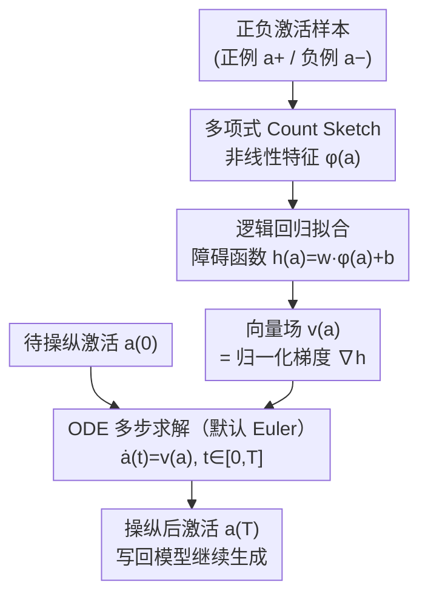

# ODESteer: A Unified ODE-Based Steering Framework for LLM Alignment

**会议**: ICLR 2026  
**arXiv**: [2602.17560](https://arxiv.org/abs/2602.17560)  
**代码**: [项目页面](https://odesteer.github.io)  
**领域**: 模型压缩  
**关键词**: 激活操纵, ODE, 障碍函数, 控制论, 推理时对齐

## 一句话总结

提出基于常微分方程(ODE)的统一激活操纵理论框架，将传统激活加法解释为ODE的Euler离散化，操纵方向识别等价于定义障碍函数；据此设计ODESteer方法，通过多步自适应求解ODE实现精细操纵，在TruthfulQA上提升5.7%、UltraFeedback上提升2.5%、RealToxicityPrompts上提升2.4%。

## 研究背景与动机

**领域现状**：激活操纵（Activation Steering / Representation Engineering）是推理时对齐LLM的轻量级方法，通过直接修改模型内部激活来引导模型行为（如提升有益性、真实性），无需修改模型权重或重新训练。代表方法包括RepE、CAA（对比激活加法）、ITI（推理时干预）等。

**现有痛点**：
1. **缺乏统一理论框架**：现有方法分为"输入读取"（对比正负样本激活差异）和"输出优化"（最大化评分函数）两大类，但两者基于完全不同的原理，难以系统比较和深入理解
2. **依赖单步操纵**：现有方法多采用一步加法 $\tilde{a} = a + T \cdot v(a)$，这种粗粒度修改难以捕捉复杂激活分布的精细模式
3. **线性操纵表达力不足**：CAA使用均值差、ITI使用线性探针，结果都是固定向量，无法自适应调整

**核心矛盾**：推理时对齐需要精细、自适应的激活控制，但现有方法要么理论基础薄弱、要么表达力不足——如何在统一理论框架下实现多步自适应操纵？

**本文方案**：从一个关键观察出发——传统激活加法 $\tilde{a} = a + T \cdot v(a)$ 恰好是ODE $\dot{a}(t) = v(a(t))$ 的一阶Euler离散化。基于此，操纵方向识别等价于设计ODE的向量场，进而等价于定义控制论中的障碍函数。

## 方法详解

### 整体框架

ODESteer 把激活操纵重新理解为求解一个常微分方程（ODE）的初值问题：激活 $a$ 沿向量场 $\dot{a}(t)=v(a(t))$ 从初值演化到时刻 $T$，积分时间 $t$ 就是操纵强度。在这个视角下，"识别操纵方向"等价于"定义一个障碍函数 $h(a)$"——让向量场始终沿 $h$ 上升、把激活推向期望区域。落到实现上分两步：**离线**用正负激活拟合出非线性障碍函数；**在线**把它的归一化梯度当向量场，对每个待操纵激活多步数值求解 ODE，从 $a(0)$ 推进到 $a(T)$ 后写回模型。下图是 ODESteer 的离线学习 + 在线求解流水线。

### 关键设计

**1. 把激活加法读成 ODE 的 Euler 离散化：暴露单步操纵的近似误差**

现有方法几乎都采用一步加法 $\tilde{a}=a+T\cdot v(a)$，看似是工程技巧，本文指出它恰好是 ODE $\dot{a}(t)=v(a(t))$ 的一阶 Euler 离散：把 $a(T)=a(0)+\dot{a}(0)\cdot T=a(0)+T\cdot v(a(0))$ 展开就回到了激活加法。这说明传统做法本质是沿理想轨迹的**一步大跳跃**，一阶近似带来 $\mathcal{O}(T^2)$ 的误差；当激活分布复杂、轨迹弯曲时，单步落点会明显偏离真正的期望位置。把同一段演化拆成多步小调整、每步重新评估方向，就能把离散化误差压下来，这正是后面 ODESteer 多步求解的理论依据。

**2. 用障碍函数统一"输入读取"与"输出优化"两类方法：给方向识别一个共同语言**

借鉴控制论的障碍函数（Barrier Function），定义期望区域 $\mathcal{C}=\{a\mid h(a)\geq 0\}$，只要向量场满足 $\nabla_a h(a)^\top v(a)>0$，激活就会渐近进入并停留在 $\mathcal{C}$ 内——像自动驾驶的副驾驶不断把车修正回安全路线。在这套语言下，看似原理迥异的两大流派其实都在隐式地选 $h$：以 CAA、ITI 为代表的输入读取方法用的是正负激活的对数密度比 $h(a)=\log\frac{p_+(a)}{p_-(a)}$（CAA 取高斯假设的均值差，ITI 取逻辑回归探针）；以 RE-Control 为代表的输出优化方法则用评分函数减阈值 $h(a)=s(a)-\varepsilon$。这一统一不只是理论整理，它直接告诉 ODESteer：只要换一个表达力更强的 $h$，就能在同一框架下得到更好的操纵方向。

| 类别 | 代表方法 | 隐式障碍函数 |
|:---|:---|:---|
| 输入读取-均值差 | CAA/RepE | 对数密度比（高斯假设） |
| 输入读取-探针 | ITI | 对数密度比（逻辑回归） |
| 输出优化 | RE-Control | 评分函数减阈值 |

**3. ODESteer：非线性障碍函数 + 数值求解的反馈式操纵**

既然方向识别归结为选障碍函数，ODESteer 干脆把它做成非线性的 $h(a)=w^\top\phi(a)+b$：其中 $\phi:\mathbb{R}^d\to\mathbb{R}^D$ 是多项式 Count Sketch（Polynomial Count Sketch）特征映射，把激活先归一化到单位 $\ell_2$ 范数再映射以保数值稳定，$w,b$ 则直接在正负激活的随机多项式特征上用逻辑回归（scikit-learn 实现）学得，全程不训练神经网络。对应的向量场取障碍函数的归一化梯度 $\dot{a}(t)=\frac{J_\phi(a(t))^\top w}{\|J_\phi(a(t))^\top w\|}$（$J_\phi$ 为特征映射的 Jacobian，归一化避免高梯度区步子过大），最后交给标准数值求解器从 $a(0)$ 多步推进到 $\tilde{a}=a(T)=\text{ODESolve}(v(\cdot),a,[0,T])$；默认就用最简单的 Euler 法（论文实测换成更高阶的 RK4 只带来边际提升，故取 Euler 兼顾简洁与效率）。这样得到的操纵有三点不同于以往：向量场依赖当前激活、每步动态重算方向，是闭环反馈而非固定向量的开环控制；多步小调兑现了设计 1 里降低离散化误差的承诺；整条实现只用到逻辑回归 + 多项式 Count Sketch，计算开销很低、也不依赖对激活分布的强假设。

## 实验结果

### 主实验：三模型三任务全面对比

在Falcon-7B、Mistral-7B、LLaMA3.1-8B上评估有益性（UltraFeedback）、真实性（TruthfulQA）、去毒性（RealToxicityPrompts）：

| 方法 | UltraFeedback Win% ↑ | TruthfulQA T×I% ↑ | Toxicity ↓ |
|:---|:---:|:---:|:---:|
| Original (Falcon-7B) | 50.0 | 29.0 | 0.257 |
| CAA | 52.8 | 35.0 | 0.244 |
| ITI | 50.5 | 34.7 | 0.243 |
| Linear-AcT | 50.7 | 35.1 | 0.248 |
| RE-Control | 51.4 | 31.7 | 0.219 |
| **ODESteer** | **56.3** | **42.2** | **0.188** |
| Original (Mistral-7B) | 50.0 | 39.3 | 0.215 |
| CAA | 53.4 | 45.9 | 0.190 |
| HPR | 52.3 | 50.4 | 0.127 |
| Linear-AcT | 54.6 | 46.0 | 0.189 |
| **ODESteer** | **56.1** | **59.9** | **0.109** |

**核心发现**：
- ODESteer在所有模型×任务组合上均取得最优或次优
- Mistral-7B上TruthfulQA提升最大：从39.3%→59.9%（+20.6%），远超所有基线
- 去毒性任务上Mistral-7B的Toxicity从0.215降至0.109，降幅49%

### 消融实验：各组件贡献分析

| 配置 | TruthfulQA T×I% | UltraFeedback Win% |
|:---|:---:|:---:|
| 线性特征 + 单步 | 35.1 | 50.7 |
| 非线性特征 + 单步 | 37.8 | 52.1 |
| 线性特征 + 多步 | 36.5 | 51.9 |
| **非线性特征 + 多步 (ODESteer)** | **42.2** | **56.3** |

消融实验验证了两个核心设计的互补性：
- 非线性特征（多项式Count Sketch）带来+2.7%的TruthfulQA提升
- 多步ODE求解带来+1.4%的提升
- 两者结合产生超线性增益（+7.1% vs 单独加和+4.1%）

## 论文评价

### 优点

1. **理论贡献突出**：将激活操纵与ODE/控制论建立严格联系，为该领域提供了统一的数学基础
2. **方法优雅简洁**：核心实现仅依赖逻辑回归和多项式特征，计算开销极低
3. **实验全面充分**：覆盖3个模型×3个任务，且有详细消融验证每个设计的贡献

### 不足

1. 多步ODE求解引入额外推理延迟，论文未详细分析延迟-性能权衡
2. 障碍函数的正负样本需要人工收集对比数据集，数据质量影响操纵效果
3. 非线性特征维度和多项式阶数的选择需要调参，论文仅给出经验指导

### 评分

⭐⭐⭐⭐

**推荐理由**：将激活操纵从"经验技巧"提升为"理论框架"，ODE+障碍函数的统一视角不仅解释了现有方法，还自然地导出了更优的ODESteer方法。理论与实验的结合紧密，对推理时对齐研究具有重要指导意义。

<!-- RELATED:START -->

## 相关论文

- [\[ACL 2026\] Why Steering Works: Toward a Unified View of Language Model Parameter Dynamics](../../ACL2026/model_compression/why_steering_works_toward_a_unified_view_of_language_model_parameter_dynamics.md)
- [\[ICLR 2026\] Steering MoE LLMs via Expert (De)Activation](steering_moe_llms_via_expert_deactivation.md)
- [\[NeurIPS 2025\] Loquetier: A Virtualized Multi-LoRA Framework for Unified LLM Fine-tuning and Serving](../../NeurIPS2025/model_compression/loquetier_a_virtualized_multi-lora_framework_for_unified_llm_fine-tuning_and_ser.md)
- [\[CVPR 2026\] OneSparse: A Unified Framework for Sparse Activation Layers in Vision Models](../../CVPR2026/model_compression/onesparse_a_unified_framework_for_sparse_activation_layers_in_vision_models.md)
- [\[ICLR 2026\] Towards Reliable Benchmarking: A Contamination Free, Controllable Evaluation Framework for Multi-step LLM Function Calling](towards_reliable_benchmarking_a_contamination_free_controllable_evaluation_frame.md)

<!-- RELATED:END -->
