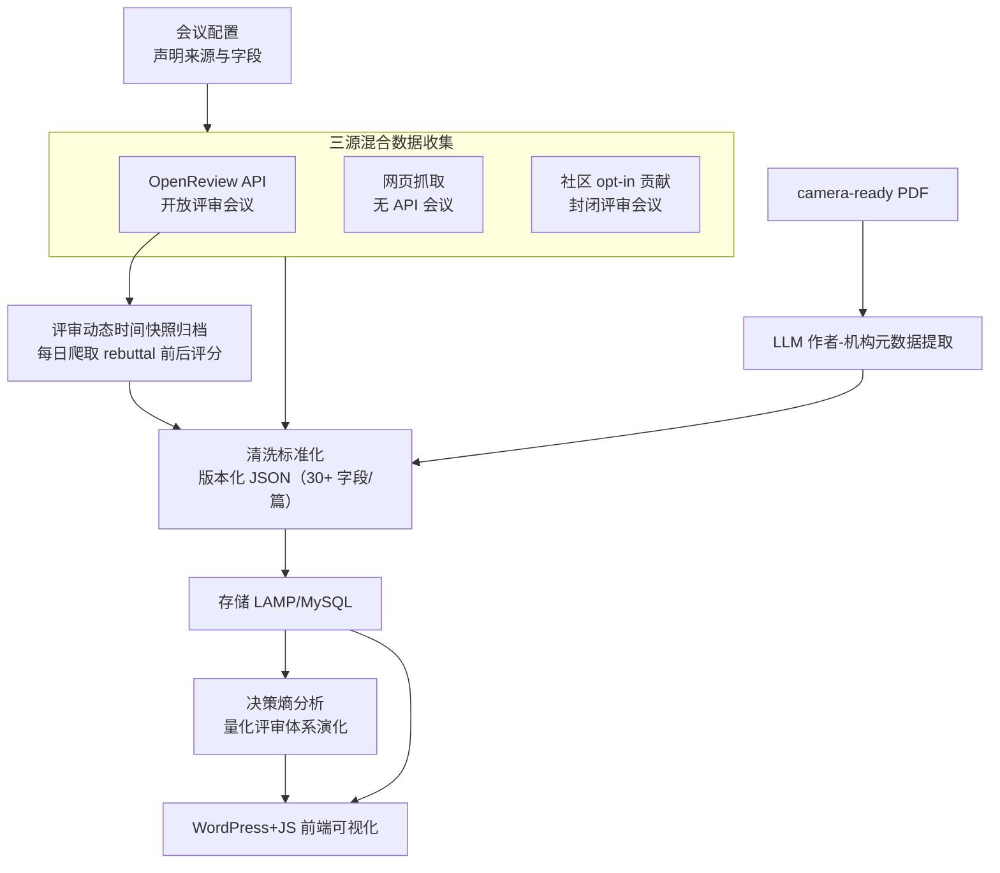

# Paper Copilot: Tracking the Evolution of Peer Review in AI Conferences

**会议**: ICLR 2026  
**arXiv**: [2510.13201](https://arxiv.org/abs/2510.13201)  
**代码**: [项目页面](https://papercopilot.com)  
**领域**: 科学计量 / 评审分析  
**关键词**: 同行评审, 评分动态, 决策熵, 会议统计, 数据集, LLM 元数据提取

## 一句话总结

构建 Paper Copilot——跨数十个 AI/ML 会议的同行评审持久数字档案与分析平台：通过 OpenReview API、网页抓取、社区贡献三源混合收集评审数据，实时归档评分时间快照（含 rebuttal 前后动态变化），揭示 ICLR 2025 年决策熵反常下降——评审体系从概率性分层转向近确定性分数驱动决策的结构性变化，并通过 LLM 驱动的作者-机构元数据提取支持人才轨迹追踪。

## 研究背景与动机

**领域现状**：AI/ML 顶会投稿量年超 10,000 篇（ICLR 2025 达 11,672 篇），同行评审压力空前。部分会议（ICLR/NeurIPS）采用 OpenReview 开放评审，但多数（CVPR/AAAI/ICCV）评审封闭。评审维度也从单一评分扩展到 soundness/correctness/novelty/contribution 等多维度评估。

**现有痛点**：(1) 评审数据分散在 Twitter/Reddit/知乎/小红书等社交平台，碎片化严重；(2) OpenReview 会覆盖旧版评审——rebuttal 期间的评分变化历史是不可恢复的信息损失；(3) 跨会议、跨年评审标准比较缺乏统一数据源和工具；(4) 作者在 rebuttal 期（仅 1-2 周）缺乏统计参考，难以判断分数水平和 rebuttal 价值。

**核心矛盾**：评审过程是研究透明度的核心，但现有基础设施无法支持系统性的评审动态追踪和纵向分析。

**本文目标** 构建统一的评审数据收集、归档和分析平台，支持跨会议纵向分析和实时评分动态追踪。

**切入角度**：三源混合数据策略最大化覆盖率，实时归档时间快照保存不可恢复的历史数据。

**核心 idea**：将分散、短暂的 AI 会议评审信息统一为持久化、结构化、可分析的数字档案，构建评审过程的"元科学基础设施"。

## 方法详解

### 整体框架

Paper Copilot 要解决的核心问题是：AI 会议的评审信息分散在 OpenReview、社交平台、社区私下交流里，既碎片化又会随时间被覆盖丢失，没有一个统一、持久、可纵向分析的数据底座。系统按"配置一个会议 → 多源抓数据 → 清洗成结构化档案 → 存储并对外可视化"的链路把这件事工程化：venue 配置层声明每个会议的来源和字段，数据收集管道用多源 assigner + worker pool + 并行 bot 同时拉取，抓回的原始评审经过清洗标准化后落成版本化的 JSON 数据集（每篇论文 30+ 字段），再进入 LAMP/MySQL 后端，最终由 WordPress + 自定义 JS 的前端做可视化分析。其中评审时序快照与决策熵分析是两个真正不可替代的环节，而 LLM 元数据提取补上了会议普遍缺失的结构化映射；接入一个新会议只需补一份最小配置，其余流程复用。

### 关键设计

**1. 三源混合数据收集管道：用异构来源拼出最大覆盖率**

单一数据源覆盖不了所有会议——开放评审的会议有 API，封闭评审的会议根本没有公开评审可抓。管道因此并行用三条来源互补：OpenReview API 用定时脚本拉取 ICLR/NeurIPS 这类开放会议的评分、置信度、评论，并存成带时间戳的快照以便追踪 rebuttal 前后的变化；网页抓取针对 CVPR/AAAI 这类无 API 的会议，提取 accepted 论文、作者和元数据；社区 opt-in 贡献则面向封闭评审会议，由作者自愿提交自己的评审，累计 6,584 条有效记录，约 60% 的作者同意公开匿名化评分。对封闭评审会议而言，社区贡献几乎是唯一可行的数据来源，三源叠加才能把覆盖面铺到数十个会议。

**2. 评审动态时间快照归档：把会被覆盖的评审"过程"保存下来**

OpenReview 官方只保留每条评审的最终版本，rebuttal 期间分数怎么变、共识怎么形成，旧版本一旦被覆盖就不可恢复，是一种永久的信息损失。Paper Copilot 对 ICLR 2024/2025 每天爬取一次评审快照，记录每个 reviewer 在每个时间点上的全部维度评分（rating、confidence、soundness、contribution、presentation），从而成为互联网上唯一保存完整评审时序数据的公开档案。在此之上用 score footprint 把单篇论文在多维度、多 reviewer 上的评分演化轨迹可视化出来——因为分数"如何变化"本身和最终结果同样重要，而此前没人系统性地把它留存下来。

**3. LLM 驱动的作者-机构元数据提取：补上会议普遍缺失的结构化映射**

绝大多数会议不提供结构化的作者-机构对应关系，而这恰恰是做机构级、国家级分析的前提。Paper Copilot 用 GLM 系列模型从 camera-ready PDF 中抽取每位作者的结构化元组 $(a_i, \mathcal{A}_i, e_i)$（姓名、机构集合、邮箱）。为评估抽取质量，先定义 mismatch indicator $\mathbf{1}(x,y) = 1$ if $|x| \neq |y|$ 来检查结构一致性，再用整体的 Success Rate 衡量：

$$\text{Success Rate} = 1 - \frac{1}{|\mathcal{D}|} \sum_{i} \left(\delta_{\text{aff}}^i \lor \delta_{\text{email}}^i \lor \delta_{\text{parse}}^i\right)$$

即只要机构、邮箱、解析三类错误中任何一类发生就算这篇失败。glm-4-plus 在约 70K 篇论文上达到 86.82% 成功率（$\delta_{\text{aff}} = 5.01\%$、$\delta_{\text{email}} = 4.94\%$、$\delta_{\text{parse}} = 0.81\%$），明显优于更小的 GLM 变体。

**4. 决策熵分析框架：把社区的直觉观察变成可量化的元科学指标**

社区一直有"今年录用线更卡平均分了"这类直觉，但缺乏量化口径。本文引入决策熵来刻画 AC 决策的确定性：对年份 $t$、分数区间 $b$，定义

$$H_{t,b} = -\sum_{s \in \{\text{Reject, Poster, ...}\}} p_{t,b,s} \log p_{t,b,s}$$

再按各区间权重加权得到当年整体决策熵 $\bar{H}_t = \sum_b w_{t,b} H_{t,b}$。历史上 $\bar{H}_t$ 通常随投稿量对数增长，即 $\bar{H}_t \approx a \log X_t + b$；但 2025 年出现强负残差，说明决策敏感度 $\kappa_{2025}$ 异常偏高——AC 比以往更依赖平均分做确定性分层。正是这个指标把散落的社区观察提升成了可拟合、可比较的元科学结论。

## 实验关键数据

### ICLR 2017-2025 评审演化分析

| 指标 | 发现 | 量化证据 |
|------|------|----------|
| 投稿量增长 | 490 → 11,672（24 倍） | AC 数从 31 增至 823 |
| 决策熵趋势 | 通常随投稿量对数增长 | $\bar{H}_t \approx a\log X_t + b$ |
| 2025 结构性变化 | 决策熵反常下降 | $\text{resid}_{2025}$ 强负偏离拟合线 |
| Rebuttal 分数变化 | 54.8% 论文 overall rating 变化 | soundness 等仅 ~10-13% 变化 |
| 共识演变 | 讨论开始时分歧先增大后收敛 | Oral 收敛最快，Reject 保持高分歧 |
| 边界不对称 | 高于均值时低方差利于接收 | 低于均值时高方差反而利于接收 |

### 社区透明度调查（4 个会议 1,860 份回复）

| 会议 | 回复数 | 同意公开匿名评审 | 比例 |
|------|:------:|:------:|:------:|
| CVPR 2025 | 357 | 191 | 53.5% |
| ICML 2025 | 1,034 | 628 | 60.7% |
| ICCV 2025 | 254 | 151 | 59.4% |
| ACL 2025 | 215 | 145 | 67.4% |
| **总计** | **1,860** | **1,115** | **59.9%** |

### LLM 元数据提取准确率

| 模型 | $\delta_{\text{aff}}$ | $\delta_{\text{email}}$ | $\delta_{\text{parse}}$ | Success Rate |
|------|:------:|:------:|:------:|:------:|
| glm-4-plus | 5.01% | 4.94% | 0.81% | **86.82%** |
| glm-4-air | 49.98% | 17.11% | 0.51% | 44.73% |
| glm-4-flash | 76.39% | 43.27% | 0.62% | 18.52% |
| glm-3-turbo | 76.07% | 32.34% | 1.34% | 20.90% |

### 关键发现

- **2025 年的结构性转折**：尽管投稿量最大，决策熵反而下降——AC 更依赖平均分做录用决策，从概率性 tiering 转向近确定性 mapping
- **Rebuttal 的双重角色**：对 borderline 论文放大分数变化，对强论文驱动共识形成
- **Spotlight 向 Oral 收敛**：平均评分在 tier 间分离加剧，Spotlight 逐年靠近 Oral
- **评分变化维度分化**：overall rating 是 rebuttal 最频繁变化的维度，soundness 等变化远少

## 亮点与洞察

- **唯一的评审时序档案**：OpenReview 覆盖讨论过程中的旧版本，Paper Copilot 实时归档保存了全网唯一的完整评审动态数据——这一种不可替代的历史记录
- **决策熵分析框架**：引入 ordered-logit 模型 + 决策熵定量刻画评审体系演化，将散落的社区直觉观察提升为可量化的元科学分析
- **伦理设计的完整性**：详细讨论数据来源合规、隐私保护、再识别风险、dual-use 防范，符合研究伦理最佳实践

## 局限与展望

- 封闭评审会议依赖社区自愿提交——存在自选择偏差（高分/低分作者提交倾向可能不同）
- LLM 提取机构元数据的非零错误率可能影响机构排名分析可靠性
- 作者轨迹分析可能被用于招聘等高风险评估——存在 dual-use 风险
- 系统是持续更新的 live platform，精确复现某一时间点状态不可行

## 相关工作与启发

- **vs PeerRead (Kang et al., 2018)**: 14.7K 论文但限于特定 venue 和时间快照，不支持纵向动态追踪
- **vs MOPRD (Lin et al., 2023)**: 多学科但不涵盖 AI 会议的 rebuttal 动态和评分时序
- **vs CSRankings**: 关注机构排名但更新慢、数据源不透明、完全不含评审数据

## 评分

- 新颖性: ⭐⭐⭐⭐ 独特的三源数据策略和评审时序归档，决策熵分析框架新颖
- 实验充分度: ⭐⭐⭐⭐ ICLR 2017-2025 大规模纵向分析，发现充实且量化扎实
- 写作质量: ⭐⭐⭐⭐ 系统描述清晰，伦理讨论详尽完整
- 价值: ⭐⭐⭐⭐⭐ 对 AI 研究社区有基础设施级贡献，数据集+平台的组合价值远超单篇论文

<!-- RELATED:START -->

## 相关论文

- [\[ICLR 2026\] LLM DNA: Tracing Model Evolution via Functional Representations](llm_dna_tracing_model_evolution_via_functional_representations.md)
- [\[ICLR 2026\] Evolution and compression in LLMs: On the emergence of human-aligned categorization](evolution_and_compression_in_llms_on_the_emergence_of_human-aligned_categorizati.md)
- [\[ICLR 2026\] Textual Equilibrium Propagation for Deep Compound AI Systems](textual_equilibrium_propagation_for_deep_compound_ai_systems.md)
- [\[ACL 2026\] When Reviews Disagree: Fine-Grained Contradiction Analysis in Scientific Peer Reviews](../../ACL2026/model_compression/when_reviews_disagree_fine-grained_contradiction_analysis_in_scientific_peer_rev.md)
- [\[AAAI 2026\] Group Orthogonal Low-Rank Adaptation for RGB-T Tracking](../../AAAI2026/model_compression/group_orthogonal_low-rank_adaptation_for_rgb-t_tracking.md)

<!-- RELATED:END -->
