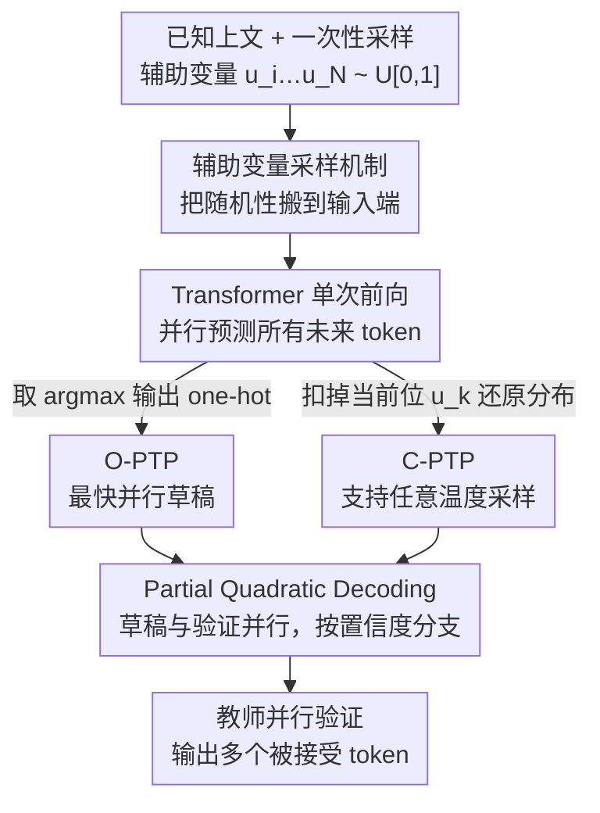

# Parallel Token Prediction for Language Models

**会议**: ICLR 2026  
**arXiv**: [2512.21323](https://arxiv.org/abs/2512.21323)  
**代码**: [GitHub](https://github.com/mandt-lab/ptp)  
**领域**: 模型压缩  
**关键词**: 并行解码, 推测解码, 辅助变量, 自回归模型, 推理加速

## 一句话总结

提出 Parallel Token Prediction (PTP)，通过将采样随机性从后处理移至模型输入（辅助变量），使未来 token 成为确定性函数，从而在单次前向传播中联合预测多个 token。

## 研究背景与动机

自回归 Transformer 的顺序生成过程是推理延迟的主要瓶颈——每预测一个 token 需要一次前向传播。现有加速方法的局限：
- **推测解码**：使用小模型草拟再验证，但小模型本身仍是顺序生成
- **独立多 token 预测**：假设 token 条件独立，导致语义不一致（如生成 "def numpy"）
- **离散扩散**：需要多步迭代，仍有不可约的顺序成分

PTP 的核心洞察：如果把采样用的随机变量 $u_i \sim \mathcal{U}[0,1]$ 作为模型输入，那么每个 token $t_i$ 就成了 $u_i$ 和上文的确定性函数，模型可以并行预测所有未来 token。

## 方法详解

### 整体框架

PTP 要解决的是自回归解码"一次前向只产一个 token"的延迟瓶颈。它的整体思路是把"采样的随机性"从输出端搬到输入端：模型在预测每个未来 token 时额外读入一组一次性采到的辅助随机变量 $u_i,\ldots,u_N$，于是原本要逐步采样的 token 变成"上文 + 这些随机变量"的确定性函数，能在单次前向里联合给出多个 token。落地时分两种变体——O-PTP 直接输出 one-hot 结果、延迟最低，适合当投机解码（speculative decoding）的草稿模型；C-PTP 还原完整条件分布、支持任意采样温度，两者都能通过蒸馏教师或从头训练得到。由于真实 Transformer 容量有限、单次能准确并行的 token 数受限，最后再用 Partial Quadratic Decoding 把草稿交给教师并行验证纠错，在不损失质量的前提下兑现加速。

### 关键设计

**1. 辅助变量采样机制：把随机性变成可输入的信息**

标准采样写作 $t_i = \text{Pick}(u_i, P_i)$，其中 $u_i \sim \mathcal{U}[0,1]$ 经逆 CDF 落到某个 token 上。常规做法是先算分布 $P_i$ 再用 $u_i$ 抽样，所以 token 之间必须串行。PTP 的关键观察是：一旦固定 $u_i$，token $t_i$ 就是确定的，$u_i$ 携带的信息与 $t_i$ 等价。把这点推广就得到 Theorem 1：$t_k = f_P(t_{<i}; u_i, \ldots, u_k)$，即任意未来 token 都能写成"已知上文 + 一串辅助变量"的确定性函数。这样一来，只要把 $u_i,\ldots,u_N$ 一次性喂给模型，所有未来位置就不再相互等待，可以并行求解。

**2. O-PTP：用 one-hot 预测换取最快的并行解码**

O-PTP 让模型同时接收全部辅助变量，对每个位置直接输出 one-hot 结果 $t_k = \arg\max P(t_k \mid t_{<i}; u_i, \ldots, u_k)$。因为辅助变量已经替模型"决定"了该选哪个 token，输出退化为一个确定的选择，省去了从分布里抽样的步骤，是延迟最低的形态。代价是它只给最终 token、不暴露底层采样分布，因此天然适合做投机解码的草稿模型——一次前向预测一串候选，再交给教师并行验证。

**3. C-PTP：隐藏一个变量以还原完整分布**

当下游需要按温度采样而非只取最可能 token 时，O-PTP 的 one-hot 输出就不够用了。C-PTP 的做法是在预测第 $k$ 个 token 时故意不提供 $u_k$，只给到 $u_{k-1}$。Theorem 2 证明此时 $P(t_k \mid t_{<i}, u_i, \ldots, u_{k-1}) = P(t_k \mid t_{<k})$，即缺掉的那个随机变量恰好把确定性输出重新"摊开"成真实条件分布。这样 C-PTP 既保留并行性，又能给出可采样的完整概率，且支持逆自回归式的从头训练或蒸馏。

**4. Partial Quadratic Decoding：按置信度把算力分给最可能的分支**

投机解码中草稿被接受的数量事先未知，朴素做法要么浪费算力、要么续写错分支。该设计让草案与验证并行，并为每种可能的接受数量预留分支，用模型自身置信度估计每个分支的概率 $P(\#\text{correct}=m \mid t) \approx (1-c_{i+m})\prod_{k=i}^{i+m-1} c_k$（$c_k$ 为第 $k$ 位的置信度）。随后贪心地把有限的续写 token 优先分配给高概率分支，使大部分计算落在真正会被采纳的路径上，减少无效前向。

### 损失函数 / 训练策略

蒸馏时需要从教师分布反推每个 token 对应的辅助变量，落在区间 $u_k \in [F_{k,t_k-1}, F_{k,t_k})$（$F$ 为累积分布）。两个变体的目标都是负对数似然，区别仅在条件里是否含 $u_k$：O-PTP 用 $\mathcal{L}(\theta; t, i) = -\sum_{k=i}^N \log P_\theta(t_k \mid t_{<i}, u_i, \ldots, u_k)$，C-PTP 则去掉当前位的变量，$\mathcal{L}(\theta; t, i) = -\sum_{k=i}^N \log P_\theta(t_k \mid t_{<i}, u_i, \ldots, u_{k-1})$。辅助变量本身通过 $\text{embed}(u) = W \cdot \text{binary}(u) + b$ 编码，即把 float32 展开成 32 位二进制向量后线性映射进 embedding 空间。

## 实验关键数据

### 主实验（SpecBench - Vicuna-7B 蒸馏）

| 方法 | MTC | TL | SUM | QA | Math | RAG | 平均 #accepted |
|------|-----|-----|-----|-----|------|-----|---------------|
| O-PTP | 2.77 | - | - | - | - | - | **4.2** |
| 自回归基线 | - | - | - | - | - | - | ~2.0 |
| 独立预测 | - | - | - | - | - | - | ~3.5 |

| 指标 | 本文 (O-PTP) | 说明 |
|------|------------|------|
| 墙钟加速比 | **2.4×** | 相比标准自回归解码 |
| 每步接受 token 数 | **4.2** | 投机解码步 |

### 消融实验

| 配置 | #accepted ↑ | 说明 |
|------|-----------|------|
| O-PTP (有辅助变量) | **7.0 ± 0.1** | token 间有协调 |
| 独立预测 (无辅助变量) | 6.2 ± 0.1 | token 间独立，不一致对 |
| C-PTP 从头训练 | PPL 19.88 | 接近自回归基线 (19.81) |

### 关键发现

- PTP 草稿模型每次调用预测多个 token，将最优模型大小推向更大模型（甚至直接微调教师）
- 辅助变量使 token 间产生协调，显著减少不兼容 token 对（"def numpy" 等降至 <1%）
- C-PTP 从头训练可与自回归模型达到相当的困惑度，验证了理论表达能力

## 亮点与洞察

- 理论贡献突出：Theorem 1/2 从概率论角度严格证明了并行采样的可行性
- 将 Normalizing Flow 中的逆自回归思想迁移到离散序列生成，跨领域创新
- 辅助变量机制自然解决了独立预测的不一致问题
- Partial Quadratic Decoding 利用置信度分配计算资源，实用性强

## 局限与展望

- 实际加速受限于模型容量——有限的 Transformer 容量限制了单次可准确预测的 token 数
- 需要教师模型来反推辅助变量，蒸馏成本较高
- 辅助变量的二进制编码可能不是最优的表示方式
- 未验证在更大规模模型（70B+）和更长上下文上的效果

## 相关工作与启发

- 与 Medusa/EAGLE 的区别：PTP 通过辅助变量实现 token 间的协调，而非独立多头预测
- 与 Normalizing Flow 的联系：PTP 本质上是 Inverse Autoregressive Flow 的离散版本
- 可与 GaLore、FlashAttention 等高效训练技术组合使用

## 评分

- 新颖性: ⭐⭐⭐⭐⭐ 辅助变量并行采样框架是全新理论贡献
- 实验充分度: ⭐⭐⭐⭐ 多任务验证，但缺少大模型实验
- 写作质量: ⭐⭐⭐⭐⭐ 定理证明严谨，图示清晰
- 价值: ⭐⭐⭐⭐⭐ 开辟了并行 token 生成的新设计空间

<!-- RELATED:START -->

## 相关论文

- [\[CVPR 2026\] Rethinking Token Reduction for Large Vision-Language Models](../../CVPR2026/model_compression/rethinking_token_reduction_for_large_vision-language_models.md)
- [\[CVPR 2026\] Hybrid Token Compression for Vision-Language Models](../../CVPR2026/model_compression/hybrid_token_compression_for_vision-language_models.md)
- [\[ICLR 2026\] Multi-View Encoders for Performance Prediction in LLM-Based Agentic Workflows](multi-view_encoders_for_performance_prediction_in_llm-based_agentic_workflows.md)
- [\[CVPR 2026\] Accelerating Streaming Video Large Language Models via Hierarchical Token Compression](../../CVPR2026/model_compression/accelerating_streaming_video_large_language_models_via_hierarchical_token_compre.md)
- [\[ICLR 2026\] BeyondBench: Contamination-Resistant Evaluation of Reasoning in Language Models](beyondbench_contamination-resistant_evaluation_of_reasoning_in_language_models.md)

<!-- RELATED:END -->
