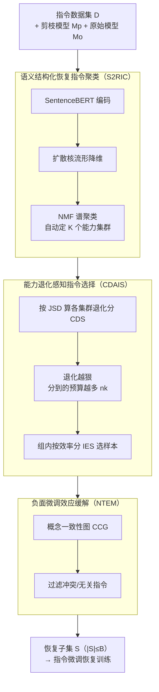

# PASER: Post-Training Data Selection for Efficient Pruned Large Language Model Recovery

**会议**: ICLR 2026  
**arXiv**: [2502.12594](https://arxiv.org/abs/2502.12594)  
**代码**: 有  
**领域**: 模型压缩 / LLM效率  
**关键词**: LLM剪枝, 数据选择, 后训练恢复, 流形学习, 能力退化感知

## 一句话总结
提出PASER，一种针对剪枝LLM恢复的后训练数据选择方法，通过流形学习+谱聚类识别能力相关指令集，按能力退化程度自适应分配数据预算，仅用4%-20%原始数据即可显著超越全量数据恢复效果。

## 研究背景与动机

**领域现状**：模型剪枝是LLM压缩的有效手段，但不可避免导致能力退化。主流做法是用指令微调数据（如Alpaca）做后训练恢复。常规方法直接用全量数据训练，既耗费算力又未必效果最优。

**现有痛点**：
   - 剪枝对不同能力的影响是**不均匀**的（数学能力可能严重退化而语言建模基本不变），但现有方法忽视这种不均匀性
   - 全量数据恢复计算成本高（如LaMini有258万条），且可能引入无关/冲突指令导致**负面微调效应**
   - 随机子集选择效果不稳定，对数据构成高度敏感
   - 已有数据选择方法（如IFD、Nuggets）面向通用指令质量，未针对剪枝恢复场景设计

**核心矛盾**：需要用少量数据高效恢复多种能力，但不同能力需要不同量和类型的数据支持，且部分数据可能产生负面效果。

**本文目标**
   - 识别与不同LLM能力对应的指令数据分组
   - 按退化程度自适应分配数据预算
   - 在每个分组内优先选择收益/计算成本比最高的样本
   - 过滤掉可能引入负面效应的冲突/无关数据

**切入角度**：假设语义空间中的几何结构对应不同LLM能力，通过流形学习发现这些结构，然后用原始模型与剪枝模型的输出分布差异（JSD）量化退化程度。

**核心 idea**：通过"能力感知的数据选择"替代"盲目全量训练"，让剪枝LLM的恢复更精准、更高效、更安全。

## 方法详解

### 整体框架
PASER 要回答的问题是：剪枝把 LLM 砍残之后，从一大堆指令数据里挑哪些、挑多少来做恢复训练，才能既省算力又不踩到"越训越坏"的坑。它把这件事拆成一条三段流水线：先把指令数据按"它在练哪种能力"聚成 $K$ 个集群，再根据每种能力退化得有多严重去分配数据预算并在集群内挑性价比最高的样本，最后把那些会跟主体数据打架的冲突指令过滤掉。形式上，输入是剪枝模型 $M_p$、原始模型 $M_o$ 和指令数据集 $D$，三步分别是语义结构化聚类（S2RIC）、能力退化感知选择（CDAIS）、负面效应缓解（NTEM），输出一个满足预算约束 $|S| \leq B$ 的恢复训练子集 $S \subset D$。

### 关键设计

**1. 语义结构化恢复指令聚类（S2RIC）：先把指令按"练哪种能力"分组**

剪枝对不同能力的损伤是不均匀的，所以第一步得先知道每条指令对应的是哪一类能力。S2RIC 的假设是：练同一种能力的指令，在语义空间里会聚成可辨识的拓扑结构。具体做法是先用 SentenceBERT 把每条指令编码成嵌入向量，再用扩散核（Diffusion Kernel）做流形学习降维——之所以不用 PCA/t-SNE，是因为扩散核更能保住这种非线性的流形几何，不会把弯曲的能力簇拍扁。降维之后用基于 NMF 的谱聚类发现自然分组，聚类数 $K$ 不靠人工指定，而是通过最小化 NMF 的逼近误差自动确定，避免了"该分几类"这个超参带来的随意性。

**2. 能力退化感知指令选择（CDAIS）：哪种能力退化越狠，就给它越多数据**

分好组之后要决定每组分多少预算、组内又挑哪些样本。退化程度用能力退化评分（CDS）来量化：在每个集群 $c_k$ 内，比较原始模型和剪枝模型在样本上的输出分布，取两者 JSD 散度的均值作为该能力的退化度。之所以用 JSD 而不是 loss 差或准确率，是因为 JSD 捕获的是完整的输出分布变化，比单点指标更稳健。预算按退化比例分配，退化越严重的能力拿到越多数据：

$$n_k = \left\lfloor B \cdot \frac{\text{CDS}(c_k)}{\sum_j \text{CDS}(c_j)} \right\rfloor$$

组内再挑样本时，不光看退化大小，还要算性价比——用单样本效率得分（IES）把"收益"和"算力成本"放到一起：

$$\text{IES}(x,y) = \frac{\text{JSD}_{avg}}{\log \text{ComputationalCost}(x,y)}$$

分子是该样本带来的退化信号（越大越值得练），分母对计算成本取对数，这样长样本虽然成本高也不会被一票否决，避免过度惩罚那些信息量大的高潜力样本。最终每组优先选出退化大、又相对省算力的样本。

**3. 负面微调效应缓解（NTEM）：把会跟别人打架的冲突指令踢掉**

全量恢复之所以可能让模型崩溃，一个重要原因是数据里混着互相矛盾的指令——比如对同一问题给出相互冲突的答案，硬塞进恢复训练只会进一步损害模型。NTEM 在概念级别而非样本级别建模这种冲突：构建一张概念一致性图（CCG），顶点是从指令里抽出的概念，边表示这些概念共现时彼此不冲突。一个新样本只有当它涉及的概念与已有 CCG 保持一致时才被接受，否则就被过滤掉。为提升判别的鲁棒性，还配了几项增强：语义归一化把同义表述合并、对低置信度的判定做软降权、并可选地用 NLI 做重排序。在概念层面建图的好处是计算成本低、还能随数据增量更新，适合大规模选数据。

### 损失函数 / 训练策略
- 数据选择完成后，子集 $S$ 上走标准的指令微调训练，方法本身不改训练目标。
- 整个选择流程的时间复杂度为 $O(N\log N + NC^2)$，其中 $C$ 是概念数；实际中 $C \ll N$，可近似简化为 $O(N\log N)$。

## 实验关键数据

### 主实验（LLaMA2-7B + LLM-Pruner 25%剪枝 + Alpaca数据）

| 恢复方法 | WikiText2↓ | BoolQ | PIQA | HellaSwag | WinoGrande | ARC-e | ARC-c | OBQA | 平均 |
|----------|-----------|-------|------|-----------|------------|-------|-------|------|------|
| 不恢复 | 20.34 | 61.87 | 76.61 | 65.86 | 60.22 | 63.13 | 37.37 | 39.40 | 57.78 |
| 全量数据 | 736.42 | 37.83 | 53.21 | 26.42 | 49.57 | 25.29 | 28.16 | 29.00 | 35.64 |
| Random | 93.77 | 57.61 | 64.37 | 45.39 | 55.87 | 43.78 | 31.94 | 34.90 | 47.69 |
| Nuggets | 20.02 | 63.62 | 77.43 | 67.36 | 61.08 | 63.77 | 37.64 | 39.90 | 58.69 |
| **PASER** | **16.40** | **67.25** | 77.29 | **68.98** | **66.97** | **67.84** | **39.54** | 39.80 | **61.10** |

注意：**全量数据恢复反而让模型崩溃**（PPL从20→736），而PASER用20%数据将PPL降至16.40（甚至优于未剪枝的12.62），平均准确率恢复到61.10（接近未剪枝的62.91）。

### 消融实验

| 配置 | 关键发现 |
|------|---------|
| SliceGPT 25% + PASER | PPL从44.53→12.24，平均54.27→64.31，**超越未剪枝模型** |
| Wanda 2:4半结构 + PASER | 平均54.39→62.02，接近全参数水平 |
| SparseGPT 50% + PASER | 平均59.93→61.62，稳定提升 |
| LaMini 258万数据 + PASER | 仅用4%数据即可匹配或超越全量训练 |
| 去掉S2RIC（均匀分配预算） | 性能下降2-4%，验证能力感知分配的必要性 |
| 去掉NTEM（不过滤冲突） | 性能下降1-3%，验证负面效应缓解的价值 |

### 关键发现
- **全量数据恢复可能有害**：在LLM-Pruner + Alpaca设置下全量恢复导致模型完全崩溃（PPL>700），说明盲目训练的危险性
- **4%-20%精选数据>100%全量数据**：PASER在所有剪枝方案下均以小量数据超越全量训练
- **SliceGPT + PASER超越未剪枝模型**：这是最惊人的结果——剪枝+精准恢复居然能超越原始模型
- **跨规模/架构泛化**：在LLaMA2-7B/13B/70B、LLaMA3-8B、Baichuan2-7B/13B上均有效

## 亮点与洞察
- **"退化感知"数据选择的核心洞察**：不是所有数据对恢复都有用，关键是找到与退化能力匹配的数据。JSD作为退化度量比简单的loss差更稳健，因为它捕获完整的输出分布变化
- **"精选少量>盲目全量"的工程启示**：全量Alpaca恢复导致PPL爆炸这个发现非常有价值——说明通用指令数据中存在大量对剪枝模型有害的样本
- **概念一致性图（CCG）的设计巧妙**：通过概念级别（而非样本级别）建模冲突关系，计算成本低且可增量更新，适合大规模数据选择

## 局限与展望
- 需要同时访问原始模型和剪枝模型来计算JSD，如果原始模型很大（如LLaMA-70B）则JSD计算本身成本不低
- CCG中的"概念"提取依赖简单规则，对复杂语义冲突的检测可能不完善
- 实验主要在英语LLM上验证，多语言场景的适用性未知
- **可改进方向**：能否用轻量代理模型替代原始模型来估计JSD？能否将此框架推广到量化后恢复？

## 相关工作与启发
- **vs Nuggets (Li et al., 2024)**：通用数据选择方法，在PASER实验中是最强基线（平均58.69），但仍显著弱于PASER（61.10），因为它不考虑能力退化分布
- **vs IFD (Li et al., 2024)**：基于可训练LLM的打分选择，在结构化剪枝场景下弱于Nuggets和PASER
- **vs LLM-Pruner (Ma et al., 2023)**：结构化剪枝先驱，推荐用全量Alpaca恢复——PASER表明这可能适得其反

## 评分
- 新颖性: ⭐⭐⭐⭐ 能力退化感知的数据选择视角新颖，流形学习+JSD的技术路线完整
- 实验充分度: ⭐⭐⭐⭐⭐ 4种剪枝方案、7款LLM、2种数据集规模、多个数据选择基线，极为全面
- 写作质量: ⭐⭐⭐⭐ 方法描述详尽，代码公开
- 价值: ⭐⭐⭐⭐⭐ 对LLM剪枝+恢复的实际工作流有直接指导意义，"少即是多"的发现有重要实践价值

<!-- RELATED:START -->

## 相关论文

- [\[ICML 2026\] Decouple Searching from Training: Scaling Data Mixing via Model Merging for Large Language Model Pre-training](../../ICML2026/model_compression/decouple_searching_from_training_scaling_data_mixing_via_model_merging_for_large.md)
- [\[CVPR 2026\] VLM-PTQ: Efficient Post-Training Quantization for Large Vision-Language Models](../../CVPR2026/model_compression/vlm-ptq_efficient_post-training_quantization_for_large_vision-language_models.md)
- [\[ICLR 2026\] Pedagogically-Inspired Data Synthesis for Language Model Knowledge Distillation](pedagogically-inspired_data_synthesis_for_language_model_knowledge_distillation.md)
- [\[NeurIPS 2025\] Restoring Pruned Large Language Models via Lost Component Compensation](../../NeurIPS2025/model_compression/restoring_pruned_large_language_models_via_lost_component_compensation.md)
- [\[ICLR 2026\] PTQ4ARVG: Post-Training Quantization for AutoRegressive Visual Generation Models](ptq4arvg_post-training_quantization_for_autoregressive_visual_generation_models.md)

<!-- RELATED:END -->
