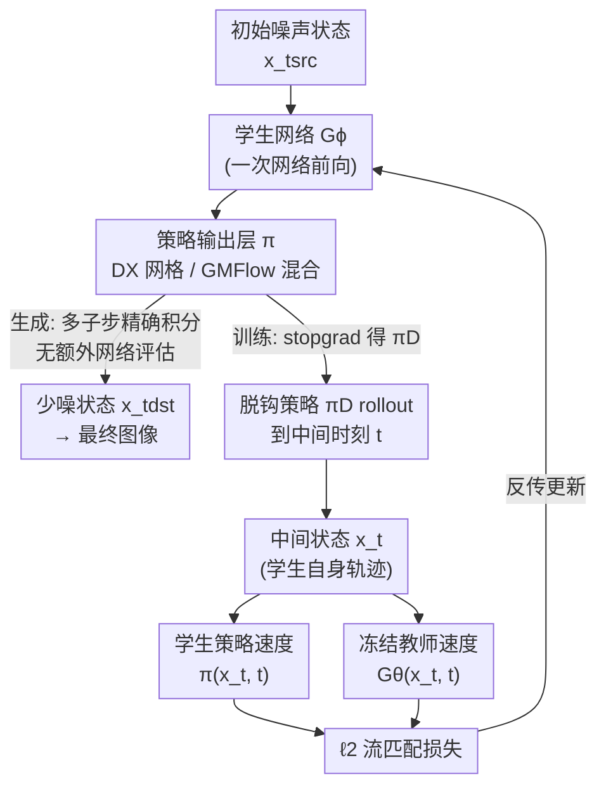

# π-Flow: Policy-Based Few-Step Generation via Imitation Distillation

**会议**: ICLR 2026  
**arXiv**: [2510.14974](https://arxiv.org/abs/2510.14974)  
**代码**: 有（见论文 Comments）  
**领域**: 图像生成 / 扩散模型蒸馏  
**关键词**: 流匹配模型蒸馏, 少步生成, 策略学习, 模仿蒸馏, DiT

## 一句话总结

提出 π-Flow，通过修改学生流模型的输出层使其预测一个"策略"（policy），该策略在单个网络评估内通过多个子步生成动态流速度进行精确 ODE 积分，并采用模仿蒸馏（imitation distillation）方法在学生自己的轨迹上匹配教师速度，从而实现稳定可扩展的少步生成并避免质量-多样性权衡。

## 研究背景与动机

扩散模型和流匹配模型虽然生成质量优异，但推理时需要大量步骤（如 50-1000 步 ODE 求解），严重限制了实际应用的效率。蒸馏（Distillation）是加速这些模型的核心方法。

### 现有蒸馏方法的问题

**格式不匹配（Format Mismatch）**：
   - 教师模型输出的是**速度场（velocity）**——在流的方向上的瞬时变化
   - 学生模型通常被要求输出**去噪后的数据（shortcut prediction）**——直接预测最终结果
   - 这种格式不匹配导致蒸馏过程复杂、不稳定

**质量-多样性权衡（Quality-Diversity Trade-off）**：
   - Distribution Matching Distillation (DMD) 等方法使用 KL 散度匹配分布
   - 但 KL 散度倾向于模式覆盖（mode covering）或模式选择（mode seeking），难以两全
   - 在实际大模型（FLUX, Qwen-Image）上表现为多样性显著下降

**训练不稳定**：
   - 许多方法需要在线生成学生样本、训练判别器或使用对抗训练
   - 这些策略增加了训练复杂度和不稳定性

### 核心动机

能否设计一种蒸馏方法，使学生模型保持与教师相同的"速度预测"格式，从而：
- 避免格式不匹配
- 使用简单的 $\ell_2$ 流匹配损失
- 保持质量和多样性的同时压缩步数

## 方法详解

### 整体框架

π-Flow 想解决的是少步蒸馏里"格式不匹配 → 训练复杂 → 质量或多样性受损"的连锁问题。它的做法是：学生在每个粗步只做**一次**网络前向，但吐出的不是单点速度、也不是去噪结果，而是一个描述该区间连续速度场的**策略（policy）**；有了策略，区间内就能做上百个子步的精确 ODE 积分而无需再评估网络，于是把"网络评估步"和"积分子步"彻底解耦。训练时，让学生先用自己的策略走出一段轨迹，再在这些轨迹点上查询教师速度、用标准 $\ell_2$ 损失去对齐——把蒸馏改写成一个 DAgger 式的"在线模仿学习"。下图给出推理（生成路径）与训练（π-ID 对齐路径）如何共享同一套策略机制：

### 关键设计

**1. 策略输出层（policy）：把网络评估步和 ODE 积分子步彻底解耦**

传统少步学生在一个粗步里只做一两次"捷径跳跃"（shortcut），直接把噪声映到去噪结果，跨度越大、误差累积越严重；多步教师虽然积分精细，却每一子步都要评估一次网络、太慢。π-Flow 的核心改动是让学生在时刻 $t_{src}$ 不再吐单点速度，而是输出一个**网络无关（network-free）的策略** $\pi$——一个能在区间内任意状态 $(x_t,t)$ 给出闭式速度的函数 $\pi(x_t,t)=G_\phi(x_{t_{src}},t_{src})(x_t,t)$。拿到策略后，区间 $[t_{dst},t_{src}]$ 内可以切成上百个子步做高精度 ODE 积分 $x_{t_{dst}}=x_{t_{src}}+\int_{t_{src}}^{t_{dst}}\pi(x_t,t)\,dt$，而这些子步**全部复用同一次网络前向、不再增加网络评估**。论文给出两种策略实例：DX 策略（dynamic-$\hat x_0$）让网络一次预测 $N$ 个等间隔时刻的 $\hat x_0$ 网格、子步间线性插值，简单但对状态扰动不鲁棒；GMFlow 策略把输出参数化成高斯混合（Gaussian mixture）速度分布，依赖 $x_t$ 与 $t$ 动态给速度、鲁棒性更强，实验效果也更好。于是"少量网络评估 + 稠密积分子步"两者兼得，这正是它能压到 1–4 NFE 还保住质量的根本。

**2. 模仿蒸馏（π-ID）：在学生自己走出的轨迹上对齐教师速度，压住误差累积**

如果照搬"在教师轨迹上训学生"的老路，学生推理时会走进训练从未见过的状态、误差逐步发散——这是少步蒸馏不稳定的常见根源。因为策略 rollout 和教师的 ODE 积分**格式完全一致**，π-Flow 得以直接套用模仿学习：采用 DAgger 式的 on-policy 训练（π-ID），先让学生预测策略 $\pi$，detach 成 $\pi_D$（并加 GM dropout）后用小步长（$1/128$）高精度 rollout 到一个中间时刻 $t$，得到落在**学生自身轨迹**上的状态 $x_t$；再把 $x_t$ 同时喂给学生策略和冻结教师，用教师在该点的速度作为"纠偏信号"把偏离的轨迹拉回正轨。把教师当专家、学生当模仿者、在模仿者自身状态分布上对齐专家行为，天然消除了训练与推理的分布偏移。

**3. 标准 $\ell_2$ 流匹配损失：格式对齐让训练退化成最朴素的速度匹配，避开 DMD 的质量-多样性权衡**

正因为学生输出的仍是速度（只是参数化成策略），它和教师输出格式一致，蒸馏损失就退化成逐点速度匹配 $\mathcal{L}_\phi=\tfrac12\|G_\theta(x_t,t)-\pi(x_t,t)\|_2^2$，梯度经策略 $\pi$ 回传到学生 $G_\phi$。这意味着不需要判别器、对抗训练，也不需要 DMD 那样的分布匹配——后者用 KL 散度，会在 mode covering 与 mode seeking 之间被迫取舍，在 FLUX、Qwen-Image 这类大模型上表现为多样性塌缩。π-Flow 用 $\ell_2$ 直接继承教师的流匹配目标，既保住多样性又让训练管线和常规流匹配完全兼容，训练稳定且可扩展。

## 实验关键数据

### 主实验：ImageNet 256×256

| 方法 | NFE | FID ↓ | 架构 |
|------|-----|-------|------|
| π-Flow | **1** | **2.85** | DiT |
| 同架构最优1-NFE | 1 | >2.85 | DiT |
| 教师（多步） | 50+ | ~2.0 | DiT |

π-Flow 以 1-NFE 达到 2.85 FID，超越了所有已知的同架构 1-NFE 模型。

### 大规模模型实验

| 模型 | 方法 | NFE | 质量 | 多样性 |
|------|------|-----|------|--------|
| FLUX.1-12B | DMD | 4 | 好 | **显著下降** |
| FLUX.1-12B | **π-Flow** | 4 | **好** | **保持教师水平** |
| Qwen-Image-20B | DMD | 4 | 好 | **显著下降** |
| Qwen-Image-20B | **π-Flow** | 4 | **好** | **保持教师水平** |

### 消融实验

| 配置 | 关键指标 | 说明 |
|------|---------|------|
| 直接速度输出（无策略） | FID较高 | 缺少子步积分精度 |
| 教师轨迹训练 | FID较高 | 存在分布偏移 |
| 学生轨迹训练（模仿蒸馏） | **FID最低** | 避免分布偏移 |
| 线性策略 vs 常数策略 | 线性更优 | 更细的子步速度描述 |
| 子步数增加 | FID改善 | 但边际收益递减 |

### 关键发现

1. **1-NFE SOTA**：在 ImageNet 256²上，π-Flow 以 2.85 FID 创下同架构 1-NFE 的最佳记录
2. **解决质量-多样性权衡**：在 FLUX.1-12B 和 Qwen-Image-20B（4 NFE）上，π-Flow 保持了教师级别的多样性，而 DMD 方法的多样性显著下降
3. **训练稳定性**：使用标准 $\ell_2$ 损失即可稳定训练，无需复杂的训练策略
4. **策略的有效性**：即使是简单的线性策略也能显著改善子步 ODE 积分的精度
5. **模仿蒸馏优于教师轨迹蒸馏**：在学生自己的轨迹上训练比在教师轨迹上训练效果更好
6. **可扩展至超大模型**：成功应用于 12B 和 20B 参数的生成模型

## 亮点与洞察

1. **核心洞察极为优雅**：将蒸馏问题重构为模仿学习问题，学生在自己的轨迹上模仿教师的"行为"（速度），而非试图匹配教师的"结果"（生成的数据），这一视角转换是本文最大的贡献
2. **策略设计的巧妙**：通过预测策略参数（而非逐步速度），学生模型可以在一次前向传播中获得对一整段 ODE 作的精确描述。这在计算上几乎没有额外开销，但大幅提升了积分精度
3. **简洁性**：整个方法只需要标准的 $\ell_2$ 流匹配损失，不需要对抗训练、分布匹配、额外网络等复杂组件
4. **解决DMD的核心痛点**：在大模型（FLUX, Qwen-Image）上保持多样性是竞争方法（如 DMD）的主要失败模式，π-Flow 通过避免 KL 散度优化而自然解决了这一问题
5. **RL与生成模型的交叉**：将强化学习中的模仿学习框架引入生成模型蒸馏，是一个有启发的跨领域联结

## 局限与展望

1. **策略表达力**：当前使用的线性策略相对简单，更复杂的策略（如分段多项式或可学习基函数）可能进一步提升性能
2. **计算开销**：虽然子步积分不需要额外网络评估，但教师在子步点上的速度查询在训练时仍需计算
3. **理论分析**：缺乏对模仿蒸馏收敛性和近似误差的理论分析框架
4. **非图像模态**：仅在图像生成上验证，视频、3D、音频等模态的适用性未探索
5. **与更多基线的对比**：在大模型实验中主要与 DMD 对比，与其他蒸馏方法（如一致性模型）的对比不够全面
6. **子步数的自适应选择**：当前子步数需要手动设定，自适应选择可能更优

## 相关工作与启发

### 蒸馏方法类

- **DMD/DMD2 (Yin et al.)**：Distribution Matching Distillation，使用 KL 散度匹配分布，但存在多样性损失
- **Consistency Models (Song et al.)**：通过一致性训练实现少步生成
- **Progressive Distillation (Salimans & Ho)**：渐进式减少步数
- **InstaFlow, BOOT**：其他流模型蒸馏方法

### 理论联系

- **模仿学习（DAgger, GAIL）**：π-Flow 的模仿蒸馏与 DAgger 的"在线聚合"有概念上的联系——都是在学习者自身分布上训练
- **流匹配（Lipman et al., Liu et al.）**：π-Flow 保持了流匹配的速度预测格式

### 对研究的启发

1. 格式一致性在蒸馏中非常重要——保持教师和学生的输出格式一致可以极大简化训练
2. 将少步生成问题视为"如何用少量参数描述一段 ODE 轨迹"比"如何直接跳到终点"更自然
3. 跨领域思想迁移（RL → 生成模型）可以带来新的设计思路

## 评分

- 新颖性: ⭐⭐⭐⭐⭐ — 策略输出层和模仿蒸馏的组合是全新的蒸馏范式
- 实验充分度: ⭐⭐⭐⭐ — ImageNet + FLUX + Qwen-Image 覆盖了多种场景，消融实验充分
- 写作质量: ⭐⭐⭐⭐ — 概念清晰，命名直观（π-Flow, policy, imitation distillation）
- 价值: ⭐⭐⭐⭐⭐ — 解决了大模型蒸馏中质量-多样性权衡这一核心痛点，对生成模型加速有重要意义

<!-- RELATED:START -->

## 相关论文

- [\[CVPR 2026\] Adaptive Video Distillation: Mitigating Oversaturation and Temporal Collapse in Few-Step Generation](../../CVPR2026/model_compression/adaptive_video_distillation_mitigating_oversaturation_and_temporal_collapse_in_f.md)
- [\[CVPR 2026\] Phased DMD: Few-step Distribution Matching Distillation via Score Matching within Subintervals](../../CVPR2026/model_compression/phased_dmd_few-step_distribution_matching_distillation_via_score_matching_within.md)
- [\[ICLR 2026\] UniFlow: A Unified Pixel Flow Tokenizer for Visual Understanding and Generation](uniflow_a_unified_pixel_flow_tokenizer_for_visual_understanding_and_generation.md)
- [\[CVPR 2026\] Flow Map Distillation Without Data](../../CVPR2026/model_compression/flow_map_distillation_without_data.md)
- [\[ICLR 2026\] LightMem: Lightweight and Efficient Memory-Augmented Generation](lightmem_lightweight_and_efficient_memory-augmented_generation.md)

<!-- RELATED:END -->
