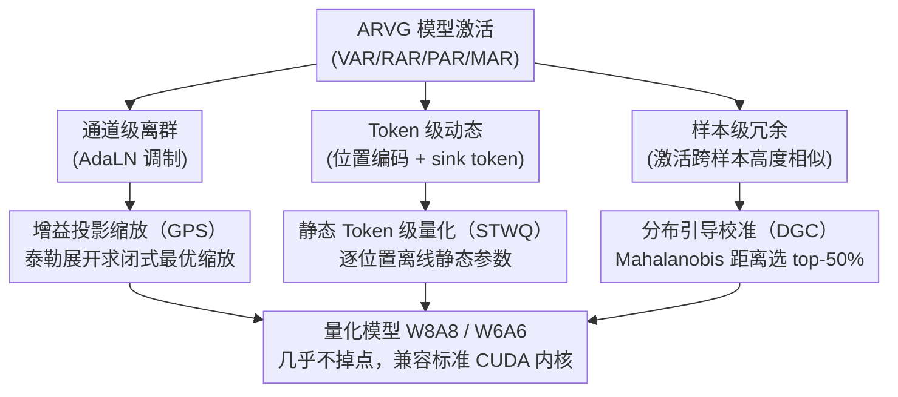

# PTQ4ARVG: Post-Training Quantization for AutoRegressive Visual Generation Models

**会议**: ICLR 2026  
**arXiv**: [2601.21238](https://arxiv.org/abs/2601.21238)  
**代码**: [GitHub](http://github.com/BienLuky/PTQ4ARVG)  
**领域**: 模型压缩  
**关键词**: 视觉生成, 自回归模型, 后训练量化, 激活量化, 离群值抑制

## 一句话总结

提出 PTQ4ARVG，首个针对自回归视觉生成（ARVG）模型的系统化 PTQ 框架，通过增益投影缩放（GPS）、静态 Token 级量化（STWQ）和分布引导校准（DGC）解决 ARVG 特有的三大量化挑战。

## 研究背景与动机

**领域现状**：自回归视觉生成（AutoRegressive Visual Generation, ARVG）模型（VAR、RAR、PAR、MAR）在图像生成质量上已超越扩散模型，但模型体积大（2-3B 参数）、推理慢（PAR-3B 生成一张图 >3 秒）。后训练量化（Post-Training Quantization, PTQ）无需重训练就能把权重和激活压到低比特，是加速推理、压缩显存的有效手段。

**核心矛盾**：直接把 LLM/ViT 上成熟的量化方法搬到 ARVG 会严重掉点，因为 ARVG 的激活在三个正交维度上各有一类特殊的离群结构：

- **通道级严重离群值**：经 AdaLN（Adaptive LayerNorm）模块调制后的激活在不同通道间数值范围差异极大，逐张量量化会被离群通道拉坏精度。
- **Token 级高度动态激活**：位置编码让激活沿 token 维度剧烈起伏，而作为初始条件的 token 还会在所有线性层里形成数值极端的 sink token。
- **样本级分布信息不匹配**：网络激活在不同样本间高度相似（尤其无条件样本），随机采的校准集大量冗余，使量化参数偏向"平庸"分布、错失边界情形。

**本文目标**：针对这三类 ARVG 特有难题各给一个无需训练的解法，组成首个系统化的 ARVG 后训练量化框架。

## 方法详解

### 整体框架

PTQ4ARVG 是一个完全无需训练（training-free）的后训练量化框架，目标是把 VAR/RAR/PAR/MAR 等 ARVG 模型压到 W8A8 乃至 W6A6 而几乎不掉点。它的思路很直接：ARVG 的量化难点分布在通道、token、样本三个正交维度上，于是用三个互不冲突的组件各管一摊——增益投影缩放（GPS）治通道级离群、静态 Token 级量化（STWQ）治 token 级动态、分布引导校准（DGC）治样本级冗余。三者在一次量化流程里依次作用：先用 GPS 把离群通道的量化难度从激活迁移到权重，再用 STWQ 为每个 token 位置离线定好量化参数，最后用 DGC 从校准集里挑出真正有信息量的样本来标定；整套参数离线算好后，推理时直接查用、零在线开销。

### 关键设计

**1. 增益投影缩放（GPS）：用闭式最优解替代手调缩放因子**

针对通道级离群。AdaLN 调制后的激活在通道间范围差异极大，SmoothQuant、OS+ 这类做法靠一个经验缩放因子把离群通道的量化难度从激活"挪"到权重，但挪多少全凭手调、难保最优。GPS 把缩放变成可求解的优化问题：对量化损失做泰勒展开，把缩放因子 $s_2$ 引起的损失变化拆成"激活侧损失减少"与"权重侧损失增加"两部分，定义缩放增益 $g(s_2) = g_{\bm{x}} - g_{\bm{W}_{:,1}}$；对它关于 $s_2$ 求导并令导数为零，得到闭式最优缩放因子

$$s_2 = s_1 \frac{\sqrt{\sum|{\Delta W_{2,i} x_2}|}}{\sqrt{\sum|{W_{2,i} \Delta x_2}|}}$$

分子分母分别由权重量化误差 $\Delta W$ 与激活量化误差 $\Delta x$ 决定。这样缩放强度由两侧真实量化误差自适应平衡，是首个有严格数学推导的缩放策略，实测一致优于经验方法。

**2. 静态 Token 级量化（STWQ）：靠固定序列长度把动态量化变成离线静态参数**

针对 token 级动态。位置编码让激活沿 token 维度剧烈起伏，条件 token 还会在 MHSA/FFN 的所有线性层里形成 sink token；LLM 因序列长度可变只能用昂贵的在线动态量化。但 ARVG 有两个独特性质——生成的 token 数固定、且同一 token 位置的分布在不同样本间高度稳定（position-invariant）——使得每个位置的量化参数都能离线确定。STWQ 据此为 AdaLN 模块沿 token 序列分配一组逐位置的静态量化参数，对线性层则把 sink token 与普通 token 分开各自标定，避免 sink 的极端值拉坏整体范围；参数用百分位数（percentile）校准而非易受离群影响的 min-max。所有参数离线算好、推理时直接查，无任何在线校准开销且兼容标准 CUDA 内核——相比之下动态方法（DTWQ）会带来约 0.5× 的速度损失。

**3. 分布引导校准（DGC）：用 Mahalanobis 距离筛掉冗余校准样本**

针对样本级冗余。ARVG 不同样本（尤其无条件样本）的激活高度相似，随机校准集里大量样本信息冗余，使量化参数偏向"平庸"分布、错失边界情形。DGC 用 Mahalanobis 距离 $\rho(x) = \sqrt{(x-u)^T S^{-1} (x-u)}$ 衡量每个样本相对整体分布的"分布熵"——离均值越远、越非典型则值越大——只保留分布熵最高的 top-50% 样本组成校准集。这样校准分布既去掉冗余又覆盖边界激活，标定出的量化参数更贴合真实分布。

### 损失函数 / 训练策略

整个框架是 training-free 的：GPS 来自 Taylor 展开后的凸优化闭式解，STWQ 用百分位数校准（而非易受离群值影响的 min-max）保证高精度，DGC 只做样本选择，三者都不更新模型权重。评估时在 ImageNet 上生成 50K 图像计算 FID、sFID、IS、Precision。

## 实验关键数据

### 主实验（VAR-d16 / VAR-d24 - W8A8 量化）

| 方法 | VAR-d16 FID ↓ | VAR-d16 IS ↑ | VAR-d24 FID ↓ | VAR-d24 IS ↑ |
|------|-------------|-------------|-------------|-------------|
| FP | 3.60 | 283.21 | 2.33 | 317.16 |
| SmoothQuant | 4.29 | 229.87 | 4.42 | 246.68 |
| OS+ | 4.11 | 230.41 | 4.14 | 250.61 |
| OmniQuant | 4.19 | 226.92 | - | - |
| **PTQ4ARVG** | **3.82** | **268.19** | **2.69** | **304.82** |

### 6-bit 量化结果（VAR-d24）

| 方法 | FID ↓ | IS ↑ | Precision ↑ |
|------|------|------|------------|
| SmoothQuant W6A6 | >10 | <200 | 严重退化 |
| **PTQ4ARVG W6A6** | **~4.5** | **~280** | 竞争力强 |

### 关键发现

- PTQ4ARVG 在 8-bit 和 6-bit 下均大幅超越现有 PTQ 方法
- GPS 的数学优化缩放一致优于经验方法（SmoothQuant、RepQ-ViT）
- STWQ 无额外推理开销即可处理 token 级方差，动态方法引入 0.5× 速度损失
- DGC 通过去除冗余样本显著提升校准质量
- 在 VAR、RAR、PAR、MAR 四种 ARVG 模型上均有效

## 亮点与洞察

- 问题定义精准：首次系统识别 ARVG 量化的三大挑战，每个挑战有针对性解决方案
- GPS 是首个基于严格数学推导的缩放策略，为量化缩放提供理论基础
- STWQ 巧妙利用了 ARVG 的固定 token 长度特性——LLM 因可变长度无法使用静态策略
- 实验覆盖四种 ARVG 架构（VAR/RAR/PAR/MAR），通用性好

## 局限与展望

- 4-bit 量化结果未展示，可能是 ARVG 模型在 4-bit 下精度退化严重
- GPS 的 Remark 1 基于统计观察而非严格证明
- 未与 SVDQuant 等最新方法对比（虽然后者依赖定制 CUDA 内核）
- ARVG 模型相比 LLM 规模较小，量化压缩的实际需求可能不如 LLM 迫切

## 相关工作与启发

- 与 SmoothQuant 的区别：GPS 用数学优化替代经验缩放
- 与 LLM 动态量化的区别：利用 ARVG 固定 token 长度实现无开销静态量化
- 与扩散模型 PTQ 的区别：ARVG 无时间步但有 token 级动态性，需要不同的方案
- 启示：模型架构的特有性质可以被量化方法充分利用

## 评分

- 新颖性: ⭐⭐⭐⭐ 首个 ARVG PTQ 框架，GPS 理论推导新颖
- 实验充分度: ⭐⭐⭐⭐⭐ 四种模型全面验证，部署验证
- 写作质量: ⭐⭐⭐⭐ 问题分析透彻，但公式推导占篇幅较大
- 价值: ⭐⭐⭐⭐ 为 ARVG 模型的高效部署奠定基础

<!-- RELATED:START -->

## 相关论文

- [\[ICCV 2025\] Bridging Continuous and Discrete Tokens for Autoregressive Visual Generation](../../ICCV2025/model_compression/bridging_continuous_and_discrete_tokens_for_autoregressive_visual_generation.md)
- [\[CVPR 2026\] QVGGT: Post-Training Quantized Visual Geometry Grounded Transformer](../../CVPR2026/model_compression/qvggt_post-training_quantized_visual_geometry_grounded_transformer.md)
- [\[CVPR 2026\] Progressive Supernet Training for Efficient Visual Autoregressive Modeling](../../CVPR2026/model_compression/progressive_supernet_training_for_efficient_visual_autoregressive_modeling.md)
- [\[CVPR 2026\] VVS: Accelerating Speculative Decoding for Visual Autoregressive Generation via Partial Verification Skipping](../../CVPR2026/model_compression/vvs_accelerating_speculative_decoding_for_visual_autoregressive_generation_via_p.md)
- [\[ICLR 2026\] UniFlow: A Unified Pixel Flow Tokenizer for Visual Understanding and Generation](uniflow_a_unified_pixel_flow_tokenizer_for_visual_understanding_and_generation.md)

<!-- RELATED:END -->
