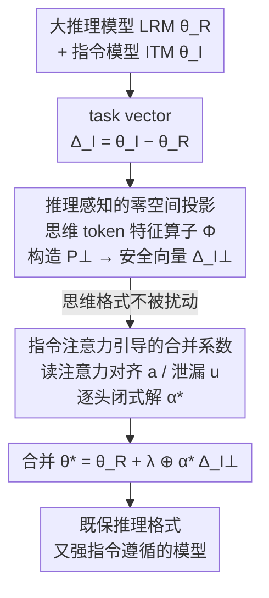

# RAIN-Merging: A Gradient-Free Method to Enhance Instruction Following Through Model Merging

**会议**: ICLR 2026 Oral  
**arXiv**: [2602.22538](https://arxiv.org/abs/2602.22538)  
**代码**: [GitHub](https://github.com/K1nght/RAIN-Merging)  
**领域**: LLM推理  
**关键词**: 模型合并, 指令遵循, 推理模型, 零空间投影, 无梯度方法

## 一句话总结

提出 RAIN-Merging，一种无梯度的两阶段模型合并方法：先通过零空间投影保护大推理模型 (LRM) 的思维格式，再用指令注意力引导的合并系数增强指令遵循能力，在保持推理质量的同时大幅提升 LRM 的指令遵循性能。

## 研究背景与动机

### 大推理模型的指令遵循矛盾

DeepSeek-R1、OpenAI-o1 等大推理模型 (LRM) 在多步推理上表现优秀，但在指令遵循上存在显著缺陷：

- 生成长链逻辑推导但忽略用户指定的格式、约束或特定需求
- 这种不一致严重影响 LRM 在 agent、专业工具部署中的实用性

### 现有解决方案的局限

- **SFT 继续训练**：需要大量标注数据（含长思维链），成本高且易导致能力退化
- **朴素模型合并**：LRM 和 ITM (Instruction-tuned Model) 的输出格式根本不同——LRM 有 `<think>...</think>` 分隔思维和回答，ITM 直接输出答案。朴素合并会破坏思维格式

### 参数空间分析的关键发现

对 LRM 和 ITM 的 task vector 做 SVD 分析后发现：**两者的主子空间在所有关键模块上几乎正交**（余弦相似度 < 0.1）。这意味着推理能力和指令遵循能力在参数空间中低耦合，合并有望不产生干扰。

但正交性不足以保证输出行为不变——特殊 token（`<think>`, `</think>`）的生成概率在前向传播中可能被改变。

## 方法详解

### 整体框架

RAIN-Merging 要解决的是：把指令模型 (ITM) 的"听话"能力注入大推理模型 (LRM)，又不能把后者赖以推理的 `<think>...</think>` 思维格式搅坏。它把这件事拆成两个先后衔接的阶段——先做"保护"，再做"增强"。输入是同一 base model 派生的一对模型 LRM ($\theta_R$) 与 ITM ($\theta_I$)，先算出 ITM 的 task vector $\Delta_I = \theta_I - \theta_R$；第一阶段把 $\Delta_I$ 投影到"对思维 token 无害"的子空间得到 $\Delta_I^\perp$，确保注入它不会扰动推理格式；第二阶段在这个安全子空间里，用注意力统计为每个子模块挑出最能提升指令遵循的合并系数 $\alpha_\star^k$。最终的合并模型写成 $\theta_\star = \theta_R + \lambda \bigoplus_{k=1}^{K} \alpha_\star^k \Delta_I^{\perp, k}$，其中 $\lambda$ 是全局缩放因子。整个流程只用前向传播，不算一次梯度。

### 关键设计

**1. 推理感知的零空间投影：让合并不触碰思维格式**

朴素合并最致命的副作用是把 LRM 的 `<think>...</think>` 结构搅乱——一旦特殊 token 的生成概率漂移，模型就会丢掉思维分隔符、推理随之退化。RAIN-Merging 的解法是把 ITM task vector 约束在"对思维 token 无害"的子空间里：对每个子模块 $k$ 收集思维特殊 token 在前向中的特征算子 $\Phi^k_{\Omega_{\text{think}}}$，再构造它的零空间投影 $P^\perp(\Phi^k_{\Omega_{\text{think}}}) = \text{diag}(1) - {\Phi^k_{\Omega_{\text{think}}}}^\top (\Phi^k_{\Omega_{\text{think}}} {\Phi^k_{\Omega_{\text{think}}}}^\top)^+ \Phi^k_{\Omega_{\text{think}}}$。投影后的 task vector 满足 $\Phi_{\Omega_{\text{think}}} \text{vec}(\Delta_I^\perp) = 0$，意味着在思维 token 位置上的中间表示完全不变。Proposition 1 进一步对 softmax-KL 散度做二阶近似，证明思维损失 $\mathcal{L}_{\text{think}}(\theta_R + \Delta_I^\perp) = O(\|\Delta_I^\perp\|_2^2) \approx 0$，即扰动越小、格式偏移越被压到二阶可忽略。构建这个投影只需 150 个推理校准样本，开销很轻。

**2. 指令注意力引导的合并系数：在安全子空间里把指令能力调到最大**

投影保证了"不破坏推理"，但还得回答"系数到底取多大才最能听指令"。RAIN-Merging 不用梯度搜索，而是直接读注意力图：对每个注意力头 $\tilde{k}$，统计输出 token 对指令 token 的注意力强度，定义对齐度 $a^{\tilde{k}}(x, \tilde{\alpha}) = \sum_{t \in \mathcal{R}(x)} \sum_{\tau \in \mathcal{I}(x)} \frac{\text{Att}^{\tilde{k}}(x, \tilde{\alpha})[t, \tau]}{|\mathcal{I}(x)| |\mathcal{R}(x)|}$（受约束输出对指令的关注）和泄漏度 $u^{\tilde{k}}(x, \tilde{\alpha}) = \sum_{t \in \mathcal{U}(x)} \sum_{\tau \in \mathcal{I}(x)} \frac{\text{Att}^{\tilde{k}}(x, \tilde{\alpha})[t, \tau]}{|\mathcal{I}(x)| |\mathcal{U}(x)|}$（无关输出对指令的误关注），这里 $\mathcal{I}(x)$ 是指令 token、$\mathcal{R}(x)$ 是受指令约束的输出、$\mathcal{U}(x)$ 是无关输出。优化目标就是抬高对齐、压低泄漏：$\max_{\tilde{\alpha}} \mathcal{J}_I^{\text{Proxy}}(\tilde{\alpha}) := \bar{a}(\tilde{\alpha}) - \rho \bar{u}(\tilde{\alpha})$。对这个目标做二阶 Taylor 展开后能写出逐头的闭式解 $\tilde{\alpha}_\star^{\tilde{k}} = \text{clip}_{[\tilde{\alpha}_l, \tilde{\alpha}_u]}(g^{\tilde{k}} / \tilde{H}^{\tilde{k}})$，其中 $g^{\tilde{k}}$、$\tilde{H}^{\tilde{k}}$ 是代理目标的一阶/二阶项，clip 把系数限在合理区间。整个过程只需前向跑出注意力统计，用 365 个指令校准样本即可定出全部系数，仍然无梯度。

### 损失函数 / 训练策略

RAIN-Merging 没有任何训练损失，它把问题表述为一个带约束的优化：$\max_\Delta \mathcal{J}_I(\theta_R + \Delta)$，约束为 $\mathcal{L}_{\text{think}}(\theta_R + \Delta) \leq \delta$。零空间投影负责满足约束（守住思维格式），注意力引导的系数负责最大化目标（提升指令遵循），两者正好对应约束优化的可行域与目标方向。

## 实验关键数据

### 主实验：7B 模型合并（DeepSeek-R1-Distill-Qwen-7B + Qwen2.5-7B-Instruct）

| 方法 | IF 平均 ↑ | 推理平均 ↑ | 运行时间 |
|------|-----------|-----------|---------|
| LRM (原始) | 44.12 | 51.03 | - |
| ITM (原始) | 52.92 | 43.32 | - |
| SFT | 45.08 | 49.51 | 120.32 min |
| Task Arithmetic | 45.96 | 49.59 | 0.93 min |
| SLERP | 45.95 | 50.97 | 1.12 min |
| TIES | 46.35 | 51.99 | 1.18 min |
| AIM-TIES | 47.02 | 53.10 | 18.51 min |
| **RAIN-Merging** | **48.11** | **55.59** | 20.96 min |

RAIN-Merging 在指令遵循（+4.0 vs LRM）和推理能力（+4.6 vs LRM）上同时提升。

### 多尺度和多架构验证

| 模型配置 | IF 相对提升 | 推理相对提升 |
|---------|-----------|------------|
| Qwen2.5-1.5B | +6.09% | +8.20% |
| Qwen2.5-7B | +9.06% | +8.93% |
| Llama-3.1-8B | +5.86% | +7.78% |
| Qwen2.5-14B | +6.11% | +6.17% |
| Qwen2.5-32B | +1.57% | +3.83% |

跨 1.5B-32B 规模和 Qwen/Llama 两种架构一致有效。

### 消融实验

| 方法 | IF 平均 | 推理平均 |
|------|---------|---------|
| w/o Stage 2 (仅零空间投影) | 46.58 | **54.92** |
| w/o Stage 1 (仅注意力引导) | **47.62** | 52.44 |
| **RAIN-Merging 完整** | **48.11** | **55.59** |

- 去掉 Stage 2：指令遵循提升有限，但推理保持良好
- 去掉 Stage 1：指令遵循更强，但推理能力明显下降
- 两阶段互补：同时获得最佳指令遵循和推理性能

### 思维格式保护验证

| 方法 | $\mathcal{L}_{\text{think}}$ | `</think>` 缺失率 |
|------|------------------------------|-------------------|
| Task Arithmetic | 0.1224 | 6.4% |
| **RAIN-Merging** | **0.0065** | **0.0%** |

零空间投影将 KL 散度从 0.12 降至 0.006，完全消除了 `</think>` 缺失问题。

### Agent 场景

| 模型 | ALFWorld | WebShop |
|------|----------|---------|
| ITM | 17.50 | 10.45 |
| LRM | 22.00 | 26.63 |
| **RAIN-Merging** | **25.00** | **29.42** |

### 关键发现

1. **推理和指令遵循是正交能力**：task vector 的主子空间余弦相似度 < 0.1
2. **思维格式保护至关重要**：朴素合并破坏 `<think>` 结构导致推理退化
3. **增强指令遵循可反向提升推理**：更好的指令理解改善了思维链质量
4. **无梯度方法 vs SFT**：RAIN-Merging 运行时间仅 21 分钟 vs SFT 120 分钟，性能更优

## 亮点与洞察

1. **精确定位问题**：从参数空间正交性分析出发，同时发现输出格式不匹配的风险
2. **零空间投影的优雅**：用线性代数工具在保证思维格式不变的同时最大化指令能力
3. **指令注意力的可解释性**：通过对齐度和泄漏度量化每个注意力头对指令的响应
4. **实用性极强**：无需训练、仅需 ~500 校准样本、20 分钟完成，远优于 SFT
5. **理论保证完整**：Proposition 1 证明零空间投影满足 KL 约束

## 局限性

1. 额外的零空间计算和注意力统计虽比 SFT 快，但比最简单的 Task Arithmetic 慢约 20 倍
2. 依赖校准数据集质量——推理校准集和指令校准集的选择可能影响结果
3. 仅合并了 Q、K、V、O 和 FFN 参数，其他模块（如 embedding）未考虑
4. 在 32B 规模时提升幅度减小，超大模型的适用性有待验证
5. 方法假设 LRM 和 ITM 共享同一 base model，不适用于完全不同架构的模型

## 相关工作与启发

- **Task Arithmetic (Ilharco et al. 2023)**：RAIN-Merging 的基础，但朴素线性加法会破坏推理格式
- **TIES / DARE**：数据无关的 task vector 修剪方法，RAIN-Merging 通过数据驱动约束超越
- **AIM (Nobari et al. 2025)**：激活感知合并但不考虑输出格式不匹配
- **Guardieiro et al. 2025**：指令注意力分析的灵感来源，但 RAIN-Merging 将其系统化为合并系数
- **启发**：模型合并不仅需要参数空间分析，还需考虑输出分布的格式兼容性

## 评分

- **新颖性**: ⭐⭐⭐⭐⭐ — 首次系统解决 LRM+ITM 合并中的思维格式保护问题
- **理论深度**: ⭐⭐⭐⭐⭐ — 零空间投影的理论推导和 KL 约束的证明严谨完整
- **实验充分度**: ⭐⭐⭐⭐⭐ — 4 个 IF 基准 + 9 个推理基准 + 5 种模型规模 + Agent 场景
- **实用价值**: ⭐⭐⭐⭐⭐ — 无梯度、20 分钟、500 样本即可显著提升 LRM 的指令遵循
- **总评**: ⭐⭐⭐⭐⭐ — 问题重要、方法优雅、理论严谨、实验全面，是模型合并领域的优秀工作

<!-- RELATED:START -->

## 相关论文

- [\[ICLR 2026\] Null-Space Filtering for Data-Free Continual Model Merging: Preserving Stability, Promoting Plasticity](null-space_filtering_for_data-free_continual_model_merging_preserving_stability_.md)
- [\[ICCV 2025\] FREE-Merging: Fourier Transform for Efficient Model Merging](../../ICCV2025/model_compression/free-merging_fourier_transform_for_efficient_model_merging.md)
- [\[CVPR 2026\] Bridging Domains through Subspace-Aware Model Merging](../../CVPR2026/model_compression/bridging_domains_through_subspace-aware_model_merging.md)
- [\[ICLR 2026\] AdaRank: Adaptive Rank Pruning for Enhanced Model Merging](adarank_adaptive_rank_pruning_for_enhanced_model_merging.md)
- [\[NeurIPS 2025\] Weight Weaving: Parameter Pooling for Data-Free Model Merging](../../NeurIPS2025/model_compression/weight_weaving_parameter_pooling_for_data-free_model_merging.md)

<!-- RELATED:END -->
