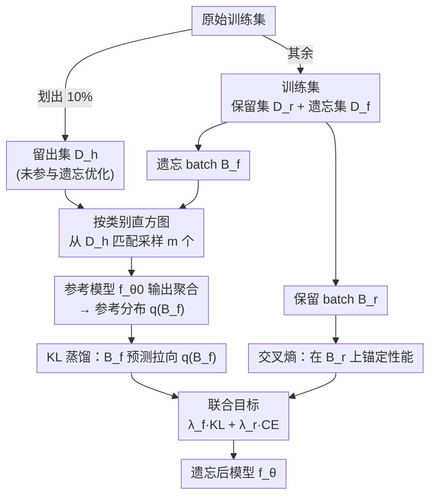

# Reference-Guided Machine Unlearning

**会议**: ICLR 2026  
**arXiv**: [2603.11210](https://arxiv.org/abs/2603.11210)  
**代码**: [GitHub](https://github.com/jmirlach/ReGUn)  
**领域**: 模型压缩/机器遗忘  
**关键词**: 机器遗忘, 参考引导, 知识蒸馏, 分布不可区分性, 隐私保护  

## 一句话总结

提出 ReGUn（Reference-Guided Unlearning），利用独立留出数据集作为"未见行为"的参考标准，通过类别条件蒸馏将遗忘数据上的模型行为对齐到真正未见数据的行为，实现更优的遗忘-效用权衡。

## 研究背景与动机

机器遗忘（Machine Unlearning）旨在从训练好的模型中移除特定数据的影响，同时保留通用性能。这是 GDPR 等隐私法规"被遗忘权"的技术基础。

**核心问题**：现有近似遗忘方法依赖性能退化启发式（如损失最大化、随机标签），存在根本缺陷：
- **条件不良**：可能产生大的或方向错误的梯度
- **泛化损害**：改变决策边界超出预期范围
- **优化冲突**：遗忘和稳定性目标相互矛盾

**关键洞察**：遗忘不应仅仅让模型"更错"，而应使其在遗忘数据上的行为与真正未见数据无法区分。

## 方法详解

### 整体框架

ReGUn 要解决的是：近似遗忘方法靠"让模型更错"（损失最大化、随机标签）来抹掉遗忘数据的影响，但"错到什么程度才算遗忘干净"说不清，梯度条件不良、决策边界被过度改写。它换了一个目标——让模型在遗忘数据上的行为，与它面对真正没见过的数据时的行为**无法区分**（分布不可区分性）。

整体怎么转：先从原始训练集里划出一个与遗忘优化完全隔离的留出集，作为"未见行为"的来源；遗忘时对每个遗忘 batch，按类别直方图从留出集匹配采样、用参考模型聚合出一个参考分布；再用一个 KL 蒸馏项把遗忘样本的预测拉向这个参考、同时用交叉熵项在保留数据上锚定性能，两项加权联合优化，得到遗忘后的模型。

### 关键设计

**1. 留出—训练数据划分：为"未见行为"腾出一块隔离的数据**

整个参考引导成立的前提，是有一批模型"本可正常对待、但又没拿去做遗忘优化"的数据。ReGUn 从原始训练集 $\mathcal{D}_{orig}$ 中划出约 10% 作为留出集 $\mathcal{D}_h$，仅在遗忘阶段用于构造参考；其余部分作为训练集 $\mathcal{D}_{train} = \mathcal{D}_r \cup \mathcal{D}_f$（保留集与遗忘集互不相交）。关键在于 $\mathcal{D}_h$ 与遗忘优化彼此隔离——参考由此来自"干净"的数据，而不是已经被遗忘梯度污染过的分布。代价是要预留约一成原始数据，数据稀缺时会成为约束。

**2. 类别条件参考分布：把"该有的行为"算成一个可蒸馏的目标**

有了留出集，还要把"未见行为"落成每个 batch 都能用的具体目标分布。给定遗忘 minibatch $B_f = \{(x_i^f, y_i^f)\}_{i=1}^b$，RefDist 按其类别直方图从 $\mathcal{D}_h$ 匹配采样 $m$ 个样本 $\tilde{\mathcal{D}}_h$，再把参考模型在这些样本上的输出平均成一份参考分布：

$$q(B_f) = \frac{1}{m} \sum_{j=1}^{m} p_\phi(\cdot \mid \tilde{x}_j)$$

这里有两个关键取舍。一是参考模型直接复用初始模型 $f_\phi = f_{\theta_0}$，省去额外训练、也避免参考在遗忘过程中随模型一起漂移（注意 $f_{\theta_0}$ 本身仍残留遗忘数据的影响，是个非理想参考）。二是用类别直方图匹配采样，让参考与遗忘 batch 的标签先验对齐，从而控制因类别分布不同引入的偏差，使 $q(B_f)$ 近似一个**类别条件**的未见参考——比直接匹配全局边缘分布更贴近实例级行为。同一 batch 内所有遗忘样本共享这份 $q(B_f)$，蒸馏目标因此稳定。

**3. KL 蒸馏 + 交叉熵双项目标：对齐遗忘行为、同时守住保留性能**

有了参考分布，遗忘就转化为一个分布匹配问题。总目标对遗忘 batch 与保留 batch 加权联合优化：

$$\mathcal{L}(\theta; B_f, B_r) = \lambda_f \frac{1}{|B_f|} \sum_{(x,\cdot) \in B_f} \text{KL}\big(q(B_f) \,\|\, p_\theta(\cdot|x)\big) + \lambda_r \frac{1}{|B_r|} \sum_{(x,y) \in B_r} \text{CE}\big(p_\theta(\cdot|x), y\big)$$

前一项 KL 散度把遗忘样本的预测蒸馏到参考分布上，使模型在遗忘数据上的输出向"它面对未见数据时的输出"靠拢；后一项交叉熵在保留 batch $B_r$ 上锚定更新，防止遗忘梯度把整体性能一起带垮。$\lambda_f, \lambda_r > 0$ 两个权重显式调节遗忘强度与保留效用的权衡。相比单纯放大遗忘损失，这种"对齐而非破坏"的方向更温和、目标间冲突更小，因而在大遗忘比例下也不易崩溃。

## 实验关键数据

### 主实验：ResNet-18 on CIFAR-10（遗忘比例 1%/10%/50%）

| 方法 | Forget 1% TestAcc | Forget 1% RMIA_AUC | Forget 10% Gap_Avg | Forget 50% Gap_Avg |
|------|-----------|------------|-------------|-------------|
| Retrain（Oracle） | 94.34 | 49.98 | 0.00 | 0.00 |
| NegGrad | **94.17** | 59.80 | 3.82 | 4.80 |
| Finetune | 90.90 | 54.78 | 2.79 | 2.39 |
| SalUn | 91.63 | **50.09** | 2.48 | 2.00 |
| Amun | 91.84 | 44.17 | **1.46** | — |
| **ReGUn** | 91.98 | 51.35 | 1.49 | **1.55** |

### 消融实验：不同遗忘比例下的综合性能（GapAvg↓）

| 方法 | CIFAR-10 1% | CIFAR-10 10% | CIFAR-10 50% | CIFAR-100 |
|------|-------------|--------------|--------------|-----------|
| NegGrad+ | 3.77 | 3.71 | 2.62 | — |
| ℓ1-sparse | 2.73 | 2.49 | 2.09 | — |
| SalUn | 1.64 | 2.48 | 2.00 | — |
| **ReGUn** | **1.49** | **1.49** | **1.55** | — |

**关键发现**：ReGUn 在大遗忘比例（50%）下表现尤为突出，综合偏差 GapAvg 最低，说明参考引导方式在大规模遗忘场景中更稳定。

## 亮点与洞察

1. **范式转变**：从"让模型更错"转向"让模型行为像未见过数据"，提出分布不可区分性视角
2. **简洁优雅**：仅需一个留出数据集和 KL 蒸馏，无需复杂修复机制或约束参数编辑
3. **类别条件参考**：通过直方图匹配实现实例级/类别条件参考，优于全局分布匹配
4. **跨架构验证**：在 CNN（ResNet-18）和 Transformer（Swin-T）上均表现良好

## 局限性

- 需要额外的留出数据集（占原始数据 10%），在数据稀缺场景下可能不可行
- 参考模型使用初始模型 $f_{\theta_0}$，仍保留遗忘数据的影响（非理想参考）
- 仅验证了随机遗忘设置，类别遗忘等场景未探索
- 成员推理攻击评估使用离线 RMIA，可能低估实际隐私风险

## 相关工作

- **基线遗忘方法**：Finetune, NegGrad, NegGrad+ — 简单但效果有限
- **约束遗忘**：SalUn（显著性引导），SSD（Fisher 信息），Amun — 引入限制机制
- **参考型方法**：伪概率替换、第三方数据分布匹配 — 缺乏实例级条件控制
- **精确遗忘**：SISA 等 — 计算成本高但提供精确保证

## 评分

| 维度 | 分数 | 说明 |
|------|------|------|
| 创新性 | ⭐⭐⭐⭐ | 分布不可区分性视角新颖，参考引导思路清晰 |
| 实用性 | ⭐⭐⭐⭐ | 方法简单通用，但需额外留出数据 |
| 实验充分性 | ⭐⭐⭐⭐ | 多架构、多遗忘比例、多指标评估 |
| 写作质量 | ⭐⭐⭐⭐ | 问题定义清晰，方法推导严谨 |

<!-- RELATED:START -->

## 相关论文

- [\[ECCV 2024\] Is Retain Set All You Need in Machine Unlearning? Restoring Performance of Unlearned Models with Out-Of-Distribution Images](../../ECCV2024/model_compression/is_retain_set_all_you_need_in_machine_unlearning_restoring_performance_of_unlear.md)
- [\[CVPR 2026\] Towards Unified Human Perception and Machine Understanding: Token Flow Guided Compression Framework](../../CVPR2026/model_compression/towards_unified_human_perception_and_machine_understanding_token_flow_guided_com.md)
- [\[ICLR 2026\] STAR: Similarity-guided Teacher-Assisted Refinement for Super-Tiny Function Calling Models](star_similarity-guided_teacher-assisted_refinement_for_super-tiny_function_calli.md)
- [\[CVPR 2026\] MambaSIC: Mamba-based Stereo Image Compression with Bi-directional Multi-reference Entropy Model](../../CVPR2026/model_compression/mambasic_mamba-based_stereo_image_compression_with_bi-directional_multi-referenc.md)
- [\[ICLR 2026\] KBVQ-MoE: KLT-guided SVD with Bias-Corrected Vector Quantization for MoE Large Language Models](kbvq-moe_klt-guided_svd_with_bias-corrected_vector_quantization_for_moe_large_la.md)

<!-- RELATED:END -->
