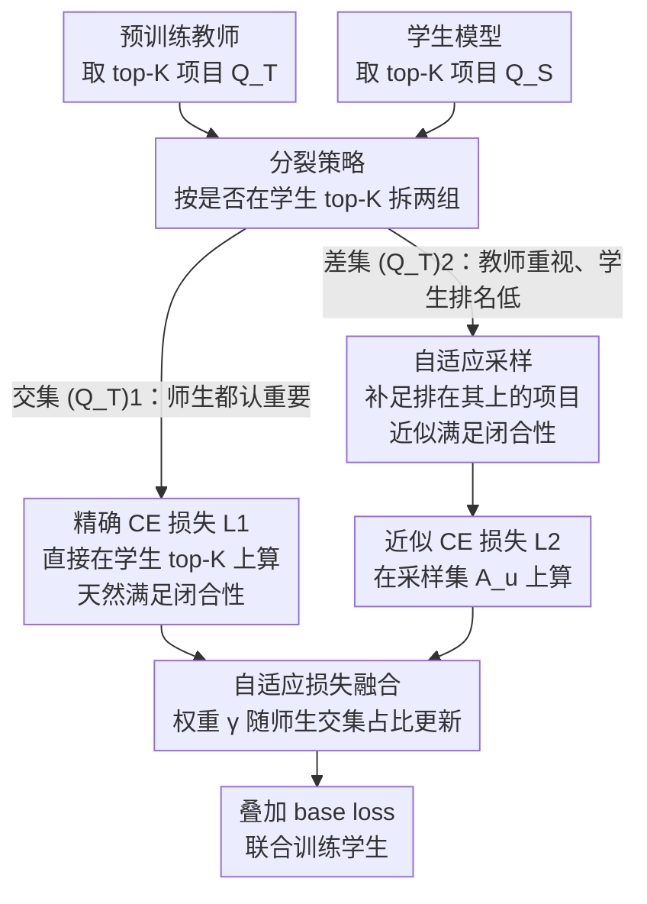

# Rejuvenating Cross-Entropy Loss in Knowledge Distillation for Recommender Systems

**会议**: ICLR 2026  
**arXiv**: [2509.20989](https://arxiv.org/abs/2509.20989)  
**代码**: [GitHub](https://github.com/BDML-lab/RCE-KD)  
**领域**: 推荐系统 / 知识蒸馏 / 模型压缩  
**关键词**: knowledge distillation, cross-entropy, NDCG, recommender system, ranking, partial NDCG

## 一句话总结
理论证明 CE 损失在推荐系统 KD 中最大化 NDCG 下界需满足"闭合性假设"（子集需包含学生 top 项目），但实际目标是蒸馏教师 top 项目的排序——两者冲突导致 vanilla CE 表现差。据此提出 RCE-KD：将教师 top-K 项目按是否在学生 top-K 中分两组，分别用精确 CE 和采样近似闭合性 CE，自适应融合权重随训练动态调整。

## 研究背景与动机
**领域现状**：知识蒸馏在推荐系统中用于将大教师模型压缩为小学生模型。Response-based KD（CE 损失、RRD、CD 等）是主流。CE 损失在 CV/NLP 的 KD 中极为成功。

**现有痛点**：
   - CE 损失在推荐 KD 中表现**出人意料地差**——在 MF→MF、LightGCN→LightGCN、HSTU→HSTU 三种设置中，vanilla CE 一致劣于所有基线（CD、RRD、HetComp 等）
   - 推荐 KD 有两个独特特点：（1）关注排序而非精确分数，尤其是教师 top 项目的排序，（2）由于项目集极大（百万级），CE 只能在小子集上计算
   - 已有的 CE-NDCG 理论连接仅适用于二值标签和全项目场景，不覆盖推荐 KD 的实际设定

**核心矛盾**：CE 约束 partial NDCG 需"闭合性假设"——子集必须包含学生排名最高的项目。但 KD 的目标是蒸馏教师 top 项目的排序，而学生和教师的 top 项目在训练初期几乎不重叠。

**核心 idea**：将教师 top-K 分裂为两组（与学生 top-K 交集 / 差集），对第一组在学生 top-K 上直接算 CE（精确满足闭合性），对第二组用自适应采样策略近似满足闭合性

## 方法详解

### 整体框架
RCE-KD 想解决的核心困惑是：为什么直接把 CE 损失搬到推荐 KD 里，反而一致打不过各种基线。它先从理论上说清 CE 只有在子集满足"闭合性"时才真的在优化 NDCG，然后围绕"怎么构造满足闭合性的子集"把整条流程搭起来。给定预训练好的教师和待训练的学生，先各自取 top-K 项目，把教师 top-K $\mathcal{Q}_u^T$ 按项目是否也落在学生 top-K $\mathcal{Q}_u^S$ 里分裂成交集、差集两组：交集 $(\mathcal{Q}_u^T)_1$ 天然闭合，直接在学生 top-K 上算精确 CE 损失 $\mathcal{L}_1$；差集 $(\mathcal{Q}_u^T)_2$ 不闭合，用自适应采样补足"排在它上面的项目"来近似闭合，再在采样集上算 $\mathcal{L}_2$。最后用一个随师生 top-K 重叠度动态调整的权重把两路损失融合，叠加 base loss 一起训练学生。

### 关键设计

**1. CE→NDCG 的理论推广：先说清 CE 什么时候才等价于优化 NDCG**

整套方法建立在两个定理上，它们回答了"CE 到底在优化什么"。**定理 4.1（全项目 KD）**证明：在全部项目上最小化 CE，等价于最大化 NDCG 的一个下界，此时相关性分数取自教师分数 $y_i = \log_2(\sigma(r_{ui}^T) + 1)$——这给"推荐 KD 用 CE"提供了第一层理论依据。但全项目计算在百万级项目集上不现实，于是**定理 4.4（部分项目 KD）**进一步证明：在子集 $\mathcal{J}^u$ 上最小化 CE 能约束 partial NDCG，但有一个前提——子集必须满足**闭合性假设（Assumption 4.3）**：对子集里的每个项目，所有被学生排得更高的项目也必须在子集中。这条假设正是诊断 vanilla CE 失败的关键：教师 top-K 子集普遍不满足闭合性，所以在它上面直接算 CE 并不真的在优化 NDCG。

**2. 分裂策略：把教师 top-K 按"学生认不认"拆成两组，分别想办法满足闭合性**

既然问题出在闭合性，方法就围绕"怎么构造满足闭合性的子集"展开。直接在教师 top-K $\mathcal{Q}_u^T$ 上算 CE 不满足闭合性，而硬把所有学生排名更高的项目都加进来又会让子集爆炸。RCE-KD 的办法是按项目是否同时落在学生 top-K $\mathcal{Q}_u^S$ 里做分裂：$(\mathcal{Q}_u^T)_1 = \mathcal{Q}_u^T \cap \mathcal{Q}_u^S$ 是师生都认为重要的项目，它们直接在 $\mathcal{Q}_u^S$ 上计算精确损失 $\mathcal{L}_1$——因为 $\mathcal{Q}_u^S$ 是学生自己的 top-K，天然闭合；$(\mathcal{Q}_u^T)_2 = \mathcal{Q}_u^T \setminus (\mathcal{Q}_u^T)_1$ 是教师重视但学生排名还很低的项目，对它们用采样策略 $\mathcal{L}_2$ 去近似闭合。这样既保住了交集部分的精确性，又把开销集中在真正需要补的差集上。

**3. 自适应采样：给差集补够"排在它上面的项目"，且补法随训练自动收紧**

差集 $(\mathcal{Q}_u^T)_2$ 要近似闭合，就得把"学生排在这些项目上面的项目"补进来，但全补太贵。做法是对 $(\mathcal{Q}_u^T)_2$ 中每个项目 $i$，统计学生排名高于它的项目并按概率采样 $L$ 个，与 $(\mathcal{Q}_u^T)_2$ 合并后算 CE。采样概率为

$$p_j \propto e^{z_j/\tau}$$

其中 $z_j$ 是项目 $j$ 在学生排序里高于 $(\mathcal{Q}_u^T)_2$ 中某项目的累计计数。这个设计自带训练进度感知：训练初期学生对教师 top 项目排名普遍很低，$z_j$ 分布平坦，采样近似均匀、广撒网覆盖更多候选；随着学生进步、把教师 top 项目逐渐抬高，$z_j$ 变得集中，采样也随之聚焦到真正关键的少数项目上——在效率和闭合性近似精度之间自动取舍。

**4. 自适应损失融合：用师生交集大小当训练进度的代理，动态调配两路损失**

最后把 $\mathcal{L}_1$ 和 $\mathcal{L}_2$ 融合，权重不是固定的，而是随师生 top-K 的重叠度每个 epoch 更新：

$$\gamma = \exp\!\left(-\beta \cdot \frac{|(\mathcal{Q}_u^T)_1|}{|\mathcal{Q}_u^T|}\right)$$

交集占比小时（学生还没学好、教师重要项目大多被排得很低），$\gamma$ 偏大，损失重心压在 $\mathcal{L}_2$ 上，优先把 $(\mathcal{Q}_u^T)_2$ 里的项目排名拉上来；交集占比大时（学生已经基本对齐教师），$\gamma$ 变小，重心转向 $\mathcal{L}_1$，精细打磨交集内项目的排序。交集大小天然就是"学生学到什么程度"的信号，用它当调度依据省去了额外的进度估计。

### 损失函数 / 训练策略
- 总损失：$\mathcal{L} = \mathcal{L}_{Base} + \lambda \cdot \mathcal{L}_{RCE-KD}$，其中 $\mathcal{L}_{RCE-KD} = (1-\gamma)\mathcal{L}_1 + \gamma \mathcal{L}_2$
- 教师预测预先保存，训练时只加载不重新推理教师
- 采样 $\tau=10$ 固定，每 epoch 重新采样

## 实验关键数据

### 主实验（三数据集 × 三 backbone × 两指标）

| 数据集 | backbone | 方法 | Recall@20 | NDCG@20 |
|--------|----------|------|-----------|---------|
| CiteULike | MF→MF | CD | 基线 | 基线 |
| | | RRD | 改进 | 改进 |
| | | HetComp | 次优 | 次优 |
| | | **RCE-KD** | **最优** | **最优** |
| Gowalla | 同上 | **RCE-KD** | **最优** | **最优** |
| Yelp | 同上 | **RCE-KD** | **最优** | **最优** |

RCE-KD 在所有 9 种设置（3 数据集 × 3 backbone：MF/LightGCN/HSTU）上一致最优，统计显著（p ≤ 0.05）。学生性能可接近甚至匹配教师。

### 消融实验

| 配置 | 效果 | 说明 |
|------|------|------|
| 仅 $\mathcal{L}_1$（学生 top 项目上的 CE） | 优于 vanilla CE | 满足闭合性的好处 |
| 仅 $\mathcal{L}_2$（采样近似闭合性） | 优于 vanilla CE | 近似闭合性生效 |
| $\mathcal{L}_1 + \mathcal{L}_2$ 固定权重 | 不如自适应 | 自适应 $\gamma$ 的必要性 |
| **Full RCE-KD** | **最优** | 分裂+采样+自适应缺一不可 |

### 训练效率

| 方法 | 相对 Student 训练时间 | GPU 内存 |
|------|---------------------|---------|
| RCE-KD | ~1.1-1.3× | 与 CE 相当 |
| RRD | ~2-3× | 显著更高 |
| HetComp | ~2-4× | 显著更高 |

RCE-KD 仅在 CE 基础上增加随机采样开销，训练效率最高。

### 关键发现
- Vanilla CE 在推荐 KD 中表现差的根本原因是闭合性假设不满足——训练初期学生和教师 top 项目的重叠率极低（~10-20%）
- 训练过程中 NDCG 演化可视化验证了 RCE-KD 成功约束了 NDCG（符合理论预期）
- RCE-KD 的泛化性：在序列推荐和多模态推荐中也有效

## 亮点与洞察
- **闭合性假设的发现**是最有价值的贡献——它精确解释了一个令人困惑的实验现象（CE 在推荐 KD 中为何差），且直接指导了算法设计
- **理论驱动 → 算法设计**的范式很优雅：先分析 CE 的理论适用条件 → 识别实际场景的违反 → 设计算法修复违反
- **自适应 $\gamma$ 调度**巧妙地利用了学生和教师 top 项目重叠度作为训练进度的代理指标

## 局限与展望
- 闭合性假设的近似程度缺乏理论量化——采样 $L$ 个项目能多好地近似闭合性？
- 采样温度 $\tau=10$ 固定，可能在不同数据集上不是最优
- 仅在隐式反馈的排序任务上验证，是否适用于评分预测等其他推荐任务未知
- partial NDCG 只关注子集内排序，不保证子集外项目的排列质量

## 相关工作与启发
- **vs RRD (Kang 2020)**：RRD 用 ListMLE 损失蒸馏，不分析 CE 的理论基础；RCE-KD 基于 CE 的理论分析设计，训练更高效
- **vs CD (Lee 2019)**：CD 用 point-wise loss 对齐预测，效果一般；本文表明 list-wise CE 在正确使用时更优
- **vs CE-NDCG 理论 (Bruch 2019)**：只适用于二值标签和全项目场景；本文推广到连续标签（教师分数）和部分项目 KD

## 评分
- 新颖性: ⭐⭐⭐⭐ 闭合性假设的理论发现新颖，分裂+采样+自适应融合的设计由理论驱动
- 实验充分度: ⭐⭐⭐⭐⭐ 3 数据集 × 3 backbone × 多 KD 设置 + 充分消融 + 效率对比 + 泛化验证
- 写作质量: ⭐⭐⭐⭐ 理论推导清晰，从问题→理论→方法→实验的逻辑链完整
- 价值: ⭐⭐⭐⭐ 为推荐 KD 中 CE 的使用提供了理论指导和实践方法

<!-- RELATED:START -->

## 相关论文

- [\[ICCV 2025\] EA-KD: Entropy-based Adaptive Knowledge Distillation](../../ICCV2025/model_compression/ea-kd_entropy-based_adaptive_knowledge_distillation.md)
- [\[ICLR 2026\] AMiD: Knowledge Distillation for LLMs with α-mixture Assistant Distribution](amid_knowledge_distillation_for_llms_with_α-mixture_assistant_distribution.md)
- [\[CVPR 2026\] Cross-Modal Knowledge Distillation from Spatial Transcriptomics to Histology](../../CVPR2026/model_compression/cross-modal_knowledge_distillation_from_spatial_transcriptomics_to_histology.md)
- [\[AAAI 2026\] Asymmetric Cross-Modal Knowledge Distillation: Bridging Modalities with Weak Semantic Consistency](../../AAAI2026/model_compression/asymmetric_cross-modal_knowledge_distillation_bridging_modalities_with_weak_sema.md)
- [\[ICLR 2026\] Pedagogically-Inspired Data Synthesis for Language Model Knowledge Distillation](pedagogically-inspired_data_synthesis_for_language_model_knowledge_distillation.md)

<!-- RELATED:END -->
